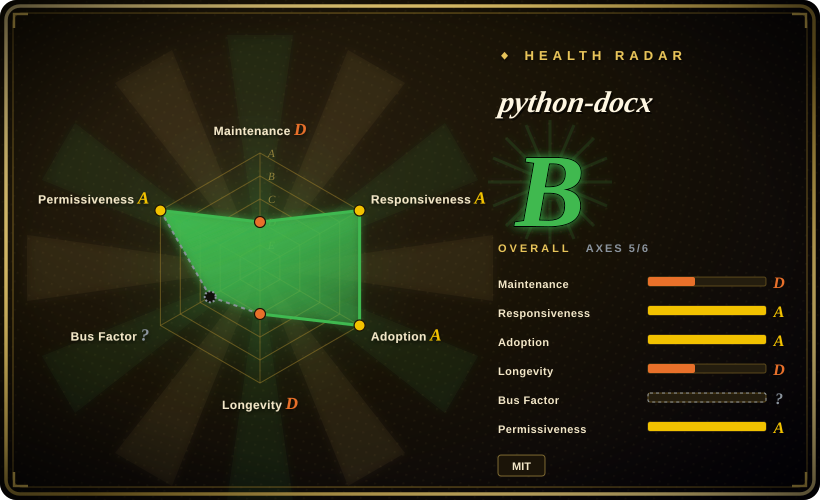

# python-docx

The de-facto Python library for creating, reading, and updating Word `.docx` files without Microsoft Word installed — 13 years old, two runtime dependencies, and the layer most agent skill packs sit on top of.

## When to use

You're a Python developer (or an agent writing Python) generating or editing Word documents server-side — invoices from a database, reports from an analytics run, mail-merge-style batch edits over a template — on Linux or in a container where installing Word is not an option. You reach for python-docx because it is the **longest-surviving, most widely wrapped** Word library in the Python ecosystem: MIT-licensed, two runtime deps (`lxml`, `typing_extensions`), 13 years of continuous existence, and the dependency that [Office-Word-MCP-Server](office-word-mcp-server.md) and most "docx skill" packs themselves build on. Versus [OfficeCLI](officecli.md) you trade the single-binary convenience and the render-back loop for a library you can pin, audit, unit-test, and keep for a decade; versus [Pandoc](../markdown-tools/pandoc.md) you trade one-way Markdown→docx conversion for **in-place editing of an existing document**, which Pandoc cannot do. Pick it when the output must be a real `.docx` that preserves a corporate template's styles, and the code that produces it must still run in five years.

## When NOT to use

- **Footnotes or endnotes** → there is no API. The footnote request has been open since **2014-01-03** and the endnote request since **2020-09-04** (issue search, API-verified 2026-09-18). Use [OfficeCLI](officecli.md), which ships a documented footnotes path, or drop to raw `lxml` manipulation of the OOXML part.
- **Anything an agent must *see*** → python-docx has no rendering or preview path. If the workflow is generate → inspect → fix, use [OfficeCLI](officecli.md) (`view … html|png`) or convert with [Pandoc](../markdown-tools/pandoc.md) / LibreOffice headless and rasterize separately.
- **Reading documents into an LLM** → use [MarkItDown](../document-parsing/markitdown.md) or [Docling](../document-parsing/docling.md). python-docx gives you an object model, not clean Markdown; you would be re-implementing a text extractor.
- **Markdown or HTML as the source format** → use [Pandoc](../markdown-tools/pandoc.md); it converts Markdown→docx with a reference-doc for styling in one call, which is far less code than building the same document paragraph by paragraph.
- **Field recalculation (TOC, cross-references, page numbers)** → python-docx can *write* the field instruction but cannot update the cached result; that needs a Word instance or LibreOffice headless. Plan a post-processing step, or use [OfficeCLI](officecli.md), which documents TOC and field handling.
- **Assuming the object model is safe under edits** → an open issue from **2026-09-07** reports `Paragraph.text` setter silently detaching comments and footnote references (API-verified). If your pipeline round-trips documents that carry comments, verify the behaviour on your version before relying on it.
- **Expecting community-driven maintenance** → 1,030 of 1,105 default-branch commits are by one person (Steve Canny, counting both the `scanny` GitHub identity and the unlinked `Steve Canny` author email; API-verified 2026-09-18). Last release v1.2.0 was 2025-06-16, ~15 months before verification, and 522 issues are open. It is maintained, slowly, by effectively one person — the same shape as OfficeCLI but with 13 years of proven continuity behind it.

## Comparison

| Alternative | In index | Our verdict | Tradeoff |
| --- | --- | --- | --- |
| [OfficeCLI](officecli.md) | ✅ | Pick python-docx when Word is one format among many in a Python service you must maintain for years; pick OfficeCLI when an agent needs Word **plus** Excel **plus** PowerPoint on a machine with no interpreter, or needs to look at the rendered page. | python-docx gives a pinnable, testable, 13-year-old MIT library with no rendering; OfficeCLI gives three formats and a render loop in one binary that is 6 months old, solo-authored, and auto-updates by default. |
| [Office-Word-MCP-Server](office-word-mcp-server.md) | ✅ | Pick python-docx for anything new — the MCP server is **archived** (2025-12-31) and is itself a wrapper around python-docx, so you would be adding a dead layer plus a `docx2pdf` dependency that requires Microsoft Word installed. | The MCP server exposes a ready-made tool schema for LLM clients at the cost of an archived codebase and a Windows/macOS-only PDF path; python-docx is the live layer underneath with no such floor. |
| [Pandoc](../markdown-tools/pandoc.md) | ✅ | Pick Pandoc when the source is Markdown/LaTeX/HTML and the docx is a one-way export styled by a reference doc; pick python-docx when you must open an **existing** .docx and change specific paragraphs, tables, or styles in place. | Pandoc is a single call with no object model and cannot edit in place; python-docx is precise in-place editing but you build every paragraph yourself. |
| [MarkItDown](../document-parsing/markitdown.md) | ✅ | Pick MarkItDown when the direction is .docx → Markdown for LLM ingestion; pick python-docx when the direction is data → .docx, or .docx → .docx. They are opposite ends of the same pipe and are commonly used together. | MarkItDown is read-only and deliberately drops formatting; python-docx preserves the OOXML object model but gives you no clean text-extraction surface. |

## Tech stack

Pure Python (`requires-python >=3.9`), built directly on the OOXML (`WordprocessingML`) ZIP+XML format. Runtime dependencies are exactly two: `lxml>=3.1.0` for XML handling and `typing_extensions>=4.9.0` (verified in `pyproject.toml`, 2026-09-18). Exposes an object model — `Document`, `Paragraph`, `Run`, `Table`, `Section`, `Style` — plus low-level `oxml` element access for anything the high-level API does not cover, which is the standard escape hatch for unsupported parts. Default branch is `master`. Docs on Read the Docs; no rendering, no layout engine, no dependency on Word.

## Dependencies

Python 3.9+ and `lxml` (which needs a C toolchain or a wheel — wheels are published for common platforms). No Microsoft Word, no LibreOffice, no database, no network access, no GPU. Runs headless on Linux/macOS/Windows and in containers. The practical extra dependency is **your own post-processor** if you need field results (TOC, page numbers) recalculated, since that requires a real layout engine.

## Ops difficulty

**Low.** `pip install python-docx`, no service, no configuration, no state. It is a library embedded in your own code, so the operational burden is just your application's. The maintenance risk is not operational but **temporal**: releases are infrequent (v1.2.0 on 2025-06-16, ~15 months before verification), the issue backlog is large (522 open), and one person authors ~93% of commits — so a feature you need may sit unimplemented for years, as footnotes have since 2014. Mitigation is the usual library discipline: pin the version, wrap the API behind your own adapter, and use the `oxml` escape hatch for gaps rather than forking.

## Health & viability

- **Maintenance: low cadence, verified** — last release v1.2.0 on 2025-06-16; the last **default-branch** commit is 459 days before verification with 0 of the last 13 weeks active (health radar, 2026-09-18), which is why the machine grades maintenance `D`. The repo's `pushed_at` of 2026-08-01 reflects non-default-branch activity, not mainline progress — do not read it as liveness. The last 100 default-branch commits span 2023-10-01 → 2025-06-16, i.e. bursts rather than a steady stream.
- **Governance: single-author, demonstrated endurance** — 1,030 of 1,105 commits by Steve Canny (`scanny` 193 + unlinked `Steve Canny` 837); 16 contributors total including anonymous; `DKWoods` second with 23. No foundation or corporate backing. The radar grades governance `?` because GitHub's contributor stats could not be resolved for this repo — treat the bus factor as 1 on the commit evidence, not as unmeasured. [推断] Unlike a young solo project, this one has already survived 13 years of solo stewardship — the Lindy prior credits that.
- **Age / Lindy: strong on age, penalised on activity** — created 2013-10-15, repo age 4,721 days (~12.9 years), but the radar grades longevity `D` because the prior requires **age × still-active together** and the default branch has been quiet for 459 days. This is still the positive half of the prior that [OfficeCLI](officecli.md) (6 months) does not have — but it is not the clean `A` that [XlsxWriter](xlsxwriter.md) (13.7 years, last commit 45 days ago) earns.
- **Adoption: the strongest signal on the page** — 90,326,686 PyPI downloads in the last month and 3,530 dependent repositories (health radar, 2026-09-18); 5,722 stars / 1,309 forks; 522 open issues. Its adoption is also indirect and load-bearing: [Office-Word-MCP-Server](office-word-mcp-server.md) declares `python-docx>=1.1.2`, and Word skill packs across harnesses wrap it rather than replace it. [推断] At ~90M downloads/month the project is effectively unmaintained-but-critical: it cannot be abandoned without a large ecosystem noticing, which is itself a form of durability.
- **Risk flags** — no relicense history (MIT throughout); no open-core gating; no CVE record surfaced during this review. The live risks are feature gaps frozen for a decade (footnotes since 2014, endnotes since 2020) and a 2026-09-07 open report that `Paragraph.text` silently detaches comments and footnote references.

## Caveats (unverified)

- [未验证] That `Paragraph.text` setter actually detaches comments/footnote references in v1.2.0 — this is taken from an open issue filed 2026-09-07 and was not reproduced here; it may be fixed or version-specific.
- [未验证] Exact behaviour and fidelity of TOC/field writing — the claim that python-docx can write a field instruction but not update its cached result reflects the library's lack of a layout engine, but was not exercised against a real document in this review.
- [未验证] Whether the ~93% single-author share holds across the full history — GitHub's contributors API caps and de-duplicates by linked account, and the `Steve Canny` / `scanny` identities were merged by hand here; a small number of commits may be misattributed.
- [推断] "The dependency of choice for agent skill packs" is inferred from Office-Word-MCP-Server's manifest and the general prevalence of python-docx-based docx skills; no systematic survey of harness skill packs was performed.
- [未验证] Whether the 522 open issues include triaged-but-unfixed versus never-reviewed items — the backlog's composition was not sampled, so it should not be read as a responsiveness score on its own (the machine health radar measures that separately).
