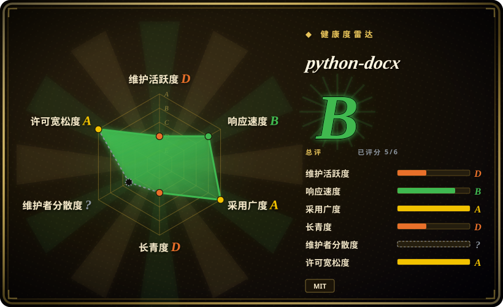

# python-docx

Python 生态里事实标准的 Word `.docx` 读写库，不需要安装 Microsoft Word——13 年历史、两个运行时依赖，也是大多数 agent skill 包底下那一层。

## 何时使用

你是 Python 开发者（或者是正在写 Python 的 agent），要在服务端生成或编辑 Word 文档——从数据库出发票、从分析结果出报告、按模板做邮件合并式的批量修改——而环境是 Linux 或容器，装不了 Word。你选 python-docx，因为它是 Python 生态里**存活最久、被包装最多**的 Word 库：MIT 许可、两个运行时依赖（`lxml`、`typing_extensions`）、13 年不间断存在，而且是 [Office-Word-MCP-Server](office-word-mcp-server.zh.md) 和大多数「docx skill」包自己依赖的那一层。相对 [OfficeCLI](officecli.zh.md)，你用「单二进制的便利和渲染回看闭环」换来了「一个能锁版本、能审计、能写单测、能用十年的库」；相对 [Pandoc](../markdown-tools/pandoc.zh.md)，你用「Markdown→docx 的单向转换」换来了**就地编辑已有文档**，这是 Pandoc 做不到的。当产出必须是一份保留企业模板样式的真 `.docx`，且生成它的代码五年后还要能跑时，选它。

## 何时不用

- **脚注或尾注** → 没有 API。脚注需求 issue 自 **2014-01-03** 开放至今，尾注需求自 **2020-09-04** 开放至今（issue 搜索，API 2026-09-18 验证）。改用 [OfficeCLI](officecli.zh.md)（它有文档化的 footnotes 路径），或者直接用 `lxml` 操作 OOXML part。
- **任何 agent 需要「看见」结果的场景** → python-docx 没有渲染或预览路径。如果工作流是「生成 → 检查 → 修正」，用 [OfficeCLI](officecli.zh.md)（`view … html|png`），或者用 [Pandoc](../markdown-tools/pandoc.zh.md)／LibreOffice headless 转换后另行光栅化。
- **把文档读进 LLM** → 用 [MarkItDown](../document-parsing/markitdown.zh.md) 或 [Docling](../document-parsing/docling.zh.md)。python-docx 给你的是对象模型，不是干净 Markdown；用它做这件事等于自己重写一遍文本抽取器。
- **源格式是 Markdown 或 HTML** → 用 [Pandoc](../markdown-tools/pandoc.zh.md)；它一次调用就能把 Markdown 转成 docx，并用 reference-doc 控制样式，比逐段构建同一份文档少写太多代码。
- **字段重算（目录、交叉引用、页码）** → python-docx 能**写入**字段指令，但无法更新缓存结果；那需要一个 Word 实例或 LibreOffice headless。请规划一个后处理步骤，或改用 [OfficeCLI](officecli.zh.md)（它对 TOC 和字段处理有文档）。
- **别假设对象模型在编辑下是安全的** → 一个 **2026-09-07** 的 open issue 报告 `Paragraph.text` setter 会静默脱离 comments 和脚注引用（API 已验证）。如果你的流水线要往返处理带批注的文档，先在目标版本上验证这个行为再依赖它。
- **别指望社区驱动的维护** → 默认分支 1,105 个 commit 里有 1,030 个出自同一人（Steve Canny，同时计入 `scanny` 这个 GitHub 身份和未关联的 `Steve Canny` 作者邮箱；API 2026-09-18 验证）。最后一个 release v1.2.0 是 2025-06-16，距验证约 15 个月，且有 522 个 open issue。它确实在被维护，只是慢，而且实质上由一个人维护——这和 OfficeCLI 是同一形态，区别是它背后有 13 年已被证明的连续性。

## 横向对比

| 替代品 | 是否收录 | 我们的评价 | 取舍 |
| --- | --- | --- | --- |
| [OfficeCLI](officecli.zh.md) | ✅ | 如果 Word 只是你要维护多年的 Python 服务里的众多格式之一，选 python-docx；如果 agent 需要在一台没有解释器的机器上同时处理 Word、Excel、PowerPoint，或者需要看到渲染后的页面，选 OfficeCLI。 | python-docx 给你一个可锁版本、可测试、13 年历史的 MIT 库，但没有渲染能力；OfficeCLI 给你一个三格式加渲染闭环的单二进制，代价是它只有 6 个月、单人作者、默认自动更新。 |
| [Office-Word-MCP-Server](office-word-mcp-server.zh.md) | ✅ | 任何新工作都选 python-docx——那个 MCP server 已**归档**（2025-12-31），而且它本身就是 python-docx 的封装，所以你会多叠一层死代码，外加一个要求安装 Microsoft Word 的 `docx2pdf` 依赖。 | MCP server 提供现成的、给 LLM 客户端用的 tool schema，代价是代码库已归档且 PDF 路径只支持 Windows／macOS；python-docx 是它底下那一层活代码，没有这种平台地板。 |
| [Pandoc](../markdown-tools/pandoc.zh.md) | ✅ | 源是 Markdown／LaTeX／HTML、docx 只是一次性导出并用 reference doc 控样式时选 Pandoc；必须打开一份**已有** .docx 并就地改动特定段落、表格或样式时选 python-docx。 | Pandoc 一次调用、没有对象模型、无法就地编辑；python-docx 能精确就地编辑，但每个段落都要你自己搭。 |
| [MarkItDown](../document-parsing/markitdown.zh.md) | ✅ | 方向是「.docx → Markdown 供 LLM 摄取」时选 MarkItDown；方向是「数据 → .docx」或「.docx → .docx」时选 python-docx。两者是同一条管道的两端，常被一起使用。 | MarkItDown 只读，且按设计丢弃格式；python-docx 保留 OOXML 对象模型，但不提供干净的文本抽取面。 |

## 技术栈

纯 Python（`requires-python >=3.9`），直接构建在 OOXML（`WordprocessingML`）的 ZIP+XML 格式之上。运行时依赖恰好两个：用于 XML 处理的 `lxml>=3.1.0` 和 `typing_extensions>=4.9.0`（2026-09-18 在 `pyproject.toml` 中验证）。对外暴露一套对象模型——`Document`、`Paragraph`、`Run`、`Table`、`Section`、`Style`——外加底层 `oxml` 元素访问，用于处理高层 API 未覆盖的部分，这也是标准逃生舱。默认分支是 `master`。文档在 Read the Docs；无渲染、无排版引擎、不依赖 Word。

## 依赖

Python 3.9+ 和 `lxml`（后者需要 C 工具链或 wheel——常见平台都有发布 wheel）。不需要 Microsoft Word、不需要 LibreOffice、无数据库、无网络访问、无 GPU。可在 Linux／macOS／Windows 和容器里 headless 运行。实际存在的额外依赖是**你自己的后处理器**：如果需要重算字段结果（目录、页码），那必须有真实排版引擎。

## 运维难度

**低**。`pip install python-docx`，无服务、无配置、无状态。它是嵌进你自己代码里的库，所以运维负担就是你应用本身的负担。维护风险不是运维性的而是**时间性**的：发版稀疏（v1.2.0 于 2025-06-16，距验证约 15 个月）、issue 积压大（522 个 open）、约 93% 的 commit 出自一人——所以你需要的特性可能多年不被实现，脚注从 2014 年就是这样。缓解手段是常规的库纪律：锁版本、把 API 包在你自己的适配层后面、遇到缺口用 `oxml` 逃生舱而不是 fork。

## 健康度与可持续性

- **维护：节奏低，已验证** —— 最后一个 release v1.2.0 于 2025-06-16；**默认分支**最后一次 commit 距验证 459 天，最近 13 周里活跃周数为 0（健康度雷达，2026-09-18），这也是机器把维护项评为 `D` 的原因。仓库的 `pushed_at` 是 2026-08-01，但那反映的是非默认分支的活动，不是主线进展——不要把它读作活跃度。默认分支最近 100 个 commit 跨 2023-10-01 至 2025-06-16，即阵发式而非稳定流。
- **治理：单人作者，但耐力已被证明** —— 1,105 个 commit 中 1,030 个出自 Steve Canny（`scanny` 193 + 未关联的 `Steve Canny` 837）；含匿名共 16 位贡献者；`DKWoods` 以 23 个居第二。无基金会或企业背书。雷达把治理项评为 `?`，因为 GitHub 的贡献者统计在这个仓库上无法解析——请按 commit 证据把 bus factor 当作 1，而不是当作「未测出」。[推断] 与年轻的单人项目不同，它已经在单人维护下存活了 13 年——Lindy 先验会给这一点加分。
- **年龄／Lindy：年龄强，活跃度被扣分** —— 创建于 2013-10-15，repo age 4721 天（约 12.9 年），但雷达把长青度评为 `D`，因为该先验要求**年龄 × 仍活跃同时成立**，而默认分支已安静 459 天。这依然是 [OfficeCLI](officecli.zh.md)（6 个月）不具备的那一半先验——但它不是 [XlsxWriter](xlsxwriter.zh.md)（13.7 年、最后 commit 距今 45 天）拿到的那个干净的 `A`。
- **采用度：本页最强信号** —— 上月 PyPI 下载 94,383,978 次、3,530 个依赖仓库（健康度雷达，2026-09-18）；5,722 star／1,309 fork；522 个 open issue。它的采用还是间接且承重的：[Office-Word-MCP-Server](office-word-mcp-server.zh.md) 声明 `python-docx>=1.1.2`，各 harness 里的 Word skill 包也是包装它而不是替换它。[推断] 在约 9,400 万次月下载的量级上，这个项目实质上处于「无人维护但关键」的状态：它不可能被悄悄弃置而不让整个生态察觉，这本身就是一种耐久性。
- **风险标记** —— 无 relicense 历史（一直是 MIT）；无 open-core 功能门；本次评审未发现 CVE 记录。现存风险是冻结了十年的功能缺口（脚注自 2014、尾注自 2020），以及 2026-09-07 那条关于 `Paragraph.text` 静默脱离批注和脚注引用的 open 报告。

## 存疑（未验证）

- [未验证] `Paragraph.text` setter 是否真的会脱离 comments／脚注引用（v1.2.0）——此说取自 2026-09-07 提交的 open issue，本次未复现；可能已修复或与版本相关。
- [未验证] TOC／字段写入的确切行为与保真度——「能写字段指令但不能更新缓存结果」这一说法反映的是该库缺少排版引擎，但本次未对真实文档实测。
- [未验证] 约 93% 的单人作者占比是否在完整历史上成立——GitHub contributors API 有上限且按关联账号去重，此处 `Steve Canny` 与 `scanny` 两个身份是手工合并的；可能有少量 commit 归属有误。
- [推断] 「agent skill 包的依赖首选」是由 Office-Word-MCP-Server 的 manifest 和 python-docx 系 docx skill 的普遍性推断出来的；未对各 harness 的 skill 包做系统普查。
- [未验证] 522 个 open issue 里「已分诊未修」与「从未评审」的比例——未抽样其构成，所以不应单独把它读作响应度评分（机器健康度雷达会另行测量该项）。
