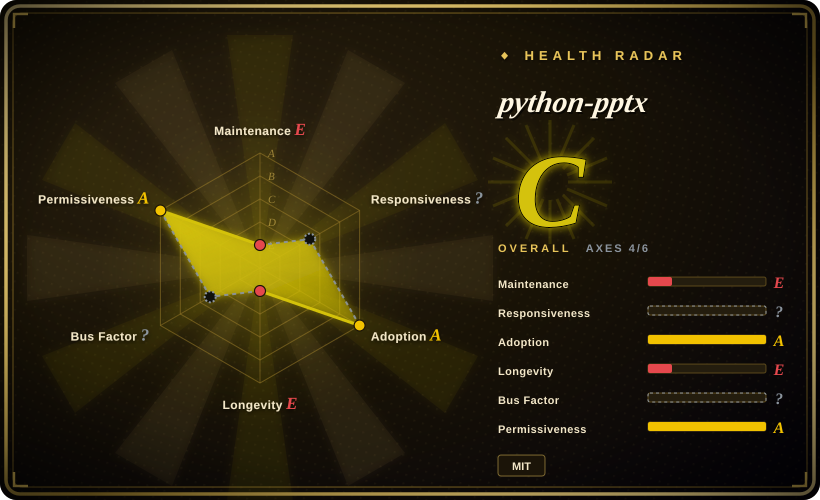

# python-pptx

The standard Python library for creating and reading PowerPoint `.pptx` files without PowerPoint installed — 13+ years old and still the default choice, but it has not shipped a release since 2024-08-07.

## When to use

You're generating slide decks programmatically from dynamic content — a database query, an analytics run, a JSON payload, perhaps behind an HTTP endpoint that returns a `.pptx` — on Linux or in a container where PowerPoint is neither installed nor licensable. You reach for python-pptx because it is the **only mature, MIT-licensed Python library** for native `.pptx` authoring: 2,137 commits over 13 years, four runtime deps, no Office requirement (its README states this explicitly), and a stable object model (`Presentation`, `Slide`, `Shape`, `TextFrame`, `Chart`) plus the `oxml` escape hatch. Versus [OfficeCLI](officecli.md) you trade the render-back loop and the single binary for something you can pin, unit-test, and embed in a service; versus [Pandoc](../markdown-tools/pandoc.md) you trade Markdown→pptx one-shot conversion for per-shape control over an existing deck; versus an HTML-deck skill like [Guizang PPT Skill](../agent-skills/slides-ppt/guizang-ppt.md) you trade visual polish for a file that opens in PowerPoint and survives corporate review. Pick it when the deliverable must be a real `.pptx` and the generation logic must live in your own tested code.

## When NOT to use

- **Animations or slide transitions** → no API. The animation-control request has been open since **2017-03-03** (14 matching issues, API-verified 2026-09-18). Use [OfficeCLI](officecli.md), which documents animation presets, effect chains, motion paths, and morph/p14/p15 transitions.
- **SmartArt** → unsupported; the feature request has been open since **2014-02-12** (API-verified). Existing SmartArt round-trips only as opaque XML. Use [OfficeCLI](officecli.md) (SmartArt via add-part + raw-set) or author the diagram as an image.
- **Anything an agent must *see*** → python-pptx has no preview, no rendering, and no rasterization. For a generate → inspect → fix loop use [OfficeCLI](officecli.md) (`view … html|png`, `watch`), or render via LibreOffice headless yourself.
- **You need a fix or feature soon** → the last commit is **2024-08-06** and the last release v1.0.2 is **2024-08-07**, ~25 months before verification, with **537 open issues** (API-verified). Treat it as feature-frozen: if your requirement is not already in the API, plan on the `oxml` escape hatch or a different tool, not on an upstream fix.
- **Visually designed decks** → python-pptx gives you shapes and placeholders, not design. For an agent producing good-looking slides, use [Guizang PPT Skill](../agent-skills/slides-ppt/guizang-ppt.md) (HTML deck, locked visual systems) if HTML output is acceptable, or [OfficeCLI](officecli.md) if it must stay `.pptx`.
- **Markdown as the source** → use [Pandoc](../markdown-tools/pandoc.md); it emits `.pptx` directly from Markdown with a reference deck for styling, which is far less code than constructing slides shape by shape.
- **Reading decks into an LLM** → use [MarkItDown](../document-parsing/markitdown.md); python-pptx gives you an object model, not clean text.

## Comparison

| Alternative | In index | Our verdict | Tradeoff |
| --- | --- | --- | --- |
| [OfficeCLI](officecli.md) | ✅ | Pick python-pptx when deck generation is code inside a Python service you must maintain and test; pick OfficeCLI when an agent drives the deck iteratively and needs animations, transitions, or to look at the rendered slide — all three are absent or frozen here. | python-pptx gives a pinnable, testable MIT library with no rendering and no animation API; OfficeCLI gives the render loop and the missing feature surface in a 6-month-old solo-authored binary that auto-updates by default. |
| [Pandoc](../markdown-tools/pandoc.md) | ✅ | Pick Pandoc when the deck is a one-way export from Markdown and a reference deck supplies the styling; pick python-pptx when you must open an existing `.pptx` and change specific shapes, charts, or layouts in place. | Pandoc is one call with no object model and cannot edit in place; python-pptx is precise in-place editing but you position every shape yourself. |
| [Guizang PPT Skill](../agent-skills/slides-ppt/guizang-ppt.md) | ✅ | Pick the Guizang skill when the deliverable is a good-looking deck an agent produces from an article and HTML output is acceptable; pick python-pptx when the deliverable must be a `.pptx` that opens in PowerPoint and goes through corporate review. | The skill buys visual design with a locked system and AGPL-3.0 terms plus an HTML (not OOXML) artifact; python-pptx buys format correctness with zero design opinion. |
| [Office-PowerPoint-MCP-Server](office-powerpoint-mcp-server.md) | ✅ | Archived by its author on 2025-12-31 (1,852 stars, API-verified); do not pick it for new work — use python-pptx directly, since the server was a thin MCP wrapper over this same library layer. | It offered a ready-made MCP tool schema for LLM clients; that convenience is now unmaintained, and the wrapper added no capability python-pptx lacks. |

## Tech stack

Pure Python (`requires-python >=3.8`), built directly on the OOXML (`PresentationML` + DrawingML) ZIP+XML format. Four runtime dependencies (verified in `pyproject.toml`, 2026-09-18): `Pillow>=3.3.2` for images, `XlsxWriter>=0.5.7` for the workbook embedded inside charts, `lxml>=3.1.0` for XML, and `typing_extensions>=4.9.0`. Note the transitive coupling: **python-pptx depends on [XlsxWriter](xlsxwriter.md)**, so a chart in a deck carries an Excel writer with it. Object model covers slides, layouts, masters, placeholders, shapes, text frames, tables, charts, and pictures; anything else goes through `oxml`. Default branch is `master`; `py.typed` ships as of the 2024-08-05 commit.

## Dependencies

Python 3.8+, Pillow (needs a wheel or C toolchain), lxml, XlsxWriter. No Microsoft PowerPoint, no LibreOffice, no database, no network access, no GPU. Runs headless on Linux/macOS/Windows and in containers. As with [python-docx](python-docx.md), the practical hidden dependency is **your own renderer** if you need to see or rasterize the result — the library produces bytes, never pixels.

## Ops difficulty

**Low** operationally: `pip install python-pptx`, no service, no configuration, no state. The real burden is **staleness risk**, not ops. With no commit since 2024-08-06 and 537 open issues, you should assume the API is frozen: pin the version, wrap it behind your own adapter, and budget for `oxml`-level work when a feature is missing. A secondary consideration is that its chart path pulls in XlsxWriter, so an upgrade to one can affect the other. If your roadmap needs animations, SmartArt, or rendering, do not plan around an upstream fix — that is a tool-choice decision, not a maintenance wait.

## Health & viability

- **Maintenance: coasting, verified** — last commit 2024-08-06 (`fix(enum): replace read-only enum values`), last release v1.0.2 on 2024-08-07, ~25 months before verification (2026-09-18). The three most recent commits are a fix, a `py.typed` addition, and a docs build update — a wind-down pattern, not active development. Repo is **not archived**.
- **Governance: single-author, extreme** — 2,117 of 2,137 default-branch commits by Steve Canny (`Steve Canny` 1,651 + `scanny` 463 + 3; API-verified 2026-09-18), i.e. **99.1%**; 12 contributors total including anonymous; the second contributor has 11. No foundation or corporate backing. The radar grades governance `?` (contributor stats unresolvable) and responsiveness `?`, so its `C (4/6)` aggregate rests on only four measured axes — read the commit evidence, not the grade, for bus factor.
- **Age / Lindy: strong on age, broken on still-active** — created 2012-11-21, ~13.8 years old. The prior requires **age × still-active together**; python-pptx has the age but has been quiet for two years, so it sits between "long-lived tool" and "coasting one". It is not abandoned (not archived, issues still receive traffic) but it is not a safe place to wait for a feature.
- **Adoption: still the default** — 3,535 stars / 737 forks; 537 open issues indicates sustained real-world use despite the quiet. It remains the library that agent skill packs and MCP servers wrap for PowerPoint, which is why its freeze matters more than its star count suggests.
- **Risk flags** — no relicense history (MIT throughout); no open-core gating; no CVE record surfaced during this review. The live risks are the two-decade-old frozen feature gaps (SmartArt since 2014, animation since 2017) and the possibility that continued quiet turns into formal abandonment. [推断] Given the author also maintains [python-docx](python-docx.md) (last release 2025-06-16), attention appears to have shifted there rather than away from the ecosystem entirely.

## Caveats (unverified)

- [未验证] Whether animations and SmartArt are truly unimplementable via the public API versus merely undocumented — the claim rests on open feature requests (2017-03-03 and 2014-02-12) and the absence of API surface, not on an attempted `oxml` implementation.
- [未验证] That existing SmartArt round-trips losslessly as opaque XML — inferred from the library's general pass-through behaviour for unmodelled parts; not tested against a real SmartArt-bearing deck here.
- [推断] "Attention shifted to python-docx" is inferred from release dates (python-docx v1.2.0 on 2025-06-16 vs python-pptx v1.0.2 on 2024-08-07) under a shared author; no statement from the maintainer was found.
- [未验证] Whether the 537 open issues are receiving triage — the count was taken from the API but the backlog's composition and last-maintainer-comment dates were not sampled.
- [推断] The 99.1% single-author share merges the `Steve Canny` and `scanny` identities by hand; GitHub's contributors API de-duplicates by linked account, so a small number of commits may be misattributed.
- [未验证] Chart fidelity and the exact role of the embedded XlsxWriter workbook when a deck is later edited in real PowerPoint — the dependency is verified in `pyproject.toml`, but round-trip behaviour was not exercised.
