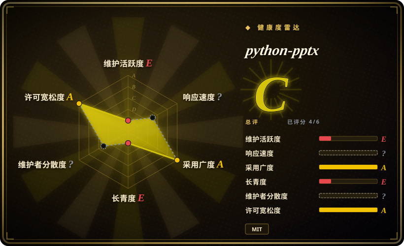

# python-pptx

不需要安装 PowerPoint 就能创建和读取 `.pptx` 的标准 Python 库——13 年以上历史、仍是默认选择，但自 2024-08-07 起没有再发过版本。

## 何时使用

你要从动态内容程序化生成幻灯片——一次数据库查询、一轮分析结果、一个 JSON payload，也许挂在一个返回 `.pptx` 的 HTTP 端点后面——环境是 Linux 或容器，PowerPoint 既没装也无法授权。你选 python-pptx，因为它是**唯一成熟的、MIT 许可的**原生 `.pptx` 生成 Python 库：13 年 2,137 个 commit、四个运行时依赖、不需要 Office（README 明确这么写）、稳定的对象模型（`Presentation`、`Slide`、`Shape`、`TextFrame`、`Chart`）外加 `oxml` 逃生舱。相对 [OfficeCLI](officecli.zh.md)，你用「渲染回看闭环和单二进制」换来了「能锁版本、能写单测、能嵌进服务」的东西；相对 [Pandoc](../markdown-tools/pandoc.zh.md)，你用「Markdown→pptx 一次性转换」换来了对已有 deck 里逐个 shape 的控制权；相对 [Guizang PPT Skill](../agent-skills/slides-ppt/guizang-ppt.zh.md) 这类 HTML deck skill，你用「视觉精致度」换来了「一个能在 PowerPoint 里打开、能过企业评审的文件」。当交付物必须是真 `.pptx`、且生成逻辑必须活在你自己有测试的代码里时，选它。

## 何时不用

- **动画或幻灯片转场** → 没有 API。动画控制需求 issue 自 **2017-03-03** 开放至今（14 条匹配 issue，API 2026-09-18 验证）。改用 [OfficeCLI](officecli.zh.md)，它对动画预设、效果链、运动路径以及 morph／p14／p15 转场都有文档。
- **SmartArt** → 不支持；该功能请求自 **2014-02-12** 开放至今（API 已验证）。已有 SmartArt 只能作为不透明 XML 往返。改用 [OfficeCLI](officecli.zh.md)（通过 add-part + raw-set 处理 SmartArt），或把图示作为图片插入。
- **任何 agent 需要「看见」结果的场景** → python-pptx 没有预览、没有渲染、没有光栅化。要做「生成 → 检查 → 修正」闭环，用 [OfficeCLI](officecli.zh.md)（`view … html|png`、`watch`），或自己用 LibreOffice headless 渲染。
- **你很快需要一个修复或新特性** → 最后一个 commit 是 **2024-08-06**，最后一个 release v1.0.2 是 **2024-08-07**，距验证约 25 个月，且有 **537 个 open issue**（API 已验证）。请把它当作功能冻结：如果你的需求还不在 API 里，请规划走 `oxml` 逃生舱或换工具，而不是等上游修。
- **视觉设计过的 deck** → python-pptx 给你的是 shape 和占位符，不是设计。要让 agent 产出好看的幻灯片，如果 HTML 输出可接受，用 [Guizang PPT Skill](../agent-skills/slides-ppt/guizang-ppt.zh.md)（HTML deck、锁定的视觉系统）；如果必须保持 `.pptx`，用 [OfficeCLI](officecli.zh.md)。
- **源格式是 Markdown** → 用 [Pandoc](../markdown-tools/pandoc.zh.md)；它能直接从 Markdown 产出 `.pptx`，并用 reference deck 控制样式，比逐个 shape 搭幻灯片少写太多代码。
- **把 deck 读进 LLM** → 用 [MarkItDown](../document-parsing/markitdown.zh.md)；python-pptx 给你的是对象模型，不是干净文本。

## 横向对比

| 替代品 | 是否收录 | 我们的评价 | 取舍 |
| --- | --- | --- | --- |
| [OfficeCLI](officecli.zh.md) | ✅ | 如果 deck 生成是你必须维护和测试的 Python 服务里的一段代码，选 python-pptx；如果 deck 由 agent 迭代驱动、且需要动画、转场或看到渲染后的幻灯片，选 OfficeCLI——这三样在这里要么缺失要么已冻结。 | python-pptx 给你一个可锁版本、可测试的 MIT 库，但没有渲染、没有动画 API；OfficeCLI 给你一个渲染闭环和缺失的特性面，代价是它只有 6 个月、单人作者、默认自动更新。 |
| [Pandoc](../markdown-tools/pandoc.zh.md) | ✅ | 如果 deck 是从 Markdown 单向导出、样式由 reference deck 提供，选 Pandoc；如果必须打开一份已有 `.pptx` 并就地改动特定 shape、图表或版式，选 python-pptx。 | Pandoc 一次调用、没有对象模型、无法就地编辑；python-pptx 能精确就地编辑，但每个 shape 都要你自己定位。 |
| [Guizang PPT Skill](../agent-skills/slides-ppt/guizang-ppt.zh.md) | ✅ | 如果交付物是 agent 从一篇文章产出的好看 deck、且 HTML 输出可接受，选 Guizang skill；如果交付物必须是能在 PowerPoint 打开并走企业评审的 `.pptx`，选 python-pptx。 | 该 skill 用锁定视觉系统换来设计感，代价是 AGPL-3.0 条款和 HTML（而非 OOXML）产物；python-pptx 换来格式正确性，但完全不带设计主张。 |
| [Office-PowerPoint-MCP-Server](office-powerpoint-mcp-server.zh.md) | ✅ | 已被作者于 2025-12-31 归档（1,852 star，API 已验证）；新工作不要选它——直接用 python-pptx，因为那个 server 只是这同一层库之上的薄 MCP 封装。 | 它曾提供现成的、给 LLM 客户端用的 MCP tool schema；这份便利现在无人维护，而且该封装没有增加任何 python-pptx 缺少的能力。 |

## 技术栈

纯 Python（`requires-python >=3.8`），直接构建在 OOXML（`PresentationML` + DrawingML）的 ZIP+XML 格式之上。四个运行时依赖（2026-09-18 在 `pyproject.toml` 中验证）：处理图片的 `Pillow>=3.3.2`、用于图表内嵌工作簿的 `XlsxWriter>=0.5.7`、处理 XML 的 `lxml>=3.1.0`，以及 `typing_extensions>=4.9.0`。注意这条传递耦合：**python-pptx 依赖 [XlsxWriter](xlsxwriter.zh.md)**，所以 deck 里的一个图表会顺带拖进一个 Excel 写入器。对象模型覆盖 slide、layout、master、占位符、shape、text frame、表格、图表和图片；其余走 `oxml`。默认分支是 `master`；自 2024-08-05 那个 commit 起附带 `py.typed`。

## 依赖

Python 3.8+、Pillow（需要 wheel 或 C 工具链）、lxml、XlsxWriter。不需要 Microsoft PowerPoint、不需要 LibreOffice、无数据库、无网络访问、无 GPU。可在 Linux／macOS／Windows 和容器里 headless 运行。和 [python-docx](python-docx.zh.md) 一样，实际存在的隐藏依赖是**你自己的渲染器**：如果你需要看到或光栅化结果——这个库产出字节，从不产出像素。

## 运维难度

运维上**低**：`pip install python-pptx`，无服务、无配置、无状态。真正的负担是**陈旧风险**，不是运维。自 2024-08-06 起无 commit、537 个 open issue，你应当假设 API 已冻结：锁版本、把它包在你自己的适配层后面、并在缺特性时预留 `oxml` 层的工作量。次要考虑是它的图表路径会拖进 XlsxWriter，所以升级其中一个可能影响另一个。如果你的路线图需要动画、SmartArt 或渲染，不要围绕上游修复来做计划——那是选型决策，不是维护等待。

## 健康度与可持续性

- **维护：滑行中，已验证** —— 最后 commit 2024-08-06（`fix(enum): replace read-only enum values`），最后 release v1.0.2 于 2024-08-07，距验证（2026-09-18）约 25 个月。最近三个 commit 分别是一个 fix、一次 `py.typed` 添加、一次 docs 构建更新——是收尾形态，不是活跃开发。仓库**未归档**。
- **治理：单人作者，极端** —— 默认分支 2,137 个 commit 中 2,117 个出自 Steve Canny（`Steve Canny` 1,651 + `scanny` 463 + 3；API 2026-09-18 验证），即 **99.1%**；含匿名共 12 位贡献者；第二名 11 个。无基金会或企业背书。雷达把治理项评为 `?`（贡献者统计无法解析）、响应度也评为 `?`，所以它那个 `C (4/6)` 的总评只建立在四个实测轴上——判断 bus factor 请看 commit 证据，不要看评级。
- **年龄／Lindy：年龄强，「仍活跃」断裂** —— 创建于 2012-11-21，约 13.8 年。该先验要求**年龄 × 仍活跃同时成立**；python-pptx 有年龄，但已安静两年，所以它处在「长寿工具」与「滑行工具」之间。它没有被弃置（未归档，issue 仍有流量），但也不是一个适合等特性的地方。
- **采用度：仍是默认选择** —— 3,535 star／737 fork；537 个 open issue 说明尽管安静，真实使用仍在持续。它依然是各 agent skill 包和 MCP server 在处理 PowerPoint 时包装的那个库，这也是为什么它的冻结比 star 数看起来更重要。
- **风险标记** —— 无 relicense 历史（一直是 MIT）；无 open-core 功能门；本次评审未发现 CVE 记录。现存风险是冻结了十几年的功能缺口（SmartArt 自 2014、动画自 2017），以及持续安静可能演变为正式弃置。[推断] 鉴于同一作者还在维护 [python-docx](python-docx.zh.md)（最后 release 2025-06-16），注意力看起来是转移到了那边，而不是彻底离开这个生态。

## 存疑（未验证）

- [未验证] 动画和 SmartArt 究竟是「通过公开 API 无法实现」还是「只是没有文档」——此说依据的是 open 状态的功能请求（2017-03-03 和 2014-02-12）以及 API 面的缺失，而不是尝试过 `oxml` 实现。
- [未验证] 已有 SmartArt 是否能作为不透明 XML 无损往返——由该库对未建模 part 的一般透传行为推断；本次未对含 SmartArt 的真实 deck 实测。
- [推断] 「注意力转移到 python-docx」由发版日期推断（python-docx v1.2.0 于 2025-06-16，python-pptx v1.0.2 于 2024-08-07），二者作者相同；未找到维护者的公开说明。
- [未验证] 537 个 open issue 是否在被分诊——计数取自 API，但未抽样其构成和维护者最后回复时间。
- [推断] 99.1% 的单人作者占比是手工合并 `Steve Canny` 与 `scanny` 两个身份得出的；GitHub contributors API 按关联账号去重，所以可能有少量 commit 归属有误。
- [未验证] 图表保真度，以及 deck 之后在真实 PowerPoint 里被编辑时那个内嵌 XlsxWriter 工作簿的确切作用——依赖关系已在 `pyproject.toml` 中验证，但往返行为未实测。
