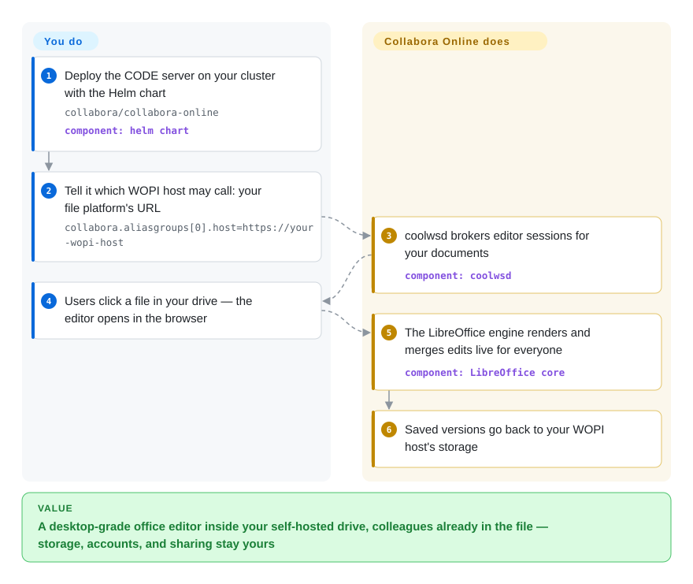

# Collabora Online

Your self-hosted drive previews office files but "edit" still means download-and-reupload, and your users are not going to install anything. Collabora Online puts a *whole LibreOffice engine* behind a browser tab: a server streams the desktop word/spreadsheet/presentation editors tile-by-tile, multiple people co-edit, and the file is saved back through WOPI to storage you already run. It's the permissive-license (MPL-2.0) pole position in the "document server" niche — and it expects you to bring a WOPI host.

## When to use

You already operate (or are adopting) a WOPI-speaking file platform — Nextcloud/ownCloud's richdocuments integration is the flagship path, and the Helm chart's config surface speaks `aliasgroups`/WOPISrc natively (verified in the chart README, 2026-09) — or you're prepared to implement a WOPI host yourself. You pick Collabora over [ONLYOFFICE Docs](onlyoffice-documentserver.md) on three axes: **license** (MPL-2.0 file-level copyleft vs AGPL's network clause), **engine breadth** (LibreOffice's format matrix, ODF-native, legacy formats included), and **scale economics** — high-availability is a Helm `replicaCount` + a WOPISrc-sticky load balancer, not an Enterprise-edition paywall (the chart README documents exactly that recipe). You pick it over [Univer](univer.md) when the deliverable is "click file → full-featured editor now" rather than an editor kit to restyle. Viability backing is unusual in this category: the contributor roster is LibreOffice old-guard (Ashod 4,676 / timar 2,283 / mmeeks 1,536 / kendy 1,227 …, contributors API 2026-09-27), Collabora the company stewards it, and the Docker image has ~121M pulls — an installed base measured, not claimed.

## How it works

Two halves: `coolwsd`, a C++ daemon that authenticates your WOPI host, brokers sessions, and relays changes, and a LibreOffice-derived core that renders and mutates the document, shipping canvas updates to browser clients (mirror tree linguist: C++ ≈263 MB — the engine really is in-tree, verified 2026-09-27; the *GitHub* repo you'd browse holds only `docker/`, `kubernetes/` and docs — active development moved to Collabora's Gerrit, README says so up top). Flow: your file platform issues a WOPI access token for a file → Collabora opens an editor session, pinning all clients of that WOPISrc to one pod/instance (their chart docs the HAProxy/nginx affinity trick) → edits merge server-side and autosave back through WOPI to your storage. Admin knobs live in `coolwsd.xml` style parameters (`--o:ssl.enable=false …` in the chart); clipboard, spellcheck (dictionaries), fonts (bundled + substitution) are all part of the appliance. For pure evaluation, the `collabora/code` image plus any WOPI-capable host gets you a demo in one container.

<!-- flow-steps:begin (generated from flows/collabora-online.json by tools/flow_card.py — do not edit) -->

Text version of the flow

1. **You**: Deploy the CODE server on your cluster with the Helm chart — `collabora/collabora-online` — component: `helm chart`
2. **You**: Tell it which WOPI host may call: your file platform's URL — `collabora.aliasgroups[0].host=https://your-wopi-host`
3. **Collabora Online**: coolwsd brokers editor sessions for your documents — component: `coolwsd`
4. **You**: Users click a file in your drive — the editor opens in the browser
5. **Collabora Online**: The LibreOffice engine renders and merges edits live for everyone — component: `LibreOffice core`
6. **Collabora Online**: Saved versions go back to your WOPI host's storage

**Value**: A desktop-grade office editor inside your self-hosted drive, colleagues already in the file — storage, accounts, and sharing stay yours

<!-- flow-steps:end -->

## When NOT to use

- **You have no WOPI host and want a five-line embed** → WOPI is the contract; rolling your own host (discovery, proof keys, token REST semantics) is real work. [ONLYOFFICE Docs](onlyoffice-documentserver.md) ships a simpler first-party `DocsAPI.DocEditor` embed (plus its own WOPI mode), and [Univer](univer.md) needs no WOPI at all — just your bundler.
- **You need the editor restyled inside your own product UI** → the UI is Collabora's chrome (Ribbon/Classic options, theming knobs) streamed to the browser — not a component library. For embed-and-restyle, [Univer](univer.md).
- **Your contribution/audit workflow is GitHub-PR-shaped** → README (2026-09): *active development is on Gerrit*; this repo accepts PRs only for the Helm chart and docker build; issues + nightly images + chart releases live here, source browsing via the `online.mirror` repo (`未收录` — deliberately not a second page; it *is* this project). If patch-review visibility on GitHub is a compliance requirement, weigh this friction honestly.
- **Your users' baseline is pixel-perfect MS Office rendering** → fidelity here is LibreOffice's rendering of OOXML — excellent coverage, different engine; exotic smart-art/charts are where suites diverge [推断 — no fidelity comparison was run in this review]. Test your corpus.
- **You want a full Drive *product* (sharing UI, mobile apps, search)** → Collabora is the editing backend only; the platform around it (Nextcloud et al.) is a separate stack decision. [Grist](grist.md) is the self-contained-app counterpoint for data-centric teams.

## Comparison

| Alternative | In index | Our verdict | Tradeoff |
| --- | --- | --- | --- |
| [ONLYOFFICE Docs](onlyoffice-documentserver.md) | ✅ | Pick Collabora when MPL licensing, ODF/legacy format breadth, or un-metered HA decides it; pick ONLYOFFICE when OOXML-first UI fidelity, first-party connectors (Moodle/Seafile/Odoo) and a shallower embed contract matter more. | Collabora: engine breadth + scale freedom, WOPI plumbing yours. ONLYOFFICE: contract simplicity + Office-shaped UX, AGPL + capacity tiers. |
| [Univer](univer.md) | ✅ | Pick Univer when the editing surface is *your* product (SDK, headless Node, agent APIs); pick Collabora when the product already stores files and the honest requirement is "desktop office in the browser, this quarter." | Univer buys restylability and pays in engineering; Collabora buys completeness and pays in iframe-and-WOPI constraints. |
| LibreOffice | `未收录` | The engine ancestor — its canonical git lives at git.libreoffice.org (GitHub is a read-only mirror), so it's not an embeddable server and stays out of this index per existing precedent (see the office-automation comparison matrix). | Buys the desktop suite itself; no web server, no collaboration protocol. |
| Nextcloud (richdocuments) | `未收录` | The default production partner: most deployments are Nextcloud + this chart/image; `未收录` deliberately (groupware platform, outside this batch's scope). | The drive, tokens and share links you'd otherwise implement; a second full platform to operate. |

## Tech stack

C++ server (`coolwsd` + `common/net/` + the LibreOffice-derived `lokit` document engine) with JavaScript/HTML browser UI (mirror linguist 2026-09-27: C++ ≈263 MB, Python ≈10.9 MB [推断 — python is build/tooling/test surface, not a runtime service], JS ≈5.8 MB); WOPI protocol for host integration; binary websocket tile messaging between client and server [未验证 — protocol internals not read this pass]; packaging: official Docker images (`collabora/code` nightly from this repo), Helm chart in-tree (`kubernetes/helm/collabora-online`, HA sample with HAProxy WOPISrc balancing), snap, plus distro packages; L10n via Weblate; the sdk docs site is versioned by year (26.04 doc paths seen in the sitemap, 2026-09-27).

## Dependencies

A WOPI host (file platform or your implementation) is *required* — Collabora never owns storage or identity. Server-side: Docker or Kubernetes (the chart's HA path wants sticky routing by `WOPISrc`), TLS termination (or `--o:ssl.termination=true` behind a proxy), fonts for the languages you serve, optional dictionaries/thesauri; further external-store requirements (caches/sessions) were not enumerated in this review pass [未验证]. Client: a modern browser; no plugins.

## Ops difficulty

**Medium-high.** The container demo is trivial; production is an *office appliance*: session-per-document means sticky routing and per-pod document limits to size, updates roll through versioned CODE branches (or paid builds with longer support), font/translation drift shows up as rendering complaints, and WOPI token bugs surface as "save failed" tickets that cross team boundaries (your auth vs their editor). The Helm chart, SDK docs and a decade of Nextcloud-integration war stories lower the cliff — but this is a "we operate a document backend now" commitment, not an npm dependency.

## Health & viability

- **Maintenance: release-train verified.** GitHub releases on the chart (helm-collabora-online-1.3.5, 2026-09-24) and pushes through 2026-09-25 (API-verified); nightly container published from this repo; year-versioned product line (26.04 docs visible 2026-09-27).
- **Governance: company + LibreOffice veteran commons.** Collabora the company is the steward; the top-12 contributor list is 100% long-arc LibreOffice/Collabora names, not a solo hustle (contributors API 2026-09-27). Canonical review moved to Gerrit — old-world, public, functional; the README states the split plainly.
- **Backing & longevity** — LibreOffice Online program lineage from ~2015 [未验证 — lineage date not re-sourced this pass], GitHub repo since 2020-10; the paid enterprise edition funds development while CODE stays open [推断 from product structure; license terms themselves are MPL-2.0 per COPYING]. Age × still-active: strong.
- **Adoption: measured at ~121M Docker pulls** for `collabora/code` (Docker Hub API 2026-09-27) — the same floor-scale caveat as ONLYOFFICE's number applies [推断]; 3.4k GitHub stars undercount it badly because the *code* doesn't live there — another page reading only stars would mis-rank this field; this line exists to counter that.
- **Risk flags** — Gerrit-not-GitHub contribution friction and mirror-repo confusion (two repos, `online` + `online.mirror`); enterprise support is vendor-tied; LibreOffice upstream direction (e.g., their own cloud work) can shift priorities [推断].

## Caveats (unverified)

- [未验证] The ~2015 LibreOffice Online lineage date — background knowledge; the GitHub repo's own clock starts 2020-10-01 (that half is API-verified).
- [未验证] Websocket tile protocol details, document limits per instance, and Codis/external-cache requirements — chart README was read for helm/WOPI/HA lines only.
- [未验证] Whether paid editions gate *features* vs *support/lifespan* only — CODE vs enterprise feature matrix not fetched.
- [推断] Python's role is build/tooling (its 10.9 MB in the mirror linguist includes test harnesses); no runtime Python service is documented in what was read.
- [推断] Fidelity divergence on exotic OOXML objects (SmartArt, embedded charts) — general suite-differentiation knowledge; no corpus test executed here.
- [未验证] `online.mirror` star/pull metadata — deliberately queried languages only; treating it as a page would double-count the project.
