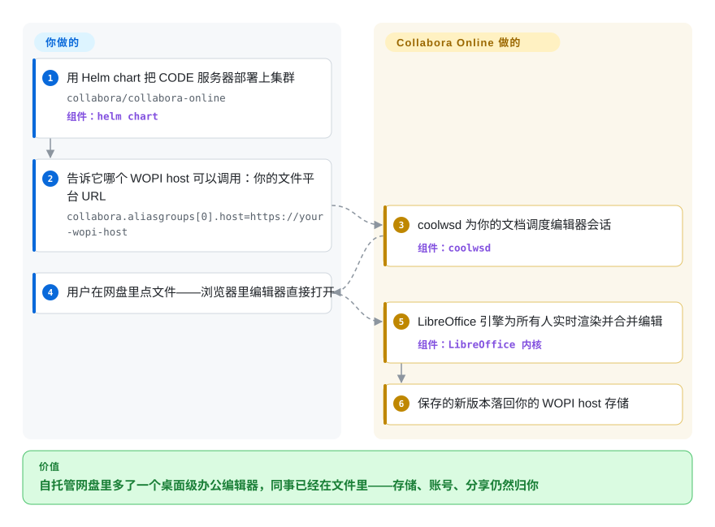

# Collabora Online

你的自托管网盘能预览办公文件，但「编辑」仍是下载再上传，而用户不可能装任何东西。Collabora Online 把*一整个 LibreOffice 引擎*放到浏览器标签页后面：服务器把桌面的文字/表格/演示编辑器逐瓦片流给你，多人共编，文件经 WOPI 存回你已有的存储。它是「文档服务器」这个生态位里拿宽松许可（MPL-2.0）的 pole position——前提是你带来一个 WOPI host。

## 何时使用

你已经在运营（或正在引入）一个会说 WOPI 的文件平台——Nextcloud/ownCloud 的 richdocuments 集成是旗舰路径，而 Helm chart 的配置面原生讲 `aliasgroups`/WOPISrc（chart README 核实，2026-09）——或者你准备自己实现一个 WOPI host。相比 [ONLYOFFICE Docs](onlyoffice-documentserver.zh.md) 选 Collabora 有三条轴：**许可**（MPL-2.0 的文件级 copyleft 对 AGPL 的网络条款）、**引擎广度**（LibreOffice 的格式矩阵，ODF 为心，祖传格式也在）、**扩容经济学**——高可用是 Helm 的 `replicaCount` 加一个按 WOPISrc 粘滞的负载均衡，不是企业版付费墙（chart README 写的就是这个配方）。相比 [Univer](univer.zh.md) 选它：交付物是「点文件→功能完整的编辑器，现在」，不是一个等着改版重写的编辑器套件。它的可持续性背书在本分类里很罕见：贡献者名单是 LibreOffice 老近卫军（Ashod 4,676／timar 2,283／mmeeks 1,536／kendy 1,227…，contributors API 2026-09-27），Collabora 公司当管家，Docker 镜像约 1.21 亿拉取——采纳是被测量的，不是被宣称的。

## 怎么用起来

两半：`coolwsd`——一个 C++ 守护进程，鉴权你的 WOPI host、调度会话、转发变更；以及 LibreOffice 衍生的内核，负责渲染与改文档，把画布更新推给浏览器客户端（镜像树 linguist：C++ 约 2.63 亿字节——引擎确实在树里，2026-09-27 核实；而你会去浏览的*那个 GitHub* 仓库只装着 `docker/`、`kubernetes/` 和文档——活跃开发搬去了 Collabora 的 Gerrit，README 置顶说明）。流程：你的文件平台为某文件签发 WOPI access token → Collabora 开一个编辑器会话，把该 WOPISrc 的所有客户端钉在同一个 pod/实例（chart 文档给了 HAProxy/nginx 的亲和配方）→ 编辑在服务端合并，经 WOPI 自动存回你的存储。管理旋钮是 `coolwsd.xml` 风格参数（chart 里的 `--o:ssl.enable=false …`）；剪贴板、拼写检查（词典）、字体（内嵌+替换）都在这台 appliance 里。纯评估的话：`collabora/code` 镜像加任意 WOPI-capable host，一个容器就能起 demo。

<!-- flow-steps:begin (generated from flows/collabora-online.json by tools/flow_card.py — do not edit) -->

流程文字版

1. **你**：用 Helm chart 把 CODE 服务器部署上集群 — `collabora/collabora-online` — 组件：`helm chart`
2. **你**：告诉它哪个 WOPI host 可以调用：你的文件平台 URL — `collabora.aliasgroups[0].host=https://your-wopi-host`
3. **Collabora Online**：coolwsd 为你的文档调度编辑器会话 — 组件：`coolwsd`
4. **你**：用户在网盘里点文件——浏览器里编辑器直接打开
5. **Collabora Online**：LibreOffice 引擎为所有人实时渲染并合并编辑 — 组件：`LibreOffice 内核`
6. **Collabora Online**：保存的新版本落回你的 WOPI host 存储

**价值**：自托管网盘里多了一个桌面级办公编辑器，同事已经在文件里——存储、账号、分享仍然归你

<!-- flow-steps:end -->

## 何时不用

- **你没有 WOPI host、又想要五行代码的嵌入** → WOPI 就是契约；自研 host（discovery、proof keys、token 的 REST 语义）是实打实的工作。[ONLYOFFICE Docs](onlyoffice-documentserver.zh.md) 带来更浅的一手 `DocsAPI.DocEditor` 嵌入（外加它自己的 WOPI 模式），[Univer](univer.zh.md) 则完全不需要 WOPI——只要你的打包器。
- **你要把编辑器改版重排进自己产品的 UI** → UI 是 Collabora 的外观（Ribbon/Classic 可选、有主题旋钮）流到浏览器——不是组件库。要嵌进自己页面并重排样式，用 [Univer](univer.zh.md)。
- **你的贡献/审计流程是 GitHub-PR 形状的** → README（2026-09）：*活跃开发在 Gerrit*；本仓库只收 Helm chart 与 docker 构建的 PR；issue、nightly 镜像与 chart 发布住在这里，源码浏览去 `online.mirror` 仓库（`未收录`——有意不做第二页；它*就是*本项目）。如果补丁评审在 GitHub 上的可见性是合规要求，请诚实称重这个摩擦。
- **用户的基线是像素级的 MS Office 渲染** → 这里的保真是 LibreOffice 对 OOXML 的渲染——覆盖面极好，但引擎不同；生僻的 SmartArt/嵌入图表正是各套件分野之处 [推断——本次审查未跑保真对比]。拿你的文档语料实测。
- **你要的是完整网盘*产品*（分享 UI、移动 app、搜索）** → Collabora 只是编辑后端；围着它的平台（Nextcloud 等）是另一个栈决定。数据中心型团队的自成一体的对位产品是 [Grist](grist.zh.md)。

## 横向对比

| 替代品 | 是否收录 | 我们的评价 | 取舍 |
| --- | --- | --- | --- |
| [ONLYOFFICE Docs](onlyoffice-documentserver.zh.md) | ✅ | MPL 许可、ODF/祖传格式广度、或不设计量的高可用是决定项时选 Collabora；OOXML-first 的 UI 保真、一手连接器（Moodle/Seafile/Odoo）与更浅的嵌入契约更要紧时选 ONLYOFFICE。 | Collabora：引擎广度+扩容自由，WOPI 管子自己铺。ONLYOFFICE：契约简单+Office 形状 UI，代价是 AGPL 与容量分层。 |
| [Univer](univer.zh.md) | ✅ | 编辑界面是*你的*产品（SDK、无头 Node、agent API）时选 Univer；产品已经在存文件、真实需求就是「本季把桌面办公搬进浏览器」时选 Collabora。 | Univer 用工程开销买可重排；Collabora 用 iframe+WOPI 的约束买完整。 |
| LibreOffice | `未收录` | 引擎祖先——它的正典 git 在 git.libreoffice.org（GitHub 是只读镜像），所以它不是可嵌入的服务器，且按本索引既有判例（见 office-automation 对比矩阵）保持不收录。 | 买入的是桌面套件本身；没有 web 服务器，没有协同协议。 |
| Nextcloud (richdocuments) | `未收录` | 事实上的默认生产搭档：多数部署就是 Nextcloud + 本 chart/镜像；`未收录` 有意跳过（群组协作平台，超出本批范围）。 | 买入你本来要自己实现的 drive、token 与分享链接；代价是再养一个完整平台。 |

## 技术栈

C++ 服务端（`coolwsd` + `common/net/` + LibreOffice 衍生的文档引擎）配 JavaScript/HTML 浏览器 UI（镜像 linguist 2026-09-27：C++ 约 2.63 亿、Python 约 1,090 万 [推断——python 属构建/工具/测试面，不是运行时服务]、JS 约 580 万字节）；host 集成走 WOPI 协议；客户端与服务端之间是二进制 websocket 瓦片消息 [未验证——协议内部未在本次通读]。打包：官方 Docker 镜像（`collabora/code`，nightly 由本仓库发布）、树内 Helm chart（`kubernetes/helm/collabora-online`，带 HAProxy WOPISrc 均衡的 HA 示例）、snap，另有发行版包；L10n 在 Weblate；SDK 文档站按年分版本（sitemap 里可见 26.04 文档路径，2026-09-27）。

## 依赖

一个 WOPI host（文件平台或你的实现）是*必需*——Collabora 从不占有存储或身份。服务端：Docker 或 Kubernetes（chart 的 HA 路线要求按 `WOPISrc` 粘滞路由）、TLS 终结（或代理后面 `--o:ssl.termination=true`）、你所服务语言的字体、可选词典/同义词库；其他外部存储服务需求（缓存/会话）本次未穷举 [未验证]。客户端：现代浏览器；无插件。

## 运维难度

**中到高。** 容器 demo 是小菜；生产是一台*办公 appliance*：每文档一个会话意味着粘滞路由与按 pod 的文档上限要容量规划，更新沿版本化 CODE 分支滚动（或买支持期更长的一手构建），字体/翻译漂移会以「渲染不对」的工单出现，WOPI token 的 bug 会伪装成跨团队边界的「保存失败」工单（你的认证 vs 他们的编辑器）。Helm chart、SDK 文档与十年 Nextcloud 集成血泪史把悬崖削矮了——但这是「我们现在运营一个文档后端」的承诺，不是一个 npm 依赖。

## 健康度与可持续性

- **维护：发布列车可验证。** GitHub 上 chart 有 release（helm-collabora-online-1.3.5，2026-09-24）、推送持续到 2026-09-25（API 核实）；nightly 容器由本仓库发布；产品线按年编号（2026-09-27 可见 26.04 文档）。
- **治理：公司 + LibreOffice 老兵公地。** Collabora 公司是管家；top-12 贡献者名单 100% 是长期任职的 LibreOffice/Collabora 名字，不是单骑冲榜（contributors API 2026-09-27）。正统评审搬去了 Gerrit——旧世界的、公开的、能用的；README 把拆分讲得很直白。
- **背书与寿命** ——LibreOffice Online 项目血统可追到约 2015 年 [未验证——血统日期本次未重新找源]，GitHub 仓库自 2020-10；企业订阅供养开发、CODE 保持开放 [推断——出自产品结构；许可条文本身按 COPYING 核实为 MPL-2.0]。年龄×仍活跃：强。
- **采纳：测量值约 1.21 亿 Docker 拉取**（`collabora/code`，Docker Hub API 2026-09-27）——与 ONLYOFFICE 数字同款的下限性免责适用 [推断]；GitHub 3.4k stars 严重低估，因为*代码*不住在那——只看 stars 的读者会给这个领域排错序；这行就是为纠正它而写。
- **风险信号** ——Gerrit-非-GitHub 的贡献摩擦与双仓库混淆（`online` + `online.mirror`）；企业支持系于厂商；LibreOffice 上游走向（例如其自己的云工作）可能挪动优先级 [推断]。

## 存疑（未验证）

- [未验证] 约 2015 年的 LibreOffice Online 血统起点——背景知识；GitHub 仓库自己的时钟始于 2020-10-01（这半句是 API 核实）。
- [未验证] websocket 瓦片协议细节、单实例文档上限、Codis/外部缓存需求——chart README 只读了 helm/WOPI/HA 相关行。
- [未验证] 付费层闸的是*功能*还是仅*支持/生命周期*——CODE 与企业版功能矩阵未抓取。
- [推断] Python 属构建/工具（镜像 linguist 的 1,090 万字节含测试脚手架）；所读材料中没有运行时 Python 服务。
- [推断] 生僻 OOXML 对象（SmartArt、嵌入图表）的保真分野——套件差异的通识；本次未跑语料实测。
- [未验证] `online.mirror` 的 stars/拉取等元数据——刻意只查过语言统计；给它单独一页会重复计数同一项目。
