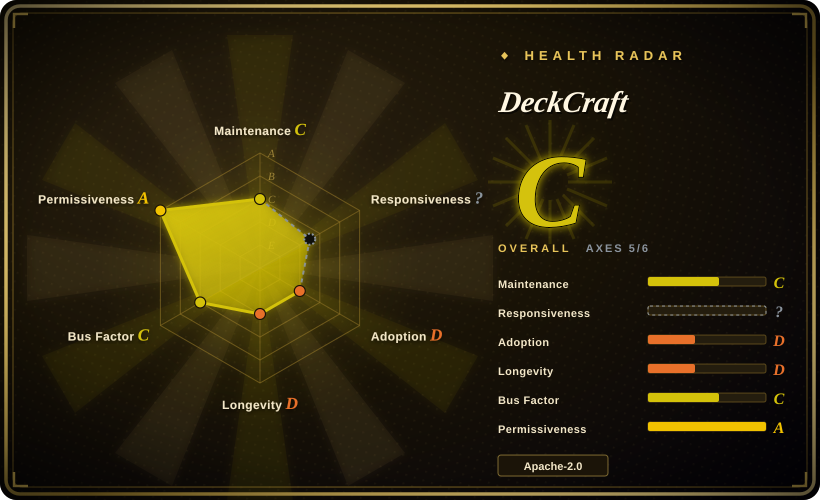
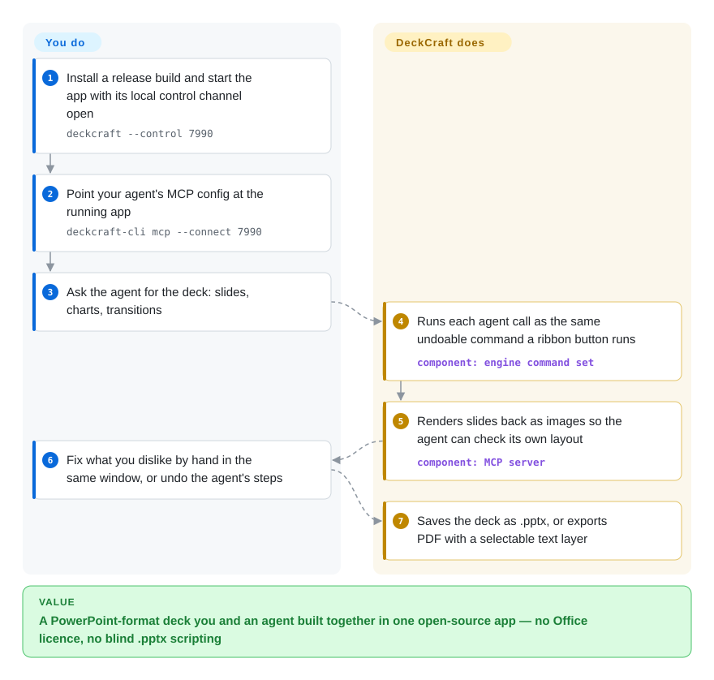

# DeckCraft

You need slides that open in PowerPoint but have no Office licence (or no Windows/Mac to run it on), and when you let an agent write the `.pptx` with a script it never sees what it made — text spills off the slide and nobody notices until the meeting. DeckCraft is a PowerPoint-style desktop app written from scratch in Rust in which every button is also a command that a CLI or an AI agent can run and then look at the rendered slide — but it is two days old and pre-alpha.

## When to use

You're a developer or technical writer on Linux, FreeBSD or a locked-down laptop who has to hand people `.pptx` files, and you also want your coding agent to draft the deck. The loop you keep hitting is concrete: the agent emits a python-pptx script, the file opens, and slide 4's title runs off the right edge because the script never rendered anything. You reach for DeckCraft because the same engine powers a PowerPoint-style ribbon editor *and* a `deckcraft-cli mcp` server: the agent inserts slides, shapes, charts and transitions as named commands (`slide.new`, `shape.insert`, `transition.set`), calls `render_slide` to see the result, and you fix the rest by hand in the same window with undo. It ships signed native builds for macOS, Windows, Linux and FreeBSD plus a WebAssembly build, under MIT OR Apache-2.0.

Choose it over LibreOffice Impress or ONLYOFFICE Desktop Editors (neither indexed yet) only when the agent-drivable command surface and a permissive Rust codebase matter more than years of real-world `.pptx` fidelity — those two have the fidelity, DeckCraft has the agent hooks. Choose it over [GenOffice](genoffice.md) when you want the agent outside the app (your own Claude/Codex driving it over MCP) rather than an AI panel inside it, and only need slides, not Word or Excel.

## How it works

DeckCraft is a layered Rust workspace: a document model of slides, masters, layouts and themes; a CPU renderer (`vello_cpu`); a `.pptx` reader/writer and PDF exporter; an engine where every user action — about 220 of them — is a command with an id, parameters and undo; and a thin egui user interface on top. Because the ribbon, the keyboard, the `deckcraft-cli` binary, a JSON-lines control port on `127.0.0.1` and the MCP server (Model Context Protocol, the standard way an AI agent discovers and calls tools) all funnel into those same commands, an agent's edit and your click are literally the same operation — like a piano with a player-piano roll: the keys you press and the roll that drives them move the same hammers. What DeckCraft does for you: layout, rendering, slide show, media playback (its own pure-Rust H.264/HEVC/VP9/AV1 decoders), `.pptx`/PDF/PNG export, and rendering slides back to the agent as images. What you do: install it, wire the agent to it, ask, then review and fix. Without an agent it is simply a desktop slide editor; headless, `deckcraft-cli run --cmd … --save` scripts a deck with no window at all.

<!-- flow-steps:begin (generated from flows/deckcraft.json by tools/flow_card.py — do not edit) -->

Text version of the flow

1. **You**: Install a release build and start the app with its local control channel open — `deckcraft --control 7990`
2. **You**: Point your agent's MCP config at the running app — `deckcraft-cli mcp --connect 7990`
3. **You**: Ask the agent for the deck: slides, charts, transitions
4. **DeckCraft**: Runs each agent call as the same undoable command a ribbon button runs — component: `engine command set`
5. **DeckCraft**: Renders slides back as images so the agent can check its own layout — component: `MCP server`
6. **You**: Fix what you dislike by hand in the same window, or undo the agent's steps
7. **DeckCraft**: Saves the deck as .pptx, or exports PDF with a selectable text layer

**Value**: A PowerPoint-format deck you and an agent built together in one open-source app — no Office licence, no blind .pptx scripting

<!-- flow-steps:end -->

## When NOT to use

- **You must round-trip real-world PowerPoint decks from other people** → use LibreOffice Impress (not indexed) or ONLYOFFICE Desktop Editors (not indexed). DeckCraft's own ROADMAP (2026-10-07) lists "PPTX fidelity on a corpus of real decks" as an open alpha blocker, "Verified on generated decks only"; the project rules forbid committing files produced by PowerPoint, so its tests use decks it generated itself. Legacy `.ppt`, `.potx`/`.ppsx`/`.pptm` and password-protected files are scored *missing* in `docs/parity.md`.
- **You need to print, export video, or embed SVG pictures** → use LibreOffice Impress. Print, MP4/GIF export, SVG pictures, edit points and equations are all *missing* rows in the parity scorecard (2026-10-09).
- **Co-editing with colleagues in a browser** → use [ONLYOFFICE Docs](onlyoffice-documentserver.md) or [Collabora Online](collabora-online.md). DeckCraft is single-user; its web build is a static WASM bundle with no server, and co-authoring is explicitly out of scope.
- **A server or CI job that only needs to emit `.pptx`** → use [python-pptx](../office-automation/python-pptx.md) or [OfficeCLI](../office-automation/officecli.md). DeckCraft's CLI can do it headlessly, but there is no crates.io / PyPI package (`publish = false`), so you build a ~170-crate Rust workspace (about 5 minutes on an Apple-silicon Mac, measured 2026-10-09) or ship the release binary.
- **An organisation-wide office standard, or anything a talk depends on next week** → stay on PowerPoint, LibreOffice or ONLYOFFICE. The repo is two days old, its own README says "early development", and its ROADMAP says the code was written in about 30 wall-clock hours by up to three Claude Opus 5.5 agents in parallel; the first real-user issue (#17, v0.3.0 on Fedora) reports dead arrow keys in the slide show and a broken New Presentation layout.
- **Agent-authored decks as web pages rather than `.pptx`** → use [open-slide](../ai-design-generation/open-slide.md), where the agent writes React slides on a fixed stage and you comment in the browser; DeckCraft's value is the PowerPoint file format and a native editor.
- **Distributing builds where video-codec patents matter** → DeckCraft bundles its own H.264 and HEVC decoders; if your legal team requires licensed codecs, use a suite that defers to the OS or a licensed decoder. [推断: no patent statement found in the repo]

## Comparison

| Alternative | In index | Our verdict | Tradeoff |
| --- | --- | --- | --- |
| LibreOffice Impress (`LibreOffice/core`) | not indexed | Pick Impress whenever the deck has to survive other people's real `.pptx` files, printing or ODF, and you can live without an agent API; pick DeckCraft when an agent must build the deck through named, undoable commands and see the rendered slides. Not added in this tab batch. | Impress brings two decades of format fixes and a foundation behind it, under MPL/LGPL; DeckCraft brings a single-binary Rust app with MCP built in, but only generated-deck fidelity testing and two days of history. |
| ONLYOFFICE Desktop Editors (`ONLYOFFICE/DesktopEditors`) | not indexed | Pick ONLYOFFICE Desktop when you want OOXML-native editing that matches its document server and a long-lived vendor; pick DeckCraft when you need an MCP/CLI surface over the editor and a permissive licence. Not added in this tab batch. | ONLYOFFICE is AGPL-3.0 with years of PowerPoint compatibility work; DeckCraft is MIT OR Apache-2.0 and scriptable end to end, but pre-alpha. |
| [GenOffice](genoffice.md) | ✅ | Pick GenOffice when you want an AI panel inside a Word/Excel/PowerPoint suite that edits existing OOXML as tracked changes; pick DeckCraft when your own external agent should drive a slide editor over MCP and you only need presentations. | GenOffice covers three formats and keeps untouched XML byte-for-byte, but routes AI through a vendor login by default; DeckCraft has no built-in model at all and is slides-only, Rust-native and two days old. |
| [OfficeCLI](../office-automation/officecli.md) | ✅ | Pick OfficeCLI when an agent needs to create or patch `.pptx`/`.docx`/`.xlsx` headlessly from one binary; pick DeckCraft when a human will also open, present and hand-fix the same deck in a GUI. | OfficeCLI is a headless .NET tool covering all three Office formats; DeckCraft adds a full editor and slide show but handles presentations only. |
| Microsoft PowerPoint | not a repo | The reference implementation DeckCraft copies black-box; if you already have Microsoft 365 and need guaranteed fidelity, co-authoring or add-ins, stay on it. | Closed commercial product with a licence fee; maximal fidelity and ecosystem, but no open command API for agents beyond VBA/add-ins. |

## Tech stack

Rust 2024 edition (rust-version 1.90), a Cargo workspace of 23 library crates and three apps (`deckcraft` desktop, `deckcraft-cli`, `deckcraft-web`) plus an `xtask` crate; about 114k lines of Rust and 438 `#[test]` functions (counted 2026-10-09 at commit `4b09f35`). UI: egui/eframe 0.36 on wgpu (DirectX 12 by default on Windows; WebGPU with WebGL2 fallback in the browser via trunk). Rendering: `vello_cpu`; text: `skrifa` + `harfrust` shaping, `unicode-bidi`; PDF: `krilla`; `.pptx`: `quick-xml` + `zip`; geometry: `kurbo`, `i_overlay`. Media: in-repo pure-Rust H.264, HEVC, VP9, AV1 and Opus decoders and MP4/Matroska/Ogg demuxers (ported from the sibling FilmCraft repo), `symphonia` (MPL-2.0) for other audio, `cpal` for output. Workspace-wide `unsafe_code = "forbid"` and a clippy ban on `unwrap`/`expect`/`panic` in production code.

## Dependencies

For users: just the installer — signed `.msi`/portable zip for Windows x64/arm64/x86, a notarized universal `.dmg` for macOS, AppImage/Flatpak/`.deb`/`.rpm`/tarball for Linux x86_64 and aarch64, a FreeBSD tarball, or a static web zip for any HTTP server. No database or service. Fonts: release builds embed open fonts from the separate `storytold/craft-fonts` repo; a source build without it falls back to system fonts. Linux source builds need the ALSA development headers (`libasound2-dev` / `alsa-lib-devel`), which the README did not mention until PR #24 (open, 2026-10-09). For the agent path: any MCP client that can launch `deckcraft-cli mcp`.

## Ops difficulty

**Low** for one person: download the platform build and start it; the AppImage self-updates through `.zsync` files. The control channel listens on `127.0.0.1` only. **Medium** for a fleet: two releases in two days on a `v0.x` line, no stated update policy beyond AppImage, and a Windows build that needed a DirectX 12 default (PR #16) to stop some AMD drivers crashing at launch. Building from source is a standard `cargo build`, but it compiles ~170 crates; the official CI skips macOS on PRs and only builds it on releases.

## Health & viability

- **Maintenance: extremely active, verified 2026-10-09** — 43 commits in four days, v0.1.0 and v0.3.0 published on 2026-10-08, eleven pull requests from outside contributors merged within two days of opening (e.g. #19 ZIP central-directory detection, #4 bidirectional/Arabic text, #2 an integer-overflow fix in the H.264/HEVC parsers).
- **Governance: one company, one human driver** — the org `storytold` presents as the ArtCraft team; `echelon` (Brandon Thomas) authored most of the 43 commits (29 attributed to that account by the contributors API), including the multi-thousand-line initial drops. The app id prefix is `ai.storyteller` and Windows resources name "Learning Machines LLC" as the company. [推断] Roadmap ownership sits with that single vendor; there is no governance file.
- **How it was built** — the ROADMAP states the engine, renderer, UI, slide show, PPTX, PDF, media and release pipeline were built in about 30 wall-clock hours by up to three Claude Opus 5.5 agents, and `CLAUDE.md` tells agents to commit and push straight to `main`. That speed explains the breadth (79% weighted "PowerPoint parity" by its own scorecard) and the risk: depth and real-file fidelity lag, which the roadmap itself admits (~62% parity including depth).
- **Age / Lindy** — two days old. The Lindy prior gives no credit yet. It is one of a dozen "Crafting Apps" the same org launched between 2026-09-30 and 2026-10-07 (photo, vector, PDF, layout, effects and raw-photo siblings among them); whether one team sustains all of them is the open question.
- **Adoption** — 746 stars, 383 forks and ~13.4k release-asset downloads in two days (2026-10-09). The fork-to-star ratio (~0.5) is unusually high and the GitHub stargazer list is not returned by the API, so star organicity could not be checked; fork creation times in the first 100 forks are spread across the launch day rather than bunched. A community Gentoo overlay already packages it.
- **Risk flags** — no relicense history (MIT OR Apache-2.0 from day one; the ArtCraft logos are trademarks, and forks must remove them). "Clean-room" is a stated process (black-box observation of PowerPoint, file formats from ECMA-376) rather than something a reader can audit. Self-written video decoders handle hostile input (an overflow was already fixed in PR #2).

## Caveats (unverified)

- [未验证] PowerPoint opens DeckCraft's `.pptx` without repair — the commit message says "verified opening in PowerPoint", and this review only confirmed that LibreOffice 26.8 opened a DeckCraft-written `.pptx` and that DeckCraft re-imported a LibreOffice-saved one (9 slides, rendered); no Microsoft Office was available to check.
- [未验证] Fidelity on real third-party decks (complex masters, SmartArt, embedded fonts) — the project's own roadmap says only generated decks were tested, and no real-world corpus was run for this review.
- [未验证] The desktop GUI's behaviour — only `deckcraft-cli` (render, run/save, commands, MCP `tools/list`) was built and run; the egui app and the web build were not launched.
- [未验证] The "clean-room" claim — AGENTS.md describes the process (no reading of the Office bundle, no GPL code copied); there is no way to audit how the agents that wrote it were sourced.
- [未验证] Whether the 746 stars are organic — the stargazer list API returned nothing; fork-owner account ages could not be checked [未验证：护栏拦截 — a `gh api graphql -F query=@file` lookup was blocked by the local push guard].
- [推断] Video-codec patent exposure from bundling H.264/HEVC decoders — no patent statement exists in the repo; this is a general redistribution concern, not a finding about this project.
- [推断] "Learning Machines LLC" and the `ai.storyteller` app id tie ArtCraft to the company behind Storyteller.ai — inferred from build metadata only.
- [推断] Sustainability across a dozen sibling apps launched in one week by the same small team — no staffing or funding information is published.
