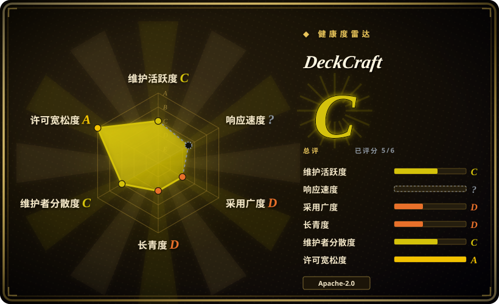
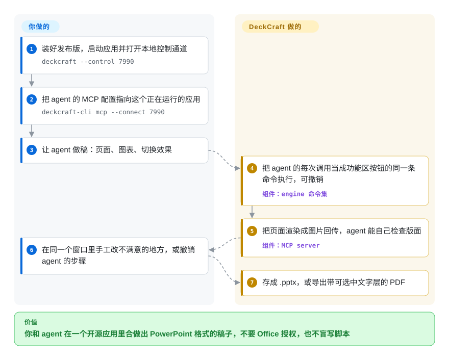

# DeckCraft

你得交一份能在 PowerPoint 里打开的演示稿，手上却没有 Office 授权（或者根本没有能跑它的 Windows/Mac）；让 agent 写脚本生成 `.pptx`，它从头到尾看不见成品，标题冲出页面也没人发现，直到开会那一刻。DeckCraft 是一个用 Rust 从零写的 PowerPoint 式桌面应用，界面上每个按钮同时是一条命令，命令行和 AI agent 都能调用，还能把渲染好的页面拿回来看——但它才诞生两天，还没到 alpha。

## 何时使用

你是在 Linux、FreeBSD 或一台管控很严的笔记本上干活的开发者或技术文档作者，要把 `.pptx` 交给别人，同时想让编码 agent 先起草。你反复撞上的问题很具体：agent 吐出一段 python-pptx 脚本，文件能打开，可第 4 页标题从右边冒出去了——脚本从来没渲染过任何东西。你选 DeckCraft，是因为同一个引擎既驱动一个 PowerPoint 式功能区编辑器，也驱动一个 `deckcraft-cli mcp` 服务：agent 用具名命令（`slide.new`、`shape.insert`、`transition.set`）插页面、形状、图表和切换效果，调用 `render_slide` 看结果，剩下的你在同一个窗口里手工改，随时撤销。它为 macOS、Windows、Linux、FreeBSD 提供签名的原生安装包，另有 WebAssembly 网页版，许可证是 MIT OR Apache-2.0。

和 LibreOffice Impress、ONLYOFFICE 桌面版（都尚未收录）相比，只有当“agent 能驱动的命令面”和宽松许可的 Rust 代码比多年真实 `.pptx` 兼容性更重要时才选它——兼容性在那两家，agent 接口在 DeckCraft。和 [GenOffice](genoffice.zh.md) 相比，你想要的是 agent 在应用**外面**（你自己的 Claude/Codex 通过 MCP 驱动它），而不是应用里内置一个 AI 面板，并且只需要做演示稿、不需要 Word 和 Excel 时，选 DeckCraft。

## 怎么用起来

DeckCraft 是一个分层的 Rust 工作区：底下是幻灯片、母版、版式、主题组成的文档模型；一个 CPU 渲染器（`vello_cpu`）；一个 `.pptx` 读写器和 PDF 导出器；一个引擎，把用户的每个动作——大约 220 个——都做成带 id、参数和撤销的命令；最上面是一层很薄的 egui 界面。功能区按钮、键盘、`deckcraft-cli` 命令行、监听 `127.0.0.1` 的 JSON 行控制端口、以及 MCP 服务（Model Context Protocol，AI agent 发现并调用工具的标准方式）全部汇入这同一套命令，所以 agent 的一次编辑和你的一次点击就是同一个操作——像一架自动钢琴：你按下的琴键和纸卷驱动的琴键敲的是同一组琴槌。DeckCraft 替你做的：排版、渲染、放映、媒体播放（自带纯 Rust 写的 H.264/HEVC/VP9/AV1 解码器）、导出 `.pptx`/PDF/PNG，以及把页面渲染成图片回传给 agent。你要做的：装好它、把 agent 接上、提要求、再审阅修改。不接 agent 时它就是一个普通的桌面幻灯片编辑器；不开窗口时，`deckcraft-cli run --cmd … --save` 也能纯命令行生成一份稿子。

<!-- flow-steps:begin (generated from flows/deckcraft.json by tools/flow_card.py — do not edit) -->

流程文字版

1. **你**：装好发布版，启动应用并打开本地控制通道 — `deckcraft --control 7990`
2. **你**：把 agent 的 MCP 配置指向这个正在运行的应用 — `deckcraft-cli mcp --connect 7990`
3. **你**：让 agent 做稿：页面、图表、切换效果
4. **DeckCraft**：把 agent 的每次调用当成功能区按钮的同一条命令执行，可撤销 — 组件：`engine 命令集`
5. **DeckCraft**：把页面渲染成图片回传，agent 能自己检查版面 — 组件：`MCP server`
6. **你**：在同一个窗口里手工改不满意的地方，或撤销 agent 的步骤
7. **DeckCraft**：存成 .pptx，或导出带可选中文字层的 PDF

**价值**：你和 agent 在一个开源应用里合做出 PowerPoint 格式的稿子，不要 Office 授权，也不盲写脚本

<!-- flow-steps:end -->

## 何时不用

- **要来回处理别人发来的真实 PowerPoint 文件** → 用 LibreOffice Impress（未收录）或 ONLYOFFICE 桌面版（未收录）。DeckCraft 自己的 ROADMAP（2026-10-07）把“在真实演示稿语料上的 PPTX 兼容性”列为未完成的 alpha 阻塞项，状态是“只在生成的演示稿上验证过”；项目规则禁止提交由 PowerPoint 产出的文件，所以它的测试只用自己生成的稿子。旧版 `.ppt`、`.potx`/`.ppsx`/`.pptm` 和加密文件在 `docs/parity.md` 里都标为“缺失”。
- **要打印、导出视频或插入 SVG 图片** → 用 LibreOffice Impress。打印、MP4/GIF 导出、SVG 图片、编辑顶点、公式在兼容度记分表里都是“缺失”行（2026-10-09）。
- **要和同事在浏览器里协同编辑** → 用 [ONLYOFFICE Docs](onlyoffice-documentserver.zh.md) 或 [Collabora Online](collabora-online.zh.md)。DeckCraft 是单用户应用，网页版只是一个没有服务端的静态 WASM 包，协同编辑被明确划在范围之外。
- **服务器或 CI 里只需要产出 `.pptx`** → 用 [python-pptx](../office-automation/python-pptx.zh.md) 或 [OfficeCLI](../office-automation/officecli.zh.md)。DeckCraft 的命令行确实能无界面生成，但它没有发布到 crates.io 或 PyPI（`publish = false`），你得编译一个约 170 个 crate 的 Rust 工作区（2026-10-09 在 Apple 芯片 Mac 上实测约 5 分钟），或者随部署带上发布版二进制。
- **全公司统一的办公标准，或者下周就要用它上台讲** → 继续用 PowerPoint、LibreOffice 或 ONLYOFFICE。仓库才两天，README 自称“早期开发”，ROADMAP 写明代码是最多三个 Claude Opus 5.5 agent 并行、大约 30 个小时写出来的；第一个真实用户的 issue（#17，Fedora 上的 v0.3.0）就报告放映时方向键无效、“新建演示文稿”页面布局错乱。
- **想让 agent 产出网页形式的演示稿而不是 `.pptx`** → 用 [open-slide](../ai-design-generation/open-slide.zh.md)：agent 在固定画布上写 React 页面，你在浏览器里批注；DeckCraft 的价值在 PowerPoint 文件格式和原生编辑器。
- **在乎视频编解码专利的分发场景** → DeckCraft 打包了自己写的 H.264 和 HEVC 解码器；如果法务要求使用有授权的解码器，选一个调用操作系统或授权解码器的套件。[推断：仓库里没找到任何专利声明]

## 横向对比

| 替代品 | 是否收录 | 我们的评价 | 取舍 |
| --- | --- | --- | --- |
| LibreOffice Impress（`LibreOffice/core`） | 未收录 | 只要稿子得经得住别人的真实 `.pptx`、要打印或要 ODF，而你不需要 agent 接口，就选 Impress；当 agent 必须通过具名、可撤销的命令搭稿并看到渲染结果时选 DeckCraft。本批次（标签页收录）未新增此页。 | Impress 带来二十年的格式修补和基金会背书，许可是 MPL/LGPL；DeckCraft 带来一个内置 MCP 的单二进制 Rust 应用，但兼容性只在自己生成的稿子上测过，历史只有两天。 |
| ONLYOFFICE 桌面版（`ONLYOFFICE/DesktopEditors`） | 未收录 | 想要和 ONLYOFFICE 文档服务器一致的 OOXML 原生编辑、以及一个长寿厂商时选 ONLYOFFICE 桌面版；需要编辑器之上的 MCP/命令行接口和宽松许可时选 DeckCraft。本批次（标签页收录）未新增此页。 | ONLYOFFICE 是 AGPL-3.0，做了多年 PowerPoint 兼容；DeckCraft 是 MIT OR Apache-2.0、从头到尾可脚本化，但还没到 alpha。 |
| [GenOffice](genoffice.zh.md) | 已收录 | 想在 Word/Excel/PowerPoint 套件里内置一个 AI 面板、以修订方式改现有 OOXML 时选 GenOffice；想让你自己的外部 agent 通过 MCP 驱动一个幻灯片编辑器、且只做演示稿时选 DeckCraft。 | GenOffice 覆盖三种格式、未改动的 XML 逐字节保留，但默认经厂商登录走 AI；DeckCraft 完全不内置模型，只做幻灯片，纯 Rust，才两天大。 |
| [OfficeCLI](../office-automation/officecli.zh.md) | 已收录 | agent 需要用一个二进制无界面地创建或修补 `.pptx`/`.docx`/`.xlsx` 时选 OfficeCLI；同一份稿子人还要在图形界面里打开、放映、手工修时选 DeckCraft。 | OfficeCLI 是覆盖三种 Office 格式的无界面 .NET 工具；DeckCraft 多了完整编辑器和放映，但只管演示文稿。 |
| Microsoft PowerPoint | 非仓库 | DeckCraft 黑盒模仿的参照物；如果你已有 Microsoft 365，需要有保证的兼容性、协同编辑或加载项，就留在它上面。 | 闭源商业产品，要付授权费；兼容性和生态最全，但除了 VBA/加载项之外没有给 agent 用的开放命令接口。 |

## 技术栈

Rust 2024 edition（rust-version 1.90），一个由 23 个库 crate 加三个应用（`deckcraft` 桌面版、`deckcraft-cli`、`deckcraft-web`）和一个 `xtask` crate 组成的 Cargo 工作区；约 11.4 万行 Rust、438 个 `#[test]` 函数（2026-10-09 在提交 `4b09f35` 上统计）。界面：egui/eframe 0.36，跑在 wgpu 上（Windows 默认 DirectX 12；浏览器里经 trunk 用 WebGPU，退回 WebGL2）。渲染：`vello_cpu`；文字：`skrifa` + `harfrust` 字形排布、`unicode-bidi`；PDF：`krilla`；`.pptx`：`quick-xml` + `zip`；几何：`kurbo`、`i_overlay`。媒体：仓库内纯 Rust 的 H.264、HEVC、VP9、AV1、Opus 解码器和 MP4/Matroska/Ogg 解封装器（从同组织的 FilmCraft 移植），其他音频用 `symphonia`（MPL-2.0），输出用 `cpal`。整个工作区 `unsafe_code = "forbid"`，生产代码里用 clippy 禁掉 `unwrap`/`expect`/`panic`。

## 依赖

用户侧只需要安装包：Windows x64/arm64/x86 的签名 `.msi` 或免安装 zip，macOS 经公证的通用 `.dmg`，Linux x86_64 和 aarch64 的 AppImage/Flatpak/`.deb`/`.rpm`/tarball，FreeBSD tarball，或者一个可放在任意 HTTP 服务器上的静态网页包。不需要数据库或任何服务。字体：发布版内嵌独立仓库 `storytold/craft-fonts` 里的开源字体；源码编译时没有它就退回系统字体。Linux 源码编译需要 ALSA 开发头文件（`libasound2-dev` / `alsa-lib-devel`），README 直到 PR #24（2026-10-09 仍未合并）才补上这一条。agent 路径：任何能启动 `deckcraft-cli mcp` 的 MCP 客户端。

## 运维难度

**低**（个人使用）：下载对应平台的安装包直接启动；AppImage 能通过 `.zsync` 文件自更新。控制通道只监听 `127.0.0.1`。**中**（批量部署）：两天发了两个 `v0.x` 版本，除 AppImage 外没有说明更新策略；Windows 版曾需要把默认后端改成 DirectX 12（PR #16），才不让部分 AMD 显卡驱动在启动时崩溃。源码构建就是普通的 `cargo build`，但要编译约 170 个 crate；官方 CI 在 PR 和 main 上不跑 macOS，只在发布时构建。

## 健康度与可持续性

- **维护：极其活跃，2026-10-09 核实**——四天 43 个提交，2026-10-08 发布了 v0.1.0 和 v0.3.0；外部贡献者的 11 个 PR 在提交后两天内被合并（例如 #19 改为读 ZIP 中央目录识别文件包，#4 双向文本和阿拉伯文排版，#2 修复 H.264/HEVC 参数解析里的整数溢出）。
- **治理：一家公司、一个主驱动人**——组织 `storytold` 以 ArtCraft 团队名义出现；`echelon`（Brandon Thomas）写了 43 个提交中的大部分（贡献者接口记在这个账号下的有 29 个），包括几千行一次的初始提交。应用 id 前缀是 `ai.storyteller`，Windows 资源信息里的公司名是 “Learning Machines LLC”。[推断] 路线图归这一家厂商所有；仓库没有治理文件。
- **它是怎么写出来的**——ROADMAP 写明引擎、渲染器、界面、放映、PPTX、PDF、媒体和发布流水线是最多三个 Claude Opus 5.5 agent 在约 30 个小时内写出来的，`CLAUDE.md` 让 agent 直接提交并推到 `main`。这个速度解释了它的广度（按自家记分表是 79% 的加权“PowerPoint 功能覆盖”），也解释了风险：深度和真实文件兼容性落后，路线图自己也承认（算上深度约 62%）。
- **年龄 / Lindy**——两天。Lindy 先验目前给不了任何加分。它是同一组织在 2026-09-30 到 2026-10-07 之间推出的十来个 “Crafting Apps” 之一（兄弟项目包括图片、矢量、PDF、排版、特效、RAW 照片等），同一个团队能否同时养活这么多应用是悬而未决的问题。
- **采用**——两天内 746 星、383 个 fork、约 1.34 万次发布资产下载（2026-10-09）。fork 与星的比例（约 0.5）异常偏高，而 GitHub 接口不返回星标用户列表，因此无法核查星数是否自然；前 100 个 fork 的创建时间分散在发布当天各个时段，没有扎堆。社区已经有一个 Gentoo overlay 打包它。
- **风险信号**——没有改许可证的历史（从第一天起就是 MIT OR Apache-2.0；ArtCraft 标志是商标，fork 必须去掉）。“净室实现”是一套声明的流程（黑盒观察 PowerPoint、文件格式依据 ECMA-376），读者无法审计。自己写的视频解码器要处理恶意输入（PR #2 已经修过一次溢出）。

## 存疑（未验证）

- [未验证] PowerPoint 能否不经修复打开 DeckCraft 写出的 `.pptx`——提交信息写着“已在 PowerPoint 中验证打开”，本次只确认了 LibreOffice 26.8 能打开 DeckCraft 写出的 `.pptx`，以及 DeckCraft 能重新导入 LibreOffice 另存的文件（9 页，均能渲染）；手头没有 Microsoft Office 可供核对。
- [未验证] 在真实第三方演示稿（复杂母版、SmartArt、嵌入字体）上的兼容性——项目路线图自己说只测过生成的稿子，本次也没有跑真实语料。
- [未验证] 桌面图形界面的实际表现——只编译并运行了 `deckcraft-cli`（render、run/save、commands、MCP `tools/list`），没有启动 egui 桌面应用和网页版。
- [未验证] “净室实现”的说法——AGENTS.md 描述了流程（不读 Office 安装包内部、不抄 GPL 代码），但无从审计写代码的 agent 参考了什么。
- [未验证] 746 颗星是否自然增长——星标用户列表接口没有返回内容；fork 账号的注册时间没能查 [未验证：护栏拦截——一次 `gh api graphql -F query=@file` 查询被本地推送护栏拦下]。
- [推断] 打包 H.264/HEVC 解码器带来的视频编解码专利风险——仓库里没有专利声明；这是一般性的分发顾虑，不是针对本项目的发现。
- [推断] “Learning Machines LLC” 和 `ai.storyteller` 应用 id 把 ArtCraft 和 Storyteller.ai 背后的公司联系在一起——只是从构建元数据推出来的。
- [推断] 同一个小团队一周内推出十来个兄弟应用，可持续性存疑——没有公开的人员或资金信息。
