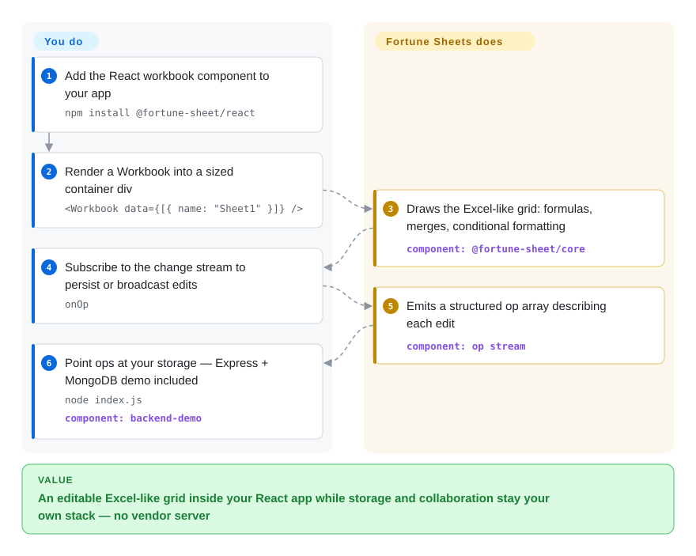

# Fortune Sheets

Luckysheet — the 17k-star JS spreadsheet everyone copied — was archived, and you still have a React app that needs an editable, Excel-like grid right now, under MIT, without adopting a whole office SDK. Fortune Sheets is the community's TypeScript port of Luckysheet: a drop-in `<Workbook>` component with the formulas, merges and conditional formatting inherited from that lineage, plus an *op stream* so persistence and collaboration stay your own backend's job.

## When to use

You're a React developer in an intranet app (report editor, planning sheet, grade grid) and the product owner says "make it feel like Excel" — cells, formula bar behavior, formatting painter — but the ticket has no budget for a commercial grid license and no appetite for Univer's plugin architecture. Fortune Sheets is the fastest path there: one component, `data` is (near enough) Luckysheet's JSON so migrating existing sheets is a rename exercise, and every user edit emits a structured `Op` array (`{op: "replace", path: ["data",1,0,"bl"], value: 1}`) that you can write to your database or relay for collab — with an Express + MongoDB working example in the repo (`backend-demo`). Versus [Jspreadsheet CE](jspreadsheet.md) it brings far more Excel semantics (conditional formatting, merged cells, fill handle) out of the box; versus [Handsontable](handsontable.md) it is MIT/free for commercial use, which Handsontable is not. The Luckysheet lineage (its 2020-era feature surface) is both its strength and its ceiling — see *When NOT to use*.

## How it works

Fortune Sheets is Luckysheet rebuilt for a modern toolchain: jQuery out, React + immer in, whole codebase moving to TypeScript (still in progress per README), and formula evaluation delegated to a forked `@handsontable/formula-parser`. The README's improvement list over Luckysheet is explicit: multiple instances per page, no window-global data, no elements rendered outside your container. What the project does *not* silently do is storage: it renders and emits ops; you decide whether ops hit Postgres, Mongo, or a websocket relay (the repo's collaboration demo wires `onOp` to Express + MongoDB). Pivot tables and charts sit unchecked on its roadmap, and Excel import/export is delegated to a separate community plugin (`fortuneexcel`).

<!-- flow-steps:begin (generated from flows/fortune-sheets.json by tools/flow_card.py — do not edit) -->

Text version of the flow

1. **You**: Add the React workbook component to your app — `npm install @fortune-sheet/react`
2. **You**: Render a Workbook into a sized container div — `<Workbook data={[{ name: "Sheet1" }]} />`
3. **Fortune Sheets**: Draws the Excel-like grid: formulas, merges, conditional formatting — component: `@fortune-sheet/core`
4. **You**: Subscribe to the change stream to persist or broadcast edits — `onOp`
5. **Fortune Sheets**: Emits a structured op array describing each edit — component: `op stream`
6. **You**: Point ops at your storage — Express + MongoDB demo included — `node index.js` — component: `backend-demo`

**Value**: An editable Excel-like grid inside your React app while storage and collaboration stay your own stack — no vendor server

<!-- flow-steps:end -->

## When NOT to use

- **You cannot carry an unmaintained dependency** → last default-branch commit and last release both 2025-11-06 (API-verified 2026-09-27; GitHub's later `pushed_at` of 2025-12-15 is not a commit to the default branch): an ~11-month stall with ~300k monthly users still on it. Security fixes will be yours. For an active successor from Luckysheet's *own* team, use [Univer](univer.md); for paid support on a grid, [Handsontable](handsontable.md).
- **Native xlsx round-trip is a requirement** → import/export lives in a third-party plugin ([fortuneexcel](https://github.com/corbe30/fortuneexcel), `未收录` — single-community-member plugin repo, deliberately not added; verify it independently before depending on it). Format fidelity needs [ONLYOFFICE Docs](onlyoffice-documentserver.md).
- **Pivot tables / charts in the grid** → unchecked roadmap boxes in the README (2026-09). A pivot-and-chart product today is [Grist](grist.md) (as an app) or Univer Pro / ONLYOFFICE (as components/suite).
- **Server-authoritative collaboration out of the box** → ops are a *primitive*, not a sync engine: no CRDT, no presence, no permission model ships with it. ONLYOFFICE/Collabora ship all three.
- **You're on Vue** → the README's "Support Vue" line is not delivered; only `@fortune-sheet/react` ships. Univer advertises Vue adapters.
- **Non-English products** → UI strings, docs and demos are Chinese-first (the README itself splits 中文/English); the English docs are flagged "some topics outdated" by the project.

## Comparison

| Alternative | In index | Our verdict | Tradeoff |
| --- | --- | --- | --- |
| [Univer](univer.md) | ✅ | Pick Univer for any new build with more than a weekend of budget — it is the actively-released successor line of the same Luckysheet family, with a maintained formula/render engine and an API stability policy; pick Fortune Sheets when you want one component and zero framework commitment this week and accept the stall risk. | Univer buys an active 1.0 line and engine depth at plugin-architecture cost; Fortune buys a 10-minute drop-in at maintenance risk. |
| [Jspreadsheet CE](jspreadsheet.md) | ✅ | Pick Fortune Sheets when the sheet must behave like Excel (conditional formatting, merged ranges, formula bar semantics, op log); pick Jspreadsheet when your artifact is really a typed data-entry grid where Excel chrome would be noise. | Fortune: more Excel, stalled repo. Jspreadsheet: maintained (pushed 2026-09-21), lighter semantics, MIT. |
| [Handsontable](handsontable.md) | ✅ | Pick Handsontable when a 15-year track record and vendor support justify the invoice; pick Fortune Sheets only if the license line is hard: Handsontable's free tier excludes commercial use. | Handsontable buys longevity + support for money; Fortune buys free-for-everything at the price of no one minding the repo. |
| Luckysheet | `未收录` | Historical ancestor; archived with a redirect to Univer. Never pick it — listed here so the lineage (and why Fortune's JSON looks like it) is explicit; deliberately skipped in this batch as an exact-successor case. | Fortune Sheets took the JSON format and TS-ified the engine; nothing Luckysheet does is worth adopting that Fortune doesn't. |
| [fortuneexcel](https://github.com/corbe30/fortuneexcel) | `未收录` | The xlsx import/export answer for Fortune projects, but a one-maintainer plugin repo outside the org — treat as a fork-or-verify dependency, not an answer; `未收录` because this batch indexes the 7 grids/suites, not ecosystem plugins. | Buys .xlsx in/out for a stack that has none; unvetted maintenance, and its author counts are not in Fortune's core team. |

## Tech stack

TypeScript + React (`@fortune-sheet/react`), state via immer, formulas via a forked handsontable/formula-parser; monorepo built with `father` (umi toolchain), tested on CircleCI with Cypress-based stories, published to npm (`@fortune-sheet/core` + react wrapper). Data format: Luckysheet-compatible JSON (with small renames documented in a migration guide). [未验证] Depth of the in-progress TS conversion and the real state of the Vue package — README says TS port is "still in progress"; package tree was not line-audited.

## Dependencies

Client-only for editing: a React app and a sized container div (the README warns `auto` height can render nothing). Persistence and collaboration are *your* services — the repo's `backend-demo` runs on Express + MongoDB (`node index.js`), which is an example, not a required stack. No native addons, no worker prerequisites stated in the quick start.

## Ops difficulty

**Low to install, medium-to-high to keep.** It's an npm component: bundle it, ship it. But a stalled upstream means upgrade pressure accumulates in *your* fork: unpatched CVEs land on your team, the data format freezes, and the ecosystem plugin for xlsx I/O has its own lifecycle to babysit. For an intranet tool that ships once, fine; for a customer-facing product, budget for forking.

## Health & viability

- **Maintenance: stalled, measured.** Last default-branch commit and last release v1.0.4 both 2025-11-06 (API-verified 2026-09-27); the 2025-12-15 `pushed_at` is a push outside the default branch. Three releases clustered in Nov-2025 then silence — that is the "coasting→dormant" transition, dated.
- **Governance: small team + company badge.** Org `ruilisi`; README carries a "maintained by xiemala" badge; top contributor zyc9012 with 277, then 186/125 — real but thin breadth (contributors API, 2026-09-27). No public roadmap commitment mechanism (unchecked roadmap boxes are the roadmap).
- **Backing & longevity** — repo ~4.5 years old (created 2022-03-31) on a 2020-era lineage; Lindy cuts both ways: the *design* is battle-tested at Luckysheet scale, the *repo* is not being fed. [推断]
- **Adoption: still flowing.** The health radar measures 212,825 monthly npm downloads for `@fortune-sheet/react` (5 dependent repos); a same-day direct registry read gives 311,677 for the same window — either way installs continue against a quiet repo, [推断] mostly because it's the only MIT drop-in left in the Luckysheet family.
- **Risk flags** — the successor of its ancestor (Univer) is the same market move that archived Luckysheet; history can repeat. No open-core gate here — but also no paid tier to buy reliability from.

## Caveats (unverified)

- [未验证] TypeScript-conversion completeness and Vue-package status — both statements rest on README wording ("still in progress"; "Support Vue" unchecked), not on code audit.
- [未验证] Whether v1.0.x APIs are stable enough to build on despite the version number — README warns input structures may change even at 1.x ("Attention" section), which was not reconciled against CHANGELOG.
- [推断] The ~300k-download / stalled-repo mismatch reads as "users didn't get the memo"; alternative explanation is the demo/tutorial ecosystem pinning it — download attribution is not visible from the registry.
- [未验证] Large-dataset performance (virtualization quality of the DOM/canvas mix inherited from Luckysheet) — no benchmark in-repo, none reproduced.
- [未验证] `fortuneexcel` plugin's current maintenance state and xlsx fidelity — linked from README; its repo was not reviewed in this batch.
