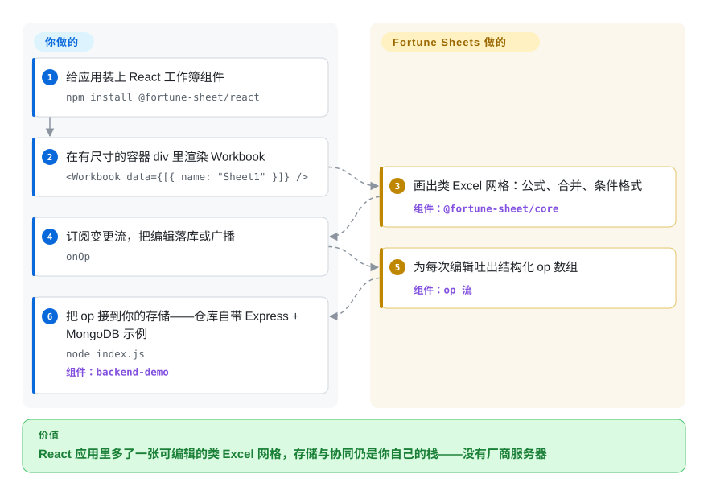

# Fortune Sheets

Luckysheet——那个被无数人抄过的 17k-star JS 在线表格——已经归档，而你的 React 应用现在就需要一张可编辑、类 Excel 的网格：MIT、不用把整套办公 SDK 请进家门。Fortune Sheets 是社区对 Luckysheet 的 TypeScript 移植：一个即插即用的 `<Workbook>` 组件，继承了那条血统里的公式、合并单元格与条件格式，外加一条 *op 流*——持久化和协同仍然是你自己后端的事。

## 何时使用

你是个 React 开发，在内网应用（报表编辑器、排产表、成绩网格）里，产品说「要做出 Excel 的感觉」——单元格、公式栏行为、格式刷——但工单里没有商业网格授权费，也不想为 Univer 的插件架构买单。Fortune Sheets 是去那儿最快的路：一个组件，`data` 基本就是 Luckysheet 的 JSON（迁移旧表是改字段名的活），每次用户编辑吐出一个结构化 `Op` 数组（`{op: "replace", path: ["data",1,0,"bl"], value: 1}`），你决定写进 Postgres、Mongo 还是走 websocket 中继——仓库自带 Express + MongoDB 的可用示例（`backend-demo`）。对比 [Jspreadsheet CE](jspreadsheet.zh.md)：它开箱的 Excel 语义多得多（条件格式、合并、填充柄）；对比 [Handsontable](handsontable.zh.md)：它商用免费，而 Handsontable 不是。Luckysheet 血统（2020 年代的功能面）既是它的强项也是它的天花板——见*何时不用*。

## 怎么用起来

Fortune Sheets 是为现代工具链重造的 Luckysheet：去掉 jQuery，换成 React + immer，全库向 TypeScript 迁移（README 自述仍在进行中），公式求值交给 fork 出来的 `@handsontable/formula-parser`。README 列出的对 Luckysheet 的改进很具体：一页多实例、数据不再挂在 window、不在你的容器外渲染元素。它*不*默默替你做的是存储：组件负责渲染和吐 op，落库还是广播由你决定（仓库的协同 demo 把 `onOp` 接到 Express + MongoDB）。透视表与图表挂在 roadmap 未勾选项上，Excel 导入导出外包给了一个社区插件（`fortuneexcel`）。

<!-- flow-steps:begin (generated from flows/fortune-sheets.json by tools/flow_card.py — do not edit) -->

流程文字版

1. **你**：给应用装上 React 工作簿组件 — `npm install @fortune-sheet/react`
2. **你**：在有尺寸的容器 div 里渲染 Workbook — `<Workbook data={[{ name: "Sheet1" }]} />`
3. **Fortune Sheets**：画出类 Excel 网格：公式、合并、条件格式 — 组件：`@fortune-sheet/core`
4. **你**：订阅变更流，把编辑落库或广播 — `onOp`
5. **Fortune Sheets**：为每次编辑吐出结构化 op 数组 — 组件：`op 流`
6. **你**：把 op 接到你的存储——仓库自带 Express + MongoDB 示例 — `node index.js` — 组件：`backend-demo`

**价值**：React 应用里多了一张可编辑的类 Excel 网格，存储与协同仍是你自己的栈——没有厂商服务器

<!-- flow-steps:end -->

## 何时不用

- **你不能背一个无人维护的依赖** → 末次推送 2025-12-15、末次发布 2025-11-06（2026-09-27 API 核实）：约 9 个月的停滞，而月下载还有约 30 万。安全修补将落到你头上。要 Luckysheet *亲团队*的活跃后继，用 [Univer](univer.zh.md)；要网格的付费支持，用 [Handsontable](handsontable.zh.md)。
- **原生 xlsx 往返是硬需求** → 导入导出在第三方插件里（[fortuneexcel](https://github.com/corbe30/fortuneexcel)，`未收录`——单人社区插件仓库，有意不加，依赖前须自行核验）。格式保真得靠 [ONLYOFFICE Docs](onlyoffice-documentserver.zh.md)。
- **网格里要透视表/图表** → README roadmap 上的未勾选项（2026-09）。今天就要透视+图表产品的：当应用用 [Grist](grist.zh.md)，当组件/套件用 Univer Pro 或 ONLYOFFICE。
- **要开箱即用的服务端权威协同** → op 是*原料*不是同步引擎：没有 CRDT、在线状态、权限模型。ONLYOFFICE/Collabora 三样都有。
- **你在 Vue 栈** → README 的「Support Vue」未交付，只发 `@fortune-sheet/react`。Univer 宣传有 Vue 适配。
- **非中文产品** → UI 文案、文档、demo 中文优先（README 本身就分中/英），英文文档被项目自己标注「部分过时」。

## 横向对比

| 替代品 | 是否收录 | 我们的评价 | 取舍 |
| --- | --- | --- | --- |
| [Univer](univer.zh.md) | ✅ | 只要预算超过一个周末，新做都选 Univer——它是 Luckysheet 同族里持续发布的那条线，有在维护的公式/渲染引擎和 API 稳定性政策；只有当你本周就要一个组件、不想对任何框架表态、且接受停更风险时才选 Fortune。 | Univer 用插件架构换活跃 1.0 线与引擎深度；Fortune 用十分钟即插即用换停摆风险。 |
| [Jspreadsheet CE](jspreadsheet.zh.md) | ✅ | 这张表必须表现得像 Excel（条件格式、合并区、公式栏语义、op 日志）选 Fortune；你的产物其实是张类型化录入网格、Excel 外观反而是噪音时选 Jspreadsheet。 | Fortune：更像 Excel，仓库停摆。Jspreadsheet：有人维护（2026-09-21 有推送）、语义更轻、MIT。 |
| [Handsontable](handsontable.zh.md) | ✅ | 15 年记录与厂商支持值这张发票时选 Handsontable；只有许可是硬红线时才考虑 Fortune——Handsontable 的免费层不含商用。 | Handsontable 花钱买长寿+支持；Fortune 全免费，代价是没人看仓库。 |
| Luckysheet | `未收录` | 历史祖先；已归档并指向 Univer。永远别选它——列在这里是为了把血统（以及 Fortune 的 JSON 为何长这样）讲明白；本批按「后继已收录」情形有意跳过。 | Fortune 拿走 JSON 格式并把引擎 TS 化；Luckysheet 能做而 Fortune 不能的事，没有值得采用的。 |
| [fortuneexcel](https://github.com/corbe30/fortuneexcel) | `未收录` | Fortune 项目 xlsx 读写的官方指路答案，但它是 org 外单人维护的插件仓库——当「要么 fork 要么核验」的依赖看待，不算答案；`未收录` 因为本批收录的是 7 个网格/套件，不含生态插件。 | 给本无 xlsx 读写的技术栈补上进出；维护未经审查，作者也不在 Fortune 核心团队。 |

## 技术栈

TypeScript + React（`@fortune-sheet/react`），immer 管状态，公式走 fork 的 handsontable/formula-parser；monorepo 用 `father`（umi 工具链）构建，CircleCI 上以 Cypress story 测试，发布到 npm（`@fortune-sheet/core` + react wrapper）。数据格式：Luckysheet 兼容 JSON（迁移指南记录了少量改名）。[未验证] TS 化完成度与 Vue 包真实状态——README 自述 TS 移植「仍在进行」；未逐行审计包树。

## 依赖

编辑本身纯客户端：一个 React 应用加一个有尺寸的容器 div（README 提醒高度设 `auto` 可能什么都画不出来）。持久化与协同是*你的*服务——仓库 `backend-demo` 跑在 Express + MongoDB（`node index.js`），是示例不是必需栈。无原生插件，quick start 未声明 worker 前置。

## 运维难度

**装起来低，养起来中到高。** 它就是个 npm 组件：打包、上线。但上游停摆意味着升级压力全堆到*你的* fork：未修补的 CVE 落在你团队头上、数据格式冻结、负责 xlsx 读写的生态插件还有自己的生命周期要盯。一次性交付的内网工具没问题；面向客户的产品，请把 fork 的钱算进预算。

## 健康度与可持续性

- **维护：停摆，有测量。** 末次推送 2025-12-15；末次发布 v1.0.4 于 2025-11-06（2026-09-27 API 核实）。2025-11 扎堆发了三个版本然后沉默——这就是「滑向休眠」的转折点，有日期。
- **治理：小队 + 公司徽章。** org `ruilisi`；README 挂「maintained by xiemala」徽章；头号贡献者 zyc9012 277 次，其后 186/125——真实但单薄（contributors API，2026-09-27）。没有公开路线图承诺机制（未勾选的 roadmap 清单就是路线图）。
- **背书与寿命** ——仓库约 4.5 年（2022-03-31 创建），血统是 2020 年代的；Lindy 双向切：*设计*在 Luckysheet 规模上久经考验，*仓库*没人在喂。[推断]
- **采纳：仍在流入。** 健康雷达记录 `@fortune-sheet/react` 月下载 212,825（dependent repos 5）；同日 registry 直读同一窗口为 311,677——无论取哪个口径，安装量都还在对着一个安静下来的仓库流入，[推断] 多半因为它是 Luckysheet 家族里仅剩的 MIT 即用品。
- **风险信号** ——其祖先的后继（Univer）正是让 Luckysheet 归档的同一次市场动作；历史可能重演。这里没有开放核心闸门——但也没有付费层可以向厂商买确定性。

## 存疑（未验证）

- [未验证] TypeScript 迁移完成度与 Vue 包状态——两个判断都只依据 README 措辞（「仍在进行」；「Support Vue」未勾选），未做代码审计。
- [未验证] v1.0.x 的 API 是否稳到可以长期建设——README「Attention」节自警 1.0 稳定前数据结构与 API 仍可能变，此说法未与 CHANGELOG 对账。
- [推断] 约 30 万月下载 × 停摆仓库的错位，读起来像「用户没收到停更通知」；另一种解释是教程/demo 生态把它钉住了——registry 看不出下载归因。
- [未验证] 大数据量性能（继承自 Luckysheet 的 DOM/canvas 混合的虚拟化质量）——仓库无基准，此处未复现。
- [未验证] `fortuneexcel` 插件当前的维护状态与 xlsx 保真度——由 README 指路；其仓库未在本批审查。
