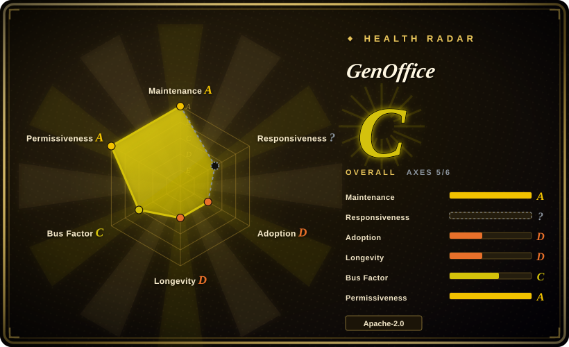
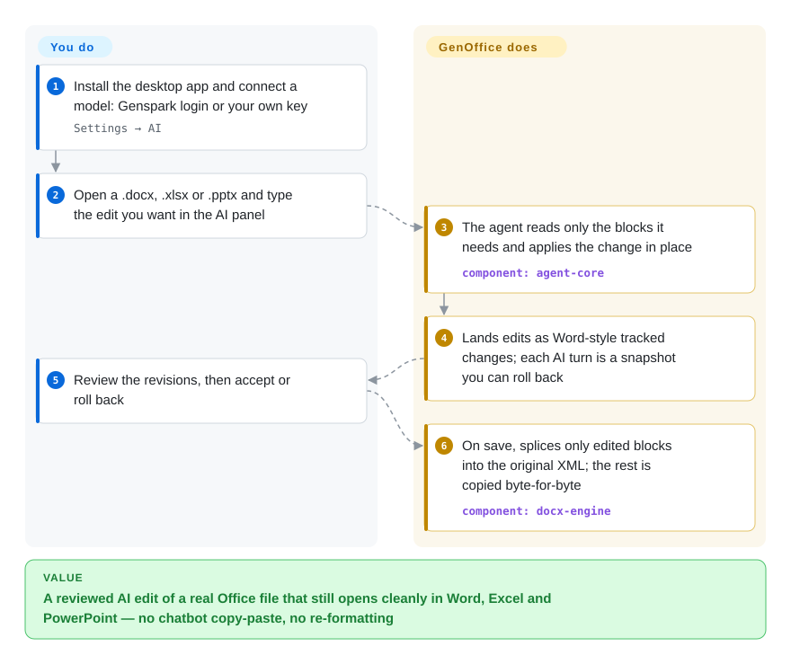

# GenOffice

You ask a chatbot to fix a Word report and get back pasted Markdown that loses the styles, the comments and the numbering, so you redo the formatting by hand. GenOffice is a free desktop office suite where the AI edits the `.docx` / `.xlsx` / `.pptx` itself — as tracked changes you can review and roll back — and rewrites only the parts it touched, so the file still opens cleanly in Microsoft Office.

## When to use

You're a consultant or analyst who lives in Word, Excel and PowerPoint files that other people send you, and you want an AI to do the tedious edits — rewrite a section, add a summary sheet with real `SUMIFS`, draft a ten-slide deck — without laundering the file through a chat window. The failure you keep hitting is concrete: the chatbot's answer is prose or Markdown, and when you paste it back the heading styles, tracked changes and table shading are gone. You reach for GenOffice because its AI panel works *inside* the native file: Docs lands edits as Word-style revisions and snapshots every AI turn, Sheets writes live formulas and applies a batch of changes as one undo, and the save path splices only the edited XML back into the original package. You bring your own key (Claude, OpenAI, Gemini, DeepSeek, Qwen, GLM, any OpenAI-compatible or local endpoint) or sign in with Genspark.

It also fits when you run a coding agent (Claude Code, Codex, Cursor) and want it to produce real Office files on your machine: the app ships a `genoffice` CLI, an agent skill and an MCP server that drive the same engines headless. Versus LibreOffice and ONLYOFFICE Desktop Editors (neither indexed yet) you trade 20+ years of format coverage for an AI-first editor with a review loop; versus [OfficeCLI](../office-automation/officecli.md) you get a full GUI suite plus the CLI, at the cost of installing an Electron desktop app instead of one binary.

## How it works

Think of it as seven Electron editors (Docs, Sheets, Slides, PDF, Markdown, HTML and a tabbed shell) sharing one layer of TypeScript engines plus a Rust sidecar for `.xlsx`. When you open a Word file, the engine archives the original, parses `word/document.xml` into blocks that each remember their original XML slice, and hands them to a rich-text editor; on save, only "dirty" blocks are regenerated and spliced back, and every other zip entry is copied byte-for-byte — like a tailor who re-sews one seam instead of re-cutting the whole suit. What GenOffice does for you: the agent loop, the per-format edit operations, tracked changes, snapshots, and on-device conversion (PDF → Word/Excel/PowerPoint via PDFium, Markdown/HTML → Word). What you do: install the app, supply a model (your key or a Genspark login), and ask. The other way in is headless: `genoffice` commands (or `genoffice mcp` for MCP clients) let a coding agent create, read, edit, render and audit files — "no model call happens inside `genoffice`", the agent does the thinking and the CLI checks each stage.

<!-- flow-steps:begin (generated from flows/genoffice.json by tools/flow_card.py — do not edit) -->

Text version of the flow

1. **You**: Install the desktop app and connect a model: Genspark login or your own key — `Settings → AI`
2. **You**: Open a .docx, .xlsx or .pptx and type the edit you want in the AI panel
3. **GenOffice**: The agent reads only the blocks it needs and applies the change in place — component: `agent-core`
4. **GenOffice**: Lands edits as Word-style tracked changes; each AI turn is a snapshot you can roll back
5. **You**: Review the revisions, then accept or roll back
6. **GenOffice**: On save, splices only edited blocks into the original XML; the rest is copied byte-for-byte — component: `docx-engine`

**Value**: A reviewed AI edit of a real Office file that still opens cleanly in Word, Excel and PowerPoint — no chatbot copy-paste, no re-formatting

<!-- flow-steps:end -->

## When NOT to use

- **Legacy binary or OpenDocument files as your working format** → use LibreOffice (not indexed). The packaged app registers `docx`, `xlsx`, `xlsm`, `pptx`, `xls`, `csv`, `tsv`, `pdf`, `md`, `html` — no `.doc`, `.ppt`, `.odt`, `.ods` or `.odp` (`apps/shell/electron-builder.cjs`, 2026-09-28). Native `.doc` import is an open feature request (#579); `.doc`/`.ppt` are only read as plain text for AI attachments.
- **A browser editor embedded in your own product, or real-time co-editing** → use [ONLYOFFICE Docs](onlyoffice-documentserver.md) or [Collabora Online](collabora-online.md) for "click a file → editor in the browser", or [Univer](univer.md) to build the editor into your app. GenOffice is a single-user desktop app; nothing in its README or tree offers a server editor or multi-user collaboration.
- **Offline or no-egress environments that still want the AI** → the editing is local, but every AI feature calls a remote model unless you point the custom slot at a local OpenAI-compatible server; the default login routes through the Genspark proxy, web search falls back to Parallel's free MCP or a DuckDuckGo scrape, and packaged builds send **Google Analytics 4 usage events by default** (opt-out in Settings, per `PRIVACY.md`). If policy forbids any of that, use LibreOffice plus a local model, or the libraries in [office-automation](../office-automation/INDEX.md).
- **Server-side or CI document pipelines** → use [python-docx](../office-automation/python-docx.md) / [python-pptx](../office-automation/python-pptx.md) / [XlsxWriter](../office-automation/xlsxwriter.md), or [OfficeCLI](../office-automation/officecli.md) as one binary. `genoffice` ships *inside* the desktop app (no npm/PyPI package; the registry has no `genoffice` or `@genoffice/cli`), and `render`, `convert --to pdf` and `create_pdf` start a hidden GenOffice process, so a Linux server needs the full app plus a virtual display (`xvfb-run`).
- **Scanned-PDF conversion on Linux** → the README says scanned pages go through the *system* OCR "on macOS and Windows"; on Linux run [OCRmyPDF](../pdf-tools/ocrmypdf.md) on the scan first. [推断: no Linux OCR path is documented]
- **A multi-year organisational standard** → the repo is two months old (created 2026-07-31) and ships a release every ~2 days on a `v0.x` line. For a fleet-wide office suite, the 20-year-old LibreOffice or ONLYOFFICE lines are the safer bet until GenOffice has a longer record.

## Comparison

| Alternative | In index | Our verdict | Tradeoff |
| --- | --- | --- | --- |
| LibreOffice (`LibreOffice/core`) | not indexed | Pick LibreOffice when format breadth (`.doc`, ODF, decades of legacy files), a GPL/MPL community foundation and no network dependency matter; pick GenOffice when the job is AI-assisted editing of modern OOXML with tracked-change review. Not added in this tab-intake batch. | LibreOffice converts OOXML to its own model on load and back on save, and has no built-in LLM agent; GenOffice keeps untouched OOXML bytes and bundles the agent, but is two months old and OOXML/PDF-only. |
| ONLYOFFICE Desktop Editors (`ONLYOFFICE/DesktopEditors`) | not indexed | Pick ONLYOFFICE Desktop when you want the same OOXML-native engine your ONLYOFFICE server uses and a long-lived vendor; pick GenOffice when an in-editor agent with BYOK and a CLI for coding agents is the point. Not added in this tab-intake batch. | ONLYOFFICE is AGPL-3.0 with a years-long track record; GenOffice is Apache-2.0 and AI-first, with a much shorter history and a single startup behind it. |
| [ONLYOFFICE Docs](onlyoffice-documentserver.md) | ✅ | Pick ONLYOFFICE Docs when users edit in a browser inside your drive/CRM with real-time co-editing; pick GenOffice for one person editing local files with an AI panel. | The document server gives multi-user collaboration at the cost of running an AGPL service; GenOffice needs no server but offers no collaboration at all. |
| [OfficeCLI](../office-automation/officecli.md) | ✅ | Pick OfficeCLI when an agent needs Office authoring on a machine without a GUI install, as one self-contained binary; pick GenOffice's `genoffice` CLI when the same person also wants a desktop editor to open and fix what the agent made. | OfficeCLI is a ~34 MB headless binary with no human editor; GenOffice's CLI needs the whole Electron app (and a display for render/PDF) but shares engines with a full suite. |
| [Anthropic Skills](../agent-skills/vendor-collections/anthropic-skills.md) | ✅ | Pick Anthropic's `docx`/`pptx`/`xlsx` skills when you already run Claude with code execution and want the vendor's own document procedures; pick GenOffice when you want the agent to call a stable local engine with structural checks (`slides check`, `slides audit`) rather than generate python-docx code each time. | The skills are source-available prompts plus scripts that depend on the agent's sandbox; GenOffice is Apache-2.0 software with its own engines, but you must install its desktop app. |

## Tech stack

TypeScript monorepo (npm workspaces, Node ≥ 22.12) with seven Electron apps under `apps/` and pure-TypeScript engine packages under `packages/` (`docx-engine`, `pptx-engine`, `pptx-render`, `pptx-ops`, `pdf2docx`, `html2docx`, `xlsx-gateway`, `agent-core`, `ai-provider`, `ai-search`, `file-parse`, `cli`, …). React renderers; Tiptap/ProseMirror for Docs and Markdown; Univer 0.25 (`@univerjs/*` open-source packages) for the Sheets UI; Konva for slide and chart canvases; CodeMirror for HTML; PDFium (via `@embedpdf/pdfium`), pdf.js and pdf-lib for PDF; HarfBuzz wasm for shaping; a Rust `xlsx` sidecar in `apps/sheets/native/xlsx-engine`; a SQLite full-text index for file search. The CLI runs on the app's own Node runtime (`ELECTRON_RUN_AS_NODE`). CI (`.github/workflows/ci.yml`) runs license allowlist, lint, typecheck, fixtures and unit tests on every push and PR; the tree holds 1,486 `*.test`/`*.spec` files (2026-09-28).

## Dependencies

For users: the desktop installer only — macOS 11+ (arm64/x64), Windows 10+ (x64) or Windows 11 on Arm, Linux x86_64 with glibc 2.34+ (deb, rpm, or AppImage with FUSE 2). No database or service to run. AI features need network access and either a Genspark login or your own API key; web search, image generation and the optional TypeSafe Jev reranker take separate keys. Headless `render`/PDF conversion on Linux needs a virtual display. For contributors: Node 22+, npm 10+, and a Rust toolchain for the Sheets sidecar.

## Ops difficulty

**Low** for one person: download a signed installer (macOS/Windows) and start. The updater checks GitHub Releases, does not auto-download (`autoUpdater.autoDownload = false`) but installs a downloaded update on quit. **Medium** for a managed fleet: releases land every ~2 days on a `v0.x` line, analytics are on by default and must be switched off per install, and the agent skill installer writes into each coding agent's skill directory from Settings → Integrations. The optional `genoffice mcp --http` mode can bind `0.0.0.0` with an optional `--token`; exposing it needs your own network and token discipline (`GENOFFICE_ALLOWED_ROOTS` confines file access).

## Health & viability

- **Maintenance: extremely active, verified** — 30 GitHub releases between 2026-08-02 and 2026-09-27, latest `v0.10.1467`; 630 commits and 621 merged PRs; last push 2026-09-28 (API-verified that day).
- **Governance: vendor-controlled, with an unusual contribution shape** — `NOTICE` says "Copyright 2026 Mainfunc, Inc." (the company behind Genspark), and `CONTRIBUTING.md` says the GitHub repo is a mirror of a private tree advanced by `Sync snapshot` commits (32 so far). Yet GitHub's contributor list is led by an external account (`aniruddhaadak80`, 469 commits) whose PRs are mostly small bug fixes merged directly, and who also filed 36 of the last 100 issues — the maintainer-side identity (`merrick-2002`) has 37. [推断] Real roadmap ownership sits with the Genspark team's private tree, not with the visible commit counts.
- **Backing & longevity** — a funded commercial vendor (Genspark / Mainfunc) backs it and routes its default AI login through Genspark's proxy, so the free suite doubles as a funnel for the paid service. The repo is **2 months old**; the Lindy prior gives it almost no credit yet, however active it is.
- **Adoption** — 8.0k stars and 1.0k forks in two months, ~96k release-asset downloads across 30 releases (2026-09-28; the count includes update-feed assets, so installs are fewer). Issue traffic is real: 461 closed / 88 open issues.
- **Risk flags** — `ee/` is carved out under a separate **GenOffice Enterprise License** (development/testing only, production needs an agreement); today it holds only a README and LICENSE, but it marks where future paid modules will go (open-core boundary). Default-on GA4 analytics; default AI route through the vendor's proxy. Apache-2.0 for everything outside `ee/`, with a CI license allowlist for production dependencies.

## Caveats (unverified)

- [未验证] Byte-preserving round-trip and "opens as Word lays it out" fidelity — the architecture is documented in README/CONTRIBUTING and there are generated fixtures, but no app was run for this review; checking needs a reproduction environment with Microsoft Office to compare.
- [未验证] Quality of AI-generated decks, formulas and edits — depends on the chosen model; the README demos are vendor screenshots.
- [推断] No Linux OCR path for scanned PDFs — the README names only macOS and Windows system OCR; Linux behaviour was not tested.
- [推断] The ~96k release-download total over-counts installs, since GitHub counts every asset (including `latest*.yml` update feeds and blockmaps) — the per-asset split was not analysed.
- [推断] Roadmap ownership by the Genspark team despite the external top committer — inferred from `CONTRIBUTING.md`'s private-tree model and CODEOWNERS (`@merrick-2002` owns `ee/`, `LICENSE`, `NOTICE`); no governance document states it.
- [未验证] Whether future `ee/` modules will gate features currently in the Apache-2.0 core — `ee/README.md` says the core "stay[s] plain Apache-2.0 permanently", which is a statement of intent, not a verifiable guarantee.
- [未验证] Security of the MCP HTTP mode when bound beyond localhost — flags and `GENOFFICE_ALLOWED_ROOTS` were confirmed in the README, but the server code was not audited.
