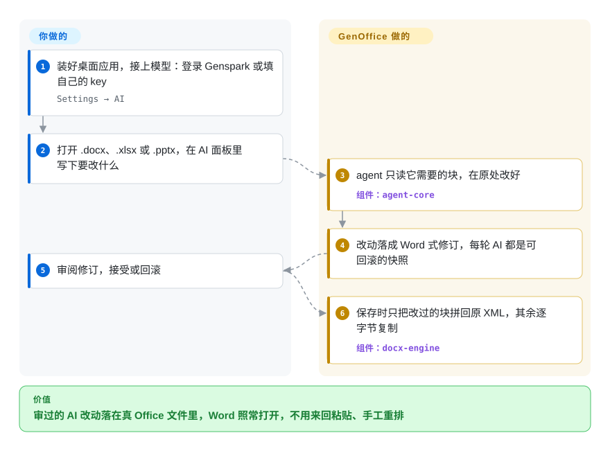

# GenOffice

你让聊天机器人改一份 Word 报告，拿回来的是一段 Markdown，贴回去标题样式、批注、编号全没了，只好手工重排。GenOffice 是一套免费的桌面办公套件，AI 直接在 `.docx` / `.xlsx` / `.pptx` 文件里改，改动以可审阅、可回滚的修订形式落下，而且只重写它碰过的部分，文件拿到 Microsoft Office 里照样正常打开。

## 何时使用

你是顾问或分析师，每天在别人发来的 Word、Excel、PowerPoint 文件里干活，想让 AI 代劳那些琐碎的改动——重写一节、加一张用真 `SUMIFS` 汇总的表、起草十页演示稿——但不想让文件在聊天窗口里走一遭。你反复撞上的问题很具体：聊天机器人给的是文字或 Markdown，贴回去之后标题样式、修订记录、表格底纹全丢了。你选 GenOffice，是因为它的 AI 面板在**原生文件内部**工作：Docs 把改动落成 Word 式修订、每轮 AI 都存快照；Sheets 写的是活公式，一批改动合成一次撤销；保存时只把改过的 XML 拼回原文件包。模型可以自带 key（Claude、OpenAI、Gemini、DeepSeek、通义千问、智谱 GLM，以及任何 OpenAI 兼容或本地端点），也可以直接登录 Genspark。

另一个触发场景：你在用编码 agent（Claude Code、Codex、Cursor），想让它在本机产出真正的 Office 文件。应用自带 `genoffice` 命令行、一个 agent skill 和一个 MCP server，无界面地调用同一套引擎。相比 LibreOffice 和 ONLYOFFICE 桌面版（都尚未收录），你用二十多年的格式覆盖面换来一个 AI 优先、带审阅回路的编辑器；相比 [OfficeCLI](../office-automation/officecli.zh.md)，你多得到一整套图形界面，代价是要装一个 Electron 桌面应用而不是一个二进制。

## 怎么用起来

可以把它看成七个 Electron 编辑器（Docs、Sheets、Slides、PDF、Markdown、HTML，外加一个多标签外壳）共用一层 TypeScript 引擎，另配一个处理 `.xlsx` 的 Rust 边车进程（sidecar，随应用启动的独立子进程）。打开 Word 文件时，引擎先把原件存档，再把 `word/document.xml`（Word 文件压缩包里存正文的那个 XML）解析成一个个块，每块记住自己原来那段 XML，交给富文本编辑器；保存时只重新生成“脏”块（改过的块）并拼回去，压缩包里其余条目逐字节原样复制——像裁缝只重缝一条线，而不是把整件衣服重裁。GenOffice 替你做的：agent 循环、各格式的编辑操作、修订、快照，以及本机格式转换（PDF 经 PDFium 转 Word/Excel/PowerPoint，Markdown/HTML 转 Word）。你要做的：装应用、给一个模型（自己的 key 或 Genspark 登录），然后提需求。另一条入口是无界面的：`genoffice` 命令（或给 MCP 客户端用的 `genoffice mcp`）让编码 agent 创建、读取、编辑、渲染和审查文件——README 原话是 CLI 内部“不发生任何模型调用”，思考归 agent，CLI 负责逐阶段检查。

<!-- flow-steps:begin (generated from flows/genoffice.json by tools/flow_card.py — do not edit) -->

流程文字版

1. **你**：装好桌面应用，接上模型：登录 Genspark 或填自己的 key — `Settings → AI`
2. **你**：打开 .docx、.xlsx 或 .pptx，在 AI 面板里写下要改什么
3. **GenOffice**：agent 只读它需要的块，在原处改好 — 组件：`agent-core`
4. **GenOffice**：改动落成 Word 式修订，每轮 AI 都是可回滚的快照
5. **你**：审阅修订，接受或回滚
6. **GenOffice**：保存时只把改过的块拼回原 XML，其余逐字节复制 — 组件：`docx-engine`

**价值**：审过的 AI 改动落在真 Office 文件里，Word 照常打开，不用来回粘贴、手工重排

<!-- flow-steps:end -->

## 何时不用

- **日常工作格式是旧版二进制或 OpenDocument** → 用 LibreOffice（未收录）。打包后的应用只注册了 `docx`、`xlsx`、`xlsm`、`pptx`、`xls`、`csv`、`tsv`、`pdf`、`md`、`html`，没有 `.doc`、`.ppt`、`.odt`、`.ods`、`.odp`（`apps/shell/electron-builder.cjs`，2026-09-28）。原生 `.doc` 导入仍是未关闭的功能请求（#579）；`.doc`/`.ppt` 只在作为 AI 附件时被读成纯文本。
- **要把浏览器编辑器嵌进自己的产品，或需要实时协同** → “点文件→浏览器里出编辑器”选 [ONLYOFFICE Docs](onlyoffice-documentserver.zh.md) 或 [Collabora Online](collabora-online.zh.md)，要把编辑器做进自己的应用选 [Univer](univer.zh.md)。GenOffice 是单用户桌面应用，README 和代码树里都没有服务端编辑器或多人协作。
- **离线或禁止外联、却又想用 AI 的环境** → 编辑在本机，但所有 AI 功能都要调远端模型，除非你把自定义槽位指向本地 OpenAI 兼容服务；默认登录走 Genspark 代理，网页搜索兜底用 Parallel 的免费 MCP 或抓 DuckDuckGo，官方安装包**默认发送 Google Analytics 4 使用事件**（可在设置里关闭，见 `PRIVACY.md`）。若策略不允许，用 LibreOffice 加本地模型，或 [office-automation](../office-automation/INDEX.zh.md) 里的库。
- **服务端或 CI 文档流水线** → 用 [python-docx](../office-automation/python-docx.zh.md) / [python-pptx](../office-automation/python-pptx.zh.md) / [XlsxWriter](../office-automation/xlsxwriter.zh.md)，或单二进制的 [OfficeCLI](../office-automation/officecli.zh.md)。`genoffice` 随桌面应用一起安装（npm 上既没有 `genoffice` 也没有 `@genoffice/cli`），而且 `render`、`convert --to pdf`、`create_pdf` 会拉起一个隐藏的 GenOffice 进程，所以 Linux 服务器得装完整应用外加虚拟显示（`xvfb-run`）。
- **在 Linux 上转换扫描版 PDF** → README 说扫描页走*系统* OCR，且只写了“macOS 和 Windows”；Linux 上先用 [OCRmyPDF](../pdf-tools/pdf-transform-signing/ocrmypdf.zh.md) 处理扫描件。[推断：文档没有写 Linux 的 OCR 路径]
- **作为多年期的组织标准** → 仓库只有两个月大（2026-07-31 创建），在 `v0.x` 线上约两天一发。要给整个团队定办公套件，在 GenOffice 攒出更长记录之前，二十年的 LibreOffice 或 ONLYOFFICE 更稳。

## 横向对比

| 替代品 | 是否收录 | 我们的评价 | 取舍 |
| --- | --- | --- | --- |
| LibreOffice（`LibreOffice/core`） | 未收录 | 当格式广度（`.doc`、ODF、几十年的旧文件）、GPL/MPL 社区基金会和零网络依赖更重要时选 LibreOffice；当任务是用 AI 编辑现代 OOXML 并按修订审阅时选 GenOffice。本批次（标签页收录）未新增此页。 | LibreOffice 打开时把 OOXML 转成自己的模型、保存时再转回去，也没有内置 LLM agent；GenOffice 保留未改动的 OOXML 字节并自带 agent，但只有两个月历史，且只做 OOXML/PDF。 |
| ONLYOFFICE 桌面版（`ONLYOFFICE/DesktopEditors`） | 未收录 | 想要和 ONLYOFFICE 服务器同一套 OOXML 原生引擎、以及一个长寿厂商时选 ONLYOFFICE 桌面版；看重编辑器内 agent、自带 key 和面向编码 agent 的 CLI 时选 GenOffice。本批次（标签页收录）未新增此页。 | ONLYOFFICE 是 AGPL-3.0，有多年记录；GenOffice 是 Apache-2.0、AI 优先，但历史短得多，背后只有一家初创公司。 |
| [ONLYOFFICE Docs](onlyoffice-documentserver.zh.md) | ✅ | 用户要在你的网盘/CRM 里用浏览器编辑并实时协同时选 ONLYOFFICE Docs；一个人带 AI 面板编辑本地文件时选 GenOffice。 | 文档服务器给你多人协作，代价是运行一个 AGPL 服务；GenOffice 不需要服务器，但完全没有协作。 |
| [OfficeCLI](../office-automation/officecli.zh.md) | ✅ | agent 要在没装图形界面的机器上写 Office 文件、只想要一个自包含二进制时选 OfficeCLI；同一个人还想用桌面编辑器打开并修补 agent 产出时选 GenOffice 的 `genoffice` CLI。 | OfficeCLI 是约 34 MB 的无界面二进制，没有给人用的编辑器；GenOffice 的 CLI 需要整个 Electron 应用（渲染/PDF 还要显示环境），但和完整套件共用引擎。 |
| [Anthropic Skills](../agent-skills/vendor-collections/anthropic-skills.zh.md) | ✅ | 已经在用带代码执行的 Claude、想要厂商自己的文档流程时选 Anthropic 的 `docx`/`pptx`/`xlsx` skill；想让 agent 调一个稳定的本地引擎、带结构检查（`slides check`、`slides audit`），而不是每次现写 python-docx 代码时选 GenOffice。 | 这些 skill 是源码可见的提示词加脚本，依赖 agent 的沙箱；GenOffice 是 Apache-2.0 软件、有自己的引擎，但你得装它的桌面应用。 |

## 技术栈

TypeScript monorepo（npm workspaces，Node ≥ 22.12）：`apps/` 下七个 Electron 应用，`packages/` 下纯 TypeScript 引擎包（`docx-engine`、`pptx-engine`、`pptx-render`、`pptx-ops`、`pdf2docx`、`html2docx`、`xlsx-gateway`、`agent-core`、`ai-provider`、`ai-search`、`file-parse`、`cli` 等）。界面用 React；Docs 和 Markdown 用 Tiptap/ProseMirror；Sheets 界面基于 Univer 0.25（开源的 `@univerjs/*` 包）；幻灯片和图表画布用 Konva；HTML 源码编辑用 CodeMirror；PDF 用 PDFium（经 `@embedpdf/pdfium`）、pdf.js 和 pdf-lib；文字塑形用 HarfBuzz wasm；`apps/sheets/native/xlsx-engine` 是 Rust 写的 `xlsx` 边车；文件搜索用 SQLite 全文索引。CLI 跑在应用自带的 Node 运行时上（`ELECTRON_RUN_AS_NODE`）。CI（`.github/workflows/ci.yml`）在每次 push 和 PR 上跑许可证白名单、lint、类型检查、fixture 和单元测试；代码树里有 1,486 个 `*.test`/`*.spec` 文件（2026-09-28）。

## 依赖

普通用户只需要桌面安装包：macOS 11+（arm64/x64）、Windows 10+（x64）或 Windows 11 on Arm、Linux x86_64 且 glibc 2.34+（deb、rpm，或需要 FUSE 2 的 AppImage）。不需要运行数据库或服务。AI 功能需要联网，外加 Genspark 登录或你自己的 API key；网页搜索、图像生成和可选的 TypeSafe Jev 重排各自另配 key。Linux 上无界面的渲染/PDF 转换需要虚拟显示。贡献者需要 Node 22+、npm 10+，以及给 Sheets 边车用的 Rust 工具链。

## 运维难度

**个人使用：低**。下载签名过的安装包（macOS/Windows）就能用。更新器检查 GitHub Releases，不会自动下载（`autoUpdater.autoDownload = false`），但下载好的更新会在退出时安装。**团队批量管理：中**。`v0.x` 线约两天一发版；使用统计默认开启，要逐台关闭；设置 → Integrations 里的 skill 安装器会往每个编码 agent 的 skill 目录写文件。可选的 `genoffice mcp --http` 模式可以绑定 `0.0.0.0`，`--token` 是可选项；要对外暴露得自己管好网络和 token（`GENOFFICE_ALLOWED_ROOTS` 可以限定能访问的目录）。

## 健康度与可持续性

- **维护：极其活跃，已核实**——2026-08-02 到 2026-09-27 共发了 30 个 GitHub release，最新 `v0.10.1467`；630 次提交、621 个已合并 PR；最近一次 push 在 2026-09-28（当天 API 核实）。
- **治理：厂商控制，贡献形态少见**——`NOTICE` 写的是 “Copyright 2026 Mainfunc, Inc.”（Genspark 背后的公司），`CONTRIBUTING.md` 说 GitHub 仓库是一棵私有代码树的镜像，靠 `Sync snapshot` 提交推进（目前 32 次）。但 GitHub 贡献者榜首是一个外部账号（`aniruddhaadak80`，469 次提交），他的 PR 大多是直接合并的小修复，最近 100 个 issue 里也有 36 个是他提的；维护方账号（`merrick-2002`）只有 37 次提交。[推断] 真正掌握路线图的是 Genspark 团队的私有代码树，而不是表面上的提交数。
- **背后支撑与长寿度**——背后是一家有融资的商业公司（Genspark / Mainfunc），默认 AI 登录走 Genspark 代理，所以这套免费套件同时也是付费服务的入口。仓库**只有两个月大**；不管多活跃，Lindy 先验目前几乎不给它加分。
- **采用度**——两个月 8.0k star、1.0k fork，30 个 release 的安装包累计下载约 9.6 万次（2026-09-28；这个数包含更新清单类文件，实际安装更少）。issue 流量是真实的：461 个已关闭、88 个未关闭。
- **风险信号**——`ee/` 目录单独适用 **GenOffice Enterprise License**（只许开发测试，生产使用需签协议）；目前里面只有 README 和 LICENSE，但它标出了未来付费模块的位置（开放核心的边界）。使用统计默认开启；默认 AI 路由走厂商代理。`ee/` 以外全部是 Apache-2.0，CI 对生产依赖做许可证白名单检查。

## 存疑（未验证）

- [未验证] 逐字节保真的往返保存、“按 Word 的排版打开”这类保真度说法——架构在 README/CONTRIBUTING 里有说明，也有生成的 fixture，但本次没有运行应用；要核实需要一个装了 Microsoft Office 的复现环境做对比。
- [未验证] AI 生成的演示稿、公式和改动的质量——取决于所选模型；README 里的演示是厂商截图。
- [推断] Linux 上没有扫描版 PDF 的 OCR 路径——README 只提到 macOS 和 Windows 的系统 OCR，Linux 表现未测试。
- [推断] 约 9.6 万次的 release 下载总数高估了安装量，因为 GitHub 对每个附件都计数（包括 `latest*.yml` 更新清单和 blockmap）——没有逐附件拆分分析。
- [推断] 尽管外部账号提交最多，路线图仍归 Genspark 团队——依据是 `CONTRIBUTING.md` 的私有代码树模式和 CODEOWNERS（`@merrick-2002` 负责 `ee/`、`LICENSE`、`NOTICE`）；没有治理文档明说。
- [未验证] 未来的 `ee/` 模块会不会把现在 Apache-2.0 核心里的功能收走——`ee/README.md` 说核心会“永久保持纯 Apache-2.0”，这是意图声明，无法核实为保证。
- [未验证] MCP HTTP 模式绑定到 localhost 以外时的安全性——参数和 `GENOFFICE_ALLOWED_ROOTS` 在 README 里核实过，但服务端代码没有审计。
