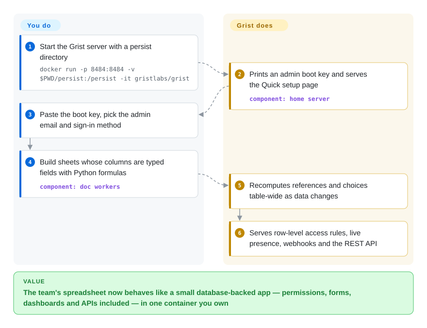

# Grist

The team's "spreadsheet" has outgrown spreadsheets: five tabs cross-referencing each other, one person owns the formulas, "only HR sees the salary column" is enforced by hope, and an exported CSV is the closest thing to a schema. Grist is a spreadsheet whose columns *are* database fields — named, typed, one kind of data each — with formulas written in Python, per-row access rules, and views (forms, charts, calendars) that behave like a small app. `grist-core` is the self-hostable server under Apache-2.0.

## When to use

You run a small org or a public-sector team whose operational data lives in Excel/Sheets shared on a drive, and the failure modes are relational: duplicated records, broken cross-tab references, no permissions. You reach for Grist because it fixes exactly that layer while keeping the spreadsheet skin — columns hold one type, references between tables stay live (two-way refs auto-sync), formulas are Python with the standard library (plus many Excel functions), and every document is a self-contained SQLite-based `.grist` file you can back up and restore anywhere (README features list, 2026-09). It is the strongest *viability* story in this category's OSS cluster: developed by Grist Labs but with sustained, credited French-government engineering (ANCT Données et Territoires, DINUM) shaping the self-hosting surface — SCIM, external attachment storage, high-contrast/WCAG work (README marks these 🇫🇷). You pick it over the Airtable-clone family (NocoDB, Baserow — `未收录`, different center of gravity, see comparison) when formula power and data-portability trump no-code polish, and over [ONLYOFFICE Docs](onlyoffice-documentserver.md) when your unit of work is structured records, not documents. You do *not* pick it to embed in your own product — it's a finished server, one `docker run` and a boot key away (README "Using Grist").

## How it works

Grist runs as a home server (users, sites, billing-free core) plus per-document *doc workers* that hold the live data; documents are versioned SQLite files, so "the database" is a folder you can tar (README: portable, self-contained format; `/persist` volume in the docker quickstart). You author like a spreadsheet — but a column definition is a field: pick Choice List, Reference, Attachment, DateTime, and the grid's editors and formulas follow the type. Formula cells run Python (full syntax per README) inside a sandbox you choose — gVisor on Linux/Docker, native `sandbox-exec` on macOS, or a Wasm/Pyodide route that works anywhere (README "Environment variables"). Everything else the app surface gives you is configured, not coded: drag-and-drop dashboards with widget linking, forms feeding the same tables, webhooks and a REST API with an interactive console, incremental imports that upsert against existing records, and access rules evaluated per row against user attributes.

<!-- flow-steps:begin (generated from flows/grist.json by tools/flow_card.py — do not edit) -->

Text version of the flow

1. **You**: Start the Grist server with a persist directory — `docker run -p 8484:8484 -v $PWD/persist:/persist -it gristlabs/grist`
2. **Grist**: Prints an admin boot key and serves the Quick setup page — component: `home server`
3. **You**: Paste the boot key, pick the admin email and sign-in method
4. **You**: Build sheets whose columns are typed fields with Python formulas — component: `doc workers`
5. **Grist**: Recomputes references and choices table-wide as data changes
6. **Grist**: Serves row-level access rules, live presence, webhooks and the REST API

**Value**: The team's spreadsheet now behaves like a small database-backed app — permissions, forms, dashboards and APIs included — in one container you own

<!-- flow-steps:end -->

## When NOT to use

- **You need Excel's free-form canvas** — merged arbitrary ranges, floating formatting, cell-by-cell anything-goes — because your deliverable *is* an .xlsx document → that's a spreadsheet document, not a relational grid; use [ONLYOFFICE Docs](onlyoffice-documentserver.md) or embed [Univer](univer.md).
- **You need an editor component inside your own application** → Grist ships a product (app + hosted service), not an npm SDK; `grist-static` renders documents read-only on a site (`未收录` — separate sibling repo, deliberately not added), and custom widgets are external pages. For embedding, [Univer](univer.md) or [Handsontable](handsontable.md).
- **Your org's spreadsheet habits are Excel-formula-native** → Grist formulas are Python-flavored with an Excel-function subset; the README itself warns "This difference can confuse people coming directly from Excel or Google Sheets." Migration friction is the product's chosen tradeoff.
- **You need enterprise SSO on pure-open-source terms** → OIDC/SAML, audit-log streaming, advanced admin controls, built-in MCP server, automations and notification emails sit in the *full edition* behind an activation key (README feature-gap list, 2022→2026 items); the key is free under US$1M funding per README, but the pure-OSS path (`grist-oss` image, forward-auth, "Sign in with getgrist.com") means arranging auth yourself.
- **Google-Docs-style same-cell cotyping is the requirement** → Grist is real-time collaborative with presence, comments and change-suggestions (README), but its model is record-centric; [ONLYOFFICE](onlyoffice-documentserver.md)/[Collabora](collabora-online.md) are the cell/character-level co-editing suites.
- **Millions-of-rows warehouse browsing** → SQLite-per-document is the design (great for portability, not for that). Use your BI stack, or a virtualized analytics grid like AG Grid (`未收录` — general-purpose grid; deliberately outside this batch, same note as on the [Handsontable](handsontable.md) page).

## Comparison

| Alternative | In index | Our verdict | Tradeoff |
| --- | --- | --- | --- |
| [Univer](univer.md) | ✅ | Pick Grist when a team needs the working spreadsheet-app *today* and will operate a server; pick Univer when *you* are the one shipping an editor inside your own product — there is no Grist-to-embed SDK, and Univer is no drop-in app. | Grist: finished product, opinionated data model, ops burden yours. Univer: components for your product, assembly burden yours. |
| [ONLYOFFICE Docs](onlyoffice-documentserver.md) | ✅ | Pick Grist when data is records (typed fields, relations, per-row permissions); pick ONLYOFFICE when data is documents (.docx/.xlsx fidelity, character-level co-editing) — they solve different halves of "spreadsheet on a shared drive". | Grist buys a database backbone with AGPL-free (Apache) core; ONLYOFFICE buys format fidelity with a document-server footprint and AGPL. |
| [Handsontable](handsontable.md) | ✅ | Pick Handsontable to put an editable grid *inside* your existing app where you own the data model; pick Grist when the grid, the model, the permissions and the server are all things you want someone to have already decided. | Handsontable: component control, paid license, no server. Grist: whole app, Apache core, not embeddable. |
| Airtable | `非仓库` | The interaction model Grist deliberately mirrors for structured data; named so you calibrate — Airtable is hosted SaaS with no self-hostable source at any price, which is precisely why the French public sector funds Grist. | Convenience and sync ecosystem vs owning your deployment and format. |
| NocoDB | `未收录` | Closest open Airtable-lookalikes (with Baserow) — evaluate them if no-code tabular UI matters more than Python-formula depth and SQLite portability; `未收录` deliberately, because this batch scopes editing surfaces and the Airtable-clone axis deserves its own comparison set. | They buy spreadsheet-app familiarity over a plain relational DB; Grist buys formula/permission expressiveness and document portability. |

## Tech stack

TypeScript end-to-end (GitHub linguist 2026-09-27: TS ≈14.7 MB, Python ≈1.9 MB — the Python is the formula runtime, not a service you deploy), Node.js server, React-based UI [推断 — framework not asserted in README sections read; verify in `app/`], SQLite as the per-document storage format, optional Redis (`REDIS_URL`) for sessions/caching, sandboxing via gVisor/macOS `sandbox-exec`/Pyodide-Wasm. Sibling artifacts: `grist-desktop` (Electron), `grist-static` (in-browser display), `grist-widget` manifest for custom widgets. Translations via Weblate.

## Dependencies

One container (`gristlabs/grist` or the pure-OSS `grist-oss`) with a persisted volume; PostgreSQL or SQLite for the home DB [未验证 — engine choice not enumerated in the README portion read]; Redis optional; reverse proxy with TLS for real deployments; a sign-in story (Quick setup offers options; full SSO is full-edition). No GPU, no external services required for the core.

## Ops difficulty

**Medium.** A single-user trial is one `docker run`; production means owning auth (forward-auth or full-edition OIDC/SAML), session secrets, `/persist` backups (documents are files — easy), doc-worker scaling knobs (`GRIST_SERVERS`, fleet/router envs — the README's variable table is a small novel), and gVisor or Wasm sandbox setup for untrusted formulas. Prometheus probes (`GRIST_PROMCLIENT_PORT`) and an Admin Panel with boot probes ease day-2 [README]. Compare ONLYOFFICE/Collabora: heavier boxes, but with a decade of deployment docs; Grist's self-host docs are thorough and French-public-sector-hardened.

## Health & viability

- **Maintenance: monthly and dated.** v1.7.16 (2026-06-30) → v1.7.19 (2026-09-06), pushed the day of verification (2026-09-27); disciplined release train (API-verified).
- **Governance: company + state contributor.** Grist Labs (NYC) leads — founder-level commit density (paulfitz 997, then 481/434/238 across the core team, contributors API 2026-09-27) — but ANCT/DINUM engineers are credited with sustained feature lines (i18n, SCIM, accessibility, networking). That's the most plural funding picture in this batch.
- **Backing & longevity** — created 2020-05-22 (~6.4 years, repo) — past the first hype window, still accelerating (2026 added automations, OAuth apps, MCP server to the *product* line). Lindy moderate-to-good; engine lineage of its ideas is older than the repo [推断].
- **Adoption: measurable but server-shaped.** ~4.2M Docker Hub pulls (API-verified 2026-09-27), 11.9k stars, active forum/Discord/newsletter cadence; hosted getgrist.com feeds the core. No npm-download signal applies.
- **Risk flags** — classic open-core: the default image bundles *inert* source-available full-edition code (README says exactly that; `grist-oss` exists if you want the clean line); SSO/audit/automations/MCP monetized; funding depends partly on a French public-sector program whose priorities could shift [推断].

## Caveats (unverified)

- [未验证] Character-level vs record-level concurrency behavior during heavy simultaneous edits — presence and live sync are README claims; not exercised.
- [未验证] Excel import/export fidelity in either direction — listed features, no round-trip test run.
- [未验证] Home-database engine options (PostgreSQL vs SQLite defaults) — README env table implies configuration, not exhaustively checked.
- [推断] React as the UI framework — from repo layout knowledge, not from the README passages quoted here; fixable in one `package.json` read on next sync.
- [未验证] Whether `grist-oss` and `grist` images differ in *anything* beyond the inert extensions (README asserts equivalence of function by default, not a diff audit).
- [推断] French-government continuity risk statement is a judgment about funding programs, not a documented governance clause.
