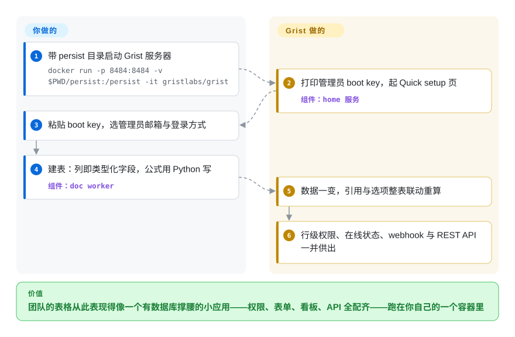

# Grist

团队的「表格」早就长过了表格所能承载的：五个标签页互相引用、公式只有一个人看得懂、「只有 HR 能看工资列」靠自觉执行、导出的 CSV 是唯一接近 schema 的东西。Grist 是这样一张表格：它的列*就是*数据库字段——有名字、有类型、每列只装一种数据——公式用 Python 写，权限可以到行，表单/图表/日历这些视图行为像一个小应用。`grist-core` 就是那个 Apache-2.0 的可自托管服务器。

## 何时使用

你运营一个小组织或公共部门团队，运营数据活在网盘共享的 Excel/Sheets 里，故障模式全是关系性的：记录重复、跨表引用断裂、权限裸奔。选 Grist 因为它恰好修这一层、又保留表格外皮——列只装一种类型、表间引用保持鲜活（双向引用自动同步）、公式是带标准库的 Python（另有大量 Excel 函数）、每个文档都是自包含的 SQLite 基底 `.grist` 文件，备份还原随处可行（README 功能表，2026-09）。它是本分类 OSS 阵营里*可持续性*叙事最强的：Grist Labs 主导开发，但法国政府的工程投入（ANCT Données et Territoires、DINUM）被具名且持续——SCIM、外部附件存储、高对比度/WCAG 这些自托管面都被 README 打上 🇫🇷 标记。对比 Airtable 克隆家族（NocoDB、Baserow——`未收录`，重心不同，见对比表）：当公式表现力与数据可携带性高于无代码打磨时选 Grist；对比 [ONLYOFFICE Docs](onlyoffice-documentserver.zh.md)：当你的工作单元是结构化记录而不是文档时选 Grist。你*不*选它来嵌入自己的产品——它是成品服务器，一个 `docker run` 加一个 boot key 的距离（README「Using Grist」）。

## 怎么用起来

Grist 跑起来是一个 home 服务器（用户、站点、免费的核心）加每文档一个的 *doc worker* 持有活数据；文档是带版本的 SQLite 文件，所以「数据库」就是一个可以 tar 走的文件夹（README：可携带、自包含格式；docker 快速开始里的 `/persist` 卷）。你像用表格一样编辑——但列定义就是字段：选了 Choice List、Reference、Attachment、DateTime，网格的编辑器与公式就跟着类型走。公式单元格在你选定的沙箱里跑 Python（README：完整语法）——Linux/Docker 用 gVisor、macOS 用原生 `sandbox-exec`、跨平台的 Wasm/Pyodide 路线也行（README 环境变量节）。应用面的其余一切都是配置而非编码：可拖拽、可联动的看板；喂同一张表的原生表单；REST API 带交互式控制台，外加 webhook；增量导入对着既有记录 upsert；访问规则按行、按用户属性求值。

<!-- flow-steps:begin (generated from flows/grist.json by tools/flow_card.py — do not edit) -->

流程文字版

1. **你**：带 persist 目录启动 Grist 服务器 — `docker run -p 8484:8484 -v $PWD/persist:/persist -it gristlabs/grist`
2. **Grist**：打印管理员 boot key，起 Quick setup 页 — 组件：`home 服务`
3. **你**：粘贴 boot key，选管理员邮箱与登录方式
4. **你**：建表：列即类型化字段，公式用 Python 写 — 组件：`doc worker`
5. **Grist**：数据一变，引用与选项整表联动重算
6. **Grist**：行级权限、在线状态、webhook 与 REST API 一并供出

**价值**：团队的表格从此表现得像一个有数据库撑腰的小应用——权限、表单、看板、API 全配齐——跑在你自己的一个容器里

<!-- flow-steps:end -->

## 何时不用

- **你需要 Excel 的自由画布**——任意合并、浮动格式、逐格不设限——因为交付物*本身就是* .xlsx 文档 → 那是电子表格文档，不是关系网格；用 [ONLYOFFICE Docs](onlyoffice-documentserver.zh.md) 或嵌一个 [Univer](univer.zh.md)。
- **你需要的是自己应用里的编辑器组件** → Grist 出货的是产品（app + 托管服务），不是 npm SDK；`grist-static` 只能在站点上只读展示文档（`未收录`——同级仓库，有意不加），custom widget 是外挂页面。要嵌入就回 [Univer](univer.zh.md) 或 [Handsontable](handsontable.zh.md)。
- **组织的肌肉记忆是 Excel 函数** → Grist 公式是 Python 风味带 Excel 函数子集；README 自己警告「This difference can confuse people coming directly from Excel or Google Sheets」。迁移摩擦是产品选定的取舍。
- **企业 SSO 必须走在纯开源条款上** → OIDC/SAML、审计流、高级管理控制台、内置 MCP server、自动通知邮件都在完整版激活钥匙后面（README 功能差列表，2022→2026 逐条）；按 README 融资低于 100 万美元可免费领钥匙，但纯开源路线（`grist-oss` 镜像、forward-auth、「Sign in with getgrist.com」）意味着认证方案自己搭。
- **要 Google Docs 式同格并敲** → Grist 是实时协作的，有在线状态、评论与变更建议（README），但模型以记录为心；字符级共编的套件是 [ONLYOFFICE](onlyoffice-documentserver.zh.md)/[Collabora](collabora-online.zh.md)。
- **百万行的仓库浏览** → 每文档一个 SQLite 是设计（利于可携带，不利于这个）。用你的 BI 栈，或虚拟化分析网格如 AG Grid（`未收录`——通用网格，本批有意不收，与 [Handsontable](handsontable.zh.md) 页同一说明）。

## 横向对比

| 替代品 | 是否收录 | 我们的评价 | 取舍 |
| --- | --- | --- | --- |
| [Univer](univer.zh.md) | ✅ | 团队*今天*就要一张能协作、带权限的表格应用、且愿意养服务器时选 Grist；当*你*就是那个要在自己产品里出货编辑器的人时选 Univer——Grist 没有可嵌入的 SDK，Univer 也不是即开即用的应用。 | Grist：成品应用、有主见的模型、运维负担归你。Univer：给你产品的零件、装配负担归你。 |
| [ONLYOFFICE Docs](onlyoffice-documentserver.zh.md) | ✅ | 数据是记录（类型字段、关系、行级权限）选 Grist；数据是文档（.docx/.xlsx 保真、字符级共编）选 ONLYOFFICE——它们各治「共享网盘上的电子表格」的一半。 | Grist 用 Apache 核心换来数据库骨架；ONLYOFFICE 用文档服务器足迹与 AGPL 换来格式保真。 |
| [Handsontable](handsontable.zh.md) | ✅ | 数据模型已在你手里、只把可编辑网格*放进*现有应用时选 Handsontable；当网格、模型、权限、服务器都是你希望「别人已经替我定了」的东西时选 Grist。 | Handsontable：组件级控制、付费授权、无服务器。Grist：整个应用、Apache 核心、不可嵌入。 |
| Airtable | `非仓库` | Grist 为结构化数据刻意对照的交互模型就是它；点名是为了校准——Airtable 是无价可买的托管 SaaS（永远不给自托管源码），这正是法国公共部门资助 Grist 的理由。 | 便利与同步生态，对抗拥有自己的部署与文件格式。 |
| NocoDB | `未收录` | 与 Baserow 同为最接近的开源 Airtable 仿品——若无代码表格 UI 比 Python 公式纵深与 SQLite 可携带性更要紧，去评估它们；`未收录` 是有意跳过，本批划的是编辑界面，Airtable 克隆轴值得自己的一组对比。 | 它们买「表格应用手感+普通关系库打底」；Grist 买公式/权限表现力与文档级可携带。 |

## 技术栈

TypeScript 端到端（GitHub linguist 2026-09-27：TS 约 1,470 万、Python 约 190 万字节——Python 是公式运行时，不是你要部署的服务），Node.js 服务器，UI 为 React 系 [推断——所读 README 段落未断言框架，下次同步读 `app/` 可订正]，每文档存储格式为 SQLite，Redis 可选（`REDIS_URL`，会话/缓存），沙箱走 gVisor/macOS `sandbox-exec`/Pyodide-Wasm。同级产物：`grist-desktop`（Electron）、`grist-static`（浏览器内展示）、custom widget 的 `grist-widget` 清单。翻译托管在 Weblate。

## 依赖

一个容器（`gristlabs/grist`，或纯净的 `grist-oss`）加持久卷；home 库可选 PostgreSQL 或 SQLite [未验证——所读 README 段未穷举引擎选项]；Redis 可选；正式部署要带 TLS 的反向代理；一套登录方案（Quick setup 给了菜单；完整 SSO 在完整版）。核心不需要 GPU，不需要外部服务。

## 运维难度

**中等。** 单人试用一条 `docker run`；生产环境意味着自己负责认证（forward-auth 或完整版 OIDC/SAML）、session secret、`/persist` 备份（文档即文件——容易）、doc worker 扩容旋钮（`GRIST_SERVERS`、fleet/router 环境变量——README 的变量表本身就是一部小小说）、以及给不可信公式配 gVisor 或 Wasm 沙箱。day-2 有 Prometheus 探针（`GRIST_PROMCLIENT_PORT`）与带启动诊断的 Admin Panel 兜底 [README]。对比 ONLYOFFICE/Collabora：机器更重，但部署文档有十年沉淀；Grist 的自托管文档详尽、且被法国公共部门实战捶打过。

## 健康度与可持续性

- **维护：月度且有日期。** v1.7.16（2026-06-30）→ v1.7.19（2026-09-06），校验当天仍有推送（2026-09-27）；成建制的发布列车（API 核实）。
- **治理：公司 + 国家贡献者。** Grist Labs（纽约）主导——创始人级提交密度（paulfitz 997，其后 481/434/238 是核心团队，contributors API 2026-09-27）——但 ANCT/DINUM 工程师被具名于持续功能线（i18n、SCIM、无障碍、网络层）。这是本批最多元的资金图景。
- **背书与寿命** ——2020-05-22 创建（仓库约 6.4 年）——过了第一波炒作窗口，还在加速（2026 年*产品*线新增 automations、OAuth apps、MCP server）。Lindy 中等偏好；其理念引擎的血统比仓库更老 [推断]。
- **采纳：可测，但是服务器形状。** Docker Hub 拉取约 420 万（API 核实 2026-09-27）、11.9k stars、论坛/Discord/月刊节奏活跃；getgrist.com 托管反哺核心。npm 下载信号不适用。
- **风险信号** ——教科书式开放核心：默认镜像捆着*惰性*的 source-available 完整版代码（README 明说；要干净底线就用 `grist-oss`）；SSO/审计/自动流程/MCP 是变现层；部分资金系于法国公共部门项目、优先级可能转移 [推断]。

## 存疑（未验证）

- [未验证] 高强度同时编辑时字符级 vs 记录级并发的真实行为——在线状态与实时同步是 README 主张；未实测。
- [未验证] Excel 导入/导出的双向保真度——功能在列，未跑往返测试。
- [未验证] home 库引擎选项（PostgreSQL 与 SQLite 的默认边界）——README 环境变量表提示有配置面，未逐一核对。
- [推断] UI 框架为 React——来自仓库布局的既有知识，非本次所读 README 段落；下次同步读一次 package.json 即可订正。
- [未验证] `grist-oss` 与 `grist` 镜像是否除惰性扩展外别无差异——README 声称默认功能等价，未做 diff 审计。
- [推断] 法国政府连续性风险是关于资助项目的判断，不是成文治理条款。
