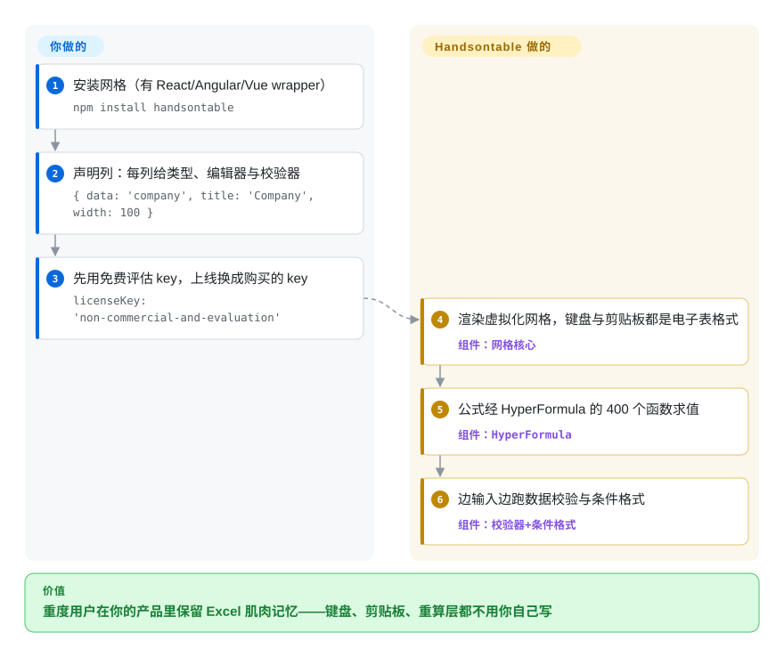

# Handsontable

你的内部系统里，重度用户拒绝填表单——他们要从 Excel 粘贴一整块、用方向键在格子间跳、拖填充柄、数值越界时看到红框。自己实现这套键盘+剪贴板 UX 是没有尽头的。Handsontable 是一个带电子表格外观的 JavaScript 数据网格：15 年沉淀的编辑语义（校验、条件格式、合并单元格、冻结行列、经 HyperFormula 提供的 400 个公式），以组件形式挂进 React、Angular、Vue——或者根本不用框架。

## 何时使用

你在做一个 B2B 工具——ERP 网格、库存排产、财务录入——数据是*你的* schema、你的后端是唯一事实源；你不需要工作簿、不需要 sheet 标签页、不需要文档格式，你需要的是一张 behave 得像电子表格的、可编辑的表。Handsontable 就是这个精确生态位里久经考验的头名（2011 年创建，2026 年仍以商业节奏发版；npm 月下载约 116 万）。对比 [Jspreadsheet CE](jspreadsheet.zh.md)：当企业功能面是决定项——服务端数据分页、行分页、合并单元格配条件格式（全在它 README 功能清单里）——选它；对比 [Univer](univer.zh.md)：当「把一张绑定自己数据数组的 DOM 网格请进来」比领养一整个带 Canvas 渲染器的编辑器*框架*更合适时，选它。它的隐性成本也可以提前说清：**商用要买授权**——这个仓库早已不是开源项目（v7.0，2019 年，MIT → 自定义非商业许可，出自厂商自己的博客）。对很多团队，这张发票仍然比复刻它键盘模型的一个工程季度便宜。

## 怎么用起来

你交给组件一个二维数组（或对象数组）加列声明——类型、编辑器、校验器——它渲染一个虚拟化的 DOM 表格，单元格行为像 Excel：选区、与真 Excel 互通的复制粘贴、撤销/重做、IME 安全的输入。公式计算外包给 HyperFormula——同家厂商的计算引擎（README 原话「400 built-in formulas via native integration」），格子里的 `=VLOOKUP` 真的会求值、随编辑重算。校验和条件格式跑在网格自身状态上；server-side data 模块让你把事实源留在自家 API，网格只做一个分页窗口。你要做的：配置列、接事件（`afterChange` 等）、凡是商用就填一个买来的 license key——README 示例自己写的是 `licenseKey: 'non-commercial-and-evaluation'`，并明说商业产品要购买。

<!-- flow-steps:begin (generated from flows/handsontable.json by tools/flow_card.py — do not edit) -->

流程文字版

1. **你**：安装网格（有 React/Angular/Vue wrapper） — `npm install handsontable`
2. **你**：声明列：每列给类型、编辑器与校验器 — `{ data: 'company', title: 'Company', width: 100 }`
3. **你**：先用免费评估 key，上线换成购买的 key — `licenseKey: 'non-commercial-and-evaluation'`
4. **Handsontable**：渲染虚拟化网格，键盘与剪贴板都是电子表格式 — 组件：`网格核心`
5. **Handsontable**：公式经 HyperFormula 的 400 个函数求值 — 组件：`HyperFormula`
6. **Handsontable**：边输入边跑数据校验与条件格式 — 组件：`校验器+条件格式`

**价值**：重度用户在你的产品里保留 Excel 肌肉记忆——键盘、剪贴板、重算层都不用你自己写

<!-- flow-steps:end -->

## 何时不用

- **你买不了软件授权** → 免费层只覆盖非商用与评估用途（README *Licenses* 节）。零发票网格：[Jspreadsheet CE](jspreadsheet.zh.md)（MIT）或 [Fortune Sheets](fortune-sheets.zh.md)（MIT）；零发票完整编辑器：[Univer](univer.zh.md)。
- **你在做电子表格*产品*，而不是产品里的一张网格** → 用户要标签页、要评论串、要旁边放个 docx？那是文档模型，Handsontable 明确自我豁免（它 FAQ 标题直接写「not a spreadsheet」）。用 [Univer](univer.zh.md)（嵌一个工作簿）或 [ONLYOFFICE Docs](onlyoffice-documentserver.zh.md)（整个套件搬进来）。
- **你需要 .xlsx 作为文件往返** → 「Export to Excel」是有的，但打开用户上传的任意工作簿、保着公式和样式不丢，是文档服务器的问题。选 [ONLYOFFICE Docs](onlyoffice-documentserver.zh.md)，或给网格配一个 [SheetJS](https://github.com/SheetJS/sheetjs)（`未收录`——文件格式库，超出本批编辑器范围，单独再加）。
- **你的瓶颈是数据量不是编辑 UX** → 几万行*只为看的渲染*是分析型虚拟网格的活：[AG Grid](https://github.com/ag-grid/ag-grid)（`未收录`——通用分析网格、没有电子表格编辑纵深；本批有意不加）。Handsontable 也虚拟化，但它的预算花在编辑交互上，不是百万行浏览。
- **你需要引擎在服务器上无头跑**（批量改数、cron 里校验 CSV）→ Handsontable 是浏览器 UI；公式可以拆出去用 HyperFormula（`未验证`同家另一仓库），但如果全部诉求就是无头办公运行时，[Univer](univer.zh.md) 在 Node 里跑同一套栈。
- **单一厂商依赖让你不安** → 开发方是 Handsoncode sp. z o.o.；前三账号（warpech 2,554／jansiegel 1,973／budnix 1,789）就是它的团队（contributors API 2026-09-27），而 2019 年的改许可已经演示了厂商需要营收时指针往哪边拨。本分类里有基金会式治理的替代是 [Grist](grist.zh.md) 的 Apache 核心。

## 横向对比

| 替代品 | 是否收录 | 我们的评价 | 取舍 |
| --- | --- | --- | --- |
| [Jspreadsheet CE](jspreadsheet.zh.md) | ✅ | 承载营收的 B2B 工具，买一张 15 年店龄、带厂商支持的网格更稳，选 Handsontable；同一张工单必须零授权费、且「Excel 式粘贴+类型列」已覆盖九成需求时，选 Jspreadsheet。 | Handsontable 用发票买功能纵深与支持；Jspreadsheet 用 MIT 换自由，但面更薄、且是 Pro 的引流口。 |
| [Fortune Sheets](fortune-sheets.zh.md) | ✅ | 要有人维护、有商业背书的网格选 Handsontable；要在一个 MIT 组件里拿满 Excel*表*语义（合并、条件格式、公式栏）且接受仓库默认分支自 2025-11-06 无提交，选 Fortune Sheets。 | Handsontable：支持到位、不像 Excel 的表、不免费。Fortune：更「表」、无支持、停摆。 |
| [Univer](univer.zh.md) | ✅ | 交付物是一个用户（或 agent）驱动的工作簿体验——标签页、文档、无头 Node——且 Apache-2.0 要紧时选 Univer；产品里要的是一张绑定自有 schema 的可编辑表、与其装配编辑器框架不如配置网格时选 Handsontable。 | Univer：框架广度、免费许可、更年轻。Handsontable：组件简单、交互成熟、收费。 |
| [ONLYOFFICE Docs](onlyoffice-documentserver.zh.md) | ✅ | 用户必须从自己的存储里打开并协同编辑真实 .xlsx/.docx 时选 ONLYOFFICE；数据活在*你的*表里、电子表格只是输入控件而不是文档时，Handsontable 才成立。 | ONLYOFFICE：一容器整套套件，AGPL，有服务器要养。Handsontable：npm 级足迹，但文件保真不是它的职责。 |
| HyperFormula | `未收录` | 如果全部需求就是「服务器上算公式、不要任何 UI」，先评估 HyperFormula（同厂商）再决定是否连网格都引进；`未收录` 因为本批收的是编辑界面，不收计算库。 | 买来纯 JS 公式求值；没有网格，且继承同一家厂商的开放核心姿态。 |

## 技术栈

JavaScript/TypeScript（GitHub linguist：JS 约 1,210 万、TS 约 1,100 万字节，2026-09-27 核实），DOM 渲染+行列虚拟化，公式经 HyperFormula 集成，主题系统含深色模式，官方 React/Angular/Vue3 wrapper，样式用 SCSS，CI 在 GitHub Actions（Jest），贡献需签 CLA（cla.handsontable.com）。面向分页 API 数据有 server-side data 模块。没有 Canvas 引擎、没有文档模型——它是组件，这是设计决定（README「Is Handsontable a Data Grid or a Spreadsheet?」）。

## 依赖

浏览器 + 打包器之外没有东西；框架 wrapper 是独立 npm 包。没有自带后端——持久化用你已有的任何服务。公式求值可跑在 Web Worker（HyperFormula 架构）[未验证——worker 配置未在本次审查中核对]。对商业产品而言，license key 字符串实际上是一个构建期依赖。

## 运维难度

**机制上低**：一个 npm 依赖，按大版本节奏升级（v18 线，2026-09），买了支持就有工单可提。**合同上中**：升级与续费交织（handsontable.com/pricing 的按座/按项目计价），且 2019 年 MIT→专有 的迁移是先例——条款会变。把授权谈判一次性做完，之后它就是个普通版本 bump 的网格。

## 健康度与可持续性

- **维护：强劲且有日期。** 18.1.1 发布于 2026-09-15，2026-09-25 仍有推送，同月候选版本滚动（API 核实）——一条活跃的商业列车，不是滑行的开源仓库。
- **治理：单一厂商，且毫不掩饰。** Handsoncode sp. z o.o.（克拉科夫）是背后的公司；仓库的存在是为了卖产品。核心贡献者就是厂商团队（warpech 2,554／jansiegel 1,973／budnix 1,789，API 2026-09-27）。贡献需 CLA。
- **背书与寿命：本分类最好的 Lindy。** 2011-05-23 创建——15 年*且仍在活跃*（年龄×仍活跃）。它活过了 jQuery 时代的竞争、React 时代的竞争、jExcel/Luckysheet 的浪潮；这份履历 Univer 和 Fortune Sheets 都没有。
- **采纳：有测量。** 健康雷达记录 `handsontable` 月下载 1,195,565、dependent repos 951（同日 registry 直读为 1,159,820）——本批收录的编辑界面里下载量头名 [推断——仅限本批 7 页之间比较]。
- **风险信号** ——**它不是开源**：自 v7.0（2019 年博客原话「The MIT license has been replaced with a custom free for non-commercial license」）起仅非商用/评估免费；代码公开可读但无 key 商用即违约；定价权完全握在一家波兰公司手里。

## 存疑（未验证）

- [未验证] 当前商业定价/席位模型——未抓取 handsontable.com/pricing；「需要发票」的结论出自仓库 README 许可节文字。
- [未验证] 改许可精确归属 v7.0.0 的 2019 年时间点——厂商博客标题（「Handsontable 7.0.0 is here! … MIT license has been replaced」）与 HN 讨论（2019 年 1 月）互证，但博客正文时间戳未打开核对。
- [未验证] HyperFormula 的 Web Worker 配置、以及 v18 中公式求值默认是否仍在主线程。
- [未验证] 「Export to Excel」的输出保真度（.xlsx 里的样式/公式）——功能见 README；本次没有生成文件并在 Excel 里打开验证。
- [推断] 「本批下载量头名」只比较了本批四个以 npm 分发的成员；Grist/ONLYOFFICE/Collabora 不走 npm，没有可比信号。
