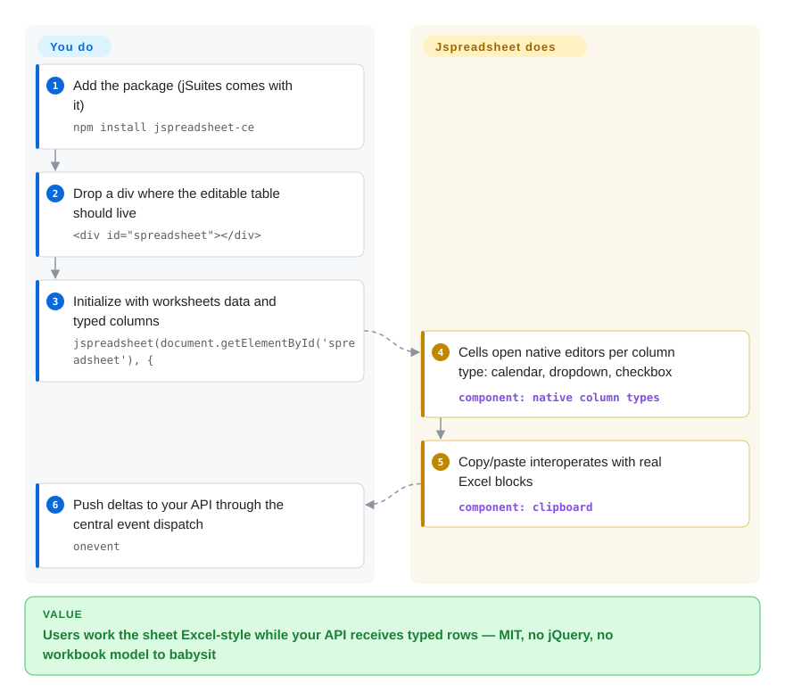

# Jspreadsheet CE

You need one table in your app to accept data the way Excel gives it: users paste a block from a real spreadsheet, columns have types (dropdown, calendar, checkbox, money mask), and edits land back in your API as clean rows. That grid from scratch is weeks of keyboard/clipboard edge cases. Jspreadsheet CE (the project formerly called jExcel) is a lightweight vanilla-JS data grid with spreadsheet controls, MIT-licensed, no jQuery, no framework requirement — the classic answer when Handsontable's license fee is a non-starter.

## When to use

You're building an admin panel, ERP screen, or science-data entry tool where the grid is *one input surface among many*, not the product's soul. You reach for Jspreadsheet when the requirement is exactly its README's pitch — typed native columns (`dropdown`, `calendar`, `checkbox`, `numeric` with mask, `color`, `image`), Excel-like copy/paste, and a small footprint — and the constraint is hard: **zero license cost for commercial use** (MIT, verified via the repo's license metadata). Versus [Fortune Sheets](fortune-sheets.md) you trade sheet-level Excel semantics (merged ranges, conditional formatting, formula bar) for a project that is still being pushed to (2026-09-21 vs Fortune's 2025-12-15); versus [Handsontable](handsontable.md) you trade 15 years of enterprise polish for $0. Its own release hygiene is the asterisk to read before committing: the last *GitHub* release is 4.15.0 (2024-12-18) while npm carries 5.0.4 (2025-08-25), and the CE repo doubles as the funnel for the vendor's paid Jspreadsheet Pro — fine if you accept those facts, fatal if your procurement doesn't.

## How it works

You call `jspreadsheet(element, config)` on a div and hand it `worksheets` — each with a `data` array and `columns` declarations; the library renders an HTML table whose cells open native editors matching the column type (a calendar pops for `type: 'calendar'`, a list for `dropdown`), and keeps a centralized event dispatch (`onevent`, `onbeforesave`, `onsave`) so your code sees changes as row/column deltas rather than DOM archaeology. Formulas exist but stay spreadsheet-shaped-but-small: a footer with formula support plus helpers like `=COLUMN`, `=ROW`, `=CELL`, `=TABLE`, `=VALUE` and display helpers `=PROGRESS`/`=RATING` (README changelog) — not an Excel-function library. Persistence is yours: the JSON update helpers push edits to your endpoint; there is no document format and no sync engine. The README's v4 changelog also flags "XLSX support via a custom SheetJS integration (experimental)" — treat .xlsx as a maybe, not a feature.

<!-- flow-steps:begin (generated from flows/jspreadsheet.json by tools/flow_card.py — do not edit) -->

Text version of the flow

1. **You**: Add the package (jSuites comes with it) — `npm install jspreadsheet-ce`
2. **You**: Drop a div where the editable table should live — `

`
3. **You**: Initialize with worksheets data and typed columns — `jspreadsheet(document.getElementById('spreadsheet'), {`
4. **Jspreadsheet CE**: Cells open native editors per column type: calendar, dropdown, checkbox — component: `native column types`
5. **Jspreadsheet CE**: Copy/paste interoperates with real Excel blocks — component: `clipboard`
6. **You**: Push deltas to your API through the central event dispatch — `onevent`

**Value**: Users work the sheet Excel-style while your API receives typed rows — MIT, no jQuery, no workbook model to babysit

<!-- flow-steps:end -->

## When NOT to use

- **You need a real formula engine** (VLOOKUP chains, cross-sheet references, recalculation graphs) → CE's formula surface is helpers + footer math. Use [Handsontable](handsontable.md) (400 formulas via HyperFormula, if you'll pay), [Fortune Sheets](fortune-sheets.md) or [Univer](univer.md) (free tier).
- **Users expect an Excel *sheet*, not a table** — free-form cells, merges everywhere, cell comments, sheet tabs → that's a document model; use [Univer](univer.md) or Fortune Sheets.
- **.xlsx import/export is in the spec** → CE's own changelog labels its xlsx path "experimental"; production-grade file fidelity is [ONLYOFFICE Docs](onlyoffice-documentserver.md)'s job (or pair with SheetJS, `未收录` — format library, outside this batch).
- **You need an SLA or vendor support on the free line** → support gravity points to paid Pro; CE gets community goodwill from one dominant maintainer (pphod: 344+ commits, next 80, API 2026-09-27). For supported grids buy [Handsontable](handsontable.md); for supported full editors, ONLYOFFICE/Collabora enterprise tiers.
- **Supply-chain hygiene is strict** → npm 5.x tarballs ship without a license field in package metadata (registry check 2026-09-27) even though the repo carries an MIT LICENSE — expect your scanner to flag it, and pin by commit SHA if needed.
- **Collaboration / multi-user editing** → nothing ships; ops-free by design. ONLYOFFICE/Collabora/Univer(+Pro) are the collab answers.

## Comparison

| Alternative | In index | Our verdict | Tradeoff |
| --- | --- | --- | --- |
| [Handsontable](handsontable.md) | ✅ | Pick Handsontable when the grid is revenue-critical and a 15-year vendor with tests/CI/a11y investment is worth an invoice; pick Jspreadsheet when MIT-with-zero-invoice is a hard constraint and typed columns + Excel paste cover the job. | Handsontable buys depth and support for money; Jspreadsheet buys freedom and lightness, with a single-maintainer funnel to Pro. |
| [Fortune Sheets](fortune-sheets.md) | ✅ | Pick Jspreadsheet for a maintained, lightweight *table* with typed columns; pick Fortune Sheets when the widget must behave like an Excel *sheet* (merges, conditional formatting, op log) and you accept its post-2025-12 silence. | Fortune: more Excel semantics, stalled repo. Jspreadsheet: fewer semantics, still-alive repo, same MIT. |
| [Univer](univer.md) | ✅ | Pick Univer when the spreadsheet is the product (workbook model, canvas perf, formula engine, headless Node, agent APIs); pick Jspreadsheet when it's one form-grid in a CRUD app and Univer's architecture would be underused overhead. | Univer: editor framework at assembly cost; Jspreadsheet: drop-in grid at ceiling cost. |
| AG Grid | `未收录` | If the need is analytics-scale rows with sorting/filtering and only light cell editing — not spreadsheet controls — evaluate AG Grid first; `未收录` deliberately (general-purpose grid, outside this batch's editing-surface scope). | AG Grid buys virtualization scale and ecosystem; Jspreadsheet buys spreadsheet-shaped editing UX. |

## Tech stack

Vanilla JavaScript (GitHub linguist 2026-09-27: JS ≈462 KB, CSS ≈23 KB — a genuinely small surface), HTML-table rendering, no jQuery since the v4 rewrite ("No jQuery required", README changelog), native column types, centralized event dispatch, JSON update helpers for server sync; React and Vue wrappers documented, examples for Angular. Companion UI-widget library jSuites ships alongside (README's CDN setup loads both). No canvas engine, no CRDT, no server component.

## Dependencies

Runtime: one npm package (`jspreadsheet-ce`) plus its jSuites companion in the browser path; nothing server-side — your API receives whatever the events give you. Framework wrappers (React/Vue) are integration layers, not services. No fonts/binaries/native addons.

## Ops difficulty

**Low** as a component: pin the npm version and move on; the surface is small enough to read. **Watch items:** the release process (GitHub tags lag npm — 4.15.0 vs 5.0.4) means your changelog reading happens in commit history, not releases; the CE/Pro split means CE features can sit "good enough" where Pro wants the sale; single-maintainer bus factor means a fork is a foreseeable event, so prefer pinning to SHAs over floating carets.

## Health & viability

- **Maintenance: alive but asymmetric.** Repo pushed 2026-09-21 (API-verified), yet last GitHub release 2024-12-18 and last npm publish 2025-08-25 — activity concentrates in the vendor's Pro line; CE gets drips. [推断] That pattern is normal for open-core funnels, but it's the shape of the risk, stated.
- **Governance: one dominant author.** pphod 344 + hodeware 80 (very likely the same person, [推断]) vs next contributor 49 (contributors API 2026-09-27); org-named repos (`jspreadsheet/*`) host both CE and Pro. No foundation, no CLA ritual needed for that trust judgment — the bus is one seat wide.
- **Backing & longevity** — created 2017-02-20 (≈9.5 years, jExcel lineage); still active, so age × alive is respectable, between Handsontable's 15 and Fortune's 4.5. Lindy moderate. [推断]
- **Adoption: real, but the radar mis-picked the package.** The health frontmatter resolved `canonical_package: jexcel` — the legacy npm name — measuring 12,102 monthly downloads and 97 dependent repos; the actual CE package `jspreadsheet-ce` reads 267,761 downloads/month (registry 2026-09-27), and 7.2k stars. Read the real number, not the radar's: same order as the stalled Fortune Sheets, i.e. the MIT-grid niche's two candidates split demand roughly evenly [推断 — attribution not visible from the registry].
- **Risk flags** — npm 5.x package metadata lacks a `license` field (registry-verified 2026-09-27) while the repo LICENSE is MIT; the README's top-of-page positions Pro ("Enterprise Solution") — CE is explicitly the free tier of a business; docs split across bossanova.uk (v4/v5) and jspreadsheet.com, a stale-docs magnet.

## Caveats (unverified)

- [未验证] Whether the missing npm `license` field in 5.0.4 is metadata sloppiness or a licensing change — the repo tree says MIT; the tarball says nothing. Needs the maintainer's answer, not speculation.
- [推断] pphod and hodeware being one person is inferred from the same-project pairing and README authorship conventions; contributor graphs don't prove identity.
- [未验证] Merge-cells support status in CE v5 (the feature existed in the jExcel era; CE v5 docs were not exhaustively checked), so this page makes no merge claims.
- [未验证] Performance on very large sheets — DOM-table architecture implies a ceiling below canvas engines, but no benchmark was run here.
- [未验证] React/Vue wrapper API surface and release cadence — README claims examples/docs; wrappers were not executed.
