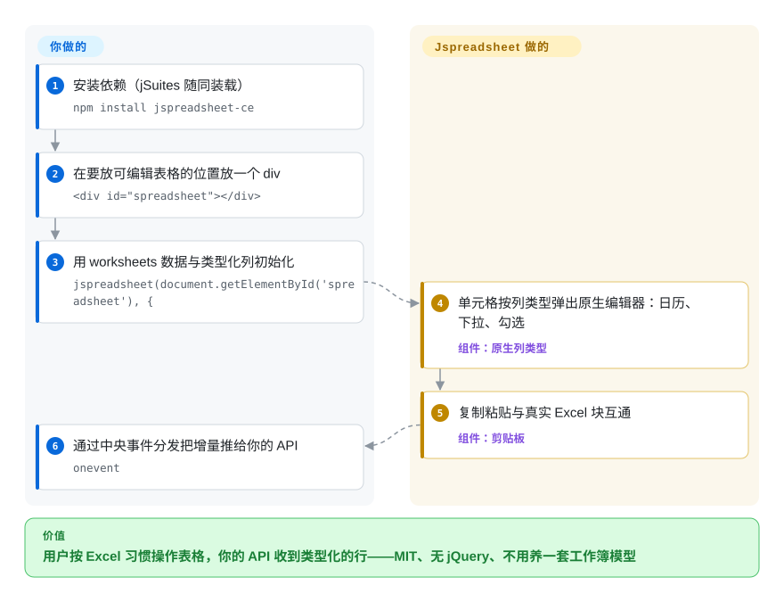

# Jspreadsheet CE

你的应用里有一张表要按 Excel 的方式收数据：用户从真表格软件粘一整块进来，列要带类型（下拉、日历、勾选、金额掩码），编辑完要变成干净的行回到你的 API。从零写这张网格就是数周不完的键盘/剪贴板边角料。Jspreadsheet CE（前身 jExcel）是一个轻量的原生 JS 数据网格，带电子表格操作，MIT、无 jQuery、不要求框架——Handsontable 的授权费谈不拢时的经典答案。

## 何时使用

你在做管理后台、ERP 界面或科研录入工具，网格是*众多输入界面之一*、不是产品的灵魂。需求恰好是它 README 的那句推销——原生类型列（`dropdown`、`calendar`、`checkbox`、带 mask 的 `numeric`、`color`、`image`）、Excel 式复制粘贴、小体积——而约束是硬的：**商用零授权费**（MIT，经仓库许可元数据核实），这时你该想到 Jspreadsheet。对比 [Fortune Sheets](fortune-sheets.zh.md)：你用表格式 Excel 语义（合并区、条件格式、公式栏）换一个仍有提交的项目（默认分支最后一次提交 2026-09-21 对 Fortune 的 2025-11-06）；对比 [Handsontable](handsontable.zh.md)：用 15 年企业级打磨换 $0。它自己的发布卫生是承诺前必须读的星号：*GitHub* 最新 release 停在 4.15.0（2024-12-18），npm 已是 5.0.4（2025-08-25），且 CE 仓库同时是厂商付费版 Jspreadsheet Pro 的引流入口——你能接受这些事实就用，采购不能接受就致命。

## 怎么用起来

你在一个 div 上调 `jspreadsheet(element, config)`，喂给它 `worksheets`——每个含一个 `data` 数组和 `columns` 声明；库渲染一张 HTML 表格，单元格按列类型弹出原生编辑器（`type: 'calendar'` 出日历、`dropdown` 出列表），并把事件收敛到中央分发（`onevent`、`onbeforesave`、`onsave`），你的代码按行/列增量看变更，不用做 DOM 考古。公式存在但保持在「小型电子表格形状」：页脚公式支持加 `=COLUMN`、`=ROW`、`=CELL`、`=TABLE`、`=VALUE` 这类助手和 `=PROGRESS`/`=RATING` 展示助手（README 变更日志）——不是 Excel 函数库。持久化是你的活：JSON 更新助手把编辑推给你的端点；没有文档格式，也没有同步引擎。README 的 v4 变更日志还写着「XLSX support via a custom SheetJS integration (experimental)」——把 .xlsx 当「也许」，别当功能。

<!-- flow-steps:begin (generated from flows/jspreadsheet.json by tools/flow_card.py — do not edit) -->

流程文字版

1. **你**：安装依赖（jSuites 随同装载） — `npm install jspreadsheet-ce`
2. **你**：在要放可编辑表格的位置放一个 div — `

`
3. **你**：用 worksheets 数据与类型化列初始化 — `jspreadsheet(document.getElementById('spreadsheet'), {`
4. **Jspreadsheet CE**：单元格按列类型弹出原生编辑器：日历、下拉、勾选 — 组件：`原生列类型`
5. **Jspreadsheet CE**：复制粘贴与真实 Excel 块互通 — 组件：`剪贴板`
6. **你**：通过中央事件分发把增量推给你的 API — `onevent`

**价值**：用户按 Excel 习惯操作表格，你的 API 收到类型化的行——MIT、无 jQuery、不用养一套工作簿模型

<!-- flow-steps:end -->

## 何时不用

- **你需要真公式引擎**（VLOOKUP 链、跨表引用、重算图）→ CE 的公式面就是助手函数+页脚算术。用 [Handsontable](handsontable.zh.md)（HyperFormula 供 400 个公式，前提是你肯付）、[Fortune Sheets](fortune-sheets.zh.md) 或 [Univer](univer.zh.md)（免费层）。
- **用户要的是 Excel*那张表*，不是表格控件**——自由单元格、到处合并、单元格批注、sheet 标签页 → 那是文档模型，用 [Univer](univer.zh.md) 或 Fortune Sheets。
- **规格里写着 .xlsx 导入导出** → CE 自己的变更日志把 xlsx 路径标为 "experimental"；生产级文件保真是 [ONLYOFFICE Docs](onlyoffice-documentserver.zh.md) 的活（或另配 SheetJS，`未收录`——格式库，超出本批范围）。
- **免费线也要 SLA 或厂商支持** → 支持的重力指向付费 Pro；CE 由一位主导维护者供社区善意（pphod 344+ 提交，第二名 80，API 2026-09-27）。要带支持的网格买 [Handsontable](handsontable.zh.md)；要带支持的完整编辑器看 ONLYOFFICE/Collabora 的企业层。
- **供应链审查严格** → npm 5.x 的包元数据没有 `license` 字段（registry 2026-09-27 查证），尽管仓库 LICENSE 是 MIT——扫描器会报警，必要时按 commit SHA 钉版本。
- **协同/多人编辑** → 什么都没有，也无 op 流。协同的答案是 ONLYOFFICE/Collabora/Univer(+Pro)。

## 横向对比

| 替代品 | 是否收录 | 我们的评价 | 取舍 |
| --- | --- | --- | --- |
| [Handsontable](handsontable.zh.md) | ✅ | 网格关乎营收、15 年厂商的测试/CI/无障碍投入值这张发票时选 Handsontable；MIT 零成本是硬约束、且「类型列+Excel 粘贴」已覆盖需求时选 Jspreadsheet。 | Handsontable 花钱买纵深与支持；Jspreadsheet 买自由与轻，但单人维护、且是 Pro 的漏斗。 |
| [Fortune Sheets](fortune-sheets.zh.md) | ✅ | 要有人维护的轻量*表控件*、带类型列，选 Jspreadsheet；这个组件必须表现得像 Excel*那张表*（合并、条件格式、op 流）且接受其 2025-11 后静默，选 Fortune Sheets。 | Fortune：更多表语义、仓库停摆。Jspreadsheet：更少语义、仓库活着、同为 MIT。 |
| [Univer](univer.zh.md) | ✅ | 电子表格本身就是产品（工作簿模型、Canvas 性能、公式引擎、无头 Node、agent API）选 Univer；CRUD 应用里一张表单网格、Univer 的架构纯属空转开销时选 Jspreadsheet。 | Univer：以装配成本换编辑器框架；Jspreadsheet：以天花板成本换即插网格。 |
| AG Grid | `未收录` | 需求其实是分析级行数+排序过滤、单元格编辑很轻、根本不要电子表格操作，先评估 AG Grid；`未收录` 是有意跳过（通用网格，超出本批「编辑界面」范围）。 | AG Grid 买虚拟化规模与生态；Jspreadsheet 买电子表格形状的编辑交互。 |

## 技术栈

原生 JavaScript（GitHub linguist 2026-09-27：JS 约 462 KB、CSS 约 23 KB——确实小），HTML 表格渲染，v4 重写后无 jQuery（README 变更日志原话 "No jQuery required"），原生列类型，中央事件分发，配 JSON 更新助手做服务端同步；有 React、Vue 文档化封装与 Angular 示例。伴随组件库 jSuites 一起装载（README 的 CDN 配置两者并列）。无 Canvas 引擎、无 CRDT、无服务端组件。

## 依赖

运行时：一个 npm 包（`jspreadsheet-ce`），浏览器路径再加 jSuites 伴侣；服务端零要求——你的 API 收到什么事件全凭配置。框架 wrapper 是集成层不是服务。无字体/二进制/原生插件。

## 运维难度

**作为组件低**：钉好 npm 版本就能走；体积小到读得完。**观察项**：发布流程（GitHub tag 落后 npm——4.15.0 对 5.0.4）意味着读变更要去 commit 历史而不是 release notes；CE/Pro 分层意味着 CE 的功能会停在「够免费用」而 Pro 等着成交；单人主导的 bus factor 让 fork 成为可预期事件——优先按 SHA 钉版本而不是 `^`。

## 健康度与可持续性

- **维护：活着，但不对称。** 仓库 2026-09-21 有推送（API 核实），但末次 GitHub release 2024-12-18、末次 npm 发布 2025-08-25——活动在厂商的 Pro 线上聚集，CE 拿滴灌。[推断] 开放核心漏斗的正常形态，但风险形状如此，说清楚。
- **治理：单一作者主导。** pphod 344 + hodeware 80（极可能同一人，[推断]），第三名 49（contributors API 2026-09-27）；org `jspreadsheet/*` 同时挂 CE 与 Pro。不需要基金会/CLA 仪式来下这个信任判断——巴士宽度一个座位。
- **背书与寿命** ——2017-02-20 创建（约 9.5 年，jExcel 血统），仍在活跃，年龄×仍活跃说得过去，介于 Handsontable 的 15 年与 Fortune 的 4.5 年之间。Lindy 中等。[推断]
- **采纳：真实，但雷达抓错了包。** health frontmatter 把 `canonical_package` 解析成了 `jexcel`（旧包名），量到月下载 12,102、dependent repos 97；而真正的 CE 包 `jspreadsheet-ce` 月下载 267,761（registry 2026-09-27）、7.2k stars。看真实数字、别看雷达抓取值：与停摆的 Fortune Sheets 同一量级，即 MIT 网格 niche 的两个候选平分需求 [推断——registry 看不到归因]。
- **风险信号** ——npm 5.x 包元数据缺 `license` 字段（registry 2026-09-27 核实）而仓库 LICENSE 为 MIT；README 页面顶部就在给 Pro 让位（"Enterprise Solution"）——CE 明说了是生意的免费层；文档分裂在 bossanova.uk（v4/v5）与 jspreadsheet.com，是陈旧文档的天然温床。

## 存疑（未验证）

- [未验证] 5.0.4 缺 npm `license` 字段究竟是元数据疏忽还是许可变更——仓库树写着 MIT，tarball 什么都没说。该由维护者回答，不该靠猜。
- [推断] pphod 与 hodeware 是同一人，系由同项目配对与 README 署名惯例推断；贡献者图无法证明身份。
- [未验证] CE v5 的合并单元格支持状态（jExcel 时代存在该功能，CE v5 文档未逐一核对），故本页不做合并主张。
- [未验证] 超大表的性能——DOM 表格架构意味着上限低于 Canvas 引擎，但本次未跑基准。
- [未验证] React/Vue wrapper 的 API 面与发布节奏——README 声称有示例/文档；wrapper 未实际执行。
