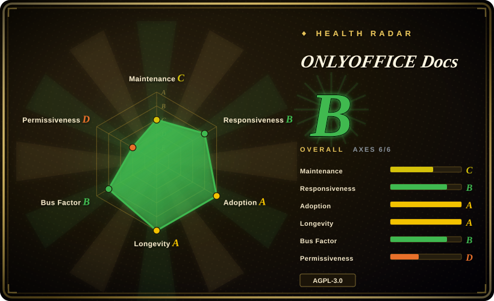
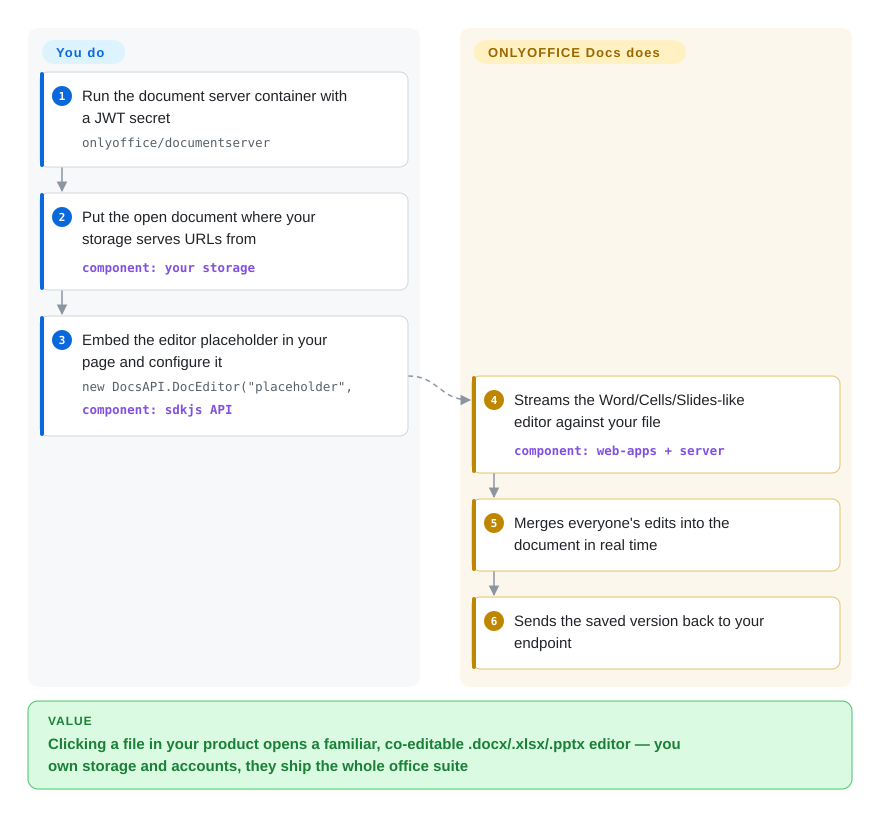

# ONLYOFFICE Docs

Your product holds .docx files and every edit cycle is "download, fix locally, re-upload, hope it's the newest copy." You need click → browser editor → saved-in-place, with real-time co-editing and Office Open XML that survives the round trip — and you are not about to write a word processor. ONLYOFFICE Docs ships that as a document server: Word/Cells/Slides-style editors in one AGPL container, drawing files from *your* storage and returning them to *your* storage.

## When to use

You run (or integrate) a sync&share platform and editing is a feature, not the product: the README names connectors for Odoo, Moodle, ownCloud, Seafile, and ONLYOFFICE's own DocSpace/Workspace — the intended posture is "your users, your files, our editors." You reach for it over [Collabora Online](collabora-online.md) when OOXML fidelity and an Office-like UI are the priority (ONLYOFFICE's engine is built OOXML-first; Collabora streams the LibreOffice engine and is ODF-centric by lineage), and over [Univer](univer.md) when assembling a restyled editor SDK is out of scope — here the editor chrome, collaboration protocol, conversion service and PDF/form handling all arrive complete. The Community Edition is genuinely free to self-host (`onlyoffice/documentserver`, up to ~20 concurrent users *recommended* per the vendor's own edition table); Enterprise/Developer editions lift that and add clustering — the open-core line is capacity and services, not basic editing (README editions table, 2026-09). One `docker run` plus a `DocsAPI.DocEditor` embed gets a pilot running in an afternoon; the JWT secret env var in the install docs is there because unauthenticated editors can open arbitrary URLs — take the hint and keep it on.

## How it works

Split your mental model the way the project splits its repos: the browser editors (JavaScript, `sdkjs`/`web-apps`), the server-side conversion/merge engine (C++, `server`/`core`), and fonts/dictionaries/templates around them — this GitHub repo is the packaging and release shell that composes them into the `onlyoffice/documentserver` image (its linguist output is literally ~180 bytes of Shell; the code lives in the component repos the README links, verified 2026-09-27). Operationally: your app embeds a page that constructs `new DocsAPI.DocEditor("placeholder", …)` with a document URL, type (`word`/`cell`/`slide`), user identity and callback config; the editor opens against that file; concurrent editors are merged by the document server's session; on save (or periodic callback), the server POSTs the new version back to *your* endpoint, which replaces the file in your storage. So the server never owns your data — it's a stateless-as-visible rendering/collaboration appliance, with WOPI as the alternative integration contract (documented in their API portal's WOPI section).

<!-- flow-steps:begin (generated from flows/onlyoffice-documentserver.json by tools/flow_card.py — do not edit) -->

Text version of the flow

1. **You**: Run the document server container with a JWT secret — `onlyoffice/documentserver`
2. **You**: Put the open document where your storage serves URLs from — component: `your storage`
3. **You**: Embed the editor placeholder in your page and configure it — `new DocsAPI.DocEditor("placeholder",` — component: `sdkjs API`
4. **ONLYOFFICE Docs**: Streams the Word/Cells/Slides-like editor against your file — component: `web-apps + server`
5. **ONLYOFFICE Docs**: Merges everyone's edits into the document in real time
6. **ONLYOFFICE Docs**: Sends the saved version back to your endpoint

**Value**: Clicking a file in your product opens a familiar, co-editable .docx/.xlsx/.pptx editor — you own storage and accounts, they ship the whole office suite

<!-- flow-steps:end -->

## When NOT to use

- **The editor must dissolve into your product's own UI** → the chrome is ONLYOFFICE's; you get embedding, config and plugin points, not a restyled component tree. For white-label assembly, [Univer](univer.md).
- **You're past small-team scale on free terms** → Community Edition's own table caps it at "up to 20 recommended" users with no clusterization; beyond that it's EE/DE pricing. Sizing this wrong is a procurement surprise — [Collabora](collabora-online.md) (MPL, HA via Helm without an edition gate) is the counterfactual.
- **Network copyleft is a problem in your architecture** → the server is AGPL-3.0: modify it and offer it over a network, and the source obligations run to network users. Running stock containers is the ordinary path; forking DS internals is where counsel gets involved. A permissive alternative *at the server layer* here is Grist's Apache core — but that's a different product (below).
- **The "document" is really a database** → typed fields, row permissions, form pipelines belong in [Grist](grist.md); DS is document-centric.
- **You need editing logic inside your Node/Python pipeline** (headless transforms, batch fixes) → the conversion service exists but as a server API; in-process generation wants [OfficeCLI](../office-automation/officecli.md), [python-docx](../office-automation/python-docx.md) or [XlsxWriter](../office-automation/xlsxwriter.md).
- **You want to contribute through this repo** → PRs land in `server`/`sdkjs`/`web-apps`/…, eight component repos linked from the README; DocumentServer itself is CI/packaging. Expect to learn the split before your first PR.

## Comparison

| Alternative | In index | Our verdict | Tradeoff |
| --- | --- | --- | --- |
| [Collabora Online](collabora-online.md) | ✅ | Pick ONLYOFFICE when your users live in .docx/.xlsx/.pptx and want Office-shaped UI + first-party connectors; pick Collabora when the format world is wider (ODF, legacy), MPL licensing matters, or HA scaling must not hit an edition paywall. | ONLYOFFICE: OOXML-first polish, AGPL with a 20-user-recommended CE. Collabora: engine breadth, MPL, but WOPI-host plumbing is on you. |
| [Univer](univer.md) | ✅ | Pick Univer when the editor is *your* product surface (custom UI, agent APIs, headless Node) and you'll assemble collab yourself or buy Pro; pick ONLYOFFICE when "a complete Office editor in an iframe, this sprint" is the requirement. | Univer: white-label SDK, Apache core, collab is Pro. ONLYOFFICE: fixed but finished suite, AGPL, collab included. |
| [Grist](grist.md) | ✅ | If the shared-drive pain is *records* (who-owns-what, per-row access, dashboards), Grist's Apache self-host beats a document server; ONLYOFFICE is the answer when the artifacts must remain Word/Excel files. | Grist: data backbone, not a document editor. ONLYOFFICE: document fidelity, not a database. |
| Microsoft 365 / Office for the Web | `非仓库` | The default the product is escaping; hosted SaaS, no source, no self-host — named so the "we already pay Microsoft" argument gets weighed honestly. | Zero ops, full fidelity; zero control, tenant lock-in, no on-prem. |
| Nextcloud (richdocuments) | `未收录` | The most common host that turns DS/Collabora into a drive-with-editing; `未收录` deliberately — groupware platform, outside this batch's editing-surface scope. | Buys the whole self-hosted-drive stack; your editor is then a component of *their* product. |

## Tech stack

Multi-repo by design (README "Components"): `server` (C++ doc engine, merge/convert services), `core` (format conversion across DOC/DOCX/ODT/RTF/TXT/PDF/HTML/EPUB/XPS/DjVu/XLS/XLSX/ODS/CSV/PPT/PPTX/ODP — the list is the README's), `sdkjs` (JS client API), `web-apps` (editor front-end), `core-fonts`, `dictionaries`, `document-formats`, `document-templates`; this repo assembles releases/Docker. Editors: word/sheet/slide + form creator + PDF editor + diagram viewer; 46 UI languages, RTL support; plugin system with a marketplace. [未验证] exact language mix inside `server` (C++ core with Node.js service wrappers is the community's description; not audited here).

## Dependencies

The Community Edition runs as `onlyoffice/documentserver` (Docker; or deb/rpm; or k8s via their Helm charts) and internally bundles its queue/database stack [未验证 — component list inside the image not inspected; treat as "one fat container"]. Requirements that are *yours*: a reverse proxy with TLS and websocket support, a fixed `JWT_SECRET` (helpcenter warns the secret regenerates on every restart if unset → broken integrations), and an integration endpoint that serves document URLs and accepts save callbacks (or a WOPI host). Editors are browser-only; no desktop agents.

## Ops difficulty

**Medium.** The container is one box to run, docs are mature (help center + API portal + marketplace examples), and the 9.x release train is quarterly-ish with security notes. The work is in the *contract*: JWT hygiene, callback URL correctness, storage auth (the document server must reach your file URLs — network topology becomes an integration decision), upgrade coordination with your connectors, and sizing: conversion is CPU-spiky. HA/clusterization exists but is EE/DE, so scaling past CE is a licensing step, not just an ansible playbook.

## Health & viability

- **Maintenance: steady commercial cadence.** v9.4.0 released 2026-05-19; 9.3.x in Feb–Mar 2026; last push 2026-07-22 on the packaging repo (API-verified) — releases track the Docs product line, not GitHub pulse.
- **Governance: single vendor, multi-repo.** ONLYOFFICE's company owns all component repos; this repo's contributor list (agolybev 182, ShockwaveNN 145…) understates the team because code lives elsewhere. No foundation; roadmap = product roadmap.
- **Backing & longevity: 12-year track record.** DocumentServer repo from 2014-07-05, product predating it [推断 — as TeamLab/OnlyOffice lineage per the README's naming note "Starting from version 6.0, Document Server is distributed under a new name - ONLYOFFICE Docs"]. Age × still-active: the oldest continuously-shipping full editor suite in this batch after Handsontable-as-component.
- **Adoption: the strongest measured signal here.** ~102M Docker Hub pulls for `onlyoffice/documentserver` (API-verified 2026-09-27) — two orders above Grist's ~4.2M; connectors across Moodle/ownCloud/Seafile/Odoo ecosystems. [推断] Pulls include unauthenticated anonymous pulls, so read as a floor-scale proxy, not user counts.
- **Risk flags** — open-core tiers (EE/DE proprietary licenses per the editions table) gate capacity; AGPL for CE; contributor trust is vendor-internal (the GitHub repo's activity metrics are packaging noise); the editor UI being non-restylable is a *product* risk if your differentiation is UX.

## Caveats (unverified)

- [未验证] The `server` repo's internal language/runtime composition (C++ engine vs Node.js service wrappers) — component split verified from the README, internals not audited.
- [未验证] What exactly caps the "up to 20 recommended" CE line — the README table states it as recommendation; enforcement (technical limit vs licensing text) not checked.
- [未验证] Minimum hardware (RAM) for the container — deployment guides give numbers; not verified against the image docs fetched here.
- [未验证] Document Builder / Automation API pricing tier boundaries — API portal nav mentions them; editions table seen here covers only DS tiers.
- [推断] Docker pull counts as adoption scale — Hub metrics lack auth granularity and include CI churn; used as floor signal only.
- [推断] Product lineage predating the 2014 repo — based on the README's own rename note, not a company history review.
