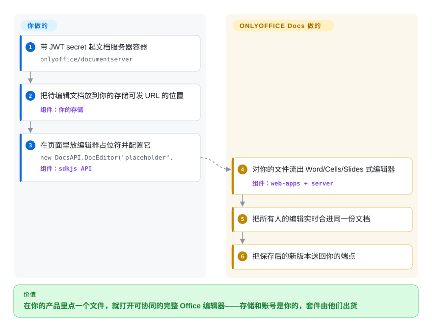

# ONLYOFFICE Docs

你的产品存着 .docx 文件，每一轮编辑都是「下载、本地改、再传上去、祈祷这是最新版」。你需要的是：点一下 → 浏览器编辑器 → 原地保存，带实时协同，而且 OOXML 往返之后还能活下来——同时你并不打算自己写一个文字处理器。ONLYOFFICE Docs 把这整套交付成一个文档服务器：一个 AGPL 容器里的 Word/Cells/Slides 式编辑器，文件从*你的*存储来、回*你的*存储去。

## 何时使用

你在运营（或对接）一个同步网盘类平台，编辑是功能而不是产品本身：README 点名了 Odoo、Moodle、ownCloud、Seafile 以及 ONLYOFFICE 自家 DocSpace/Workspace 的连接器——设计姿态就是「你的用户、你的文件、我们的编辑器」。相比 [Collabora Online](collabora-online.zh.md)：当 OOXML 保真与 Office 形状 UI 是优先项时选 ONLYOFFICE（它的引擎是 OOXML-first 构建；Collabora 流的是 LibreOffice 引擎、血统以 ODF 为心）。相比 [Univer](univer.zh.md)：当重排一个编辑器 SDK 重新装配根本不在射程内——这里的编辑器外观、协同协议、转换服务、PDF/表单处理是整套到货的。社区版自托管是真免费（`onlyoffice/documentserver`，按厂商自己的版本对照表*建议*并发 ≤20 用户）；企业版/开发者版提升上限并加集群——开放核心的线画在容量与服务上，不在基础编辑（README 版本表，2026-09）。一条 `docker run` 加一个 `DocsAPI.DocEditor` 嵌入，一个下午就能跑通试点；安装文档里那个 JWT secret 环境变量之所以存在，是因为未鉴权的编辑器可以打开任意 URL——看懂这个暗示，把它开着。

## 怎么用起来

按项目拆仓库的方式拆你的心智模型：浏览器编辑器（JavaScript，`sdkjs`/`web-apps`）、服务端转换/合并引擎（C++，`server`/`core`），外圈是字体/词典/模板——而这个 GitHub 仓库只是把它们组装成 `onlyoffice/documentserver` 镜像的打包发布壳（它的 linguist 输出字面上约 180 字节 Shell；代码在 README 链接的组件仓库里，2026-09-27 核实）。运行上：你的应用嵌一个页面，构造 `new DocsAPI.DocEditor("placeholder", …)`，给文档 URL、类型（`word`/`cell`/`slide`）、用户身份与回调配置；编辑器对着该文件打开；并发编辑者由文档服务器的会话合并；保存（或周期性回调）时，服务器把新版本 POST 回*你的*端点，由你替换存储里的文件。所以服务器从不占有你的数据——它是一台外观无状态的渲染/协同 appliance，WOPI 是另一种集成契约（其 API 门户 WOPI 节有文档）。

<!-- flow-steps:begin (generated from flows/onlyoffice-documentserver.json by tools/flow_card.py — do not edit) -->

流程文字版

1. **你**：带 JWT secret 起文档服务器容器 — `onlyoffice/documentserver`
2. **你**：把待编辑文档放到你的存储可发 URL 的位置 — 组件：`你的存储`
3. **你**：在页面里放编辑器占位符并配置它 — `new DocsAPI.DocEditor("placeholder",` — 组件：`sdkjs API`
4. **ONLYOFFICE Docs**：对你的文件流出 Word/Cells/Slides 式编辑器 — 组件：`web-apps + server`
5. **ONLYOFFICE Docs**：把所有人的编辑实时合进同一份文档
6. **ONLYOFFICE Docs**：把保存后的新版本送回你的端点

**价值**：在你的产品里点一个文件，就打开可协同的完整 Office 编辑器——存储和账号是你的，套件由他们出货

<!-- flow-steps:end -->

## 何时不用

- **编辑器必须融化进你产品自己的 UI** → 外观是 ONLYOFFICE 的；你拿到的是嵌入、配置与插件点，不是一棵可重排样式的组件树。要白牌装配，用 [Univer](univer.zh.md)。
- **免费条款下会越过小团队规模** → 社区版自己的表把上限写成「建议 ≤20 用户」且无集群化；再往上就是 EE/DE 报价。规模估错是采购部的惊吓——反事实选项是 [Collabora](collabora-online.zh.md)（MPL，HA 走 Helm、没有版本闸门）。
- **网络版权传染在你的架构里是问题** → 服务器是 AGPL-3.0：改动它再经网络提供，源码义务就延伸到网络用户。跑标准容器是常规路径；fork DS 内部就轮到法务出场。*服务器层*的宽松替代这里有个 Grist 的 Apache 核心——但那是另一个产品（见下）。
- **「文档」其实是数据库** → 类型字段、行级权限、表单管线属于 [Grist](grist.zh.md)；DS 是以文档为中心的。
- **你需要把编辑逻辑塞进 Node/Python 管线**（无头变换、批量修复）→ 转换服务存在但那是服务器 API；进程内生成请直接用 [OfficeCLI](../office-automation/officecli.zh.md)、[python-docx](../office-automation/python-docx.zh.md) 或 [XlsxWriter](../office-automation/xlsxwriter.zh.md)。
- **你想通过这个仓库贡献代码** → PR 要落在 `server`/`sdkjs`/`web-apps`/…——README 链接的八个组件仓库；DocumentServer 本体是 CI/打包。先接受这个分裂，再提第一个 PR。

## 横向对比

| 替代品 | 是否收录 | 我们的评价 | 取舍 |
| --- | --- | --- | --- |
| [Collabora Online](collabora-online.zh.md) | ✅ | 用户活在 .docx/.xlsx/.pptx、要 Office 形状 UI 与一手连接器时选 ONLYOFFICE；格式世界更宽（ODF、祖传格式）、或 MPL 许可要紧、或 HA 扩容不能撞版本付费墙时选 Collabora。 | ONLYOFFICE：OOXML-first 精修、AGPL、社区版建议 ≤20。Collabora：引擎广度、MPL、但 WOPI host 的管子你自己铺。 |
| [Univer](univer.zh.md) | ✅ | 编辑器是*你的*产品界面（自定义 UI、agent API、无头 Node）、协同宁可自装或买 Pro 时选 Univer；「本迭代要在 iframe 里放一个完整 Office 编辑器」是硬需求时选 ONLYOFFICE。 | Univer：白牌 SDK、Apache 核心、协同在 Pro。ONLYOFFICE：外观固定但功能成套、AGPL、协同自带。 |
| [Grist](grist.zh.md) | ✅ | 网盘之痛的本质是*记录*（谁 owns 什么、行级访问、看板）时，Grist 的 Apache 自托管胜过文档服务器；产物必须保持 Word/Excel 文件格式时，答案是 ONLYOFFICE。 | Grist：数据骨架，不是文档编辑器。ONLYOFFICE：文档保真，不是数据库。 |
| Microsoft 365 / Office for the Web | `非仓库` | 产品要逃离的那个默认项；托管 SaaS、无源码、不可自托管——点名是为了让「我们已经在给微软付钱」这个论点被诚实地称重。 | 零运维、全保真；零控制、租户锁定、无本地部署。 |
| Nextcloud (richdocuments) | `未收录` | 把 DS/Collabora 变成「带编辑的网盘」的最常见宿主平台；`未收录` 有意跳过——群组协作平台，超出本批编辑界面范围。 | 买入整套自托管网盘栈；但那时你的编辑器成了*它的*产品的组件。 |

## 技术栈

多仓库是设计决定（README「Components」）：`server`（C++ 文档引擎、合并/转换服务）、`core`（格式转换：DOC/DOCX/ODT/RTF/TXT/PDF/HTML/EPUB/XPS/DjVu/XLS/XLSX/ODS/CSV/PPT/PPTX/ODP——清单即 README 原文）、`sdkjs`（JS 客户端 API）、`web-apps`（编辑器前端）、`core-fonts`、`dictionaries`、`document-formats`、`document-templates`；本仓库组装发布物/Docker。编辑器：文字/表格/幻灯片 + 表单创建器 + PDF 编辑器 + 图形查看器；46 种界面语言、RTL；插件体系带 marketplace。[未验证] `server` 仓库内部语言配比（社区口径是 C++ 内核 + Node.js 服务壳；未审计）。

## 依赖

社区版以 `onlyoffice/documentserver` 运行（Docker；或 deb/rpm；或走官方 Helm chart 的 k8s），镜像内部捆着它自己的队列/数据库栈 [未验证——未检查镜像内组件清单；按「一个胖容器」对待]。*你的*责任清单：带 TLS 与 websocket 的反向代理、固定的 `JWT_SECRET`（帮助中心的警告原文：不设则每次重启随机再生 → 集成会断）、以及一个提供文档 URL、接收保存回调的集成端点（或一个 WOPI host）。编辑器仅浏览器；无桌面代理。

## 运维难度

**中等。** 容器是一台机器的事，文档成熟（帮助中心 + API 门户 + marketplace 示例），9.x 发布线约每季度一班、带安全通告。活在于*契约*：JWT 卫生、回调 URL 正确性、存储可达性（文档服务器必须能访问你的文件 URL——网络拓扑变成了集成决策）、与连接器的升级协同、以及容量：转换是 CPU 尖峰型负载。HA/集群化存在但在 EE/DE——越过社区版扩容是授权动作，不是 ansible 剧本动作。

## 健康度与可持续性

- **维护：稳定的商业节奏。** v9.4.0 发布于 2026-05-19；9.3.x 在 2026 年 2–3 月；打包仓库末次推送 2026-07-22（API 核实）——发布跟着 Docs 产品线走，不跟 GitHub 脉搏走。
- **治理：单一厂商、多仓库。** ONLYOFFICE 公司掌握全部组件仓库；本仓库贡献者表（agolybev 182、ShockwaveNN 145…）因为代码在别处而低估团队规模。无基金会；路线图=产品路线图。
- **背书与寿命：12 年记录。** DocumentServer 仓库始于 2014-07-05，产品更早 [推断——README 自己写着「自 6.0 起 Document Server 以新名字 ONLYOFFICE Docs 分发」，TeamLab/OnlyOffice 血统]。年龄×仍活跃：本批里除「作为组件的 Handsontable」之外最老的持续发货完整编辑器套件。
- **采纳：本批最强的测量信号。** `onlyoffice/documentserver` Docker Hub 拉取约 1.02 亿（API 核实 2026-09-27）——比 Grist 的约 420 万高两个量级；Moodle/ownCloud/Seafile/Odoo 生态连接器遍布。[推断] 匿名拉取也在计数内，按规模下限代理读，不是用户数。
- **风险信号** ——开放核心分层（按版本表 EE/DE 为专有许可）闸住容量；CE 为 AGPL；贡献者信任是厂商内部事（GitHub 仓库的活动指标是打包噪音）；编辑器 UI 不可重排意味着——如果你的差异化在 UX——这是一个产品风险。

## 存疑（未验证）

- [未验证] `server` 仓库内部语言/运行时配比（C++ 引擎 vs Node.js 服务壳）——组件拆分经 README 核实，内部未审计。
- [未验证] 「建议 ≤20 用户」这条社区版红线究竟 cap 在什么上——README 表写的是建议值；技术限制还是许可文本未查证。
- [未验证] 容器的最低硬件（内存）要求——部署指南有数字；未与本次抓取的镜像文档对账。
- [未验证] Document Builder / Automation API 的价格层级边界——API 门户导航提到；本次所读版本表只覆盖 DS 三档。
- [推断] Docker 拉取数作为采纳规模——Hub 计数无鉴权区分、含 CI 重复拉取；仅作下限代理。
- [推断] 产品血统早于 2014 仓库——依据 README 的改名说明，未做公司史核查。
