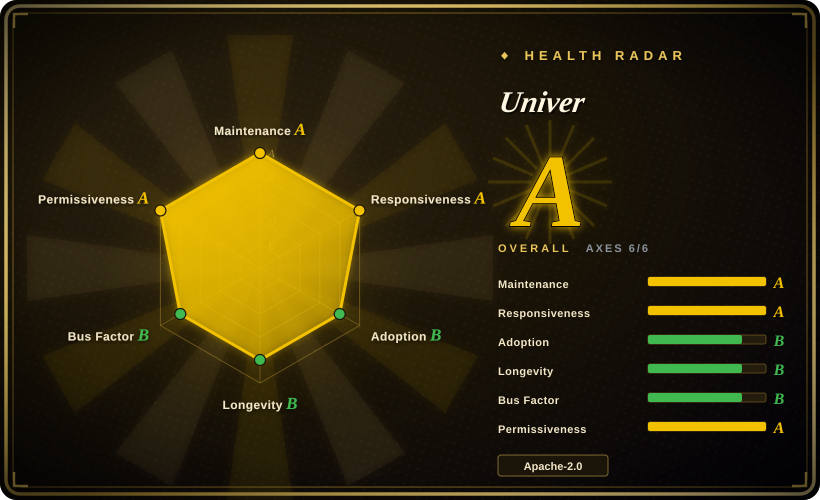
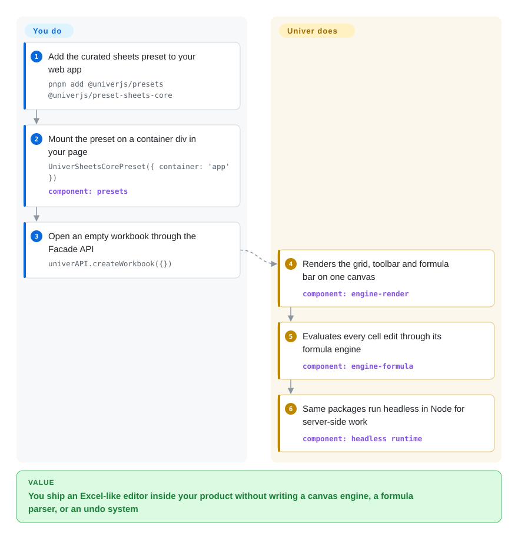

# Univer

Your SaaS needs an Excel-shaped editing surface inside its own pages — same toolbar you own, same formula bar, your theme — and licensing a document server or hand-rolling a canvas grid is out of budget. Univer is the embeddable SDK that ships the hard parts (canvas renderer, formula engine, command/undo system, sheet and doc models) as composable plugins, so you assemble the editor instead of building its engine.

## When to use

You're building a BI tool, an internal ops console, or an AI-agent product, and the requirement is *editing inside your own UI*, not "open a document server in an iframe". You reach for Univer because it is the only actively-maintained Apache-2.0 option in this category that treats the editor as a framework: every capability (formula, numfmt, selection, comments) is a plugin you can register, replace, or lazy-load, and one Facade API (`FUniver` → `FWorkbook` → `FRange`) drives the same document model whether it is rendered in a browser or running **headless in Node.js** — which is what makes "agent edits the workbook, human reviews in the same runtime" a single-stack story instead of two. Versus [Fortune Sheets](fortune-sheets.md) you get a maintained, TypeScript-rewritten successor (Univer is the same team's Luckysheet 3.x rewrite) with a real formula engine; versus [ONLYOFFICE Docs](onlyoffice-documentserver.md) you trade away built-in collaboration and .docx fidelity to gain UI you fully own. Sheets is the mature product line; docs are usable and slides/bases are explicitly under development (README, 2026-09).

## Q&A

**Q: 这个领域不该有 1-3 个强有力的竞品吗？**
A: 应该有，但按轴拆开看就散了：最直接的同轴对手 Luckysheet（17k stars）已被同团队升级为 Univer 并归档，README 明说"生产环境请用 Univer"（verified 2026-09-27）。放宽一轴才出现强手——要成品协同 Office 是 ONLYOFFICE/Collabora，要表格×数据库成品是 Grist，要纯数据网格是 Handsontable/Jspreadsheet。精确交点（Apache-2.0 + 表格/文档 + 浏览器/Node 同构 + agent 工作流）目前几乎无人。

## How it works

Think of it as an engine kit rather than a product: Univer renders everything on a single `<canvas>` (its `engine-render`), keeps document state in command-driven models (so undo/redo and collaborative changesets are first-class), and evaluates formulas with its own dependency-graph engine — none of which you have to write. What you do: pick presets (or compose plugins one by one), mount it on a container div, and speak to it through the Facade API; if you skip the UI entirely, the same packages run in Node for server-side calculation and automation. Collaboration, xlsx import/export and print are *not* in these OSS packages — they ship in the separately-licensed `@univerjs-pro/*` layer, and the README keeps that boundary explicit.

<!-- flow-steps:begin (generated from flows/univer.json by tools/flow_card.py — do not edit) -->

Text version of the flow

1. **You**: Add the curated sheets preset to your web app — `pnpm add @univerjs/presets @univerjs/preset-sheets-core`
2. **You**: Mount the preset on a container div in your page — `UniverSheetsCorePreset({ container: 'app' })` — component: `presets`
3. **You**: Open an empty workbook through the Facade API — `univerAPI.createWorkbook({})`
4. **Univer**: Renders the grid, toolbar and formula bar on one canvas — component: `engine-render`
5. **Univer**: Evaluates every cell edit through its formula engine — component: `engine-formula`
6. **Univer**: Same packages run headless in Node for server-side work — component: `headless runtime`

**Value**: You ship an Excel-like editor inside your product without writing a canvas engine, a formula parser, or an undo system

<!-- flow-steps:end -->

## When NOT to use

- **You need real-time collaboration in the open-source core** → you don't have one: collab, edit history, import/export, charts, pivot tables and server-side calculation are listed as Univer Pro / commercial extensions in the README's own OSS-vs-Pro table. For co-editing without a license key, self-host [ONLYOFFICE Docs](onlyoffice-documentserver.md) or [Collabora Online](collabora-online.md).
- **Your users live in .docx/.xlsx files with formatting you must not lose** → Univer's snapshot model is its own; byte-faithful OOXML round-trip is a document-server job (and Univer gates even its import/export behind Pro). Use [ONLYOFFICE Docs](onlyoffice-documentserver.md) or validate a [python-docx](../office-automation/python-docx.md)/[XlsxWriter](../office-automation/xlsxwriter.md) pipeline.
- **You just need an editable table, not a spreadsheet app** → the whole render/formula stack is heavyweight for a form-grid. Use [Handsontable](handsontable.md) (if licensing works out) or [Jspreadsheet](jspreadsheet.md) — both mount a grid in minutes.
- **You're generating reports rather than editing them** → no human UI is involved; an agent writing xlsx through [OfficeCLI](../office-automation/officecli.md) or [XlsxWriter](../office-automation/xlsxwriter.md) is a fraction of the bundle.
- **You need a low-effort finished workspace today** → Univer ships building blocks; assembling auth, storage, sharing, comments policy is yours. For the product, run [Grist](grist.md) or [Univer Workspace](https://github.com/dream-num/univer-workspace) (`未收录` — a separate first-party repo, left out of this batch deliberately).
- **Slides/Bases/PDF matter to your decision** → the README marks Slides "under active development", Bases Pro-centric, PDFs "coming soon" (2026-09). Sheets-first products only.
- **Zero-tolerance for single-vendor roadmap risk** → top 3 contributors hold ~41% of the 5,809 commits and the copyright is DreamNum Co., Ltd. (API-verified 2026-09-27). The OSS/Pro line is redrawable by that one company; [Grist](grist.md)'s Apache core has multi-party contributions (incl. French government teams).

## Comparison

| Alternative | In index | Our verdict | Tradeoff |
| --- | --- | --- | --- |
| [Fortune Sheets](fortune-sheets.md) | ✅ | Pick Univer for any new embeddable spreadsheet — it is the maintained successor line (same authors as Luckysheet, Fortune's ancestor) with a real formula engine and Node headless; pick Fortune Sheets only when the MIT license (vs Apache-2.0 patent grant — usually a wash) or Luckysheet-compatible JSON decides it, since Fortune has had no default-branch commits since 2025-11-06. | Univer buys engine depth and an active 1.0 release line; Fortune buys zero-config drop-in, at the cost of a stalled repo and plugin-less xlsx I/O. |
| [Handsontable](handsontable.md) | ✅ | Pick Univer when the deliverable is a spreadsheet *application* (canvas performance on large sheets, formula bar, docs module, agent API) and Apache-2.0 matters; pick Handsontable when you only need a data-entry grid inside a form and prefer 15 years of DOM-grid maturity over an SDK — if you can pay. | Univer: full editor kit, free license, younger codebase. Handsontable: mature grid UX, but commercial use requires a paid license. |
| [ONLYOFFICE Docs](onlyoffice-documentserver.md) | ✅ | Pick Univer when the editor must dissolve into your own product's UI and data flow; pick ONLYOFFICE when "click file → familiar full Office editor with co-editing" *is* the feature, because rebuilding that in Univer means buying Pro or writing the server yourself. | Univer = white-label SDK, OSS core without collab; ONLYOFFICE = fixed-but-complete editor, AGPL, your storage. |
| [Grist](grist.md) | ✅ | Pick Grist when a team wants a working structured-data product today (typed columns, Python formulas, row permissions, hosted-or-self-run); pick Univer when *you* are shipping the product and Grist's app shell doesn't exist to be embedded. | Grist gives a finished application at server-ops cost; Univer gives you the components to build an application at engineering cost. |
| Luckysheet | `未收录` | Treat as a pointer, not an option: archived by its own team, README redirects to Univer ("no longer maintained … recommended to use Univer"); do not start anything on it. [dream-num/Luckysheet](https://github.com/dream-num/Luckysheet) intentionally skipped as an exact-successor case. | Its 17k stars are legacy interest, not maintenance; everything you'd want from it moved into Univer's TS rewrite. |

## Tech stack

TypeScript monorepo (`@univerjs/*`, pnpm + Turbo + Vitest). Rendering is in-house canvas engine (`engine-render`), not a DOM grid; formulas in `engine-formula` with number-format and calculation-worker paths. UI layer is React 18 (adapters for Vue and Web Components per README), theming + dark mode built in, locales per package. Distribution: plugin mode (compose individual packages) or preset mode (`@univerjs/presets` + `preset-sheets-core` etc.), Facade API entry (`FUniver`), headless Node runtime with Web Worker/RPC patterns. Browser target Chrome 88+; depends on `Intl.Segmenter` (polyfill available). [推断] Slides/Bases packages exist but are marked pre-mature in the README's own capability table.

## Dependencies

In the browser: a bundler supporting package `exports` (Vite/esbuild/Webpack 5) and a container element — no backend needed for single-user editing (persistence is your code's job via snapshots). Headless/Node: Node ≥18.17. Optional moving parts appear only when you cross into paid territory: collaboration server, import/export service, and Pro server features are `@univerjs-pro/*` packages with their own licensing. No database, no JVM, no native addons.

## Ops difficulty

**Medium.** As an npm SDK it's bundle-size and version-alignment work: the README instructs keeping all `@univerjs/*` on one coordinated release line, and 1.x has only just begun (v1.0.0 on 2026-09-24, three patch releases that same day — cadence is fast). Day-2 costs concentrate in custom plugins (you inherit its command/service/DI conventions) and on the OSS boundary: anything you later discover is Pro (charts, pivot, import/export, collab) is an integration redesign or a purchase, not a config flag. No server to run unless you add Pro.

## Health & viability

- **Maintenance: exceptional right now.** v1.0.0–v1.0.2 all shipped 2026-09-24; pushed 2026-09-27; 5,809 commits. Release-line age is *three days* at verification — the version number, not the repo, is that young.
- **Governance: single-vendor, org-owned.** DreamNum Co., Ltd. holds copyright; top 3 contributors (jikkai 1,177 / DR-Univer 624 / wzhudev 574) hold ~41% of commits (API-verified 2026-09-27). Healthy team breadth, but one company owns the roadmap and the OSS/Pro line.
- **Backing & longevity** — created 2022-09-29 (~4 years old), and it carries a real lineage: Univer is the TypeScript rewrite of Luckysheet (2020, 17k stars, now archived *by the same team*), so the predecessor's user base is an adoption channel, not just history. Lindy: 4 active years < ONLYOFFICE (2014)/Handsontable (2011); discount accordingly. [推断]
- **Adoption: measured, substantial.** The health radar's registry signal is 2,792,870 monthly npm downloads of the flagship `@univerjs/core` (2026-10-09) — same order of magnitude as Handsontable and well above Fortune Sheets or Jspreadsheet; 19.9k stars, 106 open issues.
- **Risk flags** — open-core gating is structural and vendor-decided (collab/import-export/charts/pivot = Pro); Slides/Bases/PDF are roadmap, not product; the pre-1.0→1.0 transition just happened, so long-term API-stability claims (there is an API_STABILITY.md policy) are so far untested by a major-version war.

## Caveats (unverified)

- [未验证] Whether the OSS core alone is sufficient for a production sheet product — Pro's exact feature cut was read from the README's marketing table, not from running an evaluation tenant; package availability and licensing per feature were not exercised.
- [未验证] Formula-engine coverage/correctness vs Excel — `tests/formula-integration` exists in the repo tree, but its pass rate against Excel semantics was not executed here.
- [未验证] Canvas performance claims ("keeps complex workbooks responsive") on large real workbooks — vendor-stated; no benchmark in repo was reproduced.
- [推断] The ~41% top-3 commit share assumes the contributors API's per-author counts approximate commit authorship; GitHub counts can differ from `git log` on rebased histories.
- [未验证] Univer Workspace (dream-num/univer-workspace) was not reviewed for this batch — cited from the main README only; deliberately left `未收录`.
- [推断] "Slides/Bases under development, PDFs coming soon" reflects the README status wording as of 2026-09-27 and can change with any release.
