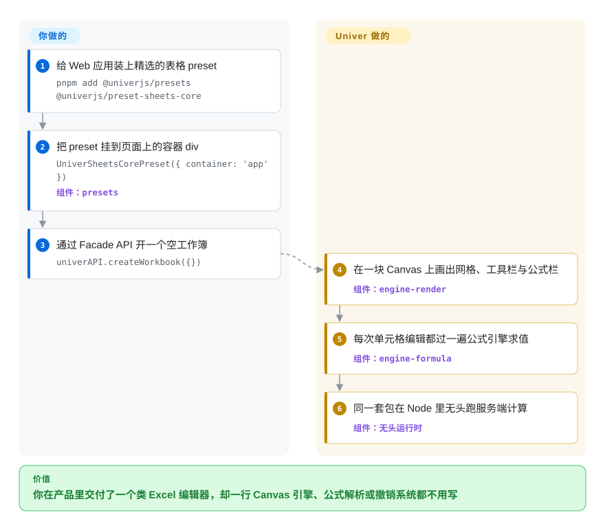

# Univer

你的 SaaS 需要在自己页面里放一个类 Excel 的编辑界面——工具栏你说了算、公式栏是那个公式栏、主题跟你的产品走——而授权文档服务器或手搓 Canvas 网格都超预算。Univer 就是把难点（Canvas 渲染器、公式引擎、命令/撤销体系、表格与文档模型）做成可组合插件的嵌入式 SDK，让你*拼装*编辑器而不是造它的引擎。

## 何时使用

你在做一个 BI 工具、内部运维台或 AI-agent 产品，需求是*在自己 UI 里编辑*，不是「iframe 打开一个文档服务器」。选 Univer，因为它是本分类里唯一活跃维护、且把编辑器当框架来卖的 Apache-2.0 选项：公式、数字格式、选区、评论都是可注册／可替换／可懒加载的插件，一套 Facade API（`FUniver` → `FWorkbook` → `FRange`）驱动同一份文档模型——浏览器里渲染是它，Node.js **无头**跑还是它，「agent 改表、人在同一运行时里审」因此是一个技术栈的故事而不是两个。对比 [Fortune Sheets](fortune-sheets.zh.md)：它是同一团队对 Luckysheet 的 TS 重写后继，有真正的公式引擎；对比 [ONLYOFFICE Docs](onlyoffice-documentserver.zh.md)：你放弃内置协同与 .docx 保真，换来完全属于你的 UI。Sheets 是成熟产品线，Docs 可用，Slides/Bases 在 README 里明写仍在开发（2026-09）。

## 快问快答

**问：这个领域不该有 1-3 个强有力的竞品吗？**
答：应该有，但按轴拆开就散了：最直接的同轴对手 Luckysheet（17k stars）已被同团队升级为 Univer 并归档，README 明写「生产环境请用 Univer」（2026-09-27 核实）。放宽一个轴才有强手——要成品协同 Office 是 ONLYOFFICE/Collabora，要表格×数据库成品是 Grist，要纯数据网格是 Handsontable/Jspreadsheet。精确交点（Apache-2.0 + 表格/文档 + 浏览器/Node 同构 + agent 工作流）目前几乎无人。

## 怎么用起来

把它想成发动机套件而非成品：Univer 用一块 `<canvas>` 画一切（自带 `engine-render`），文档状态放在命令驱动模型里（撤销/重做与协同 changeset 因此是一等公民），公式由自家依赖图引擎求值——这些你都不用写。你要做的是：选 preset（或逐个组合插件）、挂到容器 div 上、通过 Facade API 指挥它；完全不要 UI 时，同一套包在 Node 里跑服务端计算与自动化。协同、xlsx 导入导出、打印**不在**这些开源包里——它们在单独授权的 `@univerjs-pro/*` 商业层，README 把这条边界写得很明白。

<!-- flow-steps:begin (generated from flows/univer.json by tools/flow_card.py — do not edit) -->

流程文字版

1. **你**：给 Web 应用装上精选的表格 preset — `pnpm add @univerjs/presets @univerjs/preset-sheets-core`
2. **你**：把 preset 挂到页面上的容器 div — `UniverSheetsCorePreset({ container: 'app' })` — 组件：`presets`
3. **你**：通过 Facade API 开一个空工作簿 — `univerAPI.createWorkbook({})`
4. **Univer**：在一块 Canvas 上画出网格、工具栏与公式栏 — 组件：`engine-render`
5. **Univer**：每次单元格编辑都过一遍公式引擎求值 — 组件：`engine-formula`
6. **Univer**：同一套包在 Node 里无头跑服务端计算 — 组件：`无头运行时`

**价值**：你在产品里交付了一个类 Excel 编辑器，却一行 Canvas 引擎、公式解析或撤销系统都不用写

<!-- flow-steps:end -->

## 何时不用

- **你要的是开源核心里的实时协同** → 没有：协同、编辑历史、导入导出、图表、透视表、服务端计算在 README 自己的 OSS-vs-Pro 对照表里都列在 Univer Pro。要无授权费的协同编辑，自托管 [ONLYOFFICE Docs](onlyoffice-documentserver.zh.md) 或 [Collabora Online](collabora-online.zh.md)。
- **用户活在不能丢格式的 .docx/.xlsx 里** → Univer 快照模型是自己的，字节级 OOXML 往返是文档服务器的活（且 Univer 连导入导出都放 Pro）。用 [ONLYOFFICE Docs](onlyoffice-documentserver.zh.md)，或验证一条 [python-docx](../office-automation/python-docx.zh.md)/[XlsxWriter](../office-automation/xlsxwriter.zh.md) 管线。
- **你只需要一张可编辑表格，不需要表格应用** → 整套渲染+公式栈对表单网格太重。用 [Handsontable](handsontable.zh.md)（许可算得过来时）或 [Jspreadsheet](jspreadsheet.zh.md)——几分钟挂起一张网格。
- **你在生成报表而不是编辑报表** → 没有人机界面；agent 用 [OfficeCLI](../office-automation/officecli.zh.md) 或 [XlsxWriter](../office-automation/xlsxwriter.zh.md) 写 xlsx，包体小一个量级。
- **你要低投入的成品工作区** → Univer 给的是积木，鉴权、存储、分享、评论策略都是你的活。要成品就跑 [Grist](grist.zh.md)，或 [Univer Workspace](https://github.com/dream-num/univer-workspace)（`未收录`——官方另一仓库，本批有意不展开）。
- **决策关键在 Slides/Bases/PDF** → README 标注 Slides「开发中」、Bases 以 Pro 为主、PDF「即将推出」（2026-09）。只有 Sheets 优先的产品适合。
- **对单一厂商路线图风险零容忍** → 前三贡献者占 5,809 次提交约 41%，版权归 DreamNum Co., Ltd.（2026-09-27 API 核实）。OSS/Pro 的线怎么画，只有这家公司说了算；[Grist](grist.zh.md) 的 Apache 核心有多方贡献（含法国政府团队）。

## 横向对比

| 替代品 | 是否收录 | 我们的评价 | 取舍 |
| --- | --- | --- | --- |
| [Fortune Sheets](fortune-sheets.zh.md) | ✅ | 任何新的嵌入式表格选 Univer——它是同一条维护中的后继线（与 Luckysheet 同团队，Fortune 的上游），有真公式引擎与 Node 无头；只有当 MIT 许可（相对 Apache-2.0 的专利授权，通常无所谓）或 Luckysheet 兼容 JSON 成为决定项时才选 Fortune，因为它的默认分支自 2025-11-06 无提交。 | Univer 换来引擎深度与活跃的 1.0 发布线；Fortune 换来零配置即插即用，代价是停更的仓库与需要另装的 xlsx 读写。 |
| [Handsontable](handsontable.zh.md) | ✅ | 交付物是一张表格*应用*（大表 Canvas 性能、公式栏、文档模块、agent API）、且 Apache-2.0 是硬条件时选 Univer；只需要表单里一张录入网格、愿为 15 年 DOM 网格成熟度付费时选 Handsontable。 | Univer：整套编辑器 Kit、许可免费、代码库更年轻。Handsontable：网格交互成熟，但商用要买授权。 |
| [ONLYOFFICE Docs](onlyoffice-documentserver.zh.md) | ✅ | 编辑器必须融化进你自己的 UI 与数据流时选 Univer；「点文件→熟悉的完整 Office 编辑器带协同」本身就是需求时选 ONLYOFFICE——在 Univer 里复刻它意味着买 Pro 或自写服务端。 | Univer = 白牌 SDK，OSS 核心不含协同；ONLYOFFICE = 固定但完整的编辑器，AGPL，存储归你。 |
| [Grist](grist.zh.md) | ✅ | 团队今天要一个能用的结构化数据成品（类型化列、Python 公式、行级权限、webhook）选 Grist；*你*在出货一个产品、没有可嵌入的 Grist 外壳这回事时选 Univer。 | Grist 以运维成本给成品应用；Univer 以工程成本给你造应用的零件。 |
| Luckysheet | `未收录` | 当路标不当选项：被自家团队归档，README 直接指向 Univer（「不再维护……推荐用 Univer」）；新项目别碰。dream-num/Luckysheet 有意跳过，属「后继已收录」情形。 | 它的 17k stars 是遗留人气不是维护信号；你原本想要的一切都进了 Univer 的 TS 重写。 |

## 技术栈

TypeScript monorepo（`@univerjs/*`，pnpm + Turbo + Vitest）。渲染是自研 Canvas 引擎（`engine-render`）不是 DOM 网格；公式在 `engine-formula`，配数字格式与计算 worker 路径。UI 层基于 React 18（README 称另有 Vue 与 Web Components 适配），主题/深色模式内建，按包发 locale。分发双模式：plugin mode（逐包组合）与 preset mode（`@univerjs/presets` + `preset-sheets-core` 等），Facade API 入口（`FUniver`），另有带 Web Worker/RPC 模式的无头 Node 运行时。浏览器目标 Chrome 88+，依赖 `Intl.Segmenter`（可打 polyfill）。[推断] Slides/Bases 包存在但按 README 自己的能力表尚未成熟。

## 依赖

浏览器侧：支持 package `exports` 的打包器（Vite/esbuild/Webpack 5）加一个容器元素——单人编辑不需要后端（持久化是你代码的活，走快照）。无头/Node：Node ≥18.17。只有跨过商业边界才有新活动件：协同服务器、导入导出服务、Pro 服务端特性，都是带独立授权的 `@univerjs-pro/*` 包。无数据库、无 JVM、无原生插件。

## 运维难度

**中等。** 作为 npm SDK，成本在包体积与版本对齐：README 要求所有 `@univerjs/*` 保持同一条协调发布线，而 1.x 线才开始（v1.0.0 于 2026-09-24 发布，当天就连发三个补丁——节奏很快）。Day-2 成本集中在自写插件（你得继承它的 command/service/DI 约定），以及那条 OSS 边界：事后发现某个能力在 Pro（图表、透视、导入导出、协同），要么改设计要么掏钱，不是一个开关。不装 Pro 就没有服务器要养。

## 健康度与可持续性

- **维护：当下极其活跃。** v1.0.0–v1.0.2 全部发布于 2026-09-24；2026-09-27 仍有推送；5,809 次提交。发布线年龄在校验当天是*三天*——年轻的是版本号不是仓库。
- **治理：单一厂商、org 所有。** 版权归 DreamNum Co., Ltd.；前三贡献者（jikkai 1,177／DR-Univer 624／wzhudev 574）占约 41% 提交（2026-09-27 API 核实）。团队宽度健康，但路线图和 OSS/Pro 分界归一家公司。
- **背书与寿命** ——创建于 2022-09-29（约 4 年），且带着真实血统：Univer 是 Luckysheet（2020 年，17k stars，现已被*同团队*归档）的 TS 重写，前身用户盘是采纳通道不只是历史。Lindy：4 年活跃 < ONLYOFFICE（2014）/Handsontable（2011），相应打折。[推断]
- **采纳：有测量、量级可观。** 健康雷达记录的 npm 月下载为 1,538,478（canonical 包解析到 `@univerjs/protocol`；旗舰包 `@univerjs/core` 同日直读为 1,898,528）——与 Handsontable 同量级、远在 Fortune Sheets 与 Jspreadsheet 之上；19.9k stars，106 个未关 issue。
- **风险信号** ——开放核心闸门是结构性的、厂商说了算（协同/导入导出/图表/透视 = Pro）；Slides/Bases/PDF 是路线图不是产品；1.0 过渡刚发生，API 稳定性承诺（仓库里有 API_STABILITY.md 政策）还没经过一次大版本战的检验。

## 存疑（未验证）

- [未验证] OSS 核心单独能否撑起一个生产级表格产品——Pro 的功能切线读自 README 营销表，未跑评估租户，按功能的包可用性与授权未实测。
- [未验证] 公式引擎对 Excel 的覆盖度/正确性——仓库树里有 `tests/formula-integration`，但其对 Excel 语义的通过率未在此执行。
- [未验证] Canvas 性能主张（「让复杂工作簿保持流畅」）在真实大表上的表现——厂商口径；仓库内基准未复现。
- [推断] 前三约 41% 提交占比基于 contributors API 按作者计数近似提交归属；GitHub 计数与 `git log` 在 rebase 历史上可能有出入。
- [未验证] Univer Workspace（dream-num/univer-workspace）未在本批审查——仅引自主仓库 README；有意保持 `未收录`。
- [推断] 「Slides/Bases 在开发中、PDF 即将推出」反映 2026-09-27 的 README 状态措辞，任何一次发布都可能改变。
