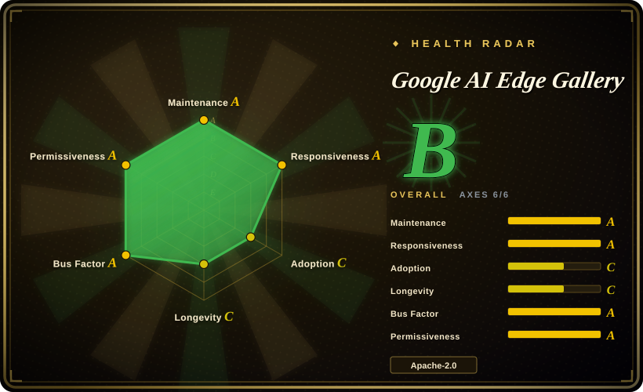
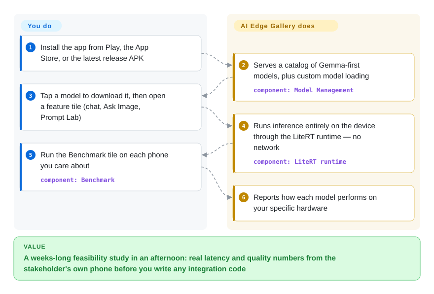

# Google AI Edge Gallery

Someone asked whether an on-device LLM feature is viable on the phones your users actually carry, and building a throwaway integration to find out costs weeks. Google AI Edge Gallery is a store app that runs open LLMs (Gemma-first) entirely on the phone's own hardware — chat, camera Q&A, transcription, prompt testing and a per-device benchmark — so you can put latency and quality evidence in a stakeholder's hand the same afternoon. It is a *runnable demo and evaluation harness*, not a library you embed.

## When to use

You're a mobile PM or applied-ML engineer who has been told "we want an on-device LLM feature — figure out if it's actually viable on the phones our users carry." Before you commit engineering weeks to a custom integration, you want to *feel* what a 1–4B model does on real hardware: how fast it decodes, whether Ask Image-style multimodal is good enough, how a "thinking mode" reasoning trace looks, and what happens to latency and battery on a mid-tier Android device versus your test iPhone. You don't want to build any of that plumbing yet — you want to put a working app in a stakeholder's hand this afternoon.

So you install Google AI Edge Gallery from the Play Store / App Store (or sideload the APK / build it from source), download a Gemma model from the bundled Hugging Face LiteRT Community list, and start poking: run Prompt Lab to sweep temperature/top-k, try Audio Scribe for on-device transcription, wire an Agent Skill through MCP to call a tool, and read the Benchmark numbers (tokens/sec, time-to-first-token) straight off the device. It's the fastest way to *de-risk the decision* and capture concrete latency/quality evidence — and because the same LiteRT runtime underlies the production SDKs, what you observe here roughly predicts what a real integration would feel like.

## How it works

You install and use the Gallery as a consumer app — there is nothing to import. You tap a store badge (Google Play, App Store, a macOS DMG, or the APK on the latest GitHub release), pick a model from the in-app catalog or load your own custom one, and the packaged **LiteRT runtime** — the lightweight inference engine that is TensorFlow Lite's successor — loads it into memory and decodes it entirely on the device, with no network required for inference. The feature tiles (AI Chat with a toggleable thinking-reasoning trace, Ask Image camera Q&A, Audio Scribe transcription, Prompt Lab parameter sweeps, Agent Skills that wire in MCP-style tools, experimental Mobile Actions/Tiny Garden) are thin surfaces over that same on-device engine; the Benchmark tile drives the engine repeatedly to tell you how each model performs *on your specific hardware*. What stays yours: judging whether the measured latency/quality/battery is good enough — and if you decide to ship, doing the real integration with LiteRT-LM or MediaPipe, because the Gallery is the demo, not the dependency.

<!-- flow-steps:begin (generated from flows/ai-edge-gallery.json by tools/flow_card.py — do not edit) -->

Text version of the flow

1. **You**: Install the app from Play, the App Store, or the latest release APK
2. **Google AI Edge Gallery**: Serves a catalog of Gemma-first models, plus custom model loading — component: `Model Management`
3. **You**: Tap a model to download it, then open a feature tile (chat, Ask Image, Prompt Lab)
4. **Google AI Edge Gallery**: Runs inference entirely on the device through the LiteRT runtime — no network — component: `LiteRT runtime`
5. **You**: Run the Benchmark tile on each phone you care about — component: `Benchmark`
6. **Google AI Edge Gallery**: Reports how each model performs on your specific hardware

**Value**: A weeks-long feasibility study in an afternoon: real latency and quality numbers from the stakeholder's own phone before you write any integration code

<!-- flow-steps:end -->

## When NOT to use

- **It is not an SDK or library — you cannot `import` it.** If you need to embed on-device inference into *your* app, this is the showcase, not the dependency. Reach for [LiteRT-LM](litert-lm.md) (the C++/Kotlin runtime layer) or the MediaPipe LLM Inference API instead; the Gallery is the demo that sits on top of those.
- **Not a model or a runtime you ship.** It's an application binary (Kotlin/Gradle, Apache-2.0). You don't get a reusable inference engine out of it — copying its UI is rebuilding an app, not adopting a library.
- **Heavily Gemma-centric.** The optimized, one-tap catalog is Gemma-family-first; arbitrary Hugging Face architectures or Qwen/Mistral/Phi as first-class citizens are not the design center. For broad model coverage you'd evaluate llama.cpp or MLX.
- **Not for production-grade throughput.** On-device generation on phones is far slower than cloud APIs; multi-minute generations and large contexts are demo-grade, and behavior degrades on memory-constrained devices.
- **Fast-moving, app-store-gated.** It ships on a rapid app cadence (v1.0.16 on 2026-06-23 → v1.0.19 on 2026-09-02, GitHub releases API) and features are explicitly "experimental" (the README calls the whole thing an "experimental Beta release"; Mobile Actions, Tiny Garden, speculative decoding, NPU/TPU paths); what you benchmark today may move, and platform availability (iOS/macOS) is newer than Android — the macOS build the README links is still versioned `0.1.0`.
- **Closed catalog assumptions.** Models flow through Google's Hugging Face LiteRT Community and LiteRT packaging; importing a truly arbitrary GGUF/ONNX model is not the happy path.

## Comparison

| Alternative | In index | Our verdict | Tradeoff |
|---|---|---|---|
| [LiteRT-LM](litert-lm.md) | ✅ | Once evaluation says "ship it", pick LiteRT-LM to actually embed on-device inference in your own app; pick the Gallery only while you still need feasibility evidence — you cannot import an app. | The actual on-device **runtime layer** (C++/Kotlin bindings) the Gallery demos. Choose it to *build* an app; choose the Gallery to *evaluate* before you build. |
| [BitNet](bitnet.md) | ✅ | When your target is 1-bit/ternary LLMs squeezed onto CPUs, pick BitNet; pick the Gallery when you want a turnkey phone demo of mainstream Gemma quantizations, because BitNet is a research framework with a far narrower model set and nothing to hand a stakeholder. | A research **inference framework** for 1-bit/ternary LLMs (extreme CPU efficiency), not a polished demo app — different layer and far narrower model set. |
| [TimesFM](timesfm.md) | ✅ | Choose TimesFM when your task is time-series forecasting, not LLM chat demos. | A time-series **foundation model**, not an LLM chat showcase — adjacent on-device ML but a different task entirely. |
| Ollama | 未收录 | Choose Ollama when you need a desktop/server local-LLM runner with a GGUF catalog and API. | Desktop/server local-LLM runner with a huge GGUF catalog and an API; great on laptops/servers but not a mobile/Android-first on-device showcase. |
| LM Studio | 未收录 | Choose LM Studio when you need a polished desktop GUI for local LLMs. | Polished desktop GUI for running local LLMs (closed-source app); broader model picker, but desktop-only and not mobile on-device. |
| MediaPipe LLM Inference Studio (Google) | 未收录 | Choose MediaPipe LLM Inference Studio when you need the older same-org demo/tooling path. | The older same-org demo/tooling path for on-device LLMs; overlapping intent, superseded in direction by the LiteRT-based Gallery. |

## Tech stack

- **App:** Kotlin (~92% of repo) on Android (Jetpack/Compose-style UI); iOS and macOS builds also shipped.
- **Inference:** LiteRT (the TensorFlow Lite successor) + Google AI Edge on-device APIs; optional GPU and vendor NPU/TPU paths (Qualcomm NPU, Pixel TPU mentioned for specific models).
- **Models:** Gemma family first-class, downloaded from the Hugging Face LiteRT Community; custom litert-lm model import supported.
- **Agent layer:** Model Context Protocol (MCP) tools / modular "Agent Skills"; experimental speculative decoding and Multi-Token Prediction.
- **Build:** Gradle (Android toolchain).

## Dependencies

- **A real device** to be useful: Android 12+, iOS 17+, or macOS; a phone with enough RAM (small-model on-device LLMs commonly want several GB free).
- **A model file** downloaded in-app from the Hugging Face LiteRT Community (network needed once to fetch; inference itself is offline).
- **To build from source:** the Android SDK + Gradle toolchain (see DEVELOPMENT.md); no Bazel needed for the app itself, unlike the underlying runtime.
- **Optional accelerators:** GPU / Qualcomm NPU / Pixel TPU drivers for the hardware-accelerated paths on supported devices.

## Ops difficulty

**Low to consume, N/A to operate.** As an end-user app there's nothing to deploy or run as a service — install from a store or sideload the APK and you're benchmarking in minutes; that's the whole point. "Difficulty" only appears if you (a) build from source, which is a standard Gradle Android build, or (b) try to read it as production architecture — at which point you're really evaluating LiteRT-LM / MediaPipe, where the on-device ops burden (RAM gating, GPU-init/CPU-fallback, KV-cache session limits) actually lives. There is no server, no scaling story, no uptime to maintain.

## Health & viability

- **Responsiveness**: Grade A — median first-response time 37.2 hours across 40 qualifying issues/PRs.
- **Maintenance (as of 2026-09):** last commit 2 days before 2026-09-28, active in all of the last 13 weeks, latest release v1.0.19 (2026-09-02, GitHub releases API) on a very rapid app cadence (v1.0.16 → v1.0.19 in the ten weeks to 2026-09-02) — **very actively maintained**, but fast enough that features churn release-to-release and several are flagged "experimental."
- **Governance / backing:** organization-owned under `google-ai-edge` and **Google-maintained** — strong backing and resourcing for the underlying LiteRT stack. [推断] Caveat: Google has a track record of sunsetting consumer-facing demo apps, so the *showcase* may be deprioritized even if the runtime endures; this is a showcase on top of the SDKs, not the SDK itself.
- **Age & Lindy verdict (created 2025-03, ~1.5 yr):** young and riding the on-device-LLM wave — **Lindy-unproven** as a standalone app. But its purpose (de-risk an on-device decision *now*) doesn't require longevity, and it sits on the more durable LiteRT/Google AI Edge runtime, which is the part worth betting on long-term.
- **Risk flags:** app-store-gated distribution and a Gemma-centric, closed-ish catalog (models via Google's Hugging Face LiteRT Community); experimental features may change or be removed. Apache-2.0, no relicense/open-core concern. [推断]

## Caveats (unverified)

- [未验证] ~24.8k stars is from the GitHub API on 2026-09-28; star counts drift continuously — treat as indicative only.
- [未验证] iOS 17+ and macOS support are stated in the README (Android 12+ as the floor); their maturity relative to the Android build was not independently confirmed — notably the macOS DMG the README links is still versioned `0.1.0` (observed 2026-09-28).
- [推断] The precise list of first-class vs nominally-supported models shifts release-to-release; the README currently headlines the Gemma 4 family ("Now Featuring: Gemma 4") as the centerpiece.
- [未验证] On-device throughput, RAM requirements and battery impact vary widely by device/model/quantization; no first-party per-device numbers were verified here.
- [推断] Experimental features (Mobile Actions, Tiny Garden, speculative decoding, NPU/TPU execution, MCP/Agent Skills) are labeled experimental (the README calls the release "experimental Beta") and may change or be removed across the fast app cadence.
