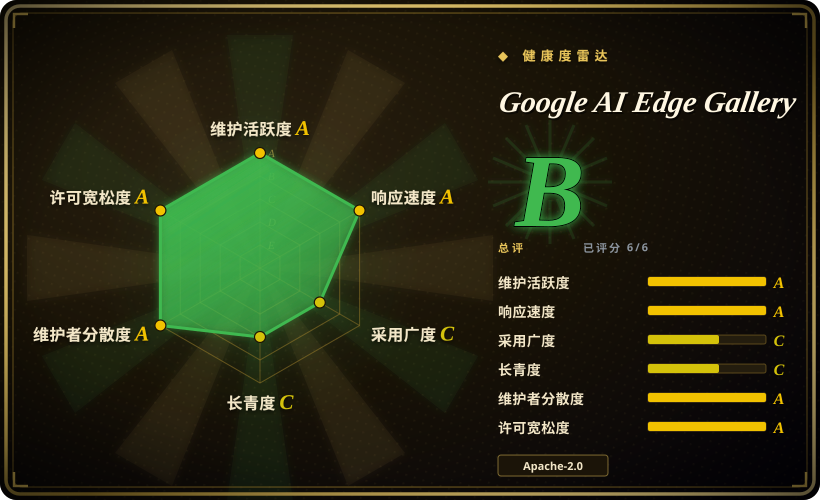
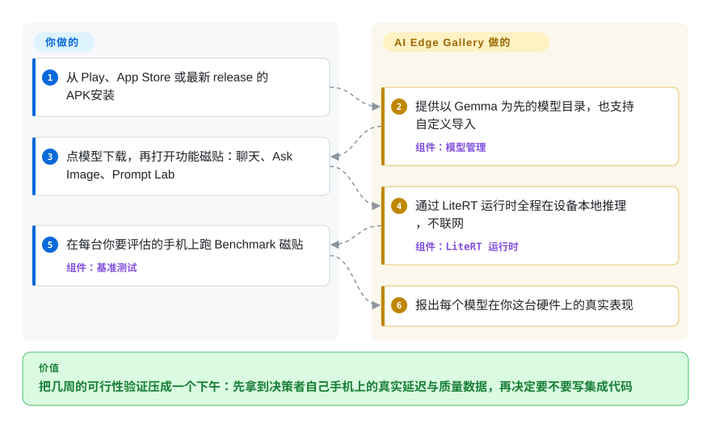

# Google AI Edge Gallery

有人问你：端侧 LLM 功能在用户实际用的那些手机上到底行不行？为验证它写一次性的集成要花好几周。Google AI Edge Gallery 是个商店里就能装的 App，把开源 LLM（以 Gemma 为先）完全跑在手机本地硬件上——聊天、拍照问答、转写、提示词测试，外加逐设备的基准——让你当天下午就把延迟和质量证据塞进决策者手里。它是一个*可运行的 demo 和评估工具*，不是一个供你嵌入的库。

## 何时使用

你是一名移动端 PM 或应用 ML 工程师，被要求“评估一下端侧 LLM 功能在我们用户实际用的那些手机上到底可不可行”。在投入数周工程做自定义集成之前，你想先*亲手感受*一个 1–4B 模型在真实硬件上的表现：解码有多快、Ask Image 这类多模态够不够用、"thinking mode" 的推理轨迹长什么样、在中端 Android 机和你的测试 iPhone 上延迟和耗电分别如何。你现在还不想搭任何底层管道——你想今天下午就把一个能跑的 App 塞进决策者手里。

于是你从应用商店（Play Store / App Store）安装 Google AI Edge Gallery，或者侧载 APK、从源码构建，从内置的 Hugging Face LiteRT Community 列表里下载一个 Gemma 模型，然后开始试：用 Prompt Lab 扫 temperature/top-k，用 Audio Scribe 做端侧转写，通过 MCP 接一个 Agent Skill 去调工具，再直接从设备上读 Benchmark 数据（tokens/秒、首字时延）。这是*给决策去风险*、拿到具体延迟/质量证据的最快方式——而且因为生产 SDK 底层用的是同一套 LiteRT 运行时，你在这里观察到的表现大致能预测真正集成后的手感。

## 怎么用起来

你像普通用户一样安装和使用 Gallery——它没有任何可供 `import` 的东西。你点商店入口（Google Play、App Store、macOS DMG，或 GitHub 最新 release 上的 APK），在应用内目录里挑一个模型下载，或导入自己的自定义模型；打包好的 **LiteRT 运行时**（TensorFlow Lite 的继任者，一个轻量推理引擎）把模型加载进内存，全程在手机本地解码，推理不需要网络。各功能磁贴（带思考轨迹开关的 AI Chat、拍照问答的 Ask Image、转写的 Audio Scribe、扫参数的 Prompt Lab、挂 MCP 式工具的 Agent Skills、实验性的 Mobile Actions/Tiny Garden）都是同一个端侧引擎之上的薄界面；Benchmark 磁贴反复驱动引擎，告诉你每个模型*在你这台硬件上*的表现。留在你这边的：判断量到的延迟/质量/耗电够不够用——以及决定要上线后，用 LiteRT-LM 或 MediaPipe 去做真正的集成，因为 Gallery 是展示品，不是依赖。

<!-- flow-steps:begin (generated from flows/ai-edge-gallery.json by tools/flow_card.py — do not edit) -->

流程文字版

1. **你**：从 Play、App Store 或最新 release 的 APK 安装
2. **Google AI Edge Gallery**：提供以 Gemma 为先的模型目录，也支持自定义导入 — 组件：`模型管理`
3. **你**：点模型下载，再打开功能磁贴：聊天、Ask Image、Prompt Lab
4. **Google AI Edge Gallery**：通过 LiteRT 运行时全程在设备本地推理，不联网 — 组件：`LiteRT 运行时`
5. **你**：在每台你要评估的手机上跑 Benchmark 磁贴 — 组件：`基准测试`
6. **Google AI Edge Gallery**：报出每个模型在你这台硬件上的真实表现

**价值**：把几周的可行性验证压成一个下午：先拿到决策者自己手机上的真实延迟与质量数据，再决定要不要写集成代码

<!-- flow-steps:end -->

## 何时不用

- **它不是 SDK 或库——你无法 `import` 它。** 如果你要把端侧推理嵌进*你自己的* App，这是展示品而不是依赖。请改用 [LiteRT-LM](litert-lm.zh.md)（C++/Kotlin 运行时层）或 MediaPipe LLM Inference API；Gallery 是架在它们之上的 demo。
- **它不是模型，也不是你能拿去发布的运行时。** 它是一个应用二进制（Kotlin/Gradle，Apache-2.0）。你拿不到可复用的推理引擎，照搬它的 UI 等于重写一个 App，而不是引入一个库。
- **高度以 Gemma 为中心。** 经过优化、一键即用的模型目录以 Gemma 系为先；任意 Hugging Face 架构、或把 Qwen/Mistral/Phi 当一等公民，并不是它的设计中心。要广覆盖应去评估 llama.cpp 或 MLX。
- **不适合生产级吞吐。** 手机上的端侧生成远慢于云端 API；数分钟级的长生成和大上下文只是 demo 级，在内存受限设备上行为会退化。
- **快速迭代、受应用商店节奏约束。** 它以很快的应用节奏更新（v1.0.16 发布于 2026-06-23 → v1.0.19 发布于 2026-09-02，GitHub releases API），且不少功能明确标注“实验性”（README 自称整个发布是“experimental Beta release”；Mobile Actions、Tiny Garden、推测解码、NPU/TPU 路径皆然）；今天你测的东西可能改变，平台可用性（iOS/macOS）也比 Android 更新——README 链接的 macOS 构建版本号仍是 `0.1.0`。
- **封闭目录的隐含前提。** 模型走的是 Google 的 Hugging Face LiteRT Community 和 LiteRT 打包流程；导入真正任意的 GGUF/ONNX 模型不是 happy path。

## 横向对比

| 替代品 | 是否收录 | 我们的评价 | 取舍 |
|---|---|---|---|
| [LiteRT-LM](litert-lm.zh.md) | ✅ | 评估结论是“可以上线”之后，要真正把端侧推理嵌进你自己的 App，选 LiteRT-LM；只有在还需要可行性证据时才选 Gallery——App 是没法 import 的。 | Gallery 所展示的真正端侧**运行时层**（C++/Kotlin 绑定）。要*构建* App 选它；要在构建前*评估*选 Gallery。 |
| [BitNet](bitnet.zh.md) | ✅ | 当目标是把 1-bit/三值模型塞进纯 CPU 时，选 BitNet；当你想要一个开箱即用、在手机上演示主流 Gemma 量化模型的 App 时，选 Gallery——BitNet 是研究框架，模型集窄得多，也没有能递到决策者手里的东西。 | 面向 1-bit/三值 LLM 的研究型**推理框架**（极致 CPU 效率），不是打磨过的 demo App——所处层次不同、模型集窄得多。 |
| [TimesFM](timesfm.zh.md) | ✅ | 任务是时间序列预测而不是 LLM 聊天展示时，选 TimesFM。 | 一个时间序列**基础模型**，不是 LLM 聊天展示——同属端侧 ML 但任务完全不同。 |
| Ollama | 未收录 | 需要桌面/服务器本地 LLM 运行器、GGUF 目录和 API 时，选 Ollama。 | 桌面/服务器本地 LLM 运行器，GGUF 目录巨大且带 API；在笔记本/服务器上很棒，但不是移动/Android 优先的端侧展示。 |
| LM Studio | 未收录 | 需要打磨精良的桌面本地 LLM GUI 时，选 LM Studio。 | 打磨精良的桌面 GUI 本地 LLM（闭源 App）；模型选择更广，但仅桌面、非移动端侧。 |
| MediaPipe LLM Inference Studio(Google) | 未收录 | 需要同一团队更早的端侧 LLM demo/工具路径时，选 MediaPipe LLM Inference Studio。 | 同一团队更早的端侧 LLM demo/工具路径；意图重叠，方向上已被基于 LiteRT 的 Gallery 取代。 |

## 技术栈

- **App:** Kotlin（占仓库约 92%），Android（Jetpack/Compose 风格 UI）；同时也发布 iOS 与 macOS 版本。
- **推理：** LiteRT（TensorFlow Lite 的继任者）+ Google AI Edge 端侧 API；可选 GPU 及厂商 NPU/TPU 路径（对特定模型提到 Qualcomm NPU、Pixel TPU）。
- **模型：** Gemma 系一等公民，从 Hugging Face LiteRT Community 下载；支持导入自定义 litert-lm 模型。
- **Agent 层：** Model Context Protocol（MCP）工具 / 模块化 "Agent Skills"；实验性的推测解码与 Multi-Token Prediction。
- **构建：** Gradle（Android 工具链）。

## 依赖

- **一台真实设备**才有意义：Android 12+、iOS 17+ 或 macOS；手机需足够 RAM（小模型端侧 LLM 通常要数 GB 空闲内存）。
- **一个模型文件**，在 App 内从 Hugging Face LiteRT Community 下载（首次需联网拉取；推理本身离线）。
- **从源码构建时：** Android SDK + Gradle 工具链（见 DEVELOPMENT.md）；App 本身不需要 Bazel，这点与底层运行时不同。
- **可选加速器：** 在支持的设备上，GPU / Qualcomm NPU / Pixel TPU 驱动以走硬件加速路径。

## 运维难度

**消费极低，运维不适用。** 作为终端用户 App，没有任何东西需要部署或作为服务运行——从商店安装或侧载 APK，几分钟内就能开始跑基准，这正是它的意义。只有当你（a）从源码构建（就是一次标准的 Gradle Android 构建）、或（b）把它当成生产架构来读时，“难度”才出现——而后者你其实是在评估 LiteRT-LM / MediaPipe，真正的端侧运维负担（RAM 分档、GPU 初始化/CPU 回退、KV 缓存会话上限）在那里。这里没有服务器、没有扩容问题、没有需要维护的可用性。

## 健康度与可持续性

- **响应速度**：Grade A——中位首次响应时间 37.2 小时，基于 40 个 qualifying issues/PRs。
- **维护（截至 2026-09）：** 最后一次提交距 2026-09-28 仅 2 天，近 13 周全部活跃，最新发布 v1.0.19（2026-09-02，GitHub releases API），应用节奏极快（v1.0.16 → v1.0.19 共十周）——**维护非常活跃**，但快到功能逐版本变动、其中若干被标注「实验性」。
- **治理 / 背书：** 由 `google-ai-edge` 这个组织持有，**Google 维护**——底层 LiteRT 栈有强力背书与资源。[推断] 但要留意：Google 有关停面向消费者的 demo App 的历史，所以即便运行时长存，这个*展示品*也可能被降优先级；它是架在 SDK 之上的展示，而非 SDK 本身。
- **年龄与 Lindy 判定（创建于 2025-03，约 1.5 年）：** 年轻，正搭着端侧 LLM 的浪潮——作为独立 App 而言 **Lindy 上未经证明**。但它的用途（*当下*给端侧决策去风险）并不需要长寿，且它坐落在更耐久的 LiteRT/Google AI Edge 运行时上，那才是值得长期押注的部分。
- **风险标记：** 受应用商店约束的分发，以及以 Gemma 为中心、偏封闭的目录（模型走 Google 的 Hugging Face LiteRT Community）；实验性功能可能变更或移除。Apache-2.0，无 relicense / 开放核心顾虑。[推断]

## 存疑（未验证）

- [未验证] 约 24.8k star 来自 2026-09-28 的 GitHub API；star 数持续漂移——仅供参考。
- [未验证] iOS 17+ 与 macOS 支持（下限 Android 12+）见于 README；相对 Android 版本的成熟度未经独立确认——值得注意的是 README 链接的 macOS DMG 版本号仍是 `0.1.0`（2026-09-28 观察）。
- [推断] 一等公民模型与仅名义支持模型的确切清单会随版本变化；README 当前以 Gemma 4 家族为主打（“Now Featuring: Gemma 4”）。
- [未验证] 端侧吞吐、RAM 需求与耗电因设备/模型/量化差异很大；此处未核实任何第一方逐设备数字。
- [推断] 实验性功能（Mobile Actions、Tiny Garden、推测解码、NPU/TPU 执行、MCP/Agent Skills）被标注为实验性（README 自称“experimental Beta”），可能在快速应用迭代中变更或移除。
