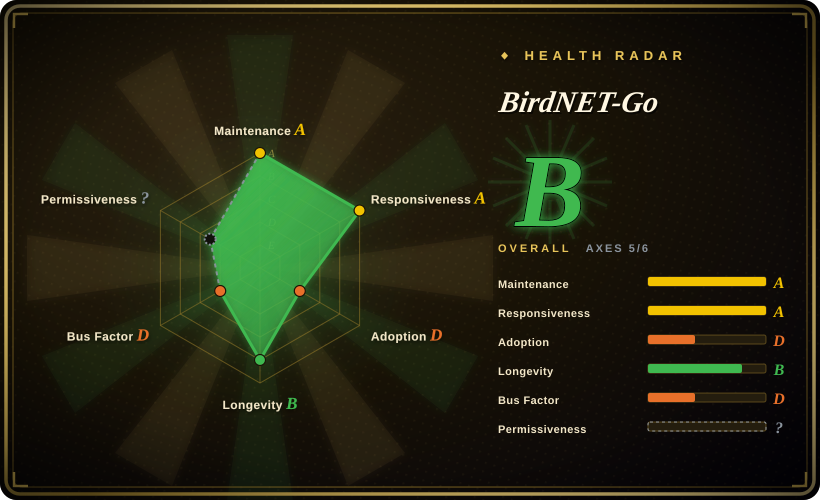
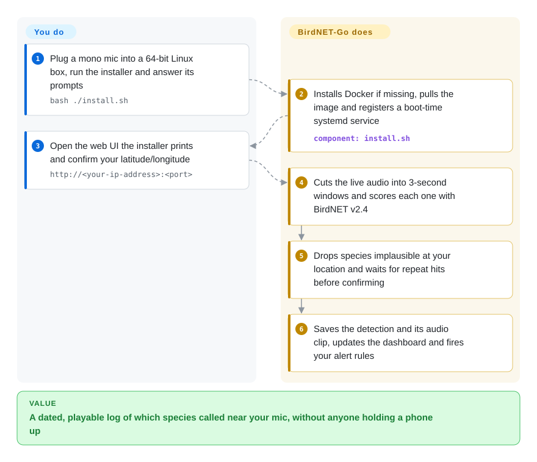

# BirdNET-Go

You hear birds outside every morning and cannot name them, and a phone app only listens while you stand there holding it up. BirdNET-Go leaves a small computer and a microphone listening around the clock and writes down every species it recognizes, with a playable clip, on a web page served from your own network.

## When to use

You have a Raspberry Pi 4 or 5 (or a spare mini PC) and a garden, a balcony feeder, or a field site, and you want to know what calls there when nobody is listening — the owl at 03:10, the first swift of the year. The picture you want is a line like `04:52 Eurasian Blackbird 0.83` with the three seconds of audio attached, every day, without touching anything. You plug in a mono USB microphone (or point it at the audio track of an RTSP camera you already own), run one installer, and from then on the box classifies sound locally and keeps a searchable history, charts, and optional pushes to Home Assistant, Telegram, ntfy or BirdWeather.

Pick it over **BirdNET-Pi** when you are not on a Raspberry Pi image you are willing to dedicate, or you want more than one microphone or model: BirdNET-Go ships as a container and as binaries for Linux, Windows and macOS, takes several sound cards and RTSP streams at once, and can run Google Perch v2 or regional bat classifiers next to BirdNET v2.4 and merge their votes. Pick it over **BirdNET-Analyzer** when the job is a live station rather than a folder of recordings: the Analyzer is the upstream batch tool for scientific audio files, with no always-on capture, dashboard or alerts. The price of choosing BirdNET-Go is its licence (non-commercial) and its pace (the default install follows a nightly build from one maintainer) — both are spelled out below.

## How it works

Think of it as a night watchman with a field guide: it never stops listening, and each time it is fairly sure it writes a line in the log book. Concretely, the program keeps the last few seconds of microphone audio in memory, cuts it into overlapping 3-second windows, and hands each window to a **classifier** — a neural network trained to output, for every species it knows, a score between 0 and 1 for "this sound is that species". The default classifier is BirdNET v2.4, built into the binary; it runs on the CPU of the box itself, so no audio leaves the machine for identification. A raw score is not yet a detection: BirdNET-Go first drops species that are not plausible at your latitude/longitude and time of year (the **range filter**), and can require the same species to be heard several times within a short span before it believes it (the false-positive filter). Only then does it write a row to the database, save the audio clip, refresh the live dashboard and run your alert rules.

**What it does for you:** capture, resampling, inference, filtering, storage, clip export, the web UI, notifications. **What you do:** supply the hardware (a 64-bit machine, a decent mono microphone, storage that survives constant writes), tell it where on Earth it is, and decide which models and alert rules to enable. Extra models — Perch v2 for insects, frogs and mammals, BattyBirdNET for bats — are installed from a gallery inside the app rather than rebuilt in. The same binary also has a file-analysis mode, but the project's own FAQ sends offline batch work to its companion CLI `birda`; the card below follows the live-station path.

<!-- flow-steps:begin (generated from flows/birdnet-go.json by tools/flow_card.py — do not edit) -->

Text version of the flow

1. **You**: Plug a mono mic into a 64-bit Linux box, run the installer and answer its prompts — `bash ./install.sh`
2. **BirdNET-Go**: Installs Docker if missing, pulls the image and registers a boot-time systemd service — component: `install.sh`
3. **You**: Open the web UI the installer prints and confirm your latitude/longitude — `http://<your-ip-address>:<port>`
4. **BirdNET-Go**: Cuts the live audio into 3-second windows and scores each one with BirdNET v2.4
5. **BirdNET-Go**: Drops species implausible at your location and waits for repeat hits before confirming
6. **BirdNET-Go**: Saves the detection and its audio clip, updates the dashboard and fires your alert rules

**Value**: A dated, playable log of which species called near your mic, without anyone holding a phone up

<!-- flow-steps:end -->

## When NOT to use

- **You want to sell it, bundle it in a product, or run it as a paid monitoring service.** The code is CC BY-NC-SA 4.0 — not an OSI open-source licence — the embedded BirdNET model is under the same terms, and the embedded eBird taxonomy is used "for non-commercial purposes". Switching to BirdNET-Analyzer does not fix this (its code is MIT, its models are CC BY-NC-SA too). For commercial work, get written permission from the maintainer and from the BirdNET team, or build your own pipeline on [google-research/perch](https://github.com/google-research/perch) (Apache-2.0 code; check the weights' licence yourself).
- **You have a folder of existing recordings to label.** The FAQ answers "Can BirdNET-Go batch-analyze my existing audio files?" with "No, it is built for real-time stream and sound-card analysis". Use `birda` (same author, MIT, same models, CSV/Parquet/Raven output) or BirdNET-Analyzer instead.
- **You only have a Raspberry Pi 3 or Pi Zero.** The hardware guide says both "are no longer supported. The codebase has outgrown these platforms", and a 64-bit OS is mandatory. The Nachtzuster fork of BirdNET-Pi still lists the 3B+ and Zero 2 W as supported; or use the Zero as an RTSP microphone feeding a Pi 4/5 that runs BirdNET-Go.
- **You need a citable, reproducible research pipeline.** The default install pulls the `:nightly` image, the FAQ's most frequent fix is "update to the latest nightly", and filter behaviour (dynamic thresholds, cross-model merging) changes between builds. For published surveys, run BirdNET-Analyzer at a pinned version over archived recordings so the result can be re-run.
- **You want casual identification on a walk, not a fixed station.** A phone is the right tool: whoBIRD runs BirdNET on the Android phone itself (GPL-3.0 app, same non-commercial model), and Merlin Bird ID is the closed Cornell app.
- **Your microphone will pick up neighbours or a public path.** The recorder runs 24/7 and saves clips. The FAQ states the privacy filter "is limited by the model" and that BirdNET "has poor human-speech recognition". There is no substitute tool that solves this — move the microphone, disable clip saving, or do not deploy.
- **You plan to expose it straight to the internet with its built-in TLS.** The FAQ says "Let's Encrypt / AutoTLS is currently broken"; a high-severity advisory (GHSA-c7jx-552f-94hh, published 2026-09-07) let unauthenticated visitors fetch stored clips in Private Mode until fixed. Put it behind a reverse proxy or a Cloudflare Tunnel that terminates TLS and adds its own access control.
- **You need bat detection on Windows or macOS.** Bat models need a 192 kHz+ ultrasonic microphone and are Linux-only; on other systems record with a dedicated bat detector and classify offline with BattyBirdNET-Analyzer.

## Comparison

| Alternative | In index | Our verdict | Tradeoff |
|---|---|---|---|
| [BirdNET-Pi (Nachtzuster fork)](https://github.com/Nachtzuster/BirdNET-Pi) | not indexed | For a single-microphone station on a dedicated Raspberry Pi — especially a 3B+ or Zero 2 W — BirdNET-Pi is the smaller commitment; choose BirdNET-Go once you want x86/Docker/Windows hosts, several audio sources, extra models or MQTT alerts. | BirdNET-Pi takes over a whole Raspberry Pi OS install and its original repo (mcguirepr89) is archived, with the fork last pushed 2026-02; BirdNET-Go is far more active but drops old Pis and moves fast. Not added in this tab batch. |
| [BirdNET-Analyzer](https://github.com/birdnet-team/BirdNET-Analyzer) | not indexed | For labelling recorded files in a research workflow, use the Analyzer — it is the upstream reference implementation; use BirdNET-Go when the requirement is a live, unattended station with history and alerts. | The Analyzer gives pinned, reproducible batch runs and MIT-licensed code, but no capture loop, dashboard or notifications; BirdNET-Go gives those and costs you reproducibility. Models are non-commercial either way. Not added in this tab batch. |
| [birda](https://github.com/tphakala/birda) | not indexed | When the audio already exists as files and you want the same models from a fast CLI, take birda; keep BirdNET-Go for the always-on side. The two are meant to be used together, not chosen between. | birda is a Rust CLI (MIT) with GPU support and tabular outputs but no real-time capture; it is nine months old with about 40 stars, so it carries more youth risk than BirdNET-Go. Not added in this tab batch. |
| [whoBIRD](https://github.com/woheller69/whoBIRD) | not indexed | If the need is "what is singing right now where I am standing", a phone app beats a fixed station; choose BirdNET-Go only when you want unattended coverage of one place over months. | whoBIRD needs no hardware beyond an Android phone, but it listens only while you run it and keeps no long-term station history. Not added in this tab batch. |
| BirdWeather PUC / Haikubox | not a repo | If you want a weatherproof box that works out of the carton and do not want to maintain Linux, buy a commercial listening device; choose BirdNET-Go when you want the data and audio to stay on hardware you control and you accept doing the upkeep. | Commercial hardware products, not repositories: you pay for the device and depend on the vendor's service, in exchange for no assembly, SD-card or update work. BirdNET-Go can still upload to BirdWeather through its API integration. |

## Tech stack

- **Backend:** Go (module declares `go 1.27.0`), one binary; HTTP via Echo, GORM over SQLite or MySQL, Cobra/Viper CLI and config.
- **Inference:** TensorFlow Lite C library through `go-tflite` for the embedded BirdNET v2.4 model; ONNX Runtime through `onnxruntime_go` for Perch v2, BattyBirdNET and the BirdNET Geomodel v3.0. Linux release binaries include an OpenVINO backend (release 20260823 notes).
- **Audio:** `malgo` (miniaudio) for sound-card capture, FFmpeg subprocesses for RTSP ingestion, the maintainer's own pure-Go codecs (FLAC, Opus, WAV; AAC/MP3 as opt-in previews) for clip export, a bundled Silero VAD model for the speech gate.
- **Frontend:** Svelte 5 + TypeScript single-page app, installable as a PWA; live feed over Server-Sent Events.
- **Integrations:** shoutrrr for notification targets, Paho MQTT with Home Assistant discovery, Prometheus metrics endpoint, optional Sentry telemetry (opt-in).

## Dependencies

- **A 64-bit machine.** Minimum per the hardware guide is a Raspberry Pi 4B with 2 GB RAM; Pi 5 is the recommendation, and Perch or bat models need at least Pi 4 class with 2 GB.
- **An audio source.** A USB sound card with a mono microphone, or an RTSP/RTSPS stream. Bats need a 96–256 kHz capable ultrasonic device.
- **Docker + systemd** for the recommended `install.sh` route (Debian 11+, Ubuntu 20.04+, Raspberry Pi OS 64-bit); the script installs Docker if missing. Windows and macOS use the release archive instead, which bundles the TFLite and ONNX Runtime libraries.
- **FFmpeg** for RTSP capture (inside the image; a native install needs FFmpeg 5.x or newer — 4.x fails per the FAQ) and **SoX** for spectrogram rendering on native installs.
- **Storage that tolerates constant writes** — the guide asks for a high-endurance microSD or a USB SSD.
- **Network egress, optional but on by default in practice:** model downloads from Hugging Face when you install gallery models, species thumbnails from Wikimedia, and whatever integrations you enable (BirdWeather, MQTT broker, weather providers, webhooks). Identification itself runs offline.
- **Optional:** MySQL instead of SQLite; a reverse proxy or Cloudflare Tunnel for remote access.

## Ops difficulty

**Medium.** Day one is easy — one script, a wizard, a working dashboard. The burden is everything around a 24/7 recorder on hobby hardware:

- The installer runs `ghcr.io/tphakala/birdnet-go:nightly` by default, so every update tracks the main branch; `:latest` (most recent stable) exists but you have to choose it yourself.
- USB sound cards can change ALSA card number across reboots and silently stop capturing; the documented fix is pinning the index in `/etc/modprobe.d`.
- Running the installer with `sudo` creates a second, empty instance under `/root` — the FAQ calls it the most common cause of "an update deleted my history".
- Backups are a manual button or copying `~/birdnet-go-app/data/`; scheduled backups are "planned but not yet available".
- Behind a reverse proxy you must disable gzip on the audio endpoints and buffering on the SSE routes, or playback and the live spectrogram break.
- Microphone placement, weatherproofing and SD-card wear are physical maintenance no software removes.

## Health & viability

- **Maintenance (as of 2026-10-08): very active.** The five most recent commits all date from 2026-10-06/07; four stable releases between 2026-07-12 and 2026-08-23, nightly images in between.
- **Governance / bus factor: one person.** tphakala has 5,713 commits; the next human contributor has 59. `SECURITY.md` calls it "a hobby project with no bug bounty". There is no foundation or company behind it; if the maintainer stops, the nightly-driven install base stops receiving fixes.
- **Age / Lindy: young-to-middling.** Created 2023-10-20, so about three years old and still accelerating — a moderate prior, well short of the upstream BirdNET project (2021) it depends on.
- **Adoption:** ~2.3k stars, 188 forks, an ecosystem of community RTSP-microphone firmware and a third-party mobile app listed in the README; DietPi packages it independently.
- **Risk flags:** non-OSI licence (CC BY-NC-SA 4.0) with a contributor relicensing grant that lets the maintainer move to any OSI-approved licence later — a change of terms is explicitly being kept open; one high-severity advisory published 2026-09-07 and several auth fixes in release 20260823; a hard dependency on models and taxonomy owned by Cornell/Chemnitz and Google.
- **Verdict:** a good bet for a personal or educational station you are willing to update often; a poor bet as a component of anything commercial or anything that must behave identically next year.

## Caveats (unverified)

- [未验证: no test hardware] Throughput and memory figures quoted by the project — about 6 inferences/s on a Pi 4B and 11/s on a Pi 5, ~400 MB baseline RAM, regional models cutting peak memory by about 67% — are author-reported and were not reproduced.
- [未验证: no labelled test set run] Detection accuracy and the real-world effect of the false-positive filter or cross-model consensus were not measured; no independent benchmark was read.
- [未验证: read from the FAQ, not from source] "AutoTLS is currently broken" is the FAQ's wording at read time (2026-10-08); it may already be fixed in a nightly.
- [推断: based on README vs FAQ wording] The README lists "Offline analysis of audio files" as a feature while the FAQ says batch analysis is not supported; the page treats single-file analysis as present but batch work as out of scope. The CLI was not run.
- [推断: assembled from release notes and SECURITY.md, no source audit] The list of outbound connections (Hugging Face, Wikimedia, weather providers) may be incomplete, and which of them fire on a default install was not traced.
- [未验证: licence of the weights not opened] Perch v2's model weights may carry terms different from the Apache-2.0 `google-research/perch` code repository.
- [未验证: legal question, not a fact lookup] Whether specific uses (paid ecological consulting, a funded research project, a museum exhibit) count as "commercial" under CC BY-NC-SA 4.0 was not assessed.
- [未验证: vendor products, no repository to read] BirdWeather PUC and Haikubox are described only as commercial listening devices; their pricing, subscription terms and accuracy were not checked.
- [未验证: issue threads not read to the end] Open issues #502 ("container keeps growing - clips not being deleted", opened 2025-02) and #4482 (host freeze on Intel N150 / Home Assistant OS, opened 2026-10-04) were seen in the issue list; their current status and reproducibility are unknown.
- [未验证: stated by upstream] The README notes its Unraid host-network template "is untested on real Unraid".
