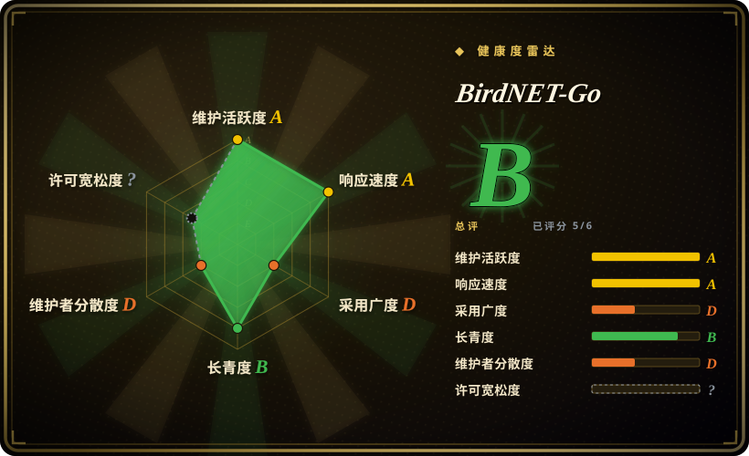
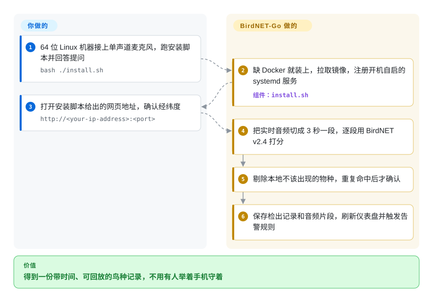

# BirdNET-Go

每天早上窗外都有鸟叫，你叫不出名字；手机识鸟应用只在你举着它的那几分钟里听。BirdNET-Go 让一台小电脑加一支麦克风全天候听着，认出一种就记一条，附上可回放的录音片段，放在你自己局域网里的一个网页上。

## 何时使用

你手里有一台树莓派 4 或 5（或者一台闲置小主机），有一个院子、一个阳台喂食器或一处野外样点，想知道没人在场时那里有什么在叫——凌晨 03:10 的猫头鹰、今年第一只雨燕。你想要的是每天自动多出来的这样一行：`04:52 Eurasian Blackbird 0.83`，后面挂着那三秒录音，全程不用动手。你插上一支单声道 USB 麦克风（或者把它指向家里已有 RTSP 摄像头的音轨），跑一次安装脚本，之后这台机器就在本地给声音分类，留下可搜索的历史和图表，还能按规则推送到 Home Assistant、Telegram、ntfy 或 BirdWeather。

和 **BirdNET-Pi** 比，选它的理由是：你不想专门腾出一张树莓派系统卡，或者你要不止一支麦克风、不止一个模型。BirdNET-Go 以容器和 Linux、Windows、macOS 二进制的形式发布，能同时接多块声卡和多路 RTSP 流，还能让 Google Perch v2 或各地区的蝙蝠分类器和 BirdNET v2.4 一起跑并合并结果。和 **BirdNET-Analyzer** 比，选它的理由是：你要的是一个实时站点，不是一文件夹录音——Analyzer 是上游的批处理工具，面向科研音频文件，没有常驻采集、仪表盘和告警。选 BirdNET-Go 的代价是它的许可证（禁止商用）和它的节奏（默认安装跟的是单人维护的每夜构建），两点下文都会展开。

## 怎么用起来

可以把它想成一个带着图鉴的守夜人：一直在听，每次比较有把握就在本子上记一行。具体来说，程序把最近几秒的麦克风音频留在内存里，切成互相重叠的 3 秒窗口，把每个窗口交给一个**分类器**——一个训练好的神经网络，对它认识的每个物种各给出一个 0 到 1 的分数，表示“这段声音是这个物种”的把握。默认分类器是内嵌在二进制里的 BirdNET v2.4，它就在这台机器的 CPU 上运行，所以识别这一步不需要把音频传出去。原始分数还不算一次检出：BirdNET-Go 先按你的经纬度和时节剔除当地不该出现的物种（**分布范围过滤**），还可以要求同一物种在短时间内被听到好几次才采信（误报过滤）。过了这两关，它才往数据库写一行、存下音频片段、刷新实时仪表盘并执行你的告警规则。

**它替你做的：**采集、重采样、推理、过滤、存储、片段导出、网页界面、通知。**你要做的：**准备硬件（一台 64 位机器、一支像样的单声道麦克风、扛得住持续写入的存储），告诉它自己在地球上的位置，决定启用哪些模型和告警规则。额外的模型——识别昆虫、蛙类和哺乳动物的 Perch v2，识别蝙蝠的 BattyBirdNET——是在应用里的模型库中安装的，不用重新编译。同一个二进制也带文件分析模式，但项目自己的 FAQ 把离线批处理交给了配套命令行工具 `birda`；下面的流程卡走的是实时站点这条路。

<!-- flow-steps:begin (generated from flows/birdnet-go.json by tools/flow_card.py — do not edit) -->

流程文字版

1. **你**：64 位 Linux 机器接上单声道麦克风，跑安装脚本并回答提问 — `bash ./install.sh`
2. **BirdNET-Go**：缺 Docker 就装上，拉取镜像，注册开机自启的 systemd 服务 — 组件：`install.sh`
3. **你**：打开安装脚本给出的网页地址，确认经纬度 — `http://<your-ip-address>:<port>`
4. **BirdNET-Go**：把实时音频切成 3 秒一段，逐段用 BirdNET v2.4 打分
5. **BirdNET-Go**：剔除本地不该出现的物种，重复命中后才确认
6. **BirdNET-Go**：保存检出记录和音频片段，刷新仪表盘并触发告警规则

**价值**：得到一份带时间、可回放的鸟种记录，不用有人举着手机守着

<!-- flow-steps:end -->

## 何时不用

- **你想拿它卖钱、打包进产品，或者当成付费监测服务来运营。** 代码是 CC BY-NC-SA 4.0，不是 OSI 认可的开源许可证；内嵌的 BirdNET 模型同样是这个条款，内嵌的 eBird 分类数据也写明“用于非商业目的”。换成 BirdNET-Analyzer 并不能解决（它的代码是 MIT，模型同样是 CC BY-NC-SA）。商用请先拿到维护者和 BirdNET 团队的书面许可，或者基于 [google-research/perch](https://github.com/google-research/perch)（代码 Apache-2.0，权重的许可证要自己核对）自建流程。
- **你手里是一文件夹现成录音，要批量标注。** FAQ 对“BirdNET-Go 能批量分析我已有的音频文件吗”的回答是 “No, it is built for real-time stream and sound-card analysis”。改用 `birda`（同一作者，MIT，同一批模型，可输出 CSV、Parquet、Raven 选择表）或 BirdNET-Analyzer。
- **你只有树莓派 3 或 Pi Zero。** 硬件指南写明这两款 “are no longer supported. The codebase has outgrown these platforms”，而且必须是 64 位系统。BirdNET-Pi 的 Nachtzuster 分支仍把 3B+ 和 Zero 2 W 列为支持机型；或者让 Zero 只当 RTSP 麦克风，把推理交给一台跑 BirdNET-Go 的 Pi 4 或 5。
- **你需要一条可引用、可复现的科研流程。** 默认安装拉的是 `:nightly` 镜像，FAQ 里出现最多的修复办法是“更新到最新 nightly”，过滤行为（动态阈值、跨模型合并）会随构建变化。要发表的调查请对存档录音运行固定版本的 BirdNET-Analyzer，结果才能重跑。
- **你只是散步时想随手认一下，不是要固定站点。** 这种场景手机才是对的工具：whoBIRD 直接在 Android 手机上运行 BirdNET（应用 GPL-3.0，模型同样禁止商用），Merlin Bird ID 是康奈尔的闭源应用。
- **你的麦克风会录到邻居或公共道路。** 它全天录音并保存片段。FAQ 承认隐私过滤 “is limited by the model”，并且 BirdNET “has poor human-speech recognition”。这一点没有替代工具能解决——挪麦克风、关掉片段保存，或者干脆不部署。
- **你打算用它自带的 TLS 直接暴露到公网。** FAQ 写着 “Let's Encrypt / AutoTLS is currently broken”；2026-09-07 公布的高危公告 GHSA-c7jx-552f-94hh 曾让未登录访客在 Private Mode 下取到已存的录音片段，后已修复。请把它放在负责终结 TLS 并自带访问控制的反向代理或 Cloudflare Tunnel 后面。
- **你要在 Windows 或 macOS 上做蝙蝠检测。** 蝙蝠模型需要 192 kHz 以上的超声麦克风，而且只支持 Linux；其他系统请用专门的蝙蝠探测器录音，再用 BattyBirdNET-Analyzer 离线分类。

## 横向对比

| 替代品 | 是否收录 | 我们的评价 | 取舍 |
|---|---|---|---|
| [BirdNET-Pi（Nachtzuster 分支）](https://github.com/Nachtzuster/BirdNET-Pi) | 未收录 | 如果只是在一台专用树莓派上接一支麦克风，尤其是 3B+ 或 Zero 2 W，BirdNET-Pi 投入更小；一旦你要 x86、Docker 或 Windows 主机、多路音源、额外模型或 MQTT 告警，就选 BirdNET-Go。 | BirdNET-Pi 会接管整套树莓派系统，原仓库（mcguirepr89）已归档，分支最近一次推送在 2026-02；BirdNET-Go 活跃得多，但放弃了旧款树莓派，变化也快。本批标签页未收录。 |
| [BirdNET-Analyzer](https://github.com/birdnet-team/BirdNET-Analyzer) | 未收录 | 在科研流程里给录好的文件打标签，用 Analyzer，它是上游的参考实现；需求是无人值守、带历史和告警的实时站点时，用 BirdNET-Go。 | Analyzer 给你可固定版本、可复现的批处理和 MIT 代码，但没有采集循环、仪表盘和通知；BirdNET-Go 有这些，代价是可复现性。两边的模型都禁止商用。本批标签页未收录。 |
| [birda](https://github.com/tphakala/birda) | 未收录 | 音频已经是文件、又想用同一批模型的快速命令行时，用 birda；常驻监听那一半留给 BirdNET-Go。两者是搭配使用的关系，不是二选一。 | birda 是 Rust 命令行工具（MIT），支持 GPU 和表格化输出，但不做实时采集；它只有九个月历史、约 40 星，年轻项目的风险比 BirdNET-Go 更大。本批标签页未收录。 |
| [whoBIRD](https://github.com/woheller69/whoBIRD) | 未收录 | 需求是“我站的这个地方现在是什么在叫”时，手机应用胜过固定站点；只有想对一个地点做数月的无人值守覆盖时才选 BirdNET-Go。 | whoBIRD 除了一部 Android 手机不需要任何硬件，但只在你打开它时才听，也不留长期的站点历史。本批标签页未收录。 |
| BirdWeather PUC / Haikubox | 非仓库 | 想要一台开箱即用、防风雨、不用自己维护 Linux 的盒子，就买商业监听设备；想让数据和录音留在自己掌控的硬件上、也愿意自己维护时，选 BirdNET-Go。 | 这两者是商业硬件产品，不是代码仓库：你为设备付费并依赖厂商服务，换来免组装、免换卡、免升级。BirdNET-Go 仍可通过 API 集成把检出上传到 BirdWeather。 |

## 技术栈

- **后端：**Go（模块声明 `go 1.27.0`），单个二进制；HTTP 用 Echo，数据层用 GORM 接 SQLite 或 MySQL，命令行和配置用 Cobra/Viper。
- **推理：**内嵌的 BirdNET v2.4 模型通过 `go-tflite` 调用 TensorFlow Lite C 库；Perch v2、BattyBirdNET 和 BirdNET Geomodel v3.0 通过 `onnxruntime_go` 调用 ONNX Runtime。Linux 发布版二进制带 OpenVINO 后端（见 20260823 版发布说明）。
- **音频：**声卡采集用 `malgo`（miniaudio），RTSP 接入靠 FFmpeg 子进程，片段导出用维护者自己写的纯 Go 编解码器（FLAC、Opus、WAV；AAC 和 MP3 为可选预览），语音闸门用内置的 Silero VAD 模型。
- **前端：**Svelte 5 + TypeScript 单页应用，可安装为 PWA；实时流走 Server-Sent Events。
- **集成：**通知目标用 shoutrrr，MQTT 用 Paho 并支持 Home Assistant 自动发现，提供 Prometheus 指标端点，Sentry 遥测为可选且默认关闭。

## 依赖

- **一台 64 位机器。** 硬件指南给的最低配置是 2 GB 内存的树莓派 4B，推荐 Pi 5；Perch 或蝙蝠模型至少要 Pi 4 级别加 2 GB 内存。
- **一个音源。** 带单声道麦克风的 USB 声卡，或一路 RTSP/RTSPS 流。蝙蝠检测需要支持 96–256 kHz 的超声设备。
- **Docker + systemd**——推荐的 `install.sh` 路线需要（Debian 11+、Ubuntu 20.04+、64 位 Raspberry Pi OS），缺 Docker 时脚本会代装。Windows 和 macOS 改用发布压缩包，里面带了 TFLite 和 ONNX Runtime 库。
- **FFmpeg**，用于 RTSP 采集（镜像内已带；原生安装需要 FFmpeg 5.x 或更新，FAQ 说明 4.x 会连不上）；原生安装渲染频谱图还需要 **SoX**。
- **扛得住持续写入的存储**——指南要求高耐久 microSD 或 USB SSD。
- **网络外联，可选但实际默认会发生：**从模型库装模型时从 Hugging Face 下载，物种缩略图来自 Wikimedia，再加上你启用的各项集成（BirdWeather、MQTT broker、天气服务、webhook）。识别本身离线运行。
- **可选：**用 MySQL 代替 SQLite；远程访问用反向代理或 Cloudflare Tunnel。

## 运维难度

**中。** 第一天很轻松——一个脚本、一个向导、一个能用的仪表盘。负担来自在业余级硬件上养一台全天候录音机：

- 安装脚本默认运行 `ghcr.io/tphakala/birdnet-go:nightly`，每次更新跟的都是主分支；`:latest`（最近的稳定版）存在，但要你自己选。
- USB 声卡的 ALSA 卡号可能在重启后变化，采集随之悄悄停掉；文档给的办法是在 `/etc/modprobe.d` 里固定卡号。
- 用 `sudo` 跑安装脚本会在 `/root` 下建出第二个空实例——FAQ 称这是“更新把我的历史删了”最常见的原因。
- 备份靠手动点按钮或复制 `~/birdnet-go-app/data/`；定时备份 “planned but not yet available”。
- 放在反向代理后面时，必须关掉音频端点的 gzip 和 SSE 路由的缓冲，否则回放和实时频谱图会坏。
- 麦克风的摆放、防水和 SD 卡磨损是物理层面的维护，软件替不了。

## 健康度与可持续性

- **维护（截至 2026-10-08）：非常活跃。** 最近五次提交都落在 2026-10-06 和 10-07 两天；2026-07-12 到 2026-08-23 之间发了四个稳定版，中间还有每夜镜像。
- **治理与巴士因子：一个人。** tphakala 有 5,713 次提交，排第二的人类贡献者只有 59 次。`SECURITY.md` 自称 “a hobby project with no bug bounty”。背后没有基金会或公司；维护者一旦停手，靠 nightly 更新的装机群体就收不到修复了。
- **年龄与 Lindy：偏年轻。** 创建于 2023-10-20，大约三年，仍在加速——只能给一个中等的先验，远不如它所依赖的上游 BirdNET 项目（2021 年）。
- **采用度：**约 2.3k 星、188 个 fork，README 里列出了一批社区做的 RTSP 麦克风固件和一个第三方手机应用；DietPi 独立为它打包。
- **风险信号：**非 OSI 许可证（CC BY-NC-SA 4.0），并要求贡献者授予再许可权，让维护者日后可以换成任意 OSI 认可的许可证——换条款的口子是明确留着的；2026-09-07 公布过一个高危公告，20260823 版里还有多项鉴权修复；模型和分类数据归康奈尔、开姆尼茨工业大学和 Google 所有，是硬依赖。
- **结论：**作为个人或教学用途、愿意经常更新的站点，值得押注；作为任何商业产品的部件，或者要求明年行为和今年完全一致的系统，不值得。

## 存疑（未验证）

- [未验证：没有测试硬件] 项目给出的吞吐和内存数字——Pi 4B 约 6 次推理/秒、Pi 5 约 11 次/秒、基线内存约 400 MB、地区模型把峰值内存降低约 67%——都是作者自报，没有复现。
- [未验证：没有跑带标注的测试集] 检出准确率，以及误报过滤和跨模型一致性在真实环境里的效果都没有测量，也没有读到独立基准。
- [未验证：出自 FAQ，没有读源码确认] “AutoTLS 目前是坏的”是读取时（2026-10-08）FAQ 的说法，可能已在某个 nightly 里修复。
- [推断：依据是 README 和 FAQ 的措辞差异] README 把 “Offline analysis of audio files” 列为功能，FAQ 却说不支持批量分析；本页按“单文件分析存在、批处理不在范围内”来写，没有实际运行命令行。
- [推断：由发布说明和 SECURITY.md 拼出，没有审计源码] 外联清单（Hugging Face、Wikimedia、天气服务）可能不全，默认安装下哪些会真的触发也没有追踪。
- [未验证：没有打开权重的许可证] Perch v2 模型权重的条款可能与 Apache-2.0 的 `google-research/perch` 代码仓库不同。
- [未验证：属于法律判断，不是查得到的事实] 具体用途（收费的生态咨询、有经费的科研项目、博物馆展项）在 CC BY-NC-SA 4.0 下算不算“商用”，没有评估。
- [未验证：厂商产品，没有仓库可读] BirdWeather PUC 和 Haikubox 只按“商业监听设备”描述，价格、订阅条款和准确率都没有核对。
- [未验证：没有把 issue 讨论读完] 未关闭的 #502（“container keeps growing - clips not being deleted”，2025-02 提出）和 #4482（Intel N150 加 Home Assistant OS 上主机卡死，2026-10-04 提出）只在 issue 列表里看到，当前状态和能否复现未知。
- [未验证：上游自述] README 注明它的 Unraid host 网络模板 “is untested on real Unraid”。
