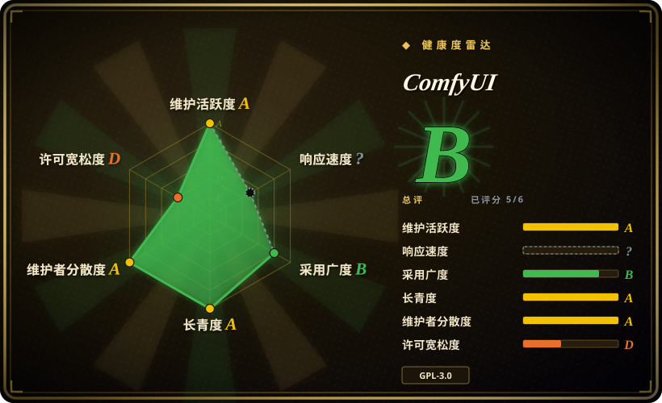
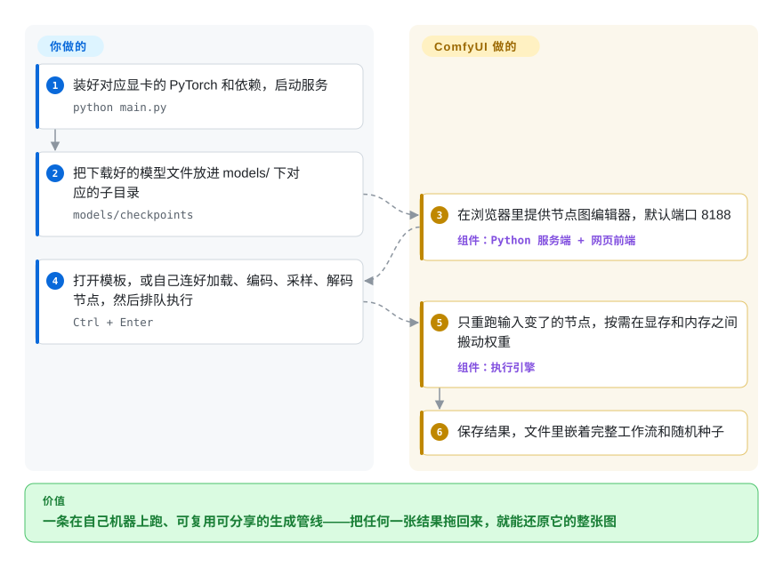

# ComfyUI

提示词框只给你一张图，图是怎么生成的你一点也管不了：想换个放大器、加一张姿势参考、只重跑最后一步，都得从头再来。ComfyUI 把整条生成管线摊在画布上，变成一个个方块和连线——模型加载、文本编码、采样、解码——在你自己的显卡上跑，并把整张图存进每一张输出里，随时能重新载入、原样重跑。

## 何时使用

你是概念美术、动态设计师或小工作室的技术美术，在自己的工作站上用开放权重模型——Flux、SDXL、Qwen Image、Wan 或 LTX 视频——出图和短视频。一个提示词搞定的工具早就不够用了：一个镜头要配深度图 ControlNet、风格 LoRA、脸部重绘，再放大两倍；客户一句“一样的，换成黄昏”，你就得只改一个输入、其他全部保持不变。在标签页式界面里，这意味着十几步手工操作，每次都得重来一遍。

这时就该想到 ComfyUI，因为管线本身成了产物：每个环节是一个节点，整张图存成 JSON 并嵌进每张输出图里，重新排队时只重算输入变了的节点。新出的开放模型它也往往很快就原生支持，因为核心团队和节点作者每一两周就发一版。你选它而不选 AUTOMATIC1111 的 Stable Diffusion WebUI 或 Forge，是因为它们用固定的标签页布局换掉了图级别的控制（而且上游活跃度已经放缓）；需要任意多模型管线、而不是一块精心打磨的画布时，选它而不选 Fooocus 或 InvokeAI；想可视化地迭代、而不是在 Python 里改脚本时，选它而不是自己写 Diffusers 脚本。

## 怎么用起来

ComfyUI 是一个 Python 服务端加一个浏览器前端。每个节点是一个 Python 类，接收有类型的输入（模型、条件、latent 图像——扩散模型内部处理的那种压缩表示），产出输出；你在画布上把它们连成一张图。排队执行时，服务端算出哪些节点需要跑，只执行自上次以来输入变了的节点，并替你管显存：在显存和系统内存之间流式搬运模型权重——大模型能在普通显卡上跑，靠的就是这个。输出文件里嵌着完整的图和随机种子；同一张图导出成 API 格式后，也可以从你自己的代码 POST 给本地服务（`http://127.0.0.1:8188/prompt`）。**ComfyUI 替你做的**：加载模型、调度、内存管理、缓存，以及对一长串图像、视频、音频、3D 模型的原生支持。**你要做的**：装好匹配显卡的 PyTorch、把模型权重下载进 `models/` 各子目录、搭建或挑选工作流，并审查你装的每一个自定义节点——它们是第三方 Python 包，以你的账户权限完整访问你的机器。

<!-- flow-steps:begin (generated from flows/comfyui.json by tools/flow_card.py — do not edit) -->

流程文字版

1. **你**：装好对应显卡的 PyTorch 和依赖，启动服务 — `python main.py`
2. **你**：把下载好的模型文件放进 models/ 下对应的子目录 — `models/checkpoints`
3. **ComfyUI**：在浏览器里提供节点图编辑器，默认端口 8188 — 组件：`Python 服务端 + 网页前端`
4. **你**：打开模板，或自己连好加载、编码、采样、解码节点，然后排队执行 — `Ctrl + Enter`
5. **ComfyUI**：只重跑输入变了的节点，按需在显存和内存之间搬动权重 — 组件：`执行引擎`
6. **ComfyUI**：保存结果，文件里嵌着完整工作流和随机种子

**价值**：一条在自己机器上跑、可复用可分享的生成管线——把任何一张结果拖回来，就能还原它的整张图

<!-- flow-steps:end -->

## 何时不用

- **你没有能用的 GPU。**README 声称借助权重流式加载，大模型最低 4 GB 显存就能跑，并列出了 NVIDIA、AMD、Intel、Apple Silicon、昇腾的支持，但 `--cpu` 模式文档自己就写着慢。没有 GPU 的话，请用 Comfy Cloud（官方付费云版）或托管的图像 API，比如 Midjourney 或提供开放模型的推理服务商。
- **你只想输入提示词拿图。**就算有模板和 App Mode，节点图也是一道实打实的学习门槛。只要提示词进、图片出、默认值靠谱，请用 Fooocus（注意：它已进入只修 bug 的长期支持状态）或 InvokeAI 的画布。
- **你需要一个多租户的生产服务。**服务默认只监听 `127.0.0.1:8188`，按进程排队执行任务；`--multi-user` 只是按用户分开存储，没有内置登录、配额或租户隔离。面向客户的生成服务，请在你自己的 API 后面用 [Diffusers](https://github.com/huggingface/diffusers) 搭，或用托管推理服务商，或者在 ComfyUI 前面自己加一层鉴权和排队。
- **GPL-3.0 和你的分发方式冲突。**ComfyUI 是 GPL-3.0；把修改过的副本打包进闭源产品会带来 copyleft 义务。走宽松许可路线就用 Diffusers（Apache-2.0）。
- **你需要跨机器、跨月份逐字节可复现。**工作流按文件名引用模型，还经常依赖自定义节点；README 警告稳定版本标签之外的提交“可能非常不稳定，会弄坏很多自定义节点”，而它每一两周发一版，节点 API 一直在动。请锁定 ComfyUI 版本、自定义节点的提交和模型哈希——或者用 Diffusers 把管线写成脚本，纳入你自己的版本管理。
- **你要在共享或敏感机器上不经审查地跑自定义节点。**自定义节点是从第三方装来的任意 Python 代码；一个恶意或被投毒的节点拥有和你的用户账户一样的权限。机器上有凭据或客户数据时，只允许审查过的节点包，或者把 ComfyUI 隔离进容器 / 虚拟机。

## 横向对比

| 替代品 | 是否收录 | 我们的评价 | 取舍 |
|---|---|---|---|
| [Stable Diffusion WebUI](stable-diffusion-webui.zh.md) | ✅ | 如果你已有一套离不开其扩展的 AUTOMATIC1111 环境、主要跑 SD 1.5/SDXL，它照样能用；新装环境、新模型家族请选 ComfyUI，因为 WebUI 上游活跃度已经放缓（截至 2026-10-08，最后一次推送在 2026-03）。 | WebUI 的标签页布局更好上手；ComfyUI 有图级别的控制，对新的图像和视频模型支持快得多。 |
| InvokeAI | 未收录 | 想要精致的分层画布（重绘、外扩、分区提示词）又要 Apache-2.0 许可的插画师，选 InvokeAI；需要任意管线和最新模型时，选 ComfyUI。 | InvokeAI 的统一画布做编辑更顺手；它的节点系统和模型覆盖比 ComfyUI 的生态窄。 |
| Fooocus | 未收录 | 在 NVIDIA 显卡上只用提示词、靠合理的 SDXL 预设出图，Fooocus 最快；但要把它当成只维护不开发（它的 README 写着有限 LTS、只修 bug），SDXL 之外的需求选 ComfyUI。 | 安装极简、几乎没有旋钮；不会再有新的模型家族和功能。 |
| Stable Diffusion WebUI Forge | 未收录 | 想要 A1111 的界面、同时让 Flux/SDXL 更省显存，Forge 可以考虑；要做长期押注选 ComfyUI，因为 Forge 最后一次推送在 2025-07。 | 界面熟悉，带性能补丁；维护前景不明，且是 AGPL-3.0。 |
| Diffusers（Hugging Face） | 未收录 | 生成跑在你自己的 Python 服务或批处理任务里时，选 Diffusers；由人来可视化地设计和迭代管线时，选 ComfyUI。 | Diffusers 是 Apache-2.0 的库，API 有版本管理，但没有界面；ComfyUI 是 GPL-3.0 的界面 + 服务端，新模型跟进更快。 |

## 技术栈

- **后端：**Python + PyTorch；aiohttp Web 服务，提供 HTTP 和 WebSocket API（默认 `127.0.0.1:8188`）；用 SQLAlchemy/Alembic 和本地 SQLite 数据库（`comfyui.db`）保存应用状态。
- **前端：**TypeScript/Vue 应用，在独立的 `Comfy-Org/ComfyUI_frontend` 仓库开发，以 PyPI 包 `comfyui-frontend-package` 的形式进入核心。
- **节点系统：**每个节点是一个 Python 类；扩展放在 `custom_nodes/` 下；ComfyUI-Manager（用 `--enable-manager` 开启）负责安装和更新它们。
- **模型：**完整 checkpoint，或者分开的扩散模型、VAE、文本编码器、LoRA、ControlNet、适配器和放大模型，格式如 safetensors；支持量化模型。
- **合作伙伴节点：**可选的节点，调用付费闭源模型的 API；`--offline` 会禁用它们，并阻止前端访问互联网。

## 依赖

- **硬件：**实际上需要 GPU——文档覆盖 NVIDIA（CUDA）、AMD（ROCm，Linux 和 Windows）、Intel Arc（XPU）、Apple Silicon（MPS）、昇腾 NPU 等。显存需求取决于模型；README 声称借助权重流式加载，4 GB 显存 + 8 GB 内存就能跑大模型。
- **软件：**推荐 Python 3.13（自定义节点有问题时退到 3.12；3.14 可用）；PyTorch ≥ 2.7，NVIDIA 20 系及更新的显卡需要 cu130 版本；外加 `requirements.txt` 里的包。Windows/macOS 用户可以改用桌面应用；Windows 便携版自带 Python 和 PyTorch。
- **模型：**需要另外下载（Hugging Face、Civitai 等）放进 `models/` 各子目录；一个能用的模型库动辄几十到几百 GB。
- **网络：**核心可以离线跑；模板、自定义节点、模型下载和合作伙伴节点需要联网。

## 运维难度

**一个人在桌面上用是中等，共享服务器上是高。**桌面应用和便携版让首次安装变容易了。反复要做的功夫在别处：让 PyTorch 版本匹配显卡驱动、整理庞大的模型目录、让自定义节点跟上每一两周一发的核心、追查大型视频工作流的爆显存、审查第三方节点代码。给团队用还要补上服务端不提供的东西——鉴权、TLS 终结（它支持 `--tls-keyfile`/`--tls-certfile`）、任务隔离，以及工作流和模型的备份。

## 健康度与可持续性

- **维护（截至 2026-10-08）：**非常活跃——上个季度每周都有提交，大约每周一个版本（2026-10-05 发布 v0.39.0，2026-09-29 发布 v0.38.0）。
- **治理与背书：**现在归 **Comfy-Org** 组织，背后是一家卖 Comfy Cloud 和付费合作伙伴节点、还在招人的公司；原作者（comfyanonymous）仍在提交历史里占绝对多数。雷达的治理轴给了 A（过去 12 个月 50 位活跃维护者，前三名占比 57.8%），但路线图掌握在一家公司手里。
- **年龄与 Lindy（2023-01 创建，约 3.7 年）：**年轻。增长和发版节奏都很突出，但还没有长期履历——Lindy 先验比它的热度所暗示的要弱。
- **响应速度：**这一轮没有评分（评分器报告窗口内无信号），可仅 2026 年 9 月就新开了 204 个 issue——更可能是评分器的盲区而不是没人理；上一轮（2026-09-22）测得首次响应中位数 4.7 小时。它有 5000 多个未关闭 issue，求助更多要靠 Discord/Matrix 社区，而不是指望快速分诊。
- **采用：**约 13.66 万 star、数百万次 release 下载，自定义节点和工作流生态非常大；不少其他工具（例如 SwarmUI）直接拿 ComfyUI 当后端。
- **风险信号：**GPL-3.0（许可轴 D）；一家公司在开源核心之上叠加付费云和合作伙伴节点带来的商业化压力；未经审查的自定义节点带来的供应链风险。

## 存疑（未验证）

- [未验证] Star 数（约 13.66 万）、未关闭 issue 数和发布日期取自 2026-10-08 的 GitHub API。
- [未验证] “4 GB 显存 + 8 GB 内存”和“优化最好的推理引擎”是 README 的自述；实际速度和内存取决于模型、分辨率和工作流。
- [推断] “新开放模型很快就原生支持”依据的是 README 里很长的原生模型列表和每周发版，不是和其他界面的系统对比。
- [推断] 没有内置鉴权：这是读 `cli_args.py` 得出的判断（`--multi-user` 只是按用户分开存储），没有逐一核对全部服务端中间件。
- [未验证] Comfy Org 的融资情况和 README 写明之外的商业模式（付费云、合作伙伴节点、招聘）没有核实。
- [推断] 自定义节点的供应链风险是安装第三方 Python 包固有的；具体的历史事件本页没有重新核实。
- [推断] 响应速度轴没评分，很可能是评分器的假阴性（GitHub 搜索 API 显示 2026-09 新开了 204 个 issue）；这次同步的健康度由统一流程计算，这里没有重新评分。
