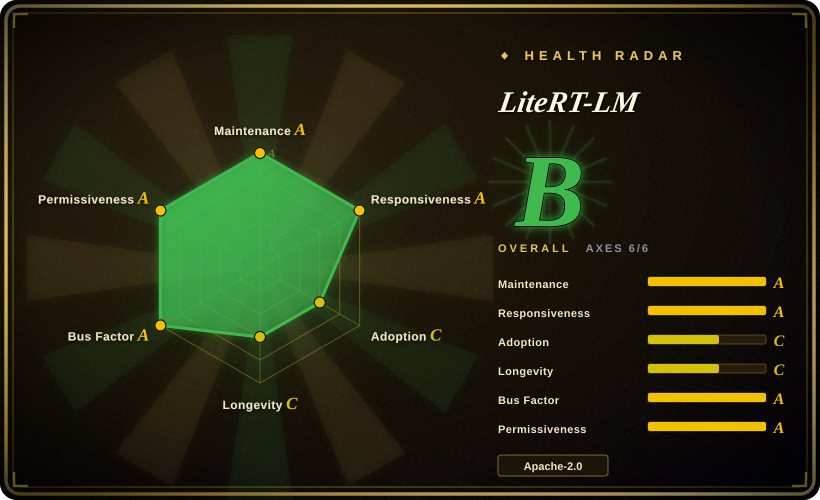
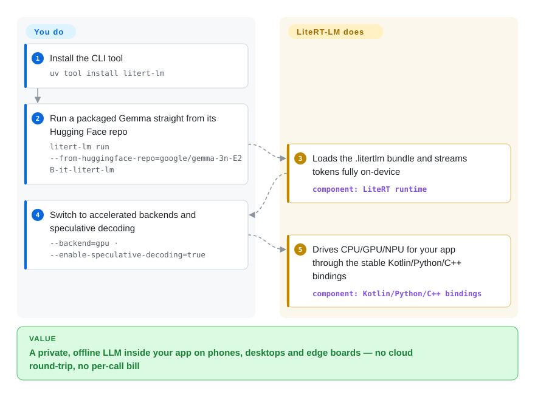

# LiteRT-LM

Your app has to summarize, extract or chat with an LLM, but the answer can't phone home — privacy promises, offline use and per-call API bills all rule out the cloud. LiteRT-LM is Google's C++ orchestration layer that runs a packaged small model (Gemma first-class) entirely on-device — CPU, with GPU/NPU acceleration — across Android, iOS, desktop, web and IoT like Raspberry Pi; its runtime already powers on-device GenAI in Chrome, Chromebook Plus and Pixel Watch per the README. The version line is still pre-1.0 (v0.17.x), so binding APIs churn even though Google ships it in its own products.

## When to use

You're a mobile engineer at a small startup shipping a private journaling app, and Android is your lead platform. Your product promise is that a user's notes never leave their phone, so the "summarize my week" and "pull out action items" features you've been asked to build can't call a cloud LLM — that would break the privacy story, and at your scale the per-call API bill for every summary would quietly bleed the runway. You need the model to run locally, work on a plane with no signal, and slot into your existing Kotlin codebase without you hand-rolling a C++ inference engine.

So you reach for LiteRT-LM. You point its CLI at a `.litertlm`-packaged **Gemma** (Gemma 4 and the 3n line are the showcased models) and it streams tokens on-device; in the app you wire it through the stable Kotlin bindings and let the runtime drive CPU with optional GPU/NPU acceleration. The tasks you actually need — summarization and structured extraction — sit squarely in the short, structured workloads a small model handles well; current releases also list vision/audio input and function-calling for agentic flows, and multi-token-prediction (MTP) speculative decoding is claimed to make Gemma 4 up to 3× faster (project benchmark). You accept the tradeoff of living inside Google's tooling — a Bazel build if you compile from source, `.litertlm` packaging for the models — in exchange for one Google-maintained runtime, instead of stitching community glue across platforms.

## How it works

LiteRT-LM sits between your app and the LiteRT inference engine (the successor to TensorFlow Lite), which does the actual tensor math. You hand it a model packaged in Google's `.litertlm` format — a bundle of quantized weights plus metadata — and the runtime takes over: it loads the graph onto the CPU or an accelerated GPU/NPU delegate, streams generated tokens back, and handles multi-turn context in the KV cache. "It does" covers scheduling, backend fallback and the prompt/tool loop; "you do" covers choosing the model, packaging or downloading `.litertlm` assets, device-tier gating (RAM, backend availability), and calling the stable Kotlin/Python/C++ bindings from your app — Swift and JavaScript are still early-preview and Flutter community-tier. The fastest door is its CLI: `uv tool install litert-lm`, then one `litert-lm run --from-huggingface-repo=...` command pulls a packaged Gemma and chats with it locally, no code.

<!-- flow-steps:begin (generated from flows/litert-lm.json by tools/flow_card.py — do not edit) -->

Text version of the flow

1. **You**: Install the CLI tool — `uv tool install litert-lm`
2. **You**: Run a packaged Gemma straight from its Hugging Face repo — `litert-lm run --from-huggingface-repo=google/gemma-3n-E2B-it-litert-lm`
3. **LiteRT-LM**: Loads the .litertlm bundle and streams tokens fully on-device — component: `LiteRT runtime`
4. **You**: Switch to accelerated backends and speculative decoding — `--backend=gpu · --enable-speculative-decoding=true`
5. **LiteRT-LM**: Drives CPU/GPU/NPU for your app through the stable Kotlin/Python/C++ bindings — component: `Kotlin/Python/C++ bindings`

**Value**: A private, offline LLM inside your app on phones, desktops and edge boards — no cloud round-trip, no per-call bill

<!-- flow-steps:end -->

## When NOT to use

- **Not a general-purpose multi-model runtime** — the README lists Gemma, Llama, Phi-4, Qwen "and more" as supported, but the showcase `.litertlm` catalog and the deep tuning (MTP drafters, mobile quantizations) are still Gemma-centric. For arbitrary Hugging Face models, exotic architectures, or Qwen/Mistral as first-class citizens, llama.cpp or MLX support far more models with less friction.
- **Not for cloud-grade throughput / low latency** — on-device inference is reported 10–100× slower than cloud APIs (third-party benchmark, not official; see Caveats); synchronous/interactive flows (multi-minute generations) are unusable without architectural workarounds.
- **Risky on memory-constrained devices** — 2–4B models commonly need 6–8GB RAM and Android may kill the process under memory pressure; the KV cache fills after a few turns and degrades output, forcing session rotation.
- **Not for a frozen, stable API** — still pre-1.0 versioning with a fast release cadence (stable v0.14.0 → v0.17.1 in roughly ten weeks, 2026-07-08 → 2026-09-16, GitHub releases); several bindings are early-preview (Swift, JS/Web) or community (Flutter), implying ongoing churn even though Google ships the runtime in Chrome and Pixel Watch.
- **Ecosystem / format lock-in** — models must be packaged into Google's `.litertlm` format and largely sourced from Google's HF community org; you also inherit a Bazel-based C++ build if you compile from source (versioned C-API prebuilts landed in v0.16.0, which softens but does not remove this).
- **Not for large-model / high-accuracy results** — this is a small-model edge runtime; teams report needing heavy defensive engineering (output parsing, language-drift mitigation, device gating) for reliable behavior.

## Comparison

| Alternative | In index | Our verdict | Tradeoff |
|---|---|---|---|
| [llama.cpp](../llm-inference/local-runtimes/llama-cpp.md) | ✅ | Choose llama.cpp when you need broad GGUF model/quantization support and ubiquitous reach. | Far broader model/quantization support (GGUF ecosystem) and ubiquitous reach, but more cross-platform build complexity and no single Google-blessed mobile SDK — you assemble more glue. |
| [MLX / mlx-lm (Apple)](mlx-mlx-lm.md) | ✅ | Choose MLX when Apple-silicon speed and clean Swift/Python ergonomics matter most. | Faster than LiteRT-LM on many non-Gemma models with clean Swift/Python ergonomics on Apple silicon, but Apple-only — can't be your cross-platform answer. |
| MediaPipe LLM Inference API (Google) | 未收录 | Choose MediaPipe LLM Inference API when you want an easier same-org drop-in layer. | Higher-level, easier drop-in on-device LLM from the same org using `.task` models, but less of a low-level orchestration layer and overlapping/superseded by LiteRT-LM in direction — the simpler-but-less-flexible sibling. |
| ONNX Runtime (+ GenAI / Mobile) | 未收录 | Choose ONNX Runtime when you need vendor-neutral format/backend breadth. | Vendor-neutral, mature, many formats and backends across ecosystems, but heavier, less tuned for the latest small mobile LLMs, and lacks LiteRT-LM's Gemma-specific mobile quantization wins. |
| Apple Core ML / Foundation Models | 未收录 | Choose Apple's stack when Apple Neural Engine integration and OS models are the hard requirement. | Best Apple Neural Engine integration and OS-level models on newer iPhones, but Apple-locked, conversion can be painful, no path to Android or generic edge hardware. |

## Tech stack

- C++ core runtime; LiteRT (TensorFlow Lite successor) inference engine
- Bazel build system; CMake; Cargo/Rust tooling; versioned C-API shared-library prebuilts since v0.16.0
- Python/Kotlin/C++ bindings Stable; Swift (Metal) and JavaScript/WebAssembly marked "Early Preview"; Flutter community-tier
- Experimental YNNPACK delegate (linux arm64, GPU-adjacent CPU accel) since v0.16.0; GPU and NPU backends for peak performance
- `.litertlm` packaged model format; multi-token-prediction (MTP) speculative decoding for Gemma 4
- Multimodal (vision/audio inputs) and function-calling/tool-use APIs per the README

## Dependencies

- **LiteRT runtime** + **models in `.litertlm` format** from the LiteRT Community on Hugging Face / Kaggle
- **CLI path**: `uv tool install litert-lm` (no Bazel needed to try it)
- **Bazel** + a pinned `.bazelversion` to build from source (heavy C++ toolchain); C-API prebuilts avoid building shared libs
- **Per-platform native toolchains** — Android NDK, Xcode (iOS/macOS), Emscripten (Web)
- **GPU/NPU vendor drivers** for accelerated backends (NPU support is platform-limited / partly preview)

## Ops difficulty

**High.** Trying it is now cheap — a `uv tool install` and one CLI command run a packaged model — but shipping is still the hard part. Building from source uses Bazel with a pinned version and a large C++/Rust toolchain. On-device LLM ops are inherently hard: device-tier RAM gating (2–4B models often need 6–8GB RAM or Android kills the process), GPU-init-then-CPU-fallback logic (GPU availability is inconsistent across devices), KV-cache session rotation every few turns `[未验证]` to stop quality decay, and defensive output parsing because small models emit malformed JSON / wrong-language text. Models must be converted/packaged to `.litertlm`. Several bindings (Swift, JS, Flutter) are preview/community, so API churn and gaps are likely pre-1.0.

## Health & viability

- **Maintenance (2026-09):** last push 2026-09-26; releases every 1–3 weeks (v0.14.0 2026-07-08 → v0.15.0 2026-08-04 → v0.16.0 2026-08-11 → v0.17.1 2026-09-16, GitHub API) — clearly **active**, still pre-1.0 versioning, so churn is the cost of that activity.
- **Governance / backing:** Google-maintained under `google-ai-edge` (Organization), part of the LiteRT / TensorFlow Lite lineage. Removes single-maintainer bus-factor risk, but Google is a notorious project-killer (cf. the MediaPipe→LiteRT-LM repositioning). The strongest new counter-signal: the README states the runtime powers on-device GenAI in **Chrome, Chromebook Plus and Pixel Watch** — Google products betting on it raise directional continuity well above a typical research repo. [未验证] (1P usage is the project's own claim)
- **Age & Lindy (created 2025-04, ~1.4yr):** young; the Lindy prior is weak on age, but 1P deployment in flagship Google hardware is the kind of embedding that makes withdrawal expensive. Bet on it for the Google/LiteRT backing and Gemma path, not for longevity track record. [推断]
- **Adoption (2026-09):** ~6.5k stars (GitHub API, 2026-09-28; ~5.7k in late June) and 136,497 PyPI downloads/month for `litert-lm-builder`; the Gemma-centric `.litertlm` catalog and preview bindings keep the *third-party* production-ready surface narrow even while Google ships it internally.
- **Risk flags:** Apache-2.0 (no relicense risk). Live flags are pre-1.0 API churn (still v0.x after ~18 months) and `.litertlm` format + Google-ecosystem lock-in.

## Caveats (unverified)

- **Counts** — stars/forks (6,532 / 733) are from the GitHub API on 2026-09-28 and drift continuously; an earlier snippet reported only ~3,157 stars, so historical sources disagreed. `[未验证]`
- **Production-readiness & 1P usage** — "production-ready", "powers Chrome / Chromebook Plus / Pixel Watch" and the Gemma 4 "up to 3× faster with MTP" claim are the project's own README statements and linked blogs; no independent verification. `[未验证]`
- **Throughput** — e.g. "Gemma-class E2B at 55.4 tok/s beating MLX 47.5 and llama.cpp 37.8 on iPhone" is a third-party dev.to benchmark, not official; varies by device/model/quantization. `[未验证]`
- **RAM figures** — ~1.5–8GB per model, ~3.66GB file, ~0.8GB text-only weights — aggregated from blogs and HF model cards, not verified against official specs. `[未验证]`
- **Catalog breadth** — README claims Gemma/Llama/Phi-4/Qwen support, but which have actually-optimized `.litertlm` assets vs nominal support is unconfirmed. `[未验证]`
- **MediaPipe relationship** — the superseding/positioning vs the older MediaPipe LLM Inference API is inferred, not stated in the official overview. `[未验证]`
- **NPU availability specifics** — from docs summaries; may differ from the current release matrix. `[未验证]`
- **Build difficulty** — inferred from repo config (`.bazelrc`, `.bazelversion`, CMake, Cargo), not a measured build. `[推断]`
