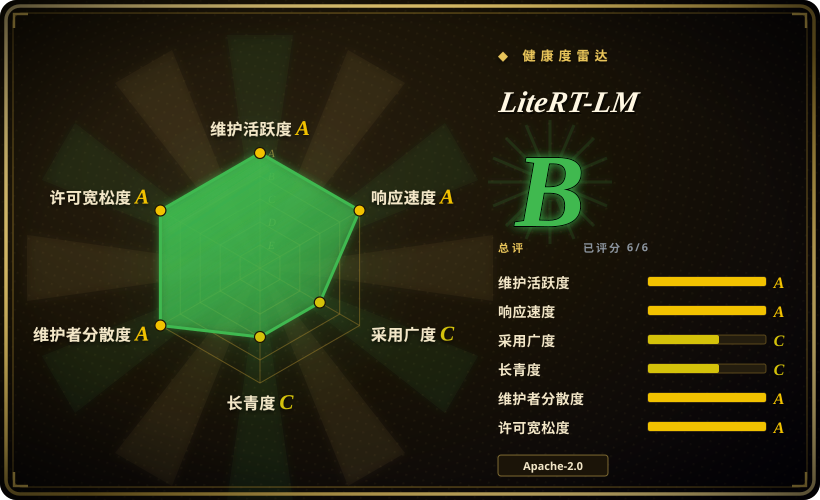
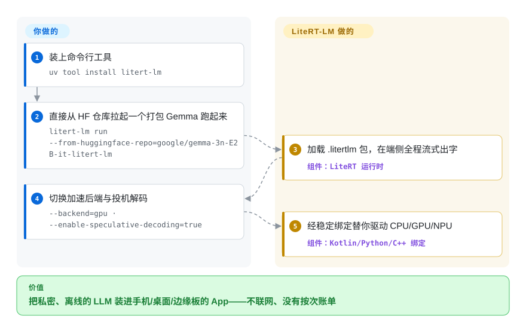

# LiteRT-LM

你的 App 要用 LLM 做摘要、抽取或对话，但答案不能打电话回云端——隐私承诺、离线可用、按次 API 账单都排除了云调用。LiteRT-LM 是 Google 的 C++ 编排层，把一个打包好的小模型（Gemma 一等公民）完全跑在端侧——CPU，外加 GPU/NPU 加速——覆盖 Android、iOS、桌面、Web 和树莓派这类 IoT 设备；README 称其运行时已在 Chrome、Chromebook Plus 和 Pixel Watch 里驱动端侧生成式体验。版本号仍是 pre-1.0（v0.17.x），所以即便 Google 自家产品在用它，绑定 API 依旧在变。

## 何时使用

你是一家小创业公司的移动端工程师，正在交付一款私密日记 App，Android 是你的主打平台。你们的产品承诺是：用户的笔记永远不离开手机。所以产品要你做的“总结我这一周”“提取待办事项”这些功能，不能去调云端 LLM——那会破坏隐私叙事，而且以你们的规模，每生成一次摘要都要付一次按调用计费的 API 账单，会悄悄耗光跑道。你需要模型在本地跑、在没信号的飞机上也能用，并且能嵌进你现有的 Kotlin 代码里，而不必自己手搓一套 C++ 推理引擎。

于是你选用 LiteRT-LM。你把 CLI 指向一个打包成 `.litertlm` 的 **Gemma**（主打展示的是 Gemma 4 与 3n 系列），它在端侧直接流式吐字；进到 App 里，你通过稳定的 Kotlin 绑定接入，让运行时用 CPU、外加可选的 GPU/NPU 加速来驱动。你真正需要的任务——摘要和结构化抽取——正好落在小模型能胜任的短小、结构化负载里；当前版本还列出视觉/音频输入与面向 agent 流程的 function calling，多 token 预测（MTP）投机解码据称让 Gemma 4 提速至 3 倍（项目自报基准）。你接受“活在 Google 工具链之内”的取舍——从源码构建要 Bazel，模型要打包成 `.litertlm`——以换取一套 Google 维护的统一运行时，而不必跨平台拼装社区胶水。

## 怎么用起来

LiteRT-LM 坐在你的 App 和 LiteRT 推理引擎（TensorFlow Lite 的继任者）之间，张量运算由后者完成。你交给它的是一份 Google `.litertlm` 格式打包的模型——量化权重加元数据的组合包——运行时从此接手：把计算图装上 CPU 或加速的 GPU/NPU delegate，把生成的 token 流式送回，并在 KV 缓存里维护多轮上下文。“它替你做”的部分：调度、后端回退、prompt 与工具循环；“仍归你管”的部分：选模型、获取或转换 `.litertlm` 资产、按设备分级门控（内存、后端可用性），以及在你的 App 里调用稳定的 Kotlin/Python/C++ 绑定——Swift 与 JavaScript 仍是 early preview，Flutter 属社区档。最快的入门方式是它的 CLI：`uv tool install litert-lm`，再一条 `litert-lm run --from-huggingface-repo=...` 就能拉一个打包 Gemma 在本地聊起来，一行代码都不用写。

<!-- flow-steps:begin (generated from flows/litert-lm.json by tools/flow_card.py — do not edit) -->

流程文字版

1. **你**：装上命令行工具 — `uv tool install litert-lm`
2. **你**：直接从 HF 仓库拉起一个打包 Gemma 跑起来 — `litert-lm run --from-huggingface-repo=google/gemma-3n-E2B-it-litert-lm`
3. **LiteRT-LM**：加载 .litertlm 包，在端侧全程流式出字 — 组件：`LiteRT 运行时`
4. **你**：切换加速后端与投机解码 — `--backend=gpu · --enable-speculative-decoding=true`
5. **LiteRT-LM**：经稳定绑定替你驱动 CPU/GPU/NPU — 组件：`Kotlin/Python/C++ 绑定`

**价值**：把私密、离线的 LLM 装进手机/桌面/边缘板的 App——不联网、没有按次账单

<!-- flow-steps:end -->

## 何时不用

- **它不是通用的多模型运行时**——README 列出 Gemma、Llama、Phi-4、Qwen“及更多”为受支持，但主打的 `.litertlm` 目录与深度调优（MTP drafter、移动量化）仍高度以 Gemma 为中心。对于任意 Hugging Face 模型、异类架构，或要把 Qwen/Mistral 作为一等公民，llama.cpp 或 MLX 支持的模型远更多，摩擦也更小。
- **不适合云级吞吐/低延迟**——据报道端侧推理比云端 API 慢 10–100 倍（第三方基准，非官方，见存疑）；同步/交互式流程（动辄数分钟的生成）在没有架构层面变通的情况下不可用。
- **在内存受限设备上有风险**——2–4B 模型通常需要 6–8GB 内存，Android 在内存压力下可能杀掉进程；KV 缓存几轮对话后被填满并使输出退化，迫使进行会话轮换。
- **不适合冻结、稳定的 API**——版本号仍是 pre-1.0，发布节奏很快：稳定版 v0.14.0 → v0.17.1 只隔了约十周（2026-07-08 → 2026-09-16，GitHub releases）；多个绑定为 early preview（Swift、JS/Web）或社区（Flutter）状态，即便 Google 已在 Chrome 与 Pixel Watch 里搭载，API 变动仍在持续。
- **生态/格式锁定**——模型必须打包成 Google 的 `.litertlm` 格式，且大多来自 Google 的 HF 社区组织；从源码构建还要承接基于 Bazel 的 C++ 构建（v0.16.0 起有带版本的 C-API 预编译库，缓解但未消除这一点）。
- **不适合大模型/高准确率结果**——这是一个小模型边缘运行时；有团队反馈需要大量防御性工程（输出解析、语种漂移缓解、设备分级）才能获得可靠行为。

## 横向对比

| 替代品 | 是否收录 | 我们的评价 | 取舍 |
|---|---|---|---|
| [llama.cpp](../llm-inference/local-runtimes/llama-cpp.zh.md) | ✅ | 需要广泛 GGUF 模型/量化支持和无处不在的覆盖面时，选 llama.cpp。 | 模型/量化支持（GGUF 生态）广泛得多、覆盖面无处不在，但跨平台构建更复杂，且没有单一的 Google 官方移动 SDK——你要自己拼装更多胶水。 |
| [MLX / mlx-lm (Apple)](mlx-mlx-lm.zh.md) | ✅ | Apple silicon 速度和干净 Swift/Python 体验最重要时，选 MLX。 | 在许多非 Gemma 模型上比 LiteRT-LM 更快，在 Apple silicon 上有干净的 Swift/Python 体验，但仅限 Apple——无法作为你的跨平台答案。 |
| MediaPipe LLM Inference API (Google) | 未收录 | 想要同一组织里更容易 drop-in 的端侧 LLM 层时，选 MediaPipe LLM Inference API。 | 来自同一组织、更高层、用 `.task` 模型即插即用的端侧 LLM 更易上手，但作为底层编排层的成分更少，在方向上与 LiteRT-LM 重叠/被其取代——是更简单但更不灵活的兄弟方案。 |
| ONNX Runtime (+ GenAI / Mobile) | 未收录 | 需要厂商中立的格式/后端广度时，选 ONNX Runtime。 | 厂商中立、成熟，跨生态支持众多格式与后端，但更重、对最新小型移动 LLM 调优不足，且缺少 LiteRT-LM 在 Gemma 专属移动量化上的优势。 |
| Apple Core ML / Foundation Models | 未收录 | Apple Neural Engine 集成和 OS 级模型是硬需求时，选 Apple 栈。 | 在较新 iPhone 上具备最佳的 Apple Neural Engine 集成与 OS 级模型，但锁定 Apple，转换可能很痛苦，没有通往 Android 或通用边缘硬件的路径。 |

## 技术栈

- C++ 核心运行时；LiteRT（TensorFlow Lite 继任者）推理引擎
- Bazel 构建系统；CMake；Cargo/Rust 工具链；v0.16.0 起提供带版本的 C-API 动态库预编译包
- Python/Kotlin/C++ 绑定为 Stable；Swift（Metal）与 JavaScript/WebAssembly 标为 Early Preview；Flutter 为社区档
- v0.16.0 起有实验性 YNNPACK delegate（linux arm64 的 CPU 加速）；GPU 与 NPU 后端用于峰值性能
- `.litertlm` 打包模型格式；面向 Gemma 4 的多 token 预测（MTP）投机解码
- 按 README：多模态（视觉/音频输入）与 function calling/工具调用 API

## 依赖

- **LiteRT 运行时** + **`.litertlm` 格式的模型**，来自 Hugging Face / Kaggle 上的 LiteRT Community
- **CLI 路径**：`uv tool install litert-lm`（尝鲜不需要 Bazel）
- **Bazel** + 固定的 `.bazelversion` 以从源码构建（重型 C++ 工具链）；C-API 预编译包可免自己动手 build 共享库
- **各平台原生工具链**——Android NDK、Xcode（iOS/macOS）、Emscripten（Web）
- **GPU/NPU 厂商驱动**，用于加速后端（NPU 支持受平台限制 / 部分为预览）

## 运维难度

**高。** 尝鲜如今很便宜——`uv tool install` 加一条 CLI 就能跑起来一个打包模型——但上线仍是硬骨头。从源码构建要用固定版本的 Bazel 与庞大的 C++/Rust 工具链。端侧 LLM 运维本身就难：设备分级的内存门控（2–4B 模型常需 6–8GB 内存，否则 Android 会杀进程）、GPU 初始化后回退 CPU 的逻辑（GPU 可用性在各设备间不一致）、每隔几轮就做 KV 缓存会话轮换 `[未验证]` 以阻止质量退化，以及防御性输出解析，因为小模型会发出格式错误的 JSON / 错误语种的文本。模型必须转换/打包为 `.litertlm`。多个绑定（Swift、JS、Flutter）为预览/社区状态，因此在 pre-1.0 阶段 API 变动与缺口很可能存在。

## 健康度与可持续性

- **维护（2026-09）：** 最后 push 在 2026-09-26；发布间隔 1–3 周（v0.14.0 2026-07-08 → v0.15.0 2026-08-04 → v0.16.0 2026-08-11 → v0.17.1 2026-09-16，GitHub API）——明显**活跃**，版本号仍是 pre-1.0，变动正是这种活跃的代价。
- **治理 / 背书：** 由 Google 在 `google-ai-edge`（Organization）下维护，属于 LiteRT / TensorFlow Lite 谱系。这消除了单一维护者的巴士因子风险，但 Google 是出了名的项目杀手（参见 MediaPipe→LiteRT-LM 的重定位）。最强的新增对冲信号：README 称该运行时已在 **Chrome、Chromebook Plus 与 Pixel Watch** 中驱动端侧生成式体验——Google 自家产品押注它，把方向性延续度抬到典型研究仓库之上。[未验证]（1P 搭载为项目自述）
- **年龄与 Lindy（创建于 2025-04，约 1.4 年）：** 年轻，按年龄算 Lindy 先验很弱；但被嵌进 Google 旗舰硬件与浏览器，这种搭载会让“撤走”变得昂贵。押它是为了 Google/LiteRT 的背书与 Gemma 路径，而非长寿记录。[推断]
- **采用度（2026-09）：** 约 6.5k star（GitHub API，2026-09-28；6 月底约 5.7k），PyPI 包 `litert-lm-builder` 月下载 136,497；以 Gemma 为中心的 `.litertlm` 目录与预览态绑定，让**第三方**可投产的面仍然偏窄——哪怕 Google 内部已在出货。
- **风险标记：** Apache-2.0（无重新许可风险）。活跃风险是 pre-1.0 的 API 变动（约 18 个月后仍是 v0.x），以及 `.litertlm` 格式 + Google 生态锁定。

## 存疑（未验证）

- **计数** —— stars/forks（6,532 / 733）取自 2026-09-28 的 GitHub API，会持续漂移；此前一份摘录只报告了约 3,157 stars，说明历史来源彼此不一致。`[未验证]`
- **生产就绪与 1P 搭载** —— “production-ready”“驱动 Chrome / Chromebook Plus / Pixel Watch”与“MTP 让 Gemma 4 提速至 3 倍”均为项目 README 与其链接博文的自述；无独立验证。`[未验证]`
- **吞吐** —— 例如“Gemma 级 E2B 在 iPhone 上达 55.4 tok/s，胜过 MLX 的 47.5 和 llama.cpp 的 37.8”出自第三方 dev.to 基准，非官方；随设备/模型/量化而变。`[未验证]`
- **内存数字** —— 每个模型约 1.5–8GB、文件约 3.66GB、纯文本权重约 0.8GB——由博客和 HF 模型卡汇总而来，未对照官方规格核实。`[未验证]`
- **目录广度** —— README 声称支持 Gemma/Llama/Phi-4/Qwen，但哪些确有已优化的 `.litertlm` 资产、哪些只是名义支持，尚未确认。`[未验证]`
- **MediaPipe 关系** —— 相对于较旧的 MediaPipe LLM Inference API 的取代/定位说法属推断，官方概述中并未陈述。`[未验证]`
- **NPU 可用性细节** —— 来自文档摘要；可能与当前发布矩阵不同。`[未验证]`
- **构建难度** —— 由仓库配置（`.bazelrc`、`.bazelversion`、CMake、Cargo）推断，而非实测构建。`[推断]`
