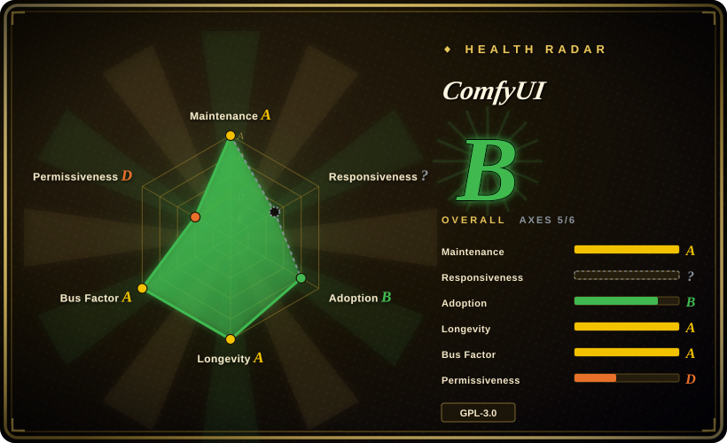
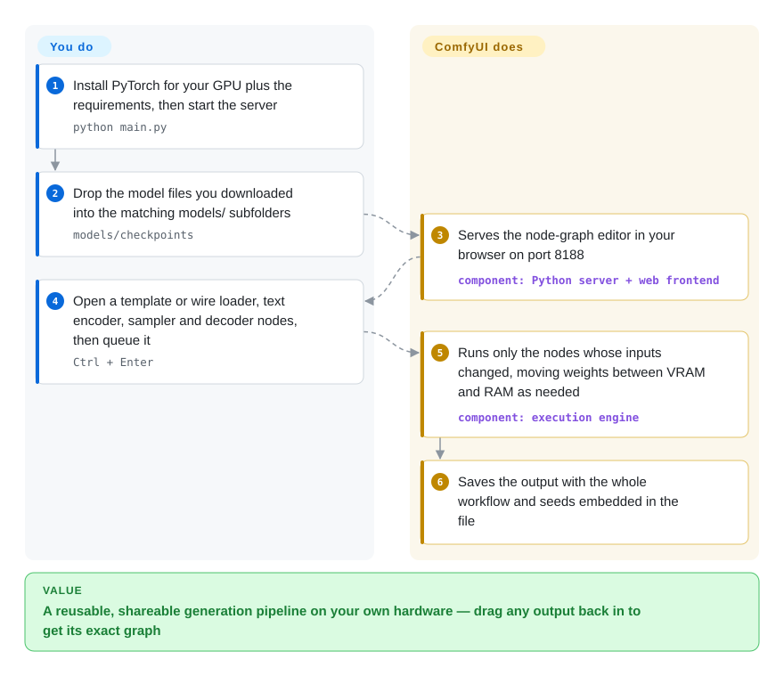

# ComfyUI

A prompt box gives you one image and no control over how it was made: you cannot swap the upscaler, add a pose reference, or re-run just the last step without starting over. ComfyUI lays the whole generation pipeline out as boxes and wires on a canvas — model loader, text encoder, sampler, decoder — runs it on your own GPU, and saves the graph inside every output so you can reload and rerun it exactly.

## When to use

You're a concept artist, motion designer or small studio TD who generates images and short clips with open-weight models — Flux, SDXL, Qwen Image, Wan or LTX video — on your own workstation. One-prompt tools stopped being enough: a single shot now needs a depth-map ControlNet, a style LoRA, an inpainting pass on the face, and a 2× upscale, and when the client asks for "the same, but dusk", you need to change one input and get everything else identical. In a tabbed UI that is a dozen manual steps you redo by hand each time.

You reach for ComfyUI because the pipeline itself becomes the artifact: every stage is a node, the graph is saved as JSON and embedded in each output image, and re-queuing only recomputes the nodes whose inputs changed. It also tends to get native support for new open models quickly, because the core team and node authors ship every week or two. You pick it over AUTOMATIC1111's Stable Diffusion WebUI or Forge because those trade graph-level control for a fixed tabbed layout (and their upstream activity has slowed); over Fooocus or InvokeAI when you need arbitrary multi-model pipelines rather than a curated canvas; and over writing Diffusers scripts when you want to iterate visually rather than in Python.

## How it works

ComfyUI is a Python server with a browser front end. Each node is a Python class that takes typed inputs (a model, conditioning, a latent image — the compressed representation diffusion models work on) and returns outputs; you connect them into a graph on the canvas. When you queue the graph, the server works out which nodes need to run, executes only those whose inputs changed since the last run, and manages GPU memory for you by streaming model weights between VRAM and system RAM — which is how large models can run on modest cards. Outputs are saved with the full graph and seeds embedded, and the same graph exported in API format can be POSTed to the local server (`http://127.0.0.1:8188/prompt`) from your own code. **What ComfyUI does for you:** model loading, scheduling, memory management, caching, and native support for a long list of image, video, audio and 3D models. **What you do:** install the right PyTorch build for your GPU, download model weights into the `models/` folders, build or pick workflows, and vet any custom nodes you add — those are third-party Python packages that run with full access to your machine.

<!-- flow-steps:begin (generated from flows/comfyui.json by tools/flow_card.py — do not edit) -->

Text version of the flow

1. **You**: Install PyTorch for your GPU plus the requirements, then start the server — `python main.py`
2. **You**: Drop the model files you downloaded into the matching models/ subfolders — `models/checkpoints`
3. **ComfyUI**: Serves the node-graph editor in your browser on port 8188 — component: `Python server + web frontend`
4. **You**: Open a template or wire loader, text encoder, sampler and decoder nodes, then queue it — `Ctrl + Enter`
5. **ComfyUI**: Runs only the nodes whose inputs changed, moving weights between VRAM and RAM as needed — component: `execution engine`
6. **ComfyUI**: Saves the output with the whole workflow and seeds embedded in the file

**Value**: A reusable, shareable generation pipeline on your own hardware — drag any output back in to get its exact graph

<!-- flow-steps:end -->

## When NOT to use

- **You have no usable GPU.** The README claims large models run on as little as 4 GB VRAM with weight streaming and lists NVIDIA, AMD, Intel, Apple Silicon and Ascend support, but `--cpu` mode is documented as slow. Without a GPU, use Comfy Cloud (the paid hosted version) or a hosted image API such as Midjourney or a provider of open models instead.
- **You just want to type a prompt and get a picture.** The node graph is a real learning curve even with templates and App Mode. For prompt-in, image-out with good defaults, use Fooocus (note: it is in bug-fix-only long-term support) or InvokeAI's canvas.
- **You need a multi-tenant production service.** The server listens on `127.0.0.1:8188` by default, queues jobs per process, and `--multi-user` only separates per-user storage; there is no built-in login, quota or tenant isolation. For a customer-facing generation service, build on [Diffusers](https://github.com/huggingface/diffusers) behind your own API, use a managed inference provider, or put ComfyUI behind your own auth and queueing layer.
- **GPL-3.0 conflicts with how you distribute.** ComfyUI is GPL-3.0; shipping a modified copy inside a proprietary product carries copyleft obligations. Diffusers (Apache-2.0) is the permissive library route.
- **You need byte-for-byte reproducibility across machines and months.** Workflows reference model files by name and often depend on custom nodes; the README warns that commits outside stable release tags "may be very unstable and break many custom nodes", and with a release every week or two, node APIs move. Pin the ComfyUI version, custom-node commits and model hashes — or script the pipeline in Diffusers under your own version control.
- **You will run custom nodes on a shared or sensitive machine without review.** Custom nodes are arbitrary Python code installed from third parties; a malicious or compromised node has the same access as your user account. On machines holding credentials or client data, restrict custom nodes to reviewed packages or isolate ComfyUI in a container/VM.

## Comparison

| Alternative | In index | Our verdict | Tradeoff |
|---|---|---|---|
| [Stable Diffusion WebUI](stable-diffusion-webui.md) | ✅ | If you already have an AUTOMATIC1111 setup with extensions you rely on for SD 1.5/SDXL, it still works; for new setups and new model families pick ComfyUI, because WebUI's upstream activity has slowed (last push 2026-03 as of 2026-10-08). | WebUI's tabbed layout is easier to learn; ComfyUI gives graph-level control and much faster support for new image and video models. |
| InvokeAI | 未收录 | For illustrators who want a polished layered canvas (inpaint, outpaint, regional prompts) with an Apache-2.0 license, pick InvokeAI; pick ComfyUI when you need arbitrary pipelines and the newest models. | InvokeAI's unified canvas is more approachable for editing; its node system and model coverage are narrower than ComfyUI's ecosystem. |
| Fooocus | 未收录 | For prompt-only generation with sensible SDXL presets on an NVIDIA card, Fooocus is quickest; treat it as maintenance-only (its README says limited LTS, bug fixes only) and pick ComfyUI for anything beyond SDXL. | Minimal setup and almost no knobs; no new model families or features are coming. |
| Stable Diffusion WebUI Forge | 未收录 | If you want the A1111 interface with better memory handling for Flux/SDXL, Forge is an option; pick ComfyUI for long-term bets, because Forge's last push was 2025-07. | Familiar UI with performance patches; uncertain maintenance and AGPL-3.0. |
| Diffusers (Hugging Face) | 未收录 | When generation runs inside your own Python service or batch job, pick Diffusers; pick ComfyUI when people design and iterate pipelines visually. | Diffusers is an Apache-2.0 library with versioned APIs but no GUI; ComfyUI is a GUI/server under GPL-3.0 with faster model coverage. |

## Tech stack

- **Backend:** Python on PyTorch; an aiohttp web server with HTTP and WebSocket APIs (default `127.0.0.1:8188`); SQLAlchemy/Alembic with a local SQLite database (`comfyui.db`) for app state.
- **Frontend:** a TypeScript/Vue app developed in the separate `Comfy-Org/ComfyUI_frontend` repository and shipped to the core as the `comfyui-frontend-package` PyPI package.
- **Node system:** each node is a Python class; extensions live in `custom_nodes/`; ComfyUI-Manager (enabled with `--enable-manager`) installs and updates them.
- **Models:** full checkpoints or separate diffusion models, VAEs, text encoders, LoRAs, ControlNets, adapters and upscalers from supported formats such as safetensors; quantized models are supported.
- **Partner nodes:** optional nodes that call paid closed-model APIs; `--offline` disables them and blocks the frontend from reaching the internet.

## Dependencies

- **Hardware:** a GPU is the practical requirement — NVIDIA (CUDA), AMD (ROCm, Linux and Windows), Intel Arc (XPU), Apple Silicon (MPS), Ascend NPUs and others are documented. VRAM needs depend on the model; the README claims 4 GB VRAM + 8 GB RAM can run large models via weight streaming.
- **Software:** Python 3.13 is the recommended version (3.12 as a fallback for custom-node issues; 3.14 works); PyTorch ≥ 2.7, with a cu130 build required for NVIDIA 20-series and newer; packages from `requirements.txt`. Windows/macOS users can use the desktop app instead; Windows portable builds bundle Python and PyTorch.
- **Models:** downloaded separately (Hugging Face, Civitai, etc.) into `models/` subfolders; a working library easily reaches tens to hundreds of GB.
- **Network:** core runs offline; templates, custom nodes, model downloads and partner nodes need internet access.

## Ops difficulty

**Medium for one person on a desktop, high for a shared server.** The desktop app and portable builds have made first install easy. The recurring work is elsewhere: matching PyTorch builds to GPU drivers, organizing large model folders, keeping custom nodes compatible with a core that releases every week or two, chasing out-of-memory errors on big video workflows, and reviewing third-party node code. Running it for a team adds what the server does not provide — authentication, TLS termination (it supports `--tls-keyfile`/`--tls-certfile`), job isolation, and backups of workflows and models.

## Health & viability

- **Maintenance (as of 2026-10-08):** very active — commits every week of the last quarter and a release about every week (v0.39.0 on 2026-10-05, v0.38.0 on 2026-09-29).
- **Governance / backing:** now under the **Comfy-Org** organization, a company that sells Comfy Cloud and paid partner-node access and is hiring; the original author (comfyanonymous) still dominates commit history. The radar scores governance A (50 active maintainers in the trailing 12 months, top-3 share 57.8%), but roadmap control sits with one company.
- **Age & Lindy (created 2023-01, ~3.7 years):** young. Its growth and release cadence are exceptional, but there is not yet a long track record — a weaker Lindy prior than its popularity suggests.
- **Responsiveness:** unscored on this run (the scorer reported no window signal), even though 204 issues were opened in September 2026 alone — more likely a scorer gap than silence; the previous run (2026-09-22) measured a 4.7-hour median first response. With 5,000+ open issues, expect community help on Discord/Matrix rather than quick triage.
- **Adoption:** ~136.6k stars, millions of release downloads, and a very large custom-node and workflow ecosystem; many other tools (e.g. SwarmUI) use ComfyUI as their backend.
- **Risk flags:** GPL-3.0 (license axis D); commercial pressure from a company layering paid cloud and partner nodes over the open core; supply-chain risk from unvetted custom nodes.

## Caveats (unverified)

- [未验证] Star count (~136.6k), open-issue count and release dates were read from the GitHub API on 2026-10-08.
- [未验证] The "4 GB VRAM + 8 GB RAM" and "most optimized inference engine" claims are the README's own; real speed and memory depend on the model, resolution and workflow.
- [推断] "Gets native support for new open models quickly" is based on the README's long native-model list and weekly releases, not a systematic comparison with other UIs.
- [推断] There is no built-in authentication: this reading of `cli_args.py` (`--multi-user` = per-user storage only) was not cross-checked against all server middleware.
- [未验证] Comfy Org's funding and business model beyond what the README states (paid cloud, partner nodes, hiring) were not verified.
- [推断] Custom-node supply-chain risk is inherent to installing third-party Python packages; specific past incidents were not re-verified for this page.
- [推断] The unscored responsiveness axis is probably a scorer false-negative (204 issues opened in 2026-09 per the GitHub search API); not re-scored here because health scoring is done centrally for this sync.
