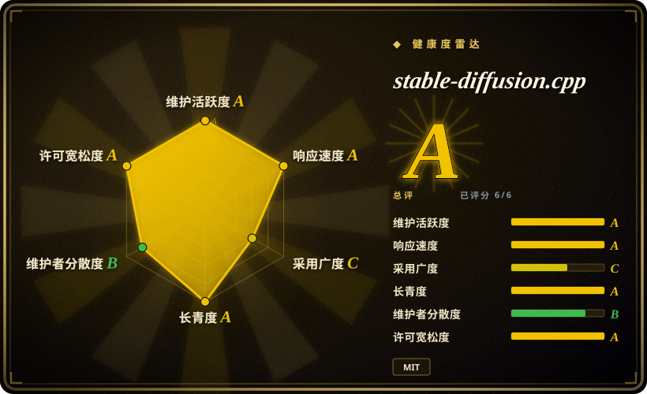
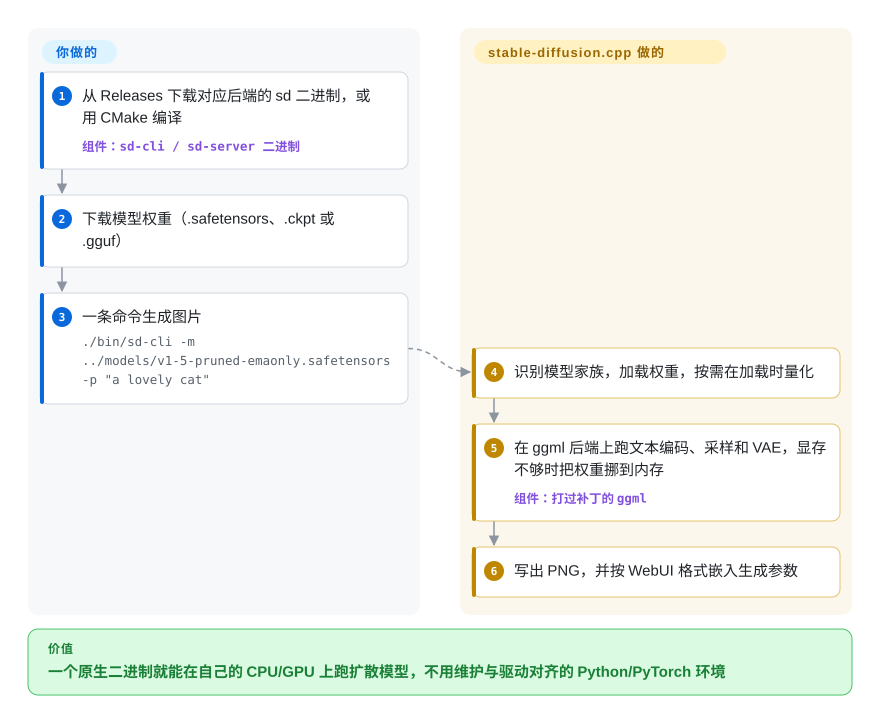

# stable-diffusion.cpp

想在笔记本、Mac、AMD 显卡甚至没有显卡的机器上出图，结果每个 Stable Diffusion 工具第一步都要你装一套 Python 环境，还得挑一个和 CUDA 驱动对得上的 PyTorch 版本。stable-diffusion.cpp 是一个原生二进制（外加一个 C 库），直接读同样的模型文件——SD、SDXL、Flux、Qwen-Image、Wan 视频等——在 CPU、CUDA、Vulkan、Metal 或 ROCm 上跑，并用 llama.cpp 那套量化把模型压进小内存。

## 何时使用

你在做一个桌面应用、游戏素材流水线或自托管服务，需要内置出图能力，但目标机器不归你管：有的是插着 6 GB AMD 显卡的 Windows，有的是 M 系列 Mac，还有一台纯 CPU 服务器。把 ComfyUI 或 AUTOMATIC1111 WebUI 装到这些机器上，意味着要为每家显卡厂商各带一份 Python 运行时和几个 GB 的 PyTorch 包，而第一条用户反馈往往就是 `torch.cuda.OutOfMemoryError: CUDA out of memory. Tried to allocate 20.00 MiB`，出现在一张本该够用的卡上。

当决定因素是**部署体积和硬件覆盖面**、而不是工作流有多丰富时，选 stable-diffusion.cpp。它是扩散模型领域的 [llama.cpp](../../llm-inference/local-runtimes/llama-cpp.zh.md)：基于 ggml 的纯 C/C++，MIT 许可，提供 CPU/CUDA/Vulkan/ROCm/macOS 预编译包，支持 GGUF 量化（文档记录 Flux-dev 在 q4_0 下约 6.4 GB，q8_0 约 12 GB），还有可链接进自己进程的 C API，以及 Python、Go、C#、Rust 的绑定。需要一个可嵌入的引擎、而不是带插件生态的图形界面时，选它而不选 [ComfyUI](comfyui.zh.md) 或 [Stable Diffusion WebUI](stable-diffusion-webui.zh.md)；不能或不愿背一套 Python/PyTorch 时，选它而不选 Diffusers。

## 怎么用起来

stable-diffusion.cpp 把每个支持的模型家族在 C++ 里用 ggml（llama.cpp 底下的同一个张量库）重写了一遍：把提示词变成数字的文本编码器、反复给潜空间图像去噪的扩散网络、把潜空间解码成像素的 VAE。你把下载好的权重文件（`.safetensors`、`.ckpt` 或 `.gguf`）交给它；它识别模型家族，可以在加载时顺手量化（`--type q4_0` 之类——用更少的位数存每个数，好塞进更小的内存），然后在二进制编译时选定的后端上跑完整条流水线。模型塞不进显存时，它把权重留在内存里（甚至按需从磁盘重读），只在某一段要计算时才搬上 GPU——慢一些，但能跑。你要负责的是：挑对并下载权重文件（大模型还要另配 VAE 和文本编码器）、选参数，以及在一次性的 `sd-cli` 和常驻的 `sd-server` 之间做选择；后者启动时加载一个模型，提供网页界面和三套 HTTP 接口：OpenAI 风格（`/v1/images/generations`）、WebUI 风格（`/sdapi/v1/txt2img`）和原生接口（`/sdcpp/v1/...`）。

<!-- flow-steps:begin (generated from flows/stable-diffusion-cpp.json by tools/flow_card.py — do not edit) -->

流程文字版

1. **你**：从 Releases 下载对应后端的 sd 二进制，或用 CMake 编译 — 组件：`sd-cli / sd-server 二进制`
2. **你**：下载模型权重（.safetensors、.ckpt 或 .gguf）
3. **你**：一条命令生成图片 — `./bin/sd-cli -m ../models/v1-5-pruned-emaonly.safetensors -p "a lovely cat"`
4. **stable-diffusion.cpp**：识别模型家族，加载权重，按需在加载时量化
5. **stable-diffusion.cpp**：在 ggml 后端上跑文本编码、采样和 VAE，显存不够时把权重挪到内存 — 组件：`打过补丁的 ggml`
6. **stable-diffusion.cpp**：写出 PNG，并按 WebUI 格式嵌入生成参数

**价值**：一个原生二进制就能在自己的 CPU/GPU 上跑扩散模型，不用维护与驱动对齐的 Python/PyTorch 环境

<!-- flow-steps:end -->

## 何时不用

- **要节点图工作流、SD 1.5 以外的 ControlNet 组合、自定义节点或庞大的插件生态，用 [ComfyUI](comfyui.zh.md)**，因为 stable-diffusion.cpp 只通过命令行参数和 API 暴露一组固定功能；README 写明 ControlNet 只支持 SD 1.5，没用 C++ 实现的功能就是没有。
- **要一个对新手友好、带局部重绘画布、插件页和大量教程的图形界面，用 [Stable Diffusion WebUI](stable-diffusion-webui.zh.md) 或 ComfyUI**，因为 stable-diffusion.cpp 自带的网页界面（2026-04 才上线）只是套在单个已加载模型外面的薄前端，不是给画师用的工作台。
- **要在 Python 里训练、微调或研究新采样器和新架构，用 Diffusers**，因为这里每个模型家族都是手工移植的 C++ 实现：新论文要等有人移植才能用，也没法像在 PyTorch 里那样随手改流水线。
- **要一个多用户或对外网开放的出图接口，就在前面加一层带鉴权的网关，或改用 LocalAI 这类服务层，别直接暴露 `sd-server`**，因为 `sd-server` 没有鉴权（API Key 的功能请求 #1988 截至 2026-09-28 仍未关闭），生成任务只在一个工作线程上对着一个已加载模型排队执行，队列满了直接返回 HTTP 429。
- **要依赖一个稳定、有版本号的 API，就钉死某个 `master-NNN` 构建并为变动预留成本，或者通过会帮你钉版本的绑定去用**，因为 README 明说“API 和命令行参数可能频繁变化”，发布是逐提交的构建标签、没有语义化版本，近期文档还记录了 C/JSON 字段改名（`tile_size_x/y` → `tile_size_w/h`）。
- **在 Apple Silicon 上追求最快速度，先拿它和 Core ML 或基于 MLX 的流水线对比测一下再定**，因为项目自己的编译指南写着 Metal 在超大矩阵运算上目前“非常低效”，还有一个未关闭的 issue（#1990）报告 M5 Max 上跑 Z-Image-Turbo 会静默输出全白图片。
- **受不了不同构建之间某个后端突然坏掉，就按后端钉一个验证过的构建，升级前先测**，因为近期未关闭的 issue 里有只影响单个后端的回归（Vulkan 上的视频模型从 master-864 起坏掉，#1976；ROCm gfx1100 在 #1994 之后启动失败，#2008），排障文档也承认维护者“硬件有限，没法测试所有组合”，而 CI 只编译打包、不跑测试集。

## 横向对比

| 替代品 | 是否收录 | 我们的评价 | 取舍 |
|---|---|---|---|
| [ComfyUI](comfyui.zh.md) | ✅ | 要把出图嵌进自己的应用、或者发到混杂的 CPU/AMD/Mac 机器上且不能带 Python，选 stable-diffusion.cpp；画师或研究者需要可组合的节点工作流和最新社区节点，选 ComfyUI。 | ComfyUI 换来最丰富的工作流和最快的新模型跟进，代价是 Python/PyTorch 栈和 GPL-3.0；stable-diffusion.cpp 换来单个 MIT 二进制和 C API，代价是功能集固定。 |
| [Stable Diffusion WebUI](stable-diffusion-webui.zh.md) | ✅ | 无界面或嵌入式出图、以及较新的模型家族（Flux、Qwen-Image、Wan），选 stable-diffusion.cpp；有人要一个成熟的分页式图形界面和经典 SD 1.x/SDXL 插件生态，选 WebUI。 | WebUI 用沉重的 Python 安装换来多年积累的插件和教程；stable-diffusion.cpp 甚至模仿了它的 `/sdapi/v1` 接口和随机数生成方式，客户端可以迁过来，但插件就没了。 |
| Diffusers（huggingface/diffusers） | 未收录 | 写 Python、需要训练或微调钩子、或者论文一发布就要用上新模型，选 Diffusers；交付物是在终端用户机器上、不带 Python 的推理，选 stable-diffusion.cpp。 | Diffusers 覆盖最广的模型和调度器，和 PyTorch 深度集成，但离不开 PyTorch/CUDA 环境；stable-diffusion.cpp 更容易分发，但只能跑已经移植过的模型。本次 tab 收录批次未添加。 |
| LocalAI（mudler/LocalAI） | 未收录 | 想用一个 OpenAI 兼容服务同时提供聊天、向量、语音和出图，选 LocalAI；只做图片/视频生成、并且想自己掌控参数和构建，直接用 stable-diffusion.cpp。 | LocalAI 把 stable-diffusion.cpp 包成自己的一个后端（`backend/go/stablediffusion-ggml`），多了模型管理和统一接口，代价是多一层封装、上游构建跟进更慢。本次 tab 收录批次未添加。 |
| Draw Things | 非仓库 | 只想在自己的 Mac 或 iPhone 上用一个打磨好、为苹果芯片优化的应用，选 Draw Things；要脚本化、嵌入或在 Windows/Linux 上跑，选 stable-diffusion.cpp。 | Draw Things 是通过 App Store 分发的闭源产品，不在本索引按仓库收录的范围内；它没法被嵌入或重新编译，而这恰恰是 stable-diffusion.cpp 的用途。 |

## 技术栈

- **语言与构建：** C++17 核心，带 C API 头文件（`include/stable-diffusion.h`：`new_sd_ctx`、`generate_image`、`generate_video`），CMake 构建。
- **张量运行时：** ggml，通过 git 子模块指向维护者的**打补丁分叉**（`leejet/ggml`，分叉自 `ggml-org/ggml`）；也支持用上游 ggml 编译，但会禁用 FP8 和 INT8 convrot 路径，还可能缺少部分算子和优化。
- **后端：** CPU（AVX/AVX2/AVX512）、CUDA、Vulkan、Metal、OpenCL、SYCL、HIP/ROCm 和 MUSA，外加 RPC 后端；提供 flash attention 和 SageAttention（CUDA）选项。
- **模型：** SD 1.x/2.x/XL/3/3.5、FLUX.1/FLUX.2、Chroma、Qwen-Image（含编辑版）、Z-Image、PixArt 以及许多较新的图像家族；视频有 Wan 2.1/2.2、LTX-2.x、HunyuanVideo 1.5、MiniMax-H3；支持 LoRA、LCM、PhotoMaker、IP-Adapter、TAESD、ESRGAN 放大。
- **权重格式：** `.ckpt`/`.pth`、`.safetensors`、`.gguf`；`-M convert` 可以提前写出量化后的 GGUF（或 safetensors）。
- **前端：** `sd-cli`、`sd-server`（HTTP 接口 + 内嵌网页界面，界面来自 `leejet/sdcpp-webui` 子模块，用 Node.js/pnpm 构建），用 libwebp/libwebm 输出 WebP 和 WebM。

## 依赖

- **运行时：** 一个自包含的二进制或共享库——不需要 Python，也不需要 PyTorch。GPU SDK（CUDA toolkit、ROCm、Vulkan SDK）只在编译时需要；Windows CUDA 版发布包另附一个 `cudart` 压缩包。
- **预编译包（截至 2026-09-27 的 master-929）：** Windows 有 CPU/CUDA 12/Vulkan/ROCm，Linux（Ubuntu 24.04）有 CPU/Vulkan/ROCm，macOS 有 arm64。没有 Linux CUDA 预编译包，所以 Linux + NVIDIA 要自己从源码编译（或用 Docker）。
- **模型：** 权重要自己从 Hugging Face 等处下载；较新的家族需要好几个文件（扩散模型 + VAE + 一个或多个文本编码器）。权重许可和代码的 MIT 许可相互独立——例如 FLUX.1-dev 的模型卡标注的是非商用许可。
- **硬件：** 编译指南建议 CUDA 至少 4 GB 显存；文档记录 SD 1.x 在 512×512 下约需 2 GB 内存，Flux-dev 从约 3.7 GB（q2_k）到约 12 GB（q8_0）不等。
- **绑定（可选，第三方）：** README 列出了 Python（`stable-diffusion-cpp-python`）、Go、C#、Rust 和 Flutter/Dart 封装。

## 运维难度

**中。** 跑一个预编译二进制很简单；持续的成本在周边。每个模型家族都要挑对权重文件和配套编码器，每台机器都要选内存参数（`--offload-to-cpu`、`--params-backend`、`--vae-tiling`、`--diffusion-fa`），还得自己钉版本，因为没有语义化版本，后端回归也确实会发生。某些后端、模型、权重格式组合下会因数值溢出出现全黑或全白图片，这是文档记录的故障模式，需要手动加 `--linear-scale`/`--attn-scale` 绕过。`sd-server` 一旦离开本机（默认绑定 `127.0.0.1:1234`）就需要反向代理来补鉴权和 TLS，而且一个进程只服务一个模型，要托管多个模型就得起多个进程。

## 健康度与可持续性

- **维护：** 非常活跃——2023-08-13 创建，2026-09-27 仍有推送，仅 2026-09-27 一天就发布了多个 `master-NNN` 构建，新模型家族往往在发布几天内就被支持（2026-09-20 宣布 Qwen-Image-2.1 “Day-0” 支持）。近期 issue 首次回复的中位时间约 27 小时（雷达 A）；长期不活跃的 issue 和 PR 由工作流自动关闭。
- **治理与巴士因子：** 个人账号项目。雷达给治理打 B：近 12 个月有 68 位活跃贡献者，但第一名占约 53% 的提交，前三名约 74%。所有者 `leejet` 在 2026-06-28 以来约 170 个提交里写了约 101 个，历史累计 453 个；第二梯队（wbruna、stduhpf、fszontagh）稳定存在。路线图和打补丁的 ggml 分叉都握在一个人手里；没有写明任何基金会或公司支持。
- **背书与 Lindy：** 项目约三年，仍在加速，并已成为 ggml 系扩散推理的默认引擎。在一个年轻领域里，这是还不错的 Lindy 先验，但要按单人治理打折扣。
- **采用与生态：** 约 7.4k 星、约 830 个 fork；雷达里采用度的 C 只按约 14.7 万次 release 附件下载计算，漏掉了从源码编译、绑定和嵌入它的应用，应当看作下限。LocalAI 和 KoboldCpp 用它做出图后端，有五种语言的绑定。Python 绑定的覆盖面不大（截至 2026-09-28 的一个月内 PyPI 下载约 1.8k）。
- **风险信号：** 代码为 MIT，未发现改许可证历史；真正的风险是没有语义化版本的 API/CLI 变动、手工移植的模型库广度超出维护者手头硬件的测试能力，以及依赖打补丁的 ggml 分叉而非上游。

## 存疑（未验证）

- [未验证] 显存/内存数字（Flux 4–6 GB、SD 1.x 约 2 GB、Flux 量化对照表）来自项目自己的文档；我没有运行这个二进制，也没有在任何硬件上做基准测试。
- [推断] “任务逐个执行”是从 `examples/server/main.cpp`（只起一个 `async_job_worker` 线程）和 `async_jobs.cpp` 里共享的 `sd_ctx_mutex` 读出来的；没有对服务做压测。
- [推断] “CI 不跑测试集”是从 `.github/workflows/build.yml`（只有编译和打包任务）以及 CONTRIBUTING 里“不要提交测试代码”的要求推断的；维护者可能在本地测试。
- [未验证] 打补丁的 `leejet/ggml` 分叉会不会持续与上游 ggml 同步、或者合并回上游，我没找到任何说明。
- [未验证] LocalAI 跟进上游 stable-diffusion.cpp 构建较慢，是根据其封装架构推测的；没有比对它钉住的提交。
- [未验证] 各模型的功能覆盖（LoRA、ControlNet、PhotoMaker、flash attention 分别能在哪个家族、哪个后端上用）分散在各模型文档页里，没有汇总矩阵，这里也没测过。
- [未验证] 星标、fork 和下载数截至 2026-09-28，会随时间变化。
