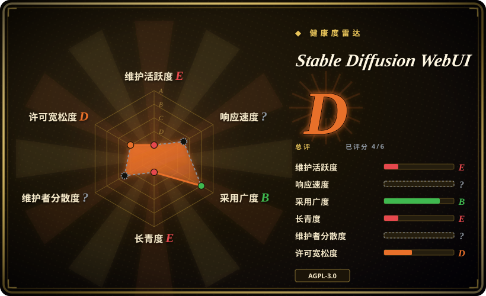
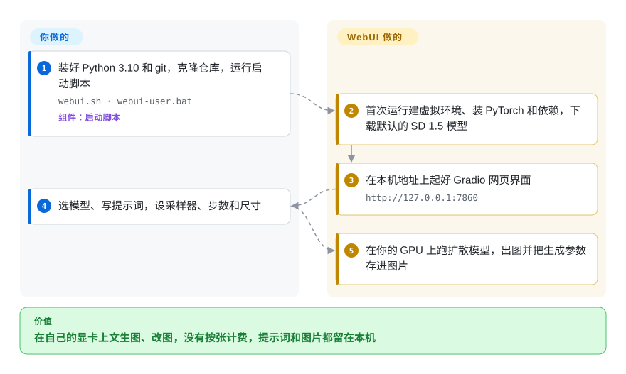

# Stable Diffusion WebUI

基于 Gradio 构建的 Stable Diffusion 图像生成 Web 界面，支持 txt2img、img2img、局部重绘、扩图、超分及丰富的插件生态，面向本地 GPU 推理。

## 何时使用

你是一名创作者、研究者或开发者，想在自有硬件上用文本提示生成图像或编辑现有图像。你需要一个本地 Web UI，可以在里面写提示词、调整采样参数、做局部重绘来移除或添加对象、运行 img2img 进行风格迁移，并用文本反演训练自定义嵌入。你选择 Stable Diffusion WebUI 而不是 ComfyUI，因为你想要传统的标签页界面而非节点图；你选它而不是 InvokeAI，因为它的扩展生态更大、文档更丰富；你偏好它而不是 Fooocus，因为你需要完整的参数控制而非简化预设。你有一块至少 6–8 GB 显存的 NVIDIA GPU，并熟悉安装 Python 包和管理模型 checkpoint。你安装 WebUI，下载 Stable Diffusion checkpoint，打开浏览器标签页即可开始生成——无需云积分、无需 API key，对模型和输出完全可控。选它之前要知道核心已经冻结：默认分支自 2024-07 起没有提交，所以它适合 SD 1.5/SDXL 时代的工作流和现成的 A1111 扩展，不适合更新的模型家族。

## 怎么用起来

WebUI 是一个 Python 网页应用，把 Stable Diffusion——一个从随机噪声出发、按提示词一步步“去噪”成图的模型——包在一个用 Gradio（把 Python 函数变成网页表单的库）做的分页浏览器界面后面。**安装的活由启动脚本替你干**：首次运行时它建虚拟环境、装 PyTorch 和其他依赖，如果 `models/Stable-diffusion/` 里还没有模型，就下载一个默认的 SD 1.5 checkpoint（几 GB 的权重文件），然后在 `http://127.0.0.1:7860` 起好界面。**你负责提供显卡、挑模型、写提示词和参数**；它在你的显卡上跑采样，并把生成参数写进每张图里，之后可以原样读回。txt2img 之外的功能——img2img、局部重绘、放大、ControlNet 之类的插件——都在同一组标签页里，或者是从界面里装的社区扩展；这是它的长处，也是升级时最容易出事的地方。

<!-- flow-steps:begin (generated from flows/stable-diffusion-webui.json by tools/flow_card.py — do not edit) -->

流程文字版

1. **你**：装好 Python 3.10 和 git，克隆仓库，运行启动脚本 — `webui.sh · webui-user.bat` — 组件：`启动脚本`
2. **Stable Diffusion WebUI**：首次运行建虚拟环境、装 PyTorch 和依赖，下载默认的 SD 1.5 模型
3. **Stable Diffusion WebUI**：在本机地址上起好 Gradio 网页界面 — `http://127.0.0.1:7860`
4. **你**：选模型、写提示词，设采样器、步数和尺寸
5. **Stable Diffusion WebUI**：在你的 GPU 上跑扩散模型，出图并把生成参数存进图片

**价值**：在自己的显卡上文生图、改图，没有按张计费，提示词和图片都留在本机

<!-- flow-steps:end -->

## 何时不用

- **核心已冻结——先看这条。** 默认分支 `master` 自 2024-07-27 起没有新提交（v1.10.1 于 2025-02 从这个提交发布）；只有零星的安装兼容修复进了 `dev` 分支（最近一次 2026-03-02）。新的模型家族和采样器不会再加进来。如果你是从零开始，或者要用较新的模型，请改用每周发版的 [ComfyUI](comfyui.zh.md)，别把工作流搭在一个停滞的核心上。
- **纯 CPU 推理。**如果你没有 GPU 却需要运行 diffusion 模型，请改用 Midjourney 或 DALL-E 等云 API，而不是 Stable Diffusion WebUI，因为 diffusion 模型在 CPU 上运行极慢（单张图需数分钟），本工具为 CUDA GPU 设计。
- **未核查 AGPL-3.0 的商业用途。**如果你需要本地运行且对商业衍生限制更宽松的 diffusion 工具，请改用 ComfyUI（GPL-3.0，copyleft 范围不同）或云 API，而不是 Stable Diffusion WebUI，因为它的 AGPL-3.0 带有强网络 copyleft 义务，可能影响你的分发计划。
- **零配置或非技术用户。**如果你想要一键消费级体验，不想管理 Python、CUDA 和模型权重，请改用 Fooocus 或 Midjourney 等云服务，而不是 Stable Diffusion WebUI，因为安装需要 Python、PyTorch、CUDA 驱动，并管理数 GB 的模型文件。
- **团队多用户部署。**如果你需要内置 RBAC、队列管理或用户隔离的共享服务器，请改用 ComfyUI（队列管理更好）或托管云 API，而不是 Stable Diffusion WebUI，因为它没有原生多用户隔离，并发用户会互相干扰生成任务和设置。
- **偏好托管云服务。**如果你不想管理 GPU、驱动和模型文件，想要托管 API，请改用 Midjourney、DALL-E 或 Stable Diffusion API 服务，而不是 Stable Diffusion WebUI，因为它严格自托管。
- **严格可复现需求。**如果你需要跨机器可复现、版本可控的工作流，请改用 ComfyUI 搭配 JSON 工作流导出，或以编程方式使用 Diffusers（Hugging Face），而不是 Stable Diffusion WebUI，因为它暴露了数百个参数、采样器选择和扩展交互，在不同 PyTorch/CUDA 版本下复现完全一致很困难。

## 横向对比

| 替代品 | 是否收录 | 我们的评价 | 取舍 |
|---|---|---|---|
| [ComfyUI](comfyui.zh.md) | ✅ | 新搭环境、要用较新的模型或要可导出的批量管线时，选 ComfyUI；只有当你依赖 WebUI 的分页界面和现有 A1111 扩展时，才继续用 WebUI。 | ComfyUI 在积极维护，节点图能存成可复用的 JSON 工作流，但节点图比 WebUI 的标签页更难上手。 |
| InvokeAI | 未收录 | 在分层画布上反复修图比 A1111 的扩展目录更重要时，选 InvokeAI。 | 更聚焦艺术工作流，自带画布；扩展生态不如 WebUI 丰富。 |
| Fooocus | 未收录 | 只想输入提示词出图、靠预设不调参数时，选 Fooocus；需要每个采样参数都能调时，留在 WebUI。 | 预设精简、控制项最少；对新手友好，但对高级用户限制较大。 |
| DiffusionBee | 未收录 | 在 Mac 上，原生应用、免装 Python 比扩展和 NVIDIA 优化速度更重要时，选 DiffusionBee。 | 无命令行或扩展生态；针对 Apple Silicon 优化，但平台锁定。 |
| Midjourney / DALL-E | 非仓库 | 没有合适的显卡或不想运维时，选托管服务；模型、提示词和图片必须留在自己机器上时，选 WebUI。 | 专有模型、订阅制、无本地控制；WebUI 开源且在你自己的 GPU 上运行。 |

## 技术栈

- **Python**——主要实现语言
- **Gradio**——前端 Web UI 框架
- **PyTorch**——模型推理的深度学习框架
- **CUDA**——通过 NVIDIA 驱动进行 GPU 加速
- **Stable Diffusion 模型**——运行时加载的社区 checkpoint、LoRA、嵌入和 VAE

## 依赖

- **NVIDIA GPU**，至少 6 GB 显存（大模型和高分辨率推荐 8 GB+）
- **Python 3.10+** 及匹配的 PyTorch/CUDA 版本
- **模型 checkpoint**——从社区 hub（如 Civitai、Hugging Face）下载的数 GB `.safetensors` 或 `.ckpt` 文件
- **可选：xformers**——用于内存高效 attention 和加速
- **可选：GFPGAN、CodeFormer、RealESRGAN**——用于 Extras 标签页的人脸修复和超分

## 运维难度

**中等。** 基础安装有一键脚本，但真正的负担在于保持 Python 环境、PyTorch、CUDA 驱动和扩展生态的兼容性。扩展更新可能在 `git pull` 后破坏 WebUI，模型文件占用数十 GB 磁盘空间。GPU 温度管理、显存限制和 batch size 调优是持续的关注点。对个人工作站而言可管理；对共享服务器或生产管线，要预期频繁排障。

## 健康度与可持续性

- **维护（截至 2026-10-08）——核心冻结，评级 E。** 默认分支自 2024-07-27 起没有提交；最近 13 周 0 周活跃。协作者 `w-e-w` 仍在 `dev` 分支零星合入安装修复（Blackwell 显卡、PyTorch 2.7、uv、setuptools——最近一次 2026-03-02），所以“新机器还能装上”有人在保，但功能不再前进。
- **响应速度——无法计算**（评分窗口里没有符合条件的 issue/PR 流量）；约 2.5k 个 open issue 基本无人分拣，与核心冻结的状态一致。
- **治理 / bus factor。** 由单个 `User` 账号（`AUTOMATIC1111`）持有，没有组织或基金会；路线图取决于这一个人是否回来。[推断]
- **年龄 × Lindy——长青度评级 E。** 2022-08 创建（1508 天，约 4 年），而 Lindy 里“仍活跃”那一半已经失效：这是老而停滞，不是老而活跃。
- **结论——综合 D。** SD 1.5/SDXL 时代的现成工具照样能用；但要长期跟着升级的东西，别拿它当底座。
- **采用度——B，盘子仍大。** 约 165k star、约 580 万次 release 资产下载；扩展生态和教程是它的护城河，这也是它冻结后仍值得一提的原因。
- **风险标记——许可评级 D。** 应用本身是 AGPL-3.0（强网络 copyleft）；模型和扩展各有许可。没有改许可的历史。

## 存疑（未验证）

- [未验证] `AUTOMATIC1111` 用户账户的精确维护状态及其持续可用性未公开记录；bus factor 是真实关切。
- [未验证] 2026-03-02 那次推送是 `dev` 分支的安装修复；截至 2026-10-08，`master` 自 2024-07-27 起没有变化。作者是否打算恢复功能开发，我们没找到任何说明。
- [未验证] 单个模型 checkpoint 和扩展带有各自的许可和安全过滤器；工具的 AGPL-3.0 不约束你下载的权重。
- [推断] 约 165k star 数既反映真实受欢迎度，也来自 2022–2023 的 AI 绘画热潮；部分曝光由炒作驱动，而非当前活跃用户信号。
- [未验证] 具体显存需求因模型大小、分辨率和启用的扩展差异巨大；"6–8 GB" 是经验法则，非保证。
