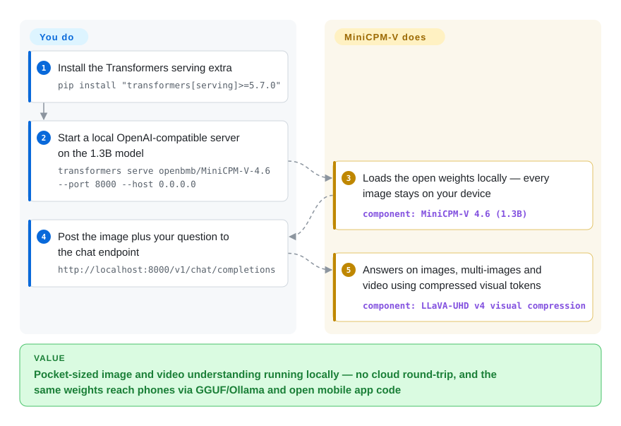

# MiniCPM-V

Your feature has to *see* — read a receipt, answer questions about a photo, follow a short video — and it must not ship those pixels to someone else's API. MiniCPM-V (and its omni-modal sibling MiniCPM-o) are OpenBMB's pocket-sized multimodal LLMs: small vision-language models tuned for maximum performance per parameter, released as open weights with GGUF/quantized builds and open-sourced iOS/Android/HarmonyOS app code, so a 1.3B model can understand images and video on-device.

## When to use

You're building a product feature that has to *see* — read a receipt, describe a photo, answer questions about a short video clip, OCR a form — and it has to run **on the device**, not in your cloud. Maybe it's a mobile app where users scan documents and you can't ship every image to a server (privacy, offline use, per-call cost), or an embedded/edge box with a modest GPU or just a capable CPU. A frontier cloud VLM would be overkill and would mean a network round-trip and an API bill that scales with usage; a text-only small model can't see at all.

So you reach for MiniCPM-V. Today that means **MiniCPM-V 4.6** (released 2026-05): 1.3B total parameters — a SigLIP2-400M vision encoder over a Qwen3.5-0.8B LLM per the README — which the project benchmarks above larger models like Gemma 4 E2B and claims ~1.5× the token throughput of Qwen3.5-0.8B itself (project-reported). You pull the open weights and deploy down the edge path: the GGUF build runs under llama.cpp with reported few-token-per-second decoding on a phone, landed in the official Ollama model library in June 2026, and there are int4/BNB/AWQ/GPTQ variants; the Model Zoo lists the 4.6 GGUF tier at ~2 GB for CPU. Or you need live speech and camera rather than snapshots: **MiniCPM-o 4.5** (9B, 2026-02) adds real-time full-duplex omni-modal streaming — it sees, listens and speaks at once — which the project says matches Gemini 2.5 Flash on those tasks.

## How it works

The models are a vision encoder bolted to a small LLM: images/video frames are turned into visual tokens, and the language backbone answers about them like it answers about words. The engineering that makes them "pocket-sized" is on the vision side — MiniCPM-V 4.6 uses the LLaVA-UHD v4 "intra-ViT early compression" technique, shrinking visual-token count (mixed 4×/16× compression) so visual encoding costs less than half the FLOPs of the uncompressed path, with a knob to trade accuracy for speed per task. What the project does for you: open checkpoints (HF + ModelScope), GGUF/BNB/AWQ/GPTQ quantized builds, upstream support in llama.cpp/vLLM/SGLang/Ollama, a `transformers serve` OpenAI-compatible path, and open-sourced iOS/Android/HarmonyOS adaptation code plus demo apps. What stays yours: picking the generation and quantization, validating accuracy after quantization, fitting the device's memory/latency budget, and checking the specific model card's license terms — the code and the current weights (4.6, 4.6-gguf, o 4.5) are tagged Apache-2.0 on Hugging Face as of 2026-09-28, but that was not always uniform across generations.

<!-- flow-steps:begin (generated from flows/minicpm-v.json by tools/flow_card.py — do not edit) -->

Text version of the flow

1. **You**: Install the Transformers serving extra — `pip install "transformers[serving]>=5.7.0"`
2. **You**: Start a local OpenAI-compatible server on the 1.3B model — `transformers serve openbmb/MiniCPM-V-4.6 --port 8000 --host 0.0.0.0`
3. **MiniCPM-V**: Loads the open weights locally — every image stays on your device — component: `MiniCPM-V 4.6 (1.3B)`
4. **You**: Post the image plus your question to the chat endpoint — `http://localhost:8000/v1/chat/completions`
5. **MiniCPM-V**: Answers on images, multi-images and video using compressed visual tokens — component: `LLaVA-UHD v4 visual compression`

**Value**: Pocket-sized image and video understanding running locally — no cloud round-trip, and the same weights reach phones via GGUF/Ollama and open mobile app code

<!-- flow-steps:end -->

## When NOT to use

- **You want frontier multimodal quality.** For the hardest vision/video reasoning, top cloud models (GPT-4o class, Gemini) still lead at the flagship end — a pocket-sized VLM trades absolute quality for footprint. If accuracy is the binding constraint and you can afford the cloud, use the big model.
- **You skipped the per-card license check.** The repo code is Apache-2.0 and the current model cards (MiniCPM-V 4.6, 4.6-GGUF, MiniCPM-o 4.5) are tagged Apache-2.0 on Hugging Face (checked 2026-09-28) — but older generations had differing terms, so verify the *specific* model card you intend to ship rather than inheriting this sentence.
- **You expected plug-and-play.** Getting a VLM onto a phone or edge box is real work: choosing a quantization (GGUF/BNB/AWQ/GPTQ), wiring the runtime, fitting the memory/latency budget, and validating quality after quantization. The two current lines even want different Python stacks — 4.6 runs on `transformers>=5.7.0`, while the MiniCPM-o 4.5 reference path pins `transformers==4.51.0` per the README. Budget integration effort.
- **Your task is text-only.** This is a *multimodal* model; if you don't need vision/audio, a text-only small language model will be smaller and faster for the same job — don't pay the vision tax you won't use.
- **You need an audited, frozen, supported SDK.** It reads as a fast-moving research-org release with rapid model turnover (4.5 → 4.6 in under a year, o-line redesign every ~18 months), not a long-term-supported product SDK with stability guarantees.

## Comparison

| Alternative | In index | Our verdict | Tradeoff |
|---|---|---|---|
| Qwen-VL / Qwen3.5 small line (Alibaba) | 未收录 | Choose the Qwen small models when you want the biggest general-purpose open family and don't need three-platform mobile app code shipped with it. | Broader size range and ecosystem than MiniCPM-V; the README itself benchmarks MiniCPM-V 4.6 against Qwen3.5-0.8B and claims a win on vision tasks at ~1.5× throughput (project-reported), so verify on your data. |
| LLaVA | 未收录 | Choose LLaVA when you need the influential open VLM recipe/lineage. | The influential open VLM recipe/lineage; great for research and fine-tuning, but generally larger / less optimized for edge deployment out of the box. |
| SmolVLM (Hugging Face) | 未收录 | Choose SmolVLM when explicitly tiny on-device VLMs are the priority. | Explicitly tiny VLMs for on-device; comparable "small + multimodal" niche, often even smaller, but typically less capable on video and a narrower model lineup than MiniCPM-V's generations. |
| GPT-4o / Gemini (cloud) | 非仓库 | Choose cloud frontier models when quality and zero deployment effort outweigh offline/device constraints. | Frontier multimodal quality and zero deployment effort, but cloud-only — network dependency, per-call cost, no offline/on-device, and your data leaves the device. The opposite tradeoff from MiniCPM-V. |
| [BitNet](bitnet.md) | ✅ | Choose BitNet when you need a 1.58-bit text LLM inference framework for CPU efficiency. | 1.58-bit *text* LLM inference framework for CPU energy efficiency — a different layer/modality; not a vision model, complementary rather than a substitute. |

## Tech stack

- **Models:** transformer vision-language models (vision encoder + LLM backbone) in the MiniCPM-V (image/multi-image/video) and MiniCPM-o (adds speech/omnimodal, full-duplex streaming) lines. Current heads: MiniCPM-V 4.6 — 1.3B total, SigLIP2-400M encoder + Qwen3.5-0.8B LLM, LLaVA-UHD v4 visual-token compression (per README); MiniCPM-o 4.5 — 9B omni.
- **Training/inference code:** Python on PyTorch / Hugging Face Transformers; weights distributed via Hugging Face and ModelScope.
- **Quantization & edge formats:** GGUF (llama.cpp), BNB (bitsandbytes int4), AWQ, GPTQ — quantized variants published per generation.
- **Serving paths:** llama.cpp, Ollama (4.6 merged into the official library 2026-06), vLLM, SGLang; `transformers serve` for a quick OpenAI-compatible server; an official hosted API (`docs/api.md`); open-sourced iOS / Android / HarmonyOS adaptation code; FlagOS multi-chip backend for the o-line.
- **Fine-tuning ecosystems:** SWIFT and LLaMA-Factory.

## Dependencies

- **Runtime:** Python + PyTorch + Transformers for the reference path (4.6 wants `transformers[torch]>=5.7.0`; the o 4.5 README pins `transformers==4.51.0`, `torch 2.3–2.8`); or llama.cpp / Ollama for the GGUF path (no Python needed at inference time there).
- **Weights:** downloaded separately from Hugging Face / ModelScope per model generation — not bundled in the repo. The Model Zoo sizes the 4.6 tiers: ~4 GB GPU for the full model, ~2 GB for GGUF on CPU, ~3 GB for BNB/AWQ/GPTQ.
- **Hardware:** a GPU helps for the full-precision path; the quantized/GGUF path targets CPU and mobile (phone-class decoding is the headline use). Memory budget is the real constraint on small devices.
- **No single install package for "the model"** — you assemble weights + a runtime; the repo provides scripts, demos and the edge adaptation code.

## Ops difficulty

**Medium.** The reference path (load a HF model, run the demo) is easy on a capable machine. The *edge* path — the reason you'd pick this — is where the work is: select a quantization format, build/run under llama.cpp or Ollama, fit the device memory and latency budget, and re-validate quality after quantization (small VLMs degrade visibly if quantized too aggressively). Mobile shipping uses the project's open-sourced iOS/Android/HarmonyOS adaptation code and demo apps (MiniCPM-V-Apps), which is integration work, not a drop-in SDK; the two current lines also straddle different Transformers version pins. There's no datastore or cluster to run for single-device inference; the friction is deployment engineering and per-model license/usage diligence, not operating a service.

## Health & viability

- **Maintenance (2026-09).** Last push 2026-09-08; model cadence is fast — MiniCPM-o 4.5 (2026-02), MiniCPM-V 4.6 (2026-05), a hosted API (2026-05), and 4.6 merged into the official Ollama library (2026-06). Note the GitHub *release tag* is stale (last one 2025-05) because drops ship via Hugging Face/Ollama, not GitHub releases — don't read the tag as inactivity.
- **Governance / backing.** OpenBMB (an open-model org with Tsinghua-affiliated/academic roots). Organizational rather than single-maintainer backing, but academic/research-org continuity is its own risk — research groups can re-prioritize or wind down a line; this is not a large-vendor SLA.
- **Age & Lindy (created 2024-01, ~2.7yr).** Across four-plus generations (2.5 → 2.6 → 4.x → 4.6, plus the o-line), each still driving real on-device deployments. **Lindy-forming** — not yet a decade, but the model line has survived multiple pivots and remains active; value rides on OpenBMB continuing it. [推断]
- **Adoption (2026-09).** ~26.5k stars (GitHub API, 2026-09-28); official support in llama.cpp/vLLM/SGLang/Ollama, ModelScope distribution, an official Ollama library entry and hosted API, plus a Cookbook and docs site — the strongest mobile-first on-device VLM story in the open field. [未验证] (production users beyond the demo apps not independently verified)
- **Risk flags.** Code Apache-2.0; the current weight cards (4.6, 4.6-GGUF, o 4.5) are tagged Apache-2.0 on HF as of 2026-09-28, but per-generation terms have varied historically — keep the per-card check. Secondary: rapid model turnover means a "supported version" is really "whatever generation shipped this year".

## Caveats (unverified)

- [未验证] Star count ~26.5k (GitHub API, 2026-09-28) drifts continuously; indicative only.
- [未验证] Benchmark claims — beating Gemma 4 E2B, ~1.5× Qwen3.5-0.8B throughput, "approaches Gemini 2.5 Flash" (o 4.5), Artificial Analysis index scores — are the project's own README claims against their stated conditions; not independently reproduced here.
- [未验证] "4.6 built on the Qwen3.5-0.8B LLM" is the README's description of the backbone; training provenance details were not verified from papers or model cards beyond that line.
- [未验证] Per-model **weight** acceptable-use terms may still differ card-to-card and generation-to-generation; the Apache-2.0 tags checked on 2026-09-28 cover the current HF cards (4.6, 4.6-gguf, o 4.5), not a blanket statement for old or future models.
- [推断] Creation date ~2024-01 from GitHub API `created_at`; age treated as approximate.
- [未验证] On-device performance ("6–8 token/s decoding on phones", GGUF ~2 GB tier) is quoted from the README news entry (2024-05, a 2.5-era figure) and Model Zoo table respectively; real numbers vary by device, model, and quantization.
