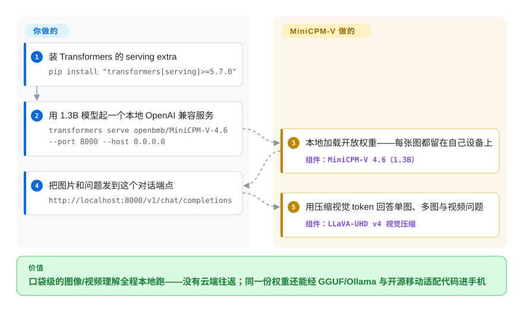

# MiniCPM-V

你的功能必须“看得见”——读小票、回答照片里的问题、跟一段短视频——而且不能把这些像素送到别人的 API 上。MiniCPM-V（及全模态姊妹线 MiniCPM-o）是 OpenBMB 的“口袋级”多模态 LLM：按每参数性能最大化调优的小型视觉语言模型，以开放权重发布，附 GGUF/量化构建和开源的 iOS/Android/HarmonyOS App 代码，1.3B 的模型就能在端侧理解图像与视频。

## 何时使用

你在做一个必须“看得见”的产品功能——读小票、描述照片、回答关于一段短视频的问题、对表单做 OCR——而且它得**跑在设备上**，不能走你的云。也许是个移动应用，用户扫描文档，你不能把每张图都传到服务器（隐私、离线可用、按次成本）；也许是个边缘盒子，只有一块普通 GPU 甚至只有一颗还算能打的 CPU。前沿云端 VLM 在这里是杀鸡用牛刀，还要承担网络往返和随用量线性增长的 API 账单；而纯文本小模型根本看不见。

于是你选 MiniCPM-V。今天它意味着 **MiniCPM-V 4.6**（2026-05 发布）：总参数 1.3B——按 README 的说法是 SigLIP2-400M 视觉编码器加 Qwen3.5-0.8B 语言主干——项目自报在基准上超过 Gemma 4 E2B 这类更大的模型，吞吐约为 Qwen3.5-0.8B 自身的 1.5 倍（项目自报，见存疑）。你拉下开放权重，沿边缘路径部署：GGUF 构建在 llama.cpp 下运行，手机上有每秒数 token 的解码记录，2026 年 6 月并入 Ollama 官方模型库，还有 int4/BNB/AWQ/GPTQ 量化版；Model Zoo 把 4.6 的 GGUF 档标到 CPU 约 2GB。如果你要的不是静态图问答，而是实时语音加摄像头：**MiniCPM-o 4.5**（9B，2026-02）带来实时全双工全模态流——边看、边听、边说——项目称在这些任务上逼近 Gemini 2.5 Flash。

## 怎么用起来

这类模型就是“视觉编码器 + 小 LLM”的拼接：图像/视频帧被转成视觉 token，语言主干像回答文字一样回答它们。让它“口袋化”的功夫在视觉侧——MiniCPM-V 4.6 用 LLaVA-UHD v4 的 intra-ViT 早期压缩技术，把视觉 token 数量压下来（4 倍/16 倍混合压缩率），视觉编码计算量削掉一半以上，还留了一个按任务换精度/速度的旋钮。它替你做：开放 checkpoint（HF 加 ModelScope）、GGUF/BNB/AWQ/GPTQ 量化构建、llama.cpp/vLLM/SGLang/Ollama 的上游支持、`transformers serve` 的 OpenAI 兼容快路径、官方托管 API，以及开源的 iOS/Android/HarmonyOS 适配代码和演示 App。仍归你管：选代次和量化格式、量化后重新验证精度、把设备内存/延迟塞进预算，以及核对具体模型卡的许可条款——代码与当前权重（4.6、4.6-gguf、o 4.5）截至 2026-09-28 在 Hugging Face 上都标着 Apache-2.0，但历代模型并非一直如此整齐。

<!-- flow-steps:begin (generated from flows/minicpm-v.json by tools/flow_card.py — do not edit) -->

流程文字版

1. **你**：装 Transformers 的 serving extra — `pip install "transformers[serving]>=5.7.0"`
2. **你**：用 1.3B 模型起一个本地 OpenAI 兼容服务 — `transformers serve openbmb/MiniCPM-V-4.6 --port 8000 --host 0.0.0.0`
3. **MiniCPM-V**：本地加载开放权重——每张图都留在自己设备上 — 组件：`MiniCPM-V 4.6（1.3B）`
4. **你**：把图片和问题发到这个对话端点 — `http://localhost:8000/v1/chat/completions`
5. **MiniCPM-V**：用压缩视觉 token 回答单图、多图与视频问题 — 组件：`LLaVA-UHD v4 视觉压缩`

**价值**：口袋级的图像/视频理解全程本地跑——没有云端往返；同一份权重还能经 GGUF/Ollama 与开源移动适配代码进手机

<!-- flow-steps:end -->

## 何时不用

- **你要前沿多模态质量。** 对最难的视觉/视频推理，旗舰端的顶级云模型（GPT-4o 级、Gemini）仍然领先——口袋级 VLM 是拿绝对质量换占用。如果精度是硬约束、又付得起云端，请用大模型。
- **你跳过了逐卡许可核对。** 仓库代码是 Apache-2.0，当前模型卡（MiniCPM-V 4.6、4.6-GGUF、MiniCPM-o 4.5）在 Hugging Face 上也标着 Apache-2.0（2026-09-28 核对）——但更早的代次条款曾有不同，所以请核对你要上线的**那个具体模型卡**，而不是直接套用这句话。
- **你以为是即插即用。** 把一个 VLM 塞进手机或边缘盒子是实打实的工作量：选量化（GGUF/BNB/AWQ/GPTQ）、接运行时、把内存/延迟塞进预算、量化后还要重新验证质量。两条当前线甚至要不同的 Python 栈——4.6 用 `transformers>=5.7.0`，而 o 4.5 的参考路径按 README 钉在 `transformers==4.51.0`。请预留集成成本。
- **你的任务是纯文本。** 这是*多模态*模型；若你不需要视觉/语音，纯文本小语言模型做同样的活会更小更快——别为用不上的视觉能力买单。
- **你要一个经过审计、冻结、受支持的 SDK。** 它读起来更像一个模型快速换代的研究机构发布（4.5 → 4.6 不到一年，o 线约每 18 个月重做一次），而非带稳定性承诺、长期支持的产品 SDK。

## 横向对比

| 替代品 | 是否收录 | 我们的评价 | 取舍 |
|---|---|---|---|
| Qwen-VL / Qwen3.5 小尺寸线（阿里） | 未收录 | 需要最大的通用开放模型家族、且不指望官方随发三平台移动 App 代码时，选 Qwen 小模型。 | 尺寸跨度与生态比 MiniCPM-V 更广；README 自己拿 MiniCPM-V 4.6 与 Qwen3.5-0.8B 对打并自称视觉任务占优、吞吐约 1.5 倍（项目自报），请在你的数据上验证。 |
| LLaVA | 未收录 | 需要影响力很大的开放 VLM 配方/谱系时，选 LLaVA。 | 影响力很大的开放 VLM 配方/谱系；适合研究与微调，但通常更大、开箱即用时对边缘部署的优化更少。 |
| SmolVLM（Hugging Face） | 未收录 | 明确面向端侧的超小 VLM 是优先级时，选 SmolVLM。 | 明确面向端侧的超小 VLM；同属“小 + 多模态”赛道，往往更小，但通常视频能力更弱、型号阵容比 MiniCPM-V 各代要窄。 |
| GPT-4o / Gemini（云端） | 非仓库 | 前沿质量和零部署成本高于离线/端侧约束时，选云端模型。 | 前沿多模态质量、零部署成本，但仅限云端——网络依赖、按次成本、无离线/端侧，且数据离开设备。与 MiniCPM-V 正好相反的取舍。 |
| [BitNet](bitnet.zh.md) | ✅ | 需要面向 CPU 能效的 1.58-bit 文本 LLM 推理框架时，选 BitNet。 | 面向 CPU 能效的 1.58-bit *文本* LLM 推理框架——层次/模态都不同；它不是视觉模型，与本项目互补而非替代。 |

## 技术栈

- **模型：** transformer 视觉语言模型（视觉编码器 + LLM 主干），分 MiniCPM-V（图像/多图/视频）与 MiniCPM-o（加语音/全模态、全双工流式）两条线。当前头牌：MiniCPM-V 4.6——共 1.3B，SigLIP2-400M 编码器加 Qwen3.5-0.8B 主干，LLaVA-UHD v4 视觉 token 压缩（按 README）；MiniCPM-o 4.5——9B 全模态。
- **训练/推理代码：** Python，基于 PyTorch / Hugging Face Transformers；权重经 Hugging Face 与 ModelScope 分发。
- **量化与边缘格式：** GGUF（llama.cpp）、BNB（bitsandbytes int4）、AWQ、GPTQ——每代都发布量化变体。
- **服务路径：** llama.cpp、Ollama（4.6 于 2026-06 并入官方库）、vLLM、SGLang；快速 OpenAI 兼容服务用 `transformers serve`；官方托管 API（`docs/api.md`）；开源的 iOS / Android / HarmonyOS 适配代码；o 线还有 FlagOS 多芯片后端。
- **微调生态：** SWIFT 与 LLaMA-Factory。

## 依赖

- **运行时：** 参考路径用 Python + PyTorch + Transformers（4.6 要 `transformers[torch]>=5.7.0`；o 4.5 的 README 钉 `transformers==4.51.0`、`torch 2.3–2.8`）；或 GGUF 路径用 llama.cpp / Ollama（那条路推理时不需要 Python）。
- **权重：** 按模型代次从 Hugging Face / ModelScope 单独下载——不随仓库打包。Model Zoo 给出 4.6 各档体量：完整模型 GPU 约 4GB，GGUF CPU 约 2GB，BNB/AWQ/GPTQ 约 3GB。
- **硬件：** 全精度路径有 GPU 更好；量化/GGUF 路径面向 CPU 与移动端（手机级解码是头条用法）。小设备上内存预算才是真正的约束。
- **没有单一的“模型”安装包**——你要自己拼装权重 + 运行时；仓库提供脚本、demo 与边缘适配代码。

## 运维难度

**中等。** 参考路径（加载 HF 模型、跑 demo）在能打的机器上很简单。*边缘*路径——你选它的真正理由——才是工作量所在：选量化格式、在 llama.cpp 或 Ollama 下构建/运行、把设备内存与延迟塞进预算、量化后重新验证质量（小 VLM 量化太狠会明显劣化）。移动端上线用项目开源的 iOS/Android/HarmonyOS 适配代码与演示 App（MiniCPM-V-Apps），这是集成工作，不是即插即用的 SDK；两条当前线还横跨不同的 Transformers 版本钉。单设备推理没有数据库或集群要运维；摩擦在于部署工程与逐模型的许可/使用尽调，而非运营一个服务。

## 健康度与可持续性

- **维护（2026-09）：** 最后 push 2026-09-08；模型节奏很快——MiniCPM-o 4.5（2026-02）、MiniCPM-V 4.6（2026-05）、托管 API（2026-05）、4.6 并入 Ollama 官方库（2026-06）。注意 GitHub 的 release tag 已陈旧（最后一个还是 2025-05），因为发布走 Hugging Face/Ollama 而不打 GitHub tag——别把 tag 当成停更信号。
- **治理 / 背书：** OpenBMB（一个有清华关联/学术渊源的开放模型组织）。这是组织而非单一维护者的背书，但学术/研究机构的延续性本身是一种风险——研究团队可能重新排期或收掉某条线；这不是大厂的 SLA。
- **年龄与 Lindy（创建于 2024-01，约 2.7 年）：** 历经四代以上（2.5 → 2.6 → 4.x → 4.6，外加 o 线），每一代都带来真实的端侧部署。**Lindy 正在成形**——还没到十年，但这条模型线扛过了多次转向且仍然活跃；价值押在 OpenBMB 能否持续。[推断]
- **采用度（2026-09）：** 约 26.5k star（GitHub API，2026-09-28）；llama.cpp/vLLM/SGLang/Ollama 官方支持、ModelScope 分发、Ollama 官方库条目与托管 API，外加 Cookbook 与文档站——是开放领域里移动端故事最完整的端侧 VLM。[未验证]（演示 App 之外的生产采用未独立核实）
- **风险标记：** 代码 Apache-2.0；当前权重卡（4.6、4.6-GGUF、o 4.5）截至 2026-09-28 在 HF 标 Apache-2.0，但历代条款历史上并不整齐——逐卡核对要保留。次级风险：模型快速换代意味着“受支持版本”实际上是“今年发的那一代”。

## 存疑（未验证）

- [未验证] star 数约 26.5k（GitHub API，2026-09-28）持续漂移——仅作参考。
- [未验证] 基准声明——超过 Gemma 4 E2B、约 1.5 倍 Qwen3.5-0.8B 吞吐、“逼近 Gemini 2.5 Flash”（o 4.5）、Artificial Analysis 指数得分——均为项目 README 在自述条件下的说法，本页未独立复现。
- [未验证] “4.6 基于 Qwen3.5-0.8B 语言主干构建”是 README 对主干的描述；训练来龙去脉未在论文或模型卡上进一步核实。
- [未验证] 逐模型的权重*使用条款*仍可能逐卡、逐代不同；2026-09-28 核对的 Apache-2.0 标签只覆盖当前 HF 卡（4.6、4.6-gguf、o 4.5），不是对旧模型或未来模型的一概而论。
- [推断] 创建日期约 2024-01 取自 GitHub API 的 `created_at`；年龄按近似处理。
- [未验证] 端侧性能数字（“手机每秒 6–8 token 解码”出自 2024-05 的 2.5 时代新闻条目；GGUF 约 2GB 档出自 Model Zoo 表）各自来源年代不同；实际数字随设备、模型、量化而变。
