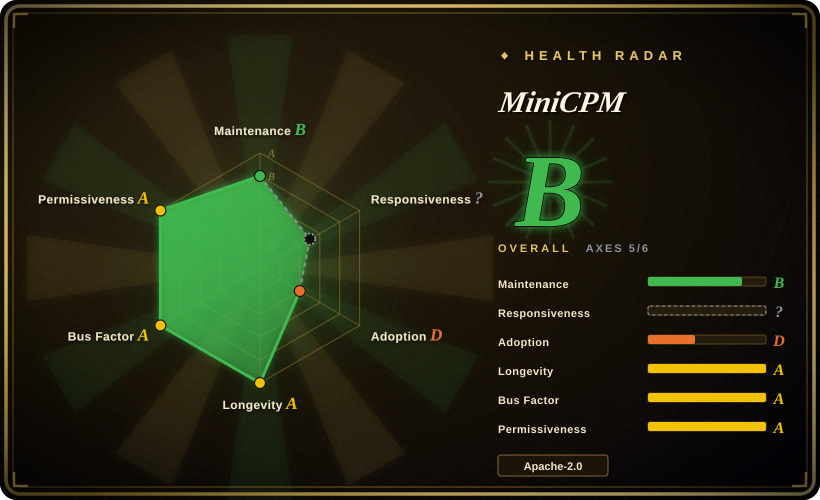
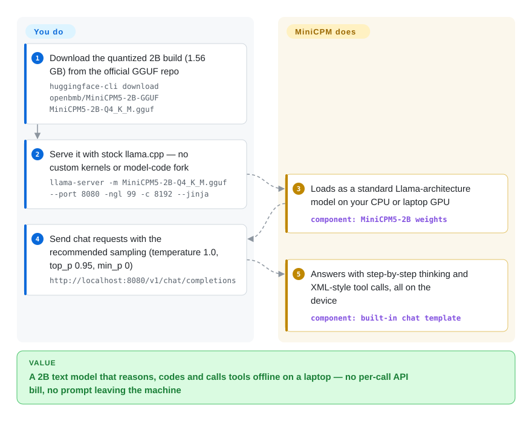

# MiniCPM

You want a chatbot, coding helper or tool-calling agent that runs on a laptop, phone or cheap box — no API bill per request, no prompt leaving the machine — but 7B-class models don't fit and the tiny ones fall apart on reasoning. MiniCPM is OpenBMB's line of 1–2B text models trained to punch above their size, shipped as open weights plus ready GGUF/MLX builds, deployment cookbooks and agent skills for every common local runtime.

## When to use

You're building something that needs a language model *on the device*: a local coding or tool-using assistant on developers' laptops, an offline helper inside a desktop app, a box on a factory floor with a modest CPU, or an agent whose prompts may not leave the company network. A 7–8B model needs ~5 GB of memory even at 4-bit and crawls on a CPU; a 0.5B model fits but answers `1+1=?` with three paragraphs and forgets the tool schema. You need something in between that still reasons and emits tool calls you can parse.

So you reach for MiniCPM — today that means **MiniCPM5-2B** (released 2026-09-07; 2.5B parameters, 2.0B without embeddings, 128K context) or **MiniCPM5-1B** (2026-05). Its Q4_K_M GGUF is 1.56 GB (the 1B's is 657 MB), it loads as a standard `LlamaForCausalLM` in stock llama.cpp, Ollama, LM Studio, MLX, vLLM and SGLang with no custom kernels, and the README benchmarks it above Qwen3.5-2B, Gemma-4-E2B-it and LFM2.5-2.6B on code, math, long context and tool use (project-reported). What decides it against those substitutes: an Apache-2.0 2B whose maintainers ship a per-runtime cookbook *and* a paired agent skill for each backend and fine-tuning framework, and publish the pre-/post-training datasets (UltraData) alongside it — so you can reproduce, fine-tune and deploy without reverse-engineering anyone's recipe. Pick the 4B Gemma/Qwen tier instead when you have the memory to spare.

## How it works

MiniCPM is a model, not a runtime: OpenBMB trains small dense transformers and hands you the weights; the existing local-inference engines do the running. The repo itself carries the parts around the weights — README quickstarts, single-page cookbooks under `docs/deployment` and `docs/finetune`, 18 agent skills under `skills/` that let a coding agent (Cursor, Claude Code) pick a backend and run it, fine-tuning and quantization scripts, and demos for older generations. What OpenBMB does for you: the training (a staged pre-train → mid-train → SFT → reinforcement learning → "on-policy distillation", where 16 specialist teacher models are merged back into one student), the quantized GGUF/MLX/GPTQ builds, and a chat template that switches on step-by-step "thinking" and formats tool calls as XML tags. What stays yours: choosing the size and quantization, setting the sampling parameters the cookbook asks for (llama.cpp's default `min_p` makes it loop), picking a runtime that parses its XML tool calls (SGLang ships a `minicpm5` parser), and checking quality on your own tasks — think of it as buying a well-documented engine block, not a car.

<!-- flow-steps:begin (generated from flows/minicpm.json by tools/flow_card.py — do not edit) -->

Text version of the flow

1. **You**: Download the quantized 2B build (1.56 GB) from the official GGUF repo — `huggingface-cli download openbmb/MiniCPM5-2B-GGUF MiniCPM5-2B-Q4_K_M.gguf`
2. **You**: Serve it with stock llama.cpp — no custom kernels or model-code fork — `llama-server -m MiniCPM5-2B-Q4_K_M.gguf --port 8080 -ngl 99 -c 8192 --jinja`
3. **MiniCPM**: Loads as a standard Llama-architecture model on your CPU or laptop GPU — component: `MiniCPM5-2B weights`
4. **You**: Send chat requests with the recommended sampling (temperature 1.0, top_p 0.95, min_p 0) — `http://localhost:8080/v1/chat/completions`
5. **MiniCPM**: Answers with step-by-step thinking and XML-style tool calls, all on the device — component: `built-in chat template`

**Value**: A 2B text model that reasons, codes and calls tools offline on a laptop — no per-call API bill, no prompt leaving the machine

<!-- flow-steps:end -->

## When NOT to use

- **You need images, audio or video.** MiniCPM is the *text* line. Use its sibling [MiniCPM-V](minicpm-v.md) (vision/omni-modal, same org) rather than bolting OCR onto a text model.
- **You have a GPU server and want the best answer per request.** At 1–2B it trades absolute quality for footprint; if latency and cost per call are not the constraint, serve a 7B+ open model with [vLLM](../llm-inference/serving-engines/vllm.md) or [SGLang](../llm-inference/serving-engines/sglang.md), or use a hosted frontier model.
- **You will run the 4-bit build with default sampling and expect stable output.** A 2026-09 issue (#374) measured MiniCPM5-2B Q4_K_M on HumanEval+ under llama.cpp: with the documented `--temp 1.0 --top-p 0.95` and no repeat penalty, 92% of generations ran away in the thinking channel; maintainers had not yet tested per-quant settings and recommend `repeat-penalty 1.05` only for unquantized weights. If you cannot afford tuning, use Q8_0 or the BF16 weights, or a model whose quantized builds are validated, such as the Gemma/Qwen small lines.
- **Tool calling must work on whatever runtime you pick.** It emits XML-style tool calls; SGLang's `minicpm5` parser converts them natively, but the first GGUF upload stripped the XML tags in llama.cpp/Ollama until llama.cpp itself was patched (#361, 2026-06), and a 2026-09 chat-template bug lost text around a leftover `<tool_sep>` branch (#379, fixed 2026-09-29). If your stack can't follow upstream fixes, use SGLang or a model with OpenAI-style JSON tool calls, such as Qwen.
- **You will ship an older MiniCPM checkpoint commercially without reading its card.** The repo and the MiniCPM3-4B, 4.1-8B, SALA and MiniCPM5 cards are tagged Apache-2.0 (checked 2026-10-09), but the 2024 MiniCPM-2B card still points to OpenBMB's "General Model License" (source attribution, publicity restriction, commercial authorization). Use MiniCPM5, or check the exact card you ship.
- **You want a frozen, long-supported model.** A new generation lands every 6–12 months (4 → 4.1 → SALA → 5-1B → 5-2B within 15 months), and the cookbooks follow the newest one; older lines keep weights but get no new deployment docs. If you need a stable target, pin the exact checkpoint and test upgrades yourself.

## Comparison

| Alternative | In index | Our verdict | Tradeoff |
|---|---|---|---|
| Qwen3.5 small models (QwenLM) | not indexed | Pick Qwen's 0.8B–4B line when you need the widest size ladder, multilingual coverage and the tool-call format most runtimes already parse; pick MiniCPM5 when per-runtime cookbooks, agent skills and published training data matter more. | Qwen buys a bigger ecosystem and first-class support everywhere; MiniCPM claims higher 2B-class scores against Qwen3.5-2B (project-reported) and documents every deployment path, but its XML tool format needs runtime-specific parsing. Not added in this tab batch. |
| Gemma (google-deepmind/gemma) | not indexed | Pick Gemma's E2B/E4B when you target Android/iOS through Google's edge stack and want a vendor-backed model; pick MiniCPM5 when you prefer an Apache-2.0 checkpoint with open training data. | Gemma gets first-party LiteRT-LM and AI Edge Gallery support (both indexed in this category) from Google; MiniCPM5 also ships a LiteRT-LM cookbook, but those `.litertlm` builds sit under the `litert-community` Hugging Face org and were documented by an outside contributor, not released alongside the model by Google. Not added in this tab batch. |
| SmolLM (huggingface/smollm) | not indexed | Pick SmolLM when you want a fully open small-model research artefact from Hugging Face (training code, data and evaluation in one place); pick MiniCPM5 for a stronger ready-to-deploy assistant with tool calling. | SmolLM is the transparent recipe to study and retrain; MiniCPM5 is tuned harder for agentic and reasoning tasks but its training pipeline is described, not shipped as runnable code here. Not added in this tab batch. |
| [MiniCPM-V](minicpm-v.md) | ✅ | Pick MiniCPM-V when the input includes images or video; pick MiniCPM when it is text-only, because the vision encoder and visual tokens cost memory and latency you won't use. | Same org, same deployment ecosystem; MiniCPM-V adds a vision encoder (and speech on the o-line) on top of a small LLM, MiniCPM stays smaller and faster for pure text. |
| [BitNet](bitnet.md) | ✅ | Pick BitNet when CPU energy per token is the binding constraint and a natively 1.58-bit model is acceptable; pick MiniCPM5 when answer quality on reasoning and tool use matters more than watts. | BitNet is an inference framework for ternary models with large CPU efficiency gains; MiniCPM's own ternary line (BitCPM4) is a legacy side branch, and its main models run as ordinary 4–16-bit weights. |

## Tech stack

- **Models:** dense decoder-only transformers. MiniCPM5-2B — standard `LlamaForCausalLM`, 42 layers, GQA 16 Q / 2 KV heads, 131,072-token context; MiniCPM5-1B the same recipe at 1B. Older lines: MiniCPM4/4.1-8B (InfLLM-V2 trainable sparse attention), MiniCPM-SALA (9B, 25% sparse + 75% linear attention for 1M-token context), BitCPM4 (ternary), MiniCPM3-4B, MiniCPM-2B/1B/MoE.
- **Training recipe (described, data released):** UltraData tiered data management; pre-train, mid-train, deep-thinking SFT (400B tokens for 2B), domain RL teachers, then on-policy distillation into one model. Datasets on HF: Ultra-FineWeb, UltraX, UltraData-Code/Math/SFT/RL.
- **Repo code:** Python fine-tuning scripts (`finetune/`, `minicpm_sala/finetune/`), GPTQ/AWQ/BNB quantization scripts (`quantize/`), a SGLang tool-call parser (`tool_parsers/`), demos for MiniCPM3/4 (function calling, code interpreter, MCP, survey generation), and Markdown cookbooks plus `SKILL.md` agent skills.
- **Formats:** BF16 safetensors, GGUF (F16/Q8_0/Q4_K_M), MLX, GPTQ, a DSpark speculative-decoding draft model (2B), community `.litertlm`.

## Dependencies

- **Weights** come from Hugging Face or ModelScope (`openbmb/MiniCPM5-2B`, `-GGUF`, `-MLX` …); nothing is bundled in the repo.
- **A runtime you already run:** llama.cpp / Ollama / LM Studio (GGUF, no Python), MLX on Apple Silicon, `transformers>=5.6` + PyTorch, `vllm>=0.21`, `sglang[srt]>=0.5.16` (needed for DSpark and the `minicpm5` tool parser), vLLM-Ascend on Huawei NPUs, LiteRT-LM on phones; FlagOS builds for nine domestic and foreign AI chips.
- **Hardware:** Q4_K_M GGUF is 1.56 GB (2B) / 657 MB (1B), F16 is 5.04 GB / 2.1 GB; CPU-only works, a GPU or Apple Silicon makes it interactive. MiniCPM4.1's recommended CPM.cu path needs CUDA 12+.
- **Fine-tuning:** TRL+PEFT, LLaMA-Factory, ms-swift, unsloth or xtuner — each with its own cookbook and skill.

## Ops difficulty

**Low to medium.** Low for local use: download one GGUF, run one `llama-server` or `ollama create` command, and you have an OpenAI-compatible endpoint; there is no database or cluster. It turns medium when you depend on its strengths: tool calling needs the right parser (SGLang, or a llama.cpp new enough to keep the XML tags), the 4-bit builds need sampling tuning to avoid runaway thinking, and each new generation changes the recommended runtime versions (SGLang 0.5.12 for 1B, 0.5.16 for 2B with DSpark). Fine-tuning is standard LoRA/SFT through mainstream frameworks, documented per framework.

## Health & viability

- **Maintenance (2026-10).** Active: last push 2026-09-21, a new checkpoint every few months (MiniCPM4 2025-06, 4.1 2025-09, SALA 2026-02, MiniCPM5-1B 2026-05, MiniCPM5-2B 2026-09). GitHub releases are sparse (tag `5.0` on 2026-05-26, before that 2025-07) because models ship through Hugging Face; read the changelog, not the tags.
- **Responsiveness.** Bug reports with reproductions get maintainer answers within days to weeks (#361, #374, #379 in 2026-06/09), but fixes often land on the Hugging Face model repo, not here, and some answers are "not yet tested" rather than a fix.
- **Governance & backing.** Organization-owned; developed by ModelBest Inc. with Tsinghua's THUNLP lab and Renmin University's Gaoling School of AI, 15 contributors with 13+ commits each (top contributor 59). A company plus academic labs is sturdier than one maintainer, but the roadmap is entirely theirs and a commercial pivot could change licensing again. [推断]
- **Age & Lindy.** Created 2024-01-29 (~2.7 years), still shipping a new generation every few months: Lindy-forming, not established. The line has already survived one licence change (2025-06, from the General Model License to Apache-2.0) and several architecture pivots (MoE, sparse, sparse+linear, back to plain dense).
- **Adoption.** ~11.5k stars, 788 forks (2026-10-09); MiniCPM5-2B shows ~1.27M Hugging Face downloads in its first month and an `openbmb/minicpm5` Ollama tag. Third parties contribute cookbooks (LiteRT-LM, MNN, Apple Core AI PRs). Production users beyond demos are not documented.
- **Risk flags.** Benchmarks are self-reported against a chosen comparison set; a 2026-09 issue asks for the evaluation scripts to reproduce them (#376, open). The license history means the "Apache-2.0" claim is per checkpoint, not for the whole lineage.

## Caveats (unverified)

- [未验证] Benchmark claims (2B-class SOTA, "exceeds all larger models in the comparison set", average 53.9 vs 51.1, RL+OPD gains) are the README's own; no independent reproduction, and #376 asking for the eval scripts was still open on 2026-10-09.
- [未验证] Star, fork and Hugging Face download counts were read on 2026-10-09 and drift; the ~1.27M download figure is the HF API's rolling counter, not a deployment count.
- [未验证] The 92% runaway rate for Q4_K_M comes from one user's HumanEval+ sweep on an RTX 3060 (#374); not reproduced here, and other quantizations, prompts or hardware will differ.
- [推断] The General Model License on the 2024 MiniCPM-2B card is summarized from its title ("source attribution – publicity restriction – commercial authorization"); its full terms were not read for this page.
- [推断] Treating ModelBest + THUNLP + RUC as durable backing is inference from the README's institutions list and contributor counts; no funding or governance document was found.
- [未验证] The LiteRT-LM `.litertlm` builds live under `litert-community/` on Hugging Face and were documented by an outside contributor (PR #375); their accuracy against the official weights was not checked.
- [推断] "No custom kernels" is the README's claim for MiniCPM5; it was not tested here on each listed runtime version.
