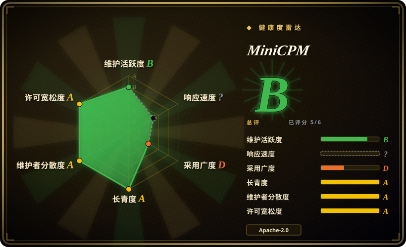
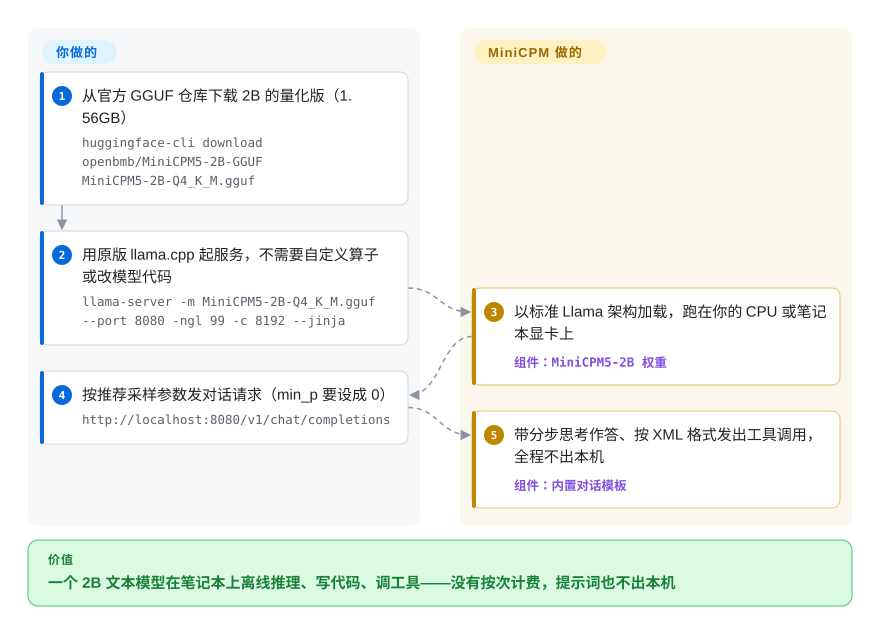

# MiniCPM

你想在笔记本、手机或一台便宜的小盒子上跑一个聊天助手、写代码的帮手或会调工具的 agent——不按次付 API 费，提示词也不出本机——可 7B 级模型塞不下，再小的模型一遇到推理就露馅。MiniCPM 是 OpenBMB 的 1–2B 文本模型系列，专门训练成“以小博大”，随权重一起给出现成的 GGUF/MLX 量化版，以及覆盖常见本地运行时的部署手册和 agent 技能。

## 何时使用

你在做一个需要“模型就在设备上”的东西：开发者笔记本上的本地编码或工具助手、桌面应用里的离线帮手、车间里一台只有普通 CPU 的盒子，或者提示词不能出公司内网的 agent。7–8B 模型就算量化到 4 bit 也要约 5GB 内存，在 CPU 上慢得没法用；0.5B 模型倒是装得下，可问它 `1+1=?` 它能回你三段话，工具的参数格式也记不住。你要的是中间那一档：还能推理，吐出的工具调用还能被程序解析。

这时你会想到 MiniCPM——眼下指的是 **MiniCPM5-2B**（2026-09-07 发布；2.5B 参数，去掉词表嵌入后 2.0B，128K 上下文）或 **MiniCPM5-1B**（2026-05）。它的 Q4_K_M GGUF 只有 1.56GB（1B 版 657MB），在原版 llama.cpp、Ollama、LM Studio、MLX、vLLM、SGLang 里都按标准 `LlamaForCausalLM` 直接加载，不需要自定义算子；README 自己的评测称它在代码、数学、长上下文和工具调用上胜过 Qwen3.5-2B、Gemma-4-E2B-it 与 LFM2.5-2.6B（项目自报）。和这些替代品比，决定性的是：一个 Apache-2.0 的 2B 模型，维护方给每个推理后端和微调框架都配了单页手册**和**一份配套 agent 技能，还把预训练、后训练数据集（UltraData）一起公开——复现、微调、部署都不用去猜别人的配方。如果内存够用，换 Gemma/Qwen 的 4B 档更合适。

## 怎么用起来

MiniCPM 是模型，不是运行时：OpenBMB 负责训练小型稠密 transformer 并交出权重，真正“跑”它的是现有的本地推理引擎。仓库里装的是权重周边的东西——README 快速上手、`docs/deployment` 与 `docs/finetune` 下的单页手册、`skills/` 下 18 个 agent 技能（让 Cursor、Claude Code 这类编码 agent 自己挑后端并执行）、微调和量化脚本，以及前几代的演示程序。OpenBMB 替你做的：训练（分阶段的预训练 → 中训练 → 监督微调 → 强化学习 → “在线策略蒸馏”，即把 16 个分领域的老师模型的本事合并回一个学生模型）、GGUF/MLX/GPTQ 量化版，以及一个对话模板——它能打开逐步“思考”，并把工具调用写成 XML 标签。留给你的：选尺寸和量化档、按手册设采样参数（llama.cpp 默认的 `min_p` 会让它陷入复读）、选一个能解析其 XML 工具调用的运行时（SGLang 自带 `minicpm5` 解析器），以及在你自己的任务上验质量——好比买来一台文档齐全的发动机，车身得自己装。

<!-- flow-steps:begin (generated from flows/minicpm.json by tools/flow_card.py — do not edit) -->

流程文字版

1. **你**：从官方 GGUF 仓库下载 2B 的量化版（1.56GB） — `huggingface-cli download openbmb/MiniCPM5-2B-GGUF MiniCPM5-2B-Q4_K_M.gguf`
2. **你**：用原版 llama.cpp 起服务，不需要自定义算子或改模型代码 — `llama-server -m MiniCPM5-2B-Q4_K_M.gguf --port 8080 -ngl 99 -c 8192 --jinja`
3. **MiniCPM**：以标准 Llama 架构加载，跑在你的 CPU 或笔记本显卡上 — 组件：`MiniCPM5-2B 权重`
4. **你**：按推荐采样参数发对话请求（min_p 要设成 0） — `http://localhost:8080/v1/chat/completions`
5. **MiniCPM**：带分步思考作答、按 XML 格式发出工具调用，全程不出本机 — 组件：`内置对话模板`

**价值**：一个 2B 文本模型在笔记本上离线推理、写代码、调工具——没有按次计费，提示词也不出本机

<!-- flow-steps:end -->

## 何时不用

- **你需要处理图片、语音或视频。** MiniCPM 是*文本*线。请用同一机构的兄弟项目 [MiniCPM-V](minicpm-v.zh.md)（视觉/全模态），别在文本模型外面硬接 OCR。
- **你有 GPU 服务器，只求每次回答最好。** 1–2B 是拿绝对质量换体积；如果单次延迟和成本不是约束，用 [vLLM](../llm-inference/serving-engines/vllm.zh.md) 或 [SGLang](../llm-inference/serving-engines/sglang.zh.md) 跑一个 7B 以上的开放模型，或直接用托管的前沿模型。
- **你打算用默认采样跑 4 bit 量化版，还指望输出稳定。** 2026-09 的一个 issue（#374）在 llama.cpp 下用 HumanEval+ 测了 MiniCPM5-2B Q4_K_M：按文档写的 `--temp 1.0 --top-p 0.95`、不加重复惩罚，92% 的生成在思考段失控停不下来；维护方回复尚未做分量化档的测试，`repeat-penalty 1.05` 只是针对未量化权重的建议。没有精力调参的话，用 Q8_0 或 BF16 权重，或者换量化版经过验证的模型，比如 Gemma/Qwen 的小尺寸线。
- **你要求在任意运行时上工具调用都能用。** 它输出 XML 格式的工具调用；SGLang 的 `minicpm5` 解析器能原生转换，但最初上传的 GGUF 在 llama.cpp/Ollama 里会把 XML 标签吞掉，直到 llama.cpp 自己打了补丁才恢复（#361，2026-06）；2026-09 还出过一个对话模板缺陷，残留的 `<tool_sep>` 分支会丢文字（#379，2026-09-29 修复）。如果你的技术栈跟不上上游修复，用 SGLang，或换一个输出 OpenAI 风格 JSON 工具调用的模型，比如 Qwen。
- **你要商用更早的 MiniCPM 权重却不看模型卡。** 仓库本身以及 MiniCPM3-4B、4.1-8B、SALA、MiniCPM5 的模型卡都标着 Apache-2.0（2026-10-09 核对），但 2024 年的 MiniCPM-2B 模型卡仍指向 OpenBMB 的“通用模型许可协议”（来源说明、宣传限制、商业授权）。请用 MiniCPM5，或逐一核对你要上线的那张卡。
- **你要一个冻结、长期支持的模型。** 每 6–12 个月就换一代（4 → 4.1 → SALA → 5-1B → 5-2B，15 个月内），手册只跟最新一代走；老系列权重还在，但不再有新的部署文档。需要稳定目标就钉死具体权重版本，升级自己测。

## 横向对比

| 替代品 | 是否收录 | 我们的评价 | 取舍 |
|---|---|---|---|
| Qwen3.5 小尺寸模型（QwenLM） | 未收录 | 需要最全的尺寸梯度、多语种覆盖，以及大多数运行时已能解析的工具调用格式时，选 Qwen 的 0.8B–4B 线；更看重逐后端手册、agent 技能和公开训练数据时，选 MiniCPM5。 | Qwen 换来更大的生态和各处的一等支持；MiniCPM 自称 2B 档分数高于 Qwen3.5-2B（项目自报），部署路径也都有文档，但它的 XML 工具格式要按运行时专门解析。本批 tab 收录未加入。 |
| Gemma（google-deepmind/gemma） | 未收录 | 目标是经由 Google 端侧栈上 Android/iOS、又想要大厂背书的模型时，选 Gemma 的 E2B/E4B；偏好带公开训练数据的 Apache-2.0 权重时，选 MiniCPM5。 | Gemma 有 Google 自家的 LiteRT-LM 与 AI Edge Gallery 一方支持（两者都已收录在本分类）；MiniCPM5 也有 LiteRT-LM 手册，但那些 `.litertlm` 文件放在 Hugging Face 的 `litert-community` 组织下、由外部贡献者写的文档，不是 Google 随模型一起发布的。本批 tab 收录未加入。 |
| SmolLM（huggingface/smollm） | 未收录 | 想要 Hugging Face 出品、完全公开的小模型研究成果（训练代码、数据、评测都在一处）时，选 SmolLM；想要开箱即可部署、能调工具的更强助手时，选 MiniCPM5。 | SmolLM 是拿来研究和重训的透明配方；MiniCPM5 在 agent 与推理任务上调得更狠，但这里只描述了训练流程，没有附可运行的训练代码。本批 tab 收录未加入。 |
| [MiniCPM-V](minicpm-v.zh.md) | ✅ | 输入里有图片或视频时选 MiniCPM-V；纯文本时选 MiniCPM，因为视觉编码器和视觉 token 会占用你用不上的内存与延迟。 | 同一机构、同一套部署生态；MiniCPM-V 在小 LLM 之上加了视觉编码器（o 线还加了语音），MiniCPM 做纯文本更小更快。 |
| [BitNet](bitnet.zh.md) | ✅ | CPU 每个 token 的能耗是硬约束、且能接受原生 1.58 bit 模型时，选 BitNet；推理与工具调用的回答质量比瓦数更重要时，选 MiniCPM5。 | BitNet 是三值模型的推理框架，CPU 能效提升大；MiniCPM 自己的三值线（BitCPM4）是遗留支线，主力模型跑的是普通 4–16 bit 权重。 |

## 技术栈

- **模型：** 稠密的纯解码器 transformer。MiniCPM5-2B——标准 `LlamaForCausalLM`，42 层，GQA 16 个查询头 / 2 个 KV 头，131,072 token 上下文；MiniCPM5-1B 是同一配方的 1B 版。更早的线：MiniCPM4/4.1-8B（InfLLM-V2 可训练稀疏注意力）、MiniCPM-SALA（9B，25% 稀疏 + 75% 线性注意力，支持百万 token 上下文）、BitCPM4（三值）、MiniCPM3-4B、MiniCPM-2B/1B/MoE。
- **训练配方（有描述、数据已公开）：** UltraData 分级数据管理；预训练、中训练、深度思考 SFT（2B 用了 400B token）、分领域 RL 老师，再在线策略蒸馏成一个模型。HF 上的数据集：Ultra-FineWeb、UltraX、UltraData-Code/Math/SFT/RL。
- **仓库代码：** Python 微调脚本（`finetune/`、`minicpm_sala/finetune/`）、GPTQ/AWQ/BNB 量化脚本（`quantize/`）、一个 SGLang 工具调用解析器（`tool_parsers/`）、MiniCPM3/4 的演示（函数调用、代码解释器、MCP、综述生成），以及 Markdown 手册和 `SKILL.md` agent 技能。
- **格式：** BF16 safetensors、GGUF（F16/Q8_0/Q4_K_M）、MLX、GPTQ、一个 DSpark 投机解码草稿模型（2B），以及社区的 `.litertlm`。

## 依赖

- **权重**从 Hugging Face 或 ModelScope 下载（`openbmb/MiniCPM5-2B`、`-GGUF`、`-MLX` 等），仓库里不带。
- **一个你本来就在用的运行时：** llama.cpp / Ollama / LM Studio（GGUF，无需 Python）、Apple Silicon 上的 MLX、`transformers>=5.6` + PyTorch、`vllm>=0.21`、`sglang[srt]>=0.5.16`（DSpark 与 `minicpm5` 工具解析器需要它）、华为 NPU 上的 vLLM-Ascend、手机上的 LiteRT-LM；另有面向九种国内外 AI 芯片的 FlagOS 构建。
- **硬件：** Q4_K_M GGUF 为 1.56GB（2B）/ 657MB（1B），F16 为 5.04GB / 2.1GB；纯 CPU 能跑，有 GPU 或 Apple Silicon 才算流畅。MiniCPM4.1 推荐的 CPM.cu 路径需要 CUDA 12+。
- **微调：** TRL+PEFT、LLaMA-Factory、ms-swift、unsloth 或 xtuner——每个都有自己的手册和技能。

## 运维难度

**低到中。** 本地用很省事：下一个 GGUF，跑一条 `llama-server` 或 `ollama create`，就有了 OpenAI 兼容的接口，不用数据库也不用集群。一旦依赖它的长处就升到中等：工具调用要配对的解析器（SGLang，或新到能保留 XML 标签的 llama.cpp），4 bit 版要调采样参数才不会思考失控，每一代还会改推荐的运行时版本（1B 要 SGLang 0.5.12，2B 带 DSpark 要 0.5.16）。微调是主流框架里的标准 LoRA/SFT，每个框架都有文档。

## 健康度与可持续性

- **维护（2026-10）。** 活跃：最近一次推送 2026-09-21，每隔几个月出一个新权重（MiniCPM4 2025-06、4.1 2025-09、SALA 2026-02、MiniCPM5-1B 2026-05、MiniCPM5-2B 2026-09）。GitHub release 很稀疏（标签 `5.0` 在 2026-05-26，再之前是 2025-07），因为模型经 Hugging Face 发布；看 changelog，别看标签。
- **响应。** 带复现的缺陷报告通常几天到几周内有维护者回复（#361、#374、#379，2026-06/09），但修复常落在 Hugging Face 的模型仓库而不是这里，有些回复是“还没测过”而不是修复。
- **治理与背书。** 组织账号所有；由面壁智能（ModelBest）联合清华 THUNLP 实验室和人大高瓴人工智能学院开发，提交数 13 次以上的贡献者有 15 位（最多的 59 次）。公司加高校实验室比单人维护稳，但路线图完全由他们定，一次商业转向就可能再改许可。[推断]
- **年龄与 Lindy。** 创建于 2024-01-29（约 2.7 年），仍每几个月出一代：属于“正在形成 Lindy”，还谈不上久经考验。这条线已经经历过一次许可变更（2025-06，从通用模型许可协议改为 Apache-2.0），以及好几次架构转向（MoE、稀疏、稀疏+线性，又回到普通稠密）。
- **采用。** 约 1.15 万 star、788 fork（2026-10-09）；MiniCPM5-2B 发布首月在 Hugging Face 显示约 127 万次下载，Ollama 上有 `openbmb/minicpm5` 标签。外部贡献者在补手册（LiteRT-LM、MNN、Apple Core AI 的 PR）。演示之外的生产用户没有公开记录。
- **风险信号。** 评测是项目对自选对照组的自报；2026-09 有 issue 要求公开评测脚本以便复现（#376，未关闭）。许可历史意味着“Apache-2.0”是按权重逐个成立的，不是整条线一概如此。

## 存疑（未验证）

- [未验证] 评测结论（2B 档 SOTA、“超过对照组里所有更大的模型”、均分 53.9 对 51.1、RL+OPD 的提升）都出自 README 本身；没有独立复现，要求公开评测脚本的 #376 截至 2026-10-09 仍未关闭。
- [未验证] star、fork 与 Hugging Face 下载数读取于 2026-10-09，会持续变化；约 127 万的下载数是 HF API 的滚动计数，不等于部署量。
- [未验证] Q4_K_M 92% 失控率来自一位用户在 RTX 3060 上的 HumanEval+ 扫参（#374）；这里没有复现，换量化档、提示词或硬件结果都会不同。
- [推断] 2024 年 MiniCPM-2B 模型卡上的“通用模型许可协议”只按其标题（来源说明-宣传限制-商业授权）概括，本页没有通读全文条款。
- [推断] 把面壁智能 + THUNLP + 人大视为持久背书，是从 README 的机构列表和贡献者数量推出来的；没有找到资金或治理文件。
- [未验证] LiteRT-LM 的 `.litertlm` 文件放在 Hugging Face 的 `litert-community/` 下，文档由外部贡献者写（PR #375）；没有核对它与官方权重的精度差异。
- [推断] “不需要自定义算子”是 README 对 MiniCPM5 的说法，本页没有在每个列出的运行时版本上实测。
