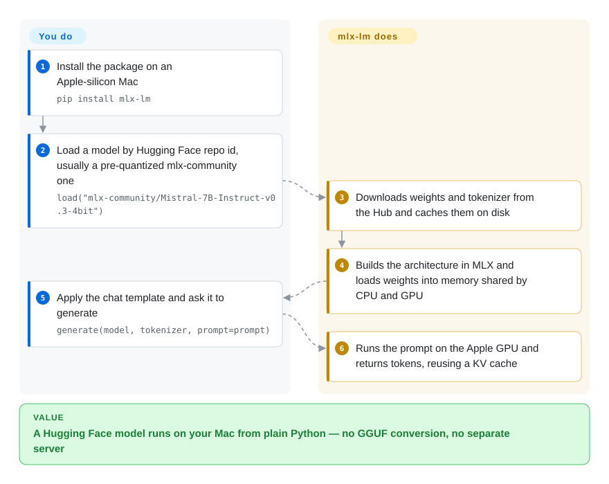

# MLX / mlx-lm

A new open-weight model lands on Hugging Face and you want it running on your Mac today — but the usual routes mean converting it to GGUF for llama.cpp, or coaxing a PyTorch stack onto Apple's GPU, and fine-tuning is yet another toolchain. mlx-lm is the MLX team's own Python package: one `pip install`, then one command pulls the model from the Hub and generates, chats, serves, quantizes or LoRA-fine-tunes it on Apple silicon.

## When to use

You're an ML engineer or researcher working on an M-series Mac with 32–128 GB of memory, and your job is to try models, not to run a fleet. A new model shows up as `mistralai/...` or `Qwen/...` on the Hub; you want to compare it against last month's, squeeze it into 4-bit so it fits next to your IDE, and run a quick LoRA on a few thousand of your own examples — without renting a cloud GPU. With llama.cpp you would first convert to GGUF and still have no training story; with a PyTorch stack you would be working through its Apple-GPU (MPS) backend. With mlx-lm it is `mlx_lm.generate --model mlx-community/Mistral-7B-Instruct-v0.3-4bit --prompt "..."`, `mlx_lm.convert --model <hf-repo> -q`, and `mlx_lm.lora --model <path> --train --data <dir>` — one package, one memory model, Python all the way down.

You also reach for it when you are *building* something Mac-local in Python — an eval harness, an agent loop, a Mac server like oMLX — and want a library API (`load`, `generate`, `stream_generate`, prompt caches) rather than an HTTP hop to a separate daemon. That is why several Mac-local servers in this index sit on top of it. Pick it over Ollama or llama.cpp when Python access, same-day architecture support and on-device fine-tuning matter more than a cross-platform binary and a model manager.

## How it works

MLX is Apple's array framework — think NumPy/PyTorch, but designed around the *unified memory* of Apple chips, where the CPU and GPU read the same RAM so tensors never have to be copied to a separate graphics card. mlx-lm reimplements each supported model architecture in MLX (one file per family under `mlx_lm/models`), reads the Hugging Face weights and tokenizer, and runs generation with a *KV cache* — the stored attention state of tokens already read, so they are not recomputed on every new token. **What it does for you:** download and cache the model, quantize it (store weights in 4 or 8 bits instead of 16, so a model needs roughly a quarter to half the memory), generate or stream tokens, cache long prompts to a file, serve an OpenAI-style HTTP endpoint on `localhost:8080`, and train LoRA adapters — small add-on weight matrices — or fuse them back into the model. **What stays yours:** choosing a model and quantization that fit in RAM, the prompts and training data, and, for big models, raising macOS's GPU wired-memory limit with `sysctl`. The CLI and the Python API are two doors to the same code; the card follows the Python one.

<!-- flow-steps:begin (generated from flows/mlx-mlx-lm.json by tools/flow_card.py — do not edit) -->

Text version of the flow

1. **You**: Install the package on an Apple-silicon Mac — `pip install mlx-lm`
2. **You**: Load a model by Hugging Face repo id, usually a pre-quantized mlx-community one — `load("mlx-community/Mistral-7B-Instruct-v0.3-4bit")`
3. **MLX / mlx-lm**: Downloads weights and tokenizer from the Hub and caches them on disk
4. **MLX / mlx-lm**: Builds the architecture in MLX and loads weights into memory shared by CPU and GPU
5. **You**: Apply the chat template and ask it to generate — `generate(model, tokenizer, prompt=prompt)`
6. **MLX / mlx-lm**: Runs the prompt on the Apple GPU and returns tokens, reusing a KV cache

**Value**: A Hugging Face model runs on your Mac from plain Python — no GGUF conversion, no separate server

<!-- flow-steps:end -->

## When NOT to use

- **You are not on Apple silicon, or you are serving many users on NVIDIA GPUs.** Use [vLLM](../llm-inference/serving-engines/vllm.md) for GPU serving with continuous batching and paged attention, or [llama.cpp](../llm-inference/local-runtimes/llama-cpp.md) for CPU/CUDA/Vulkan on any OS. mlx-lm does ship `cuda12`/`cuda13`/`cpu` extras through MLX's newer backends, but its README, benchmarks and community models are Mac-first.
- **You need a production API.** The upstream server doc says `mlx_lm.server` "is not recommended for production as it only implements basic security checks", and a quantized KV cache (`--kv-bits`) turns batching off. For a Mac that serves coding agents all day, use [oMLX](../llm-inference/local-runtimes/omlx.md) (continuous batching plus an SSD-tiered cache, built on mlx-lm); for a real multi-tenant service, a GPU engine like vLLM.
- **You want a model manager, not a Python package.** Non-developers and "just give me a local endpoint" setups are better served by [Ollama](../llm-inference/local-runtimes/ollama.md): pull/run by name, background daemon, cross-platform, GGUF library — at the cost of Python-level control and training.
- **Decode speed on one specific model family is the bottleneck.** [MTPLX](../llm-inference/local-runtimes/mtplx.md) uses the model's own multi-token-prediction heads for speculative decoding on Qwen/Gemma packs; mlx-lm is the general-purpose baseline it builds on.
- **Your model takes images, audio or video.** mlx-lm is text-in/text-out; vision-language models on MLX live in the separate `mlx-vlm` project (not indexed).
- **Serious fine-tuning beyond one machine's memory.** LoRA/QLoRA/DoRA and full fine-tuning on a single Mac is the sweet spot; multi-GPU or large-scale runs belong on CUDA with [Unsloth](../llm-training/unsloth.md) or a full training stack.
- **You need a stable API contract.** It is still 0.x and moves fast (0.30 → 0.32 between January and October 2026, `transformers>=5.7` floor); pin the version if other code imports it.

## Comparison

| Alternative | In index | Our verdict | Tradeoff |
|---|---|---|---|
| [llama.cpp](../llm-inference/local-runtimes/llama-cpp.md) | ✅ | When one inference binary must run on Mac, Linux, Windows and CPU-only boxes from the same GGUF files, pick llama.cpp; pick mlx-lm when you are Mac-only and want Python access plus quantize/fine-tune in the same package. | llama.cpp gains portability and the GGUF ecosystem but has no training path; mlx-lm gains Python-native APIs and LoRA but is tied to MLX and, in practice, Apple silicon. |
| [Ollama](../llm-inference/local-runtimes/ollama.md) | ✅ | When the goal is a local endpoint someone can install and forget, pick Ollama; pick mlx-lm when you are the developer who needs to load, modify, evaluate or fine-tune the model in Python. | Ollama trades control for a daemon, model registry and cross-platform installer; mlx-lm trades that convenience for direct library access and same-day Hugging Face models. |
| [oMLX](../llm-inference/local-runtimes/omlx.md) | ✅ | When a Mac must serve long-context coding agents continuously, pick oMLX; stay on plain mlx-lm when you need the library, the CLI tools or training rather than a managed server. | oMLX adds continuous batching, an SSD-tiered KV cache and a menu-bar app on top of mlx-lm, but it is a younger, smaller project layered on the same engine. |
| [MTPLX](../llm-inference/local-runtimes/mtplx.md) | ✅ | When decode latency of MTP-capable Qwen/Gemma models is the bottleneck, pick MTPLX; for any other model or for training, mlx-lm is the general baseline. | MTPLX gains speed from the model's own prediction heads but only on its published packs; mlx-lm covers far more architectures at standard decode speed. |
| mlx-vlm (`Blaizzy/mlx-vlm`) | not indexed | When the model takes images, audio or video, pick mlx-vlm; for text-only LLMs use mlx-lm, which the MLX team maintains directly. | mlx-vlm extends the MLX stack to multimodal models but is a separate community-led repo with its own release cadence. |

## Tech stack

- **Language:** Python ≥ 3.11 (`pyproject.toml`; classifiers list 3.11–3.13, macOS and Linux).
- **Compute:** [MLX](https://github.com/ml-explore/mlx) (`mlx>=0.32.2` on macOS) — Apple's C++/Metal array framework with Python bindings; optional `mlx[cuda12]`, `mlx[cuda13]` and `mlx[cpu]` back-ends via extras.
- **Model I/O:** Hugging Face `transformers>=5.7.0` (tokenizers/configs), `huggingface_hub` cache, `sentencepiece`, `protobuf`, `jinja2` (chat templates), safetensors weights; `mlx_lm.fuse --export-gguf` can write GGUF for some model types.
- **Surface:** Python API (`load`, `generate`, `stream_generate`, `convert`, sampler / logits-processor hooks) and CLIs `mlx_lm.generate`, `chat`, `convert`, `lora`, `fuse`, `server`, `cache_prompt`, `evaluate`, `benchmark`, plus AWQ/GPTQ/DWQ quantizers.
- **Server:** standard-library `http.server` (`ThreadingHTTPServer`) exposing OpenAI-style chat/completions routes, with tool-call parsers per model family.

## Dependencies

- **Hardware:** an Apple-silicon Mac is the primary target; memory must hold the (quantized) weights plus KV cache. Wiring memory for large models needs macOS 15+.
- **Runtime:** `pip install mlx-lm` (or conda-forge) pulls MLX, numpy, transformers and friends; training needs the `[train]` extra (`datasets`, `tqdm`), evaluation `[evaluate]` (`lm-eval`).
- **Network:** first use downloads from the Hugging Face Hub (or point `--model` at a local path); `--trust-remote-code` is prompted for tokenizers that need it.
- **No external services** for local generation, conversion or training.

## Ops difficulty

**Low for local use, medium if you serve.** On one Mac it is a pip install and a model cache on disk. The work shows up when you (1) size models to memory — models close to total RAM fall back to slow paging until you raise `iogpu.wired_limit_mb` with `sudo sysctl`; (2) expose `mlx_lm.server` — no auth, single process, so keep it on localhost or behind a proxy; (3) upgrade — a 0.x library with minor releases every few weeks and a moving `transformers` floor, so pin it in anything that imports it.

## Health & viability

- **Maintenance (2026-10-08):** very active — commits in 12 of the last 13 weeks, `v0.32.0` on PyPI on 2026-10-01. GitHub *Releases* lag behind (latest there is v0.31.3, April 2026); read PyPI or tags for the real cadence.
- **Governance & backing:** lives in Apple's `ml-explore` org next to MLX itself; Awni Hannun leads with about a quarter of all commits, and ~70 people contributed in the past year, so the bus factor is good. The roadmap is Apple's — it follows MLX and Apple hardware, not other platforms.
- **Age / Lindy:** the repo was split out of `mlx-examples` in March 2025 (~19 months), but the PyPI package dates from January 2024 (~2.7 years). Young by Lindy standards: still-active and well backed, but without a long track record.
- **Adoption:** ~7.2k stars and 544,885 PyPI downloads in the last month; the `mlx-community` org on Hugging Face republishes quantized MLX weights, and Mac servers such as oMLX, MTPLX and claude-code-local import it as their engine.
- **Risk flags:** MIT, no relicense history. The CONTRIBUTING file requires disclosure of AI-assisted contributions. Main risk is churn, not abandonment: 0.x APIs and model files change with MLX.

## Caveats (unverified)

- [推断] The claim that new architectures typically land in mlx-lm / `mlx-community` soon after release is inferred from the per-family `models/` layout and community uploads, not measured.
- [推断] The CUDA/CPU extras' maturity relative to the Metal path was not tested; treat non-Mac use as experimental until you benchmark it.
- [未验证] Relative speed versus llama.cpp or PyTorch MPS on the same Mac depends on model and quantization; no benchmark was run for this page.
- [未验证] Star, download and contributor counts are a 2026-10-08 snapshot from the GitHub API, PyPI and the health scorer.
