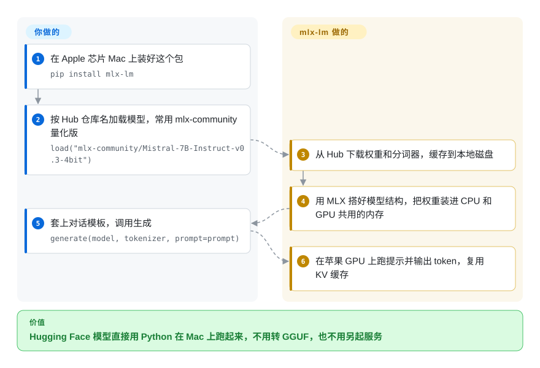

# MLX / mlx-lm

Hugging Face 上刚出了一个新模型，你想今天就在 Mac 上跑起来——可常规路线要么先转成 GGUF 交给 llama.cpp，要么折腾 PyTorch 在苹果 GPU 上的后端，想微调又得换一套工具。mlx-lm 是 MLX 团队自己的 Python 包：`pip install` 一次，一条命令就从 Hub 拉下模型，在 Apple 芯片上生成、对话、起服务、量化或做 LoRA 微调。

## 何时使用

你是一名机器学习工程师或研究员，手上是一台 32–128 GB 内存的 M 系列 Mac，工作是试模型，不是运维集群。Hub 上冒出一个 `mistralai/...` 或 `Qwen/...`，你想把它和上个月的模型比一比，压成 4-bit 好和 IDE 一起塞进内存，再用几千条自己的样本跑个 LoRA——不租云 GPU。走 llama.cpp 得先转 GGUF，而且没有训练这条路；走 PyTorch 得面对它在苹果 GPU 上的 MPS 后端。用 mlx-lm 就是 `mlx_lm.generate --model mlx-community/Mistral-7B-Instruct-v0.3-4bit --prompt "..."`、`mlx_lm.convert --model <hf-repo> -q`、`mlx_lm.lora --model <path> --train --data <dir>`——一个包、一套内存模型，从头到尾都是 Python。

当你在用 Python **搭建**一个只跑在 Mac 上的东西——评测脚本、agent 循环、像 oMLX 那样的本地服务——想直接调库（`load`、`generate`、`stream_generate`、提示缓存），而不是隔着 HTTP 去调另一个守护进程时，也该想到它。正因如此，本索引里好几个 Mac 本地服务都建在它之上。当 Python 级访问、新架构当天可用、在本机微调比跨平台二进制和模型管理器更重要时，选它而不是 Ollama 或 llama.cpp。

## 怎么用起来

MLX 是苹果的数组计算框架——可以理解为 NumPy/PyTorch，但围绕苹果芯片的“统一内存”设计：CPU 和 GPU 读写同一块内存，张量不用再拷到独立显卡上。mlx-lm 用 MLX 把每种支持的模型架构重新实现一遍（`mlx_lm/models` 下每个模型家族一个文件），读入 Hugging Face 的权重和分词器，再带着 KV 缓存生成——KV 缓存就是已读过的 token 的注意力状态，存起来就不必每出一个新 token 都重算。**它替你做的：**下载并缓存模型；量化（把权重从 16 位存成 4 或 8 位，所需内存大约降到四分之一到一半）；生成或流式输出；把长提示缓存成文件；在 `localhost:8080` 起一个 OpenAI 风格的 HTTP 接口；训练 LoRA 适配器（挂在模型上的一小组附加权重）或把它们融回模型。**留给你的：**挑一个装得进内存的模型和量化档位，准备提示和训练数据，大模型还要用 `sysctl` 调高 macOS 的 GPU 常驻内存上限。命令行和 Python API 是进同一套代码的两扇门；下面的卡片走 Python 这扇。

<!-- flow-steps:begin (generated from flows/mlx-mlx-lm.json by tools/flow_card.py — do not edit) -->

流程文字版

1. **你**：在 Apple 芯片 Mac 上装好这个包 — `pip install mlx-lm`
2. **你**：按 Hub 仓库名加载模型，常用 mlx-community 量化版 — `load("mlx-community/Mistral-7B-Instruct-v0.3-4bit")`
3. **MLX / mlx-lm**：从 Hub 下载权重和分词器，缓存到本地磁盘
4. **MLX / mlx-lm**：用 MLX 搭好模型结构，把权重装进 CPU 和 GPU 共用的内存
5. **你**：套上对话模板，调用生成 — `generate(model, tokenizer, prompt=prompt)`
6. **MLX / mlx-lm**：在苹果 GPU 上跑提示并输出 token，复用 KV 缓存

**价值**：Hugging Face 模型直接用 Python 在 Mac 上跑起来，不用转 GGUF，也不用另起服务

<!-- flow-steps:end -->

## 何时不用

- **你不在 Apple 芯片上，或要在 NVIDIA GPU 上服务很多用户。** GPU 服务用 [vLLM](../llm-inference/serving-engines/vllm.zh.md)（连续批处理、分页注意力），任意操作系统上的 CPU/CUDA/Vulkan 用 [llama.cpp](../llm-inference/local-runtimes/llama-cpp.zh.md)。mlx-lm 确实通过 MLX 较新的后端提供 `cuda12`/`cuda13`/`cpu` 可选依赖，但它的 README、基准和社区模型都以 Mac 为先。
- **你要的是生产 API。** 上游服务文档明说 `mlx_lm.server` “不推荐用于生产，只实现了基本的安全检查”，而且开启 KV 缓存量化（`--kv-bits`）后不再批处理。要让一台 Mac 全天给编码 agent 供模型，用 [oMLX](../llm-inference/local-runtimes/omlx.zh.md)（连续批处理加 SSD 分层缓存，本身建在 mlx-lm 上）；真正的多租户服务用 vLLM 这类 GPU 引擎。
- **你要的是模型管理器，不是 Python 包。** 非开发者或“给我一个本地端点就行”的场景，[Ollama](../llm-inference/local-runtimes/ollama.zh.md) 更合适：按名字拉取运行、后台守护进程、跨平台、GGUF 模型库——代价是没有 Python 级控制和训练。
- **瓶颈是某一个模型家族的解码速度。** [MTPLX](../llm-inference/local-runtimes/mtplx.zh.md) 用模型自带的多 token 预测头在 Qwen/Gemma 模型包上做投机解码；mlx-lm 是它所依赖的通用基线。
- **你的模型要吃图片、音频或视频。** mlx-lm 只做文本进、文本出；MLX 上的视觉语言模型在另一个项目 `mlx-vlm`（未收录）里。
- **超出单机内存的正经微调。** 在一台 Mac 上做 LoRA/QLoRA/DoRA 和全参微调是它的甜区；多卡或大规模训练应放到 CUDA 上，用 [Unsloth](../llm-training/unsloth.zh.md) 或完整训练栈。
- **你需要稳定的 API 契约。** 它还是 0.x，变得很快（2026 年 1 月到 10 月从 0.30 走到 0.32，且要求 `transformers>=5.7`）；有别的代码 import 它时务必锁版本。

## 横向对比

| 替代品 | 是否收录 | 我们的评价 | 取舍 |
|---|---|---|---|
| [llama.cpp](../llm-inference/local-runtimes/llama-cpp.zh.md) | ✅ | 同一套 GGUF 文件要在 Mac、Linux、Windows 和纯 CPU 机器上用同一个推理程序跑时，选 llama.cpp；只在 Mac 上、又要 Python 访问和同包量化/微调时，选 mlx-lm。 | llama.cpp 换来可移植性和 GGUF 生态，但没有训练路径；mlx-lm 换来 Python 原生 API 和 LoRA，但绑定 MLX，实际上也就是绑定 Apple 芯片。 |
| [Ollama](../llm-inference/local-runtimes/ollama.zh.md) | ✅ | 目标是装完就不用管的本地端点时，选 Ollama；你是要在 Python 里加载、改造、评测或微调模型的开发者时，选 mlx-lm。 | Ollama 用控制力换来守护进程、模型仓库和跨平台安装器；mlx-lm 放弃这些便利，换来直接调库和 Hugging Face 模型当天可用。 |
| [oMLX](../llm-inference/local-runtimes/omlx.zh.md) | ✅ | 一台 Mac 要持续给长上下文编码 agent 供模型时，选 oMLX；你要的是库、命令行工具或训练而不是托管服务时，留在 mlx-lm。 | oMLX 在 mlx-lm 之上加了连续批处理、SSD 分层 KV 缓存和菜单栏应用，但它是叠在同一引擎上的更年轻、更小的项目。 |
| [MTPLX](../llm-inference/local-runtimes/mtplx.zh.md) | ✅ | 瓶颈是支持 MTP 的 Qwen/Gemma 模型的解码延迟时，选 MTPLX；其他模型或要训练时，mlx-lm 是通用基线。 | MTPLX 借模型自带的预测头提速，但只对它发布的模型包有效；mlx-lm 覆盖的架构多得多，解码速度是常规水平。 |
| mlx-vlm（`Blaizzy/mlx-vlm`） | 未收录 | 模型要吃图片、音频或视频时，选 mlx-vlm；纯文本 LLM 用 MLX 团队直接维护的 mlx-lm。 | mlx-vlm 把 MLX 生态扩展到多模态，但它是独立的社区主导仓库，发布节奏自成一套。 |

## 技术栈

- **语言：** Python ≥ 3.11（见 `pyproject.toml`；分类器列出 3.11–3.13、macOS 和 Linux）。
- **计算：** [MLX](https://github.com/ml-explore/mlx)（macOS 上 `mlx>=0.32.2`）——苹果用 C++/Metal 写、带 Python 绑定的数组框架；可选依赖提供 `mlx[cuda12]`、`mlx[cuda13]`、`mlx[cpu]` 后端。
- **模型读写：** Hugging Face `transformers>=5.7.0`（分词器与配置）、`huggingface_hub` 缓存、`sentencepiece`、`protobuf`、`jinja2`（对话模板）、safetensors 权重；`mlx_lm.fuse --export-gguf` 可为部分模型类型导出 GGUF。
- **接口：** Python API（`load`、`generate`、`stream_generate`、`convert`、采样器与 logits 处理器钩子）和命令行 `mlx_lm.generate`、`chat`、`convert`、`lora`、`fuse`、`server`、`cache_prompt`、`evaluate`、`benchmark`，外加 AWQ/GPTQ/DWQ 量化工具。
- **服务：** 标准库 `http.server`（`ThreadingHTTPServer`），提供 OpenAI 风格的 chat/completions 路由，并按模型家族带工具调用解析器。

## 依赖

- **硬件：** 主要目标是 Apple 芯片 Mac；内存要装得下（量化后的）权重和 KV 缓存。大模型的内存常驻需要 macOS 15 及以上。
- **运行时：** `pip install mlx-lm`（或 conda-forge）会带上 MLX、numpy、transformers 等；训练要 `[train]` 可选依赖（`datasets`、`tqdm`），评测要 `[evaluate]`（`lm-eval`）。
- **网络：** 首次使用从 Hugging Face Hub 下载（也可把 `--model` 指向本地路径）；分词器需要远程代码时会提示 `--trust-remote-code`。
- **无外部服务：** 本地生成、转换和训练都不需要。

## 运维难度

**本地用是低，要对外服务是中。** 单机上就是一次 pip 安装加磁盘上的模型缓存。麻烦出现在三处：（1）按内存挑模型——接近总内存的模型会退化成慢速换页，直到你用 `sudo sysctl` 调高 `iogpu.wired_limit_mb`；（2）暴露 `mlx_lm.server`——没有鉴权、单进程，只放在 localhost 或代理后面；（3）升级——0.x 的库每几周一个小版本，`transformers` 下限也在动，凡是 import 它的地方都要锁版本。

## 健康度与可持续性

- **维护（2026-10-08）：** 非常活跃——近 13 周有 12 周有提交，PyPI 上 2026-10-01 发布 `v0.32.0`。GitHub 的 Releases 页落后（最新只到 2026 年 4 月的 v0.31.3），看真实节奏请看 PyPI 或 tag。
- **治理与背书：** 和 MLX 本体同在苹果的 `ml-explore` 组织下；Awni Hannun 主导，约占全部提交的四分之一，过去一年约 70 人有贡献，bus factor 良好。路线图归苹果——跟着 MLX 和苹果硬件走，不会为其他平台优先。
- **年龄与林迪：** 仓库 2025 年 3 月才从 `mlx-examples` 拆出来（约 19 个月），但 PyPI 包始于 2024 年 1 月（约 2.7 年）。按林迪标准仍算年轻：仍活跃、背书强，但缺长期记录。
- **采用度：** 约 7.2k star，近一个月 PyPI 下载 544,885 次；Hugging Face 上的 `mlx-community` 组织持续发布量化好的 MLX 权重，oMLX、MTPLX、claude-code-local 等 Mac 服务都把它当引擎 import。
- **风险信号：** MIT，无改许可证历史。CONTRIBUTING 要求披露 AI 辅助的贡献。主要风险是变动快而不是被弃：0.x API 和模型文件会随 MLX 一起变。

## 存疑（未验证）

- [推断] “新架构通常很快进入 mlx-lm / `mlx-community`”是从按家族组织的 `models/` 目录和社区上传推出来的，没有实测。
- [推断] CUDA/CPU 可选依赖相对 Metal 路径的成熟度未测试；在非 Mac 上使用前先自己跑基准，按实验性对待。
- [未验证] 同一台 Mac 上与 llama.cpp 或 PyTorch MPS 的速度对比取决于模型和量化档位；本页没有跑基准。
- [未验证] star、下载量和贡献者数是 2026-10-08 从 GitHub API、PyPI 和健康度评分器取的快照。
