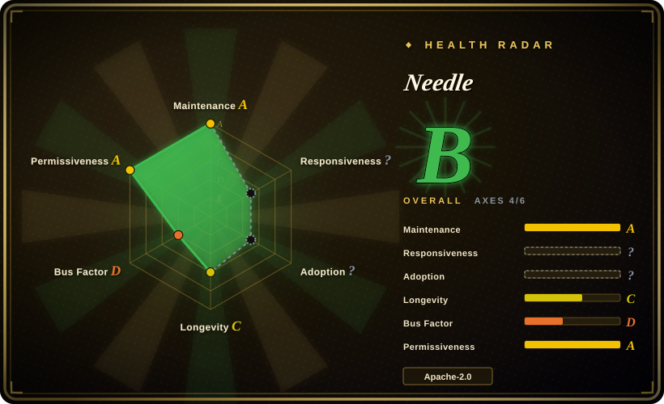
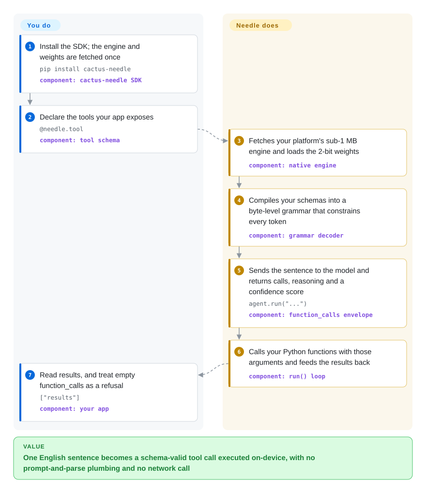

# Needle

You want your phone, watch or robot to act on a spoken sentence — call the right function with the right arguments — without sending that sentence to a cloud API, but a general small on-device model will not reliably emit the exact JSON your code needs. Needle is a small model plus a Python SDK that turns one plain English sentence into a schema-valid tool call or a typed record on the device, spending its capacity on that one job instead of chat.

## When to use

You are shipping a mobile app, a wearable, a smart-home hub or a robot that should *act* on what the user says: call the right function with the right arguments, or pull typed fields out of messy text — with nothing leaving the device. The device may be offline, may be a microcontroller with a few MB of RAM, and per-call API cost or data-residency rules rule out a hosted LLM. A general on-device LLM can chat, but it will not reliably emit the exact JSON your app needs, and a server-side function-calling model is far too big to ship.

You `pip install cactus-needle`, decorate your functions with `@needle.tool` (the signature gives argument types, the docstring is the tool description, Google-style `Args:` lines become per-argument docs), and the SDK runs a 2-bit Needle model through a native engine on the device — a sub-1 MB engine per platform plus one shared `.cact` weight file. Two constraints decide the fit. The users speak English: the shipped model and all of its acceptance suites are English, so a Chinese or multilingual surface needs a fine-tune first. And the toolset is small and closed — keep it to five tools or fewer with bounded numbers and closed enums, because that is the shape the model was trained and tuned for. You pick this over a generic runtime because the tool-call behaviour, the grammar guarantee and the confidence signal come built in rather than being assembled from a prompt and a JSON parser.

## How it works

You declare the tools your app exposes — a decorated Python function, a Pydantic model, or a raw JSON Schema — and the SDK compiles those declarations into a **byte-level grammar**: a rule set that makes any next character which would break your schema impossible to generate. The package hands one sentence to a small 2-bit model running inside a native engine on the device; because the grammar, not a prompt, is doing the constraining, the emitted call always parses and always matches your types, the way a form that rejects invalid keystrokes never produces a malformed entry. Each turn comes back as one JSON envelope carrying `function_calls`, a short `reasoning` string that derives each argument from the user's words, and a `confidence` score; a request your tools cannot serve is supposed to come back as an empty list instead of a guess. `run()` then calls your own Python functions with those arguments, feeds the results back and loops until the turn is done. What you own: the tool schemas (their names, enums and bounds are the model's entire world), the runtime guards you add around negations and out-of-range values, and any fine-tune for your domain. What Needle owns: fetching and hosting the engine, the grammar-constrained decoding, the confidence score, and the call-and-execute loop.

<!-- flow-steps:begin (generated from flows/needle.json by tools/flow_card.py — do not edit) -->

Text version of the flow

1. **You**: Install the SDK; the engine and weights are fetched once — `pip install cactus-needle` — component: `cactus-needle SDK`
2. **You**: Declare the tools your app exposes — `@needle.tool` — component: `tool schema`
3. **Needle**: Fetches your platform's sub-1 MB engine and loads the 2-bit weights — component: `native engine`
4. **Needle**: Compiles your schemas into a byte-level grammar that constrains every token — component: `grammar decoder`
5. **Needle**: Sends the sentence to the model and returns calls, reasoning and a confidence score — `agent.run("...")` — component: `function_calls envelope`
6. **Needle**: Calls your Python functions with those arguments and feeds the results back — component: `run() loop`
7. **You**: Read results, and treat empty function_calls as a refusal — `["results"]` — component: `your app`

**Value**: One English sentence becomes a schema-valid tool call executed on-device, with no prompt-and-parse plumbing and no network call

<!-- flow-steps:end -->

## When NOT to use

- **Your users do not speak English.** The shipped model is English-only in practice: in a spot check, 11 of 12 Chinese sentences were answered with the *wrong* tool at confidence 0.82–1.00 ("打开厨房的灯" → dock the robot vacuum, "帮我冲杯卡布奇诺" → start the dishwasher). Fine-tune on your own language (`needle finetune` or the platform), or put an intent classifier in front; a general small instruct model on [llama.cpp](../llm-inference/local-runtimes/llama-cpp.md) is no better at the JSON contract, so pair the classifier with it rather than swapping to it.
- **You want a general chatbot / assistant.** Needle explicitly trades general chat capacity for small-footprint tool accuracy. If the job is open-ended conversation or reasoning, use a general small instruct model (e.g. Qwen2.5-0.5B/1.5B, SmolLM2) served with llama.cpp or Ollama instead — this model will be weaker at chat.
- **Refusals must be safe (negations, out-of-range values, off-domain requests).** This is where the base model is weakest: run against its *own* frozen acceptance suites it passed 172/192 (89.6%), and 5 of the 6 suites failed their ≥90%-with-zero-critical-failures bar. The failures cluster exactly in the negative categories — "don't turn on the study lights" emitted the call it was forbidding, "set the volume to 140/500" was silently clamped to 14/5 and executed, "log 9000 ml of water" logged 900. If you need refusals you can trust, add runtime guards (negation detection, range checks that *reject* instead of clamp) or keep those intents in a deterministic layer — a rules engine, or a hosted frontier model — not in the model.
- **You plan to gate on `confidence` alone.** The errors above arrive with high scores, not low ones: wrong calls carried 0.93–1.00, and raising the acceptance gate from 0.0 to 0.4 changed nothing. Treat `confidence` as one input to a confirmation UX, not a safety net; for a hard guarantee, put the risky intents behind your own guard or a hosted model.
- **You need to serve many concurrent users on a GPU.** This is a per-device model plus SDK, with no batching server. For hosted serving, use [vLLM](../llm-inference/serving-engines/vllm.md) or [TGI](../llm-inference/serving-engines/text-generation-inference.md) (or a hosted API) with a larger function-calling model instead.
- **You need a runtime that can host arbitrary models.** Needle ships one model family; it is not a general inference engine. If model choice is the priority, use [llama.cpp](../llm-inference/local-runtimes/llama-cpp.md), [Ollama](../llm-inference/local-runtimes/ollama.md) or [LiteRT-LM](litert-lm.md).
- **You need maximum tool-call accuracy on hard or ambiguous requests.** When accuracy is the binding constraint and a network round-trip is acceptable, use hosted frontier function calling (OpenAI / Gemini) instead. For self-hosted tool calling, do not reach for [Functionary](../function-calling/functionary.md) — it is deprecated; serve a current function-calling model on [vLLM](../llm-inference/serving-engines/vllm.md) or [SGLang](../llm-inference/serving-engines/sglang.md) instead.
- **You must be fully self-contained from the source repo alone.** The repo carries the SDK and the training/export path; the native engine binary and the `.cact` weights are fetched from Hugging Face on first use and cached under `~/.cache/cactus-needle`. For a truly self-contained artifact, vendor engine + weights, or use llama.cpp with a bundled GGUF.
- **Telemetry must be impossible.** Anonymous usage counts are sent by default (disable with `NEEDLE_TELEMETRY=0` or `DO_NOT_TRACK=1`). If policy forbids any phone-home, choose a model/runtime with none.
- **You want best-in-class general embeddings.** The embedding head is tuned for local search/match/routing alongside the task model. For high-quality retrieval, use a dedicated embedding model (BGE, sentence-transformers) instead.
- **You need a long-term stability guarantee or SLA.** Young project, very fast release churn (v3.0.0 → v3.0.4 shipped within four days), vendor-owned roadmap, and a weight format that has already changed once. For a multi-year bet, prefer a mature runtime such as [LiteRT-LM](litert-lm.md).

## Comparison

| Alternative | In index | Our verdict | Tradeoff |
|---|---|---|---|
| [llama.cpp](../llm-inference/local-runtimes/llama-cpp.md) + a small instruct GGUF model | ✅ | Pick Needle when the tool-call behaviour, the schema-compiled grammar and a confidence score should ship as one task-specific model with a Python SDK; pick llama.cpp when one runtime must host any small model under your full platform control. | Needle hands you the tool-call contract out of the box, but its confidence does not reliably separate right from wrong calls and the base model misses negative cases, so with either option you still add runtime guards for refusals. |
| [LiteRT-LM](litert-lm.md) | ✅ | Pick LiteRT-LM when you are deploying Gemma-class models on Android/iOS and want Google's runtime to own NPU/GPU acceleration; pick Needle when the model itself must be a task-specialised tool-caller rather than a general Gemma. | First-party mobile accelerators and Google backing, but it is an inference runtime — you still supply the function-calling model and the tool plumbing. |
| FunctionGemma (Google) | 未收录 | Pick FunctionGemma when you want Google's purpose-built on-device function-calling model family (270M and its fine-tunes) and are happy with Hugging Face weights plus LiteRT/llama.cpp; pick Needle when you want tool calling, typed extraction and embeddings from one small model plus a first-party Python SDK. | Similar on-device tool-calling niche with Google weight releases, but no single SDK/grammar/confidence contract — you wire the runtime and parsing yourself, and it ships as a model card rather than a code repo. |
| [Functionary](../function-calling/functionary.md) | ✅ | Treat Functionary as the historical open function-calling lineage only — it is deprecated (the README carries an explicit banner); for maintained self-hosted tool calling, serve a current function-calling model on vLLM/SGLang, or pick Needle when it must run on-device. | The template for JSON-schema tool calling, but abandoned — no security or model updates — and orders of magnitude larger than an on-device model. |
| Cloud function calling (OpenAI / Gemini) | 未收录 | Pick a hosted frontier API when accuracy on hard, ambiguous requests is the constraint and a network round-trip is acceptable; pick Needle when it must run offline per-device with no per-call cost. | Best-in-class accuracy and zero deployment effort, but network dependency, per-call cost and data leaving the device — the opposite tradeoff from this page. |

## Tech stack

- **Model:** a Laddered Simple Attention Network — a Monarch Hadamard MLP in place of the FFN, GQA attention with causal conv taps, an engram n-gram memory read by gather, and multi-lane hyper-connections.
- **Size ladder:** 2L·25M / 4L·29M / 8L·52M / 16L·98M / 20L·121M parameters; every depth from 2 to 20 layers is a deployable subnetwork, so `needle build --layers N` exports a smaller model for a smaller device.
- **Language:** English-only in the shipped model. Input is one free-text sentence; output is a JSON envelope. The tokenizer is SentencePiece, fetched from Hugging Face.
- **SDK:** Python (≥3.9) using `ctypes` over a prebuilt native C engine (`libneedle.so` / `.dylib` / `.dll`), under 1 MB per platform.
- **Training / export:** JAX + Flax + Optax with `safetensors` and `sentencepiece` (the `train` extra), exporting to the `.cact` weight format.
- **Weights/format:** `.cact` is mapped and read in place; the shipped quantization is "Cactus Quants" at 2.125 bits per weight.
- **Decoding:** a byte-level grammar compiled from your function/JSON schemas constrains every generated token; a learned head emits the confidence score.

## Dependencies

- **Runtime:** Python ≥3.9 and `huggingface_hub` — the only hard runtime dependency. The native engine binary is auto-downloaded per platform and cached in `~/.cache/cactus-needle`.
- **Weights:** `needle3.cact` / `needle2.cact` are downloaded from the Hugging Face model repos `Cactus-Compute/needle3` and `Cactus-Compute/needle2`; they are **not** in the GitHub repo.
- **Training:** `jax`, `jaxlib`, `flax`, `optax`, `safetensors`, `sentencepiece`; optional `jax-metal` (Apple) or `jax[cuda12]`. Generating synthetic data (`needle finetune --generate`, `needle generate-data`) needs an `OPENROUTER_API_KEY` and calls out to OpenRouter, so local fine-tuning is not fully offline unless you bring your own JSONL.
- **Hosted fine-tuning (optional):** `needle platform finetune | generate | jobs | models | files | billing` and `needle.platform.Platform` post your JSONL to `cactuscompute.com/v1` with a `NEEDLE_API_KEY`, and each submission spends account quota.
- **Hardware:** 17 published platform folders spanning macOS, Linux (x86_64/arm64/armv7/riscv64/mipsel), Windows, Android, iOS/tvOS/watchOS and WASM/WASM-component. No database, service or cluster to operate.
- **Network:** required on first run to fetch engine + weights unless you pre-vendor them.

## Ops difficulty

**Low to medium.** `pip install cactus-needle` followed by a first call is easy — it auto-fetches the engine and weights, and there is no server or datastore to run. Shipping to a real device or an air-gapped machine is the actual work: `needle build --platform <folder> [--layers N]` stages the engine next to the weights, and you must keep the two in sync across releases (the `.cact` archive carries a generation tag, so a v2 archive will not load against a v3 engine). Budget for two things beyond deployment. First, its own acceptance suites run in one command per environment (`python -m needle.environments.<name>`), and the shipped base model fails 5 of 6 of them — so plan on a fine-tune plus your own runtime guards rather than trusting the base model on negative cases. Second, local `needle finetune` produces LoRA weights that **lose the confidence head** (an agent built on them reports `confidence` as `None`); only platform fine-tunes keep it calibrated. Telemetry is opted out with an environment variable.

## Health & viability

- **Maintenance (2026-09-22).** Active and fast: last push 2026-09-21, `v3.0.4` tagged and published to PyPI the same day, with `v3.0.0` → `v3.0.4` landing within four days. The GitHub Releases list is empty (tags only). [推断]
- **Governance / backing.** Owned by the `cactus-compute` GitHub org (Cactus Compute, Inc.) — a vendor, not a foundation. The roadmap, the 2-bit post-training/quantization pipeline and the hosted fine-tuning platform are all vendor-controlled. Vendor continuity is the longevity bet. [推断]
- **Bus factor.** Concentrated: the top contributor has 254 contributions, the next two have 9 and 6 (sampled window). [推断] Organizational backing partly offsets this, but it is a concentration risk.
- **Age & Lindy (created 2026-02-24, ~7 months).** Young. ~12.1k stars in ~7 months is a fast, hype-suspect curve rather than social proof. Lindy-unproven — currently active, durability unknown; judge with age × still-active.
- **Adoption.** 12,123 stars, 784 forks and 65 watchers on GitHub; the Hugging Face weight repos show ~54.5k downloads (needle3, created 2026-09-16) and ~31.7k (needle2), as of 2026-09-22. [推断] Real traction in the on-device tool-calling niche; no independent production-user list was confirmed.
- **Risk flags.** Telemetry on by default; very fast version and weight-format churn; the shipped 2-bit model depends on a proprietary hosted quantization pipeline; headline benchmarks are self-reported; and an independent spot check found the base model unreliable exactly on the negative cases it advertises (off-topic refusal, negation, out-of-range values) with no discriminative confidence signal to compensate. License is Apache-2.0 for the code and declared Apache-2.0 on both HF model cards.

## Caveats (unverified)

- [未验证] Benchmark claims ("beats models 10x its size on mobile tool calls", "matches 2–3x bigger models on extraction", "the 121M model does the arithmetic of a 50M one") are the project's own, against baselines it selected, and were not independently reproduced here.
- [未验证] The acceptance-suite result (172/192; 5 of 6 suites below their own ≥90%/0-critical bar; identical outcome at confidence gate 0.0 and 0.4) is one run on one platform (macOS arm64), base model, not fine-tuned, with no repeats. It is reproducible with `NEEDLE_TELEMETRY=0 python -m needle.environments.<name>`.
- [未验证] The Chinese-language result (11 of 12 utterances wrong, confidence 0.82–1.00) is a single spot check; no other non-English language was tested, and no fine-tuned Chinese model was evaluated.
- [推断] "8–29 MB" (README) and "the 35 MB needle3.cact" (`llms.txt`) disagree, and neither source states its measurement conditions, so the real on-disk footprint is unresolved.
- [未验证] "2.125 bits per weight" and the Cactus Quants scheme are the project's own description; not measured here.
- [未验证] The 17-platform support list is taken from `needle/agent/fetch.py` at verification time; whether every folder currently ships a working engine was not checked.
- [推断] The `arxiv:2607.18363` tag on the `Cactus-Compute/needle2` Hugging Face repo implies a paper; its claims were not read.
- [推断] "Calibrated confidence" is the project's claim: the spot check shows the score does not separate right from wrong calls, but calibration on the vendor's platform fine-tunes was not tested.
- [未验证] Star, fork and Hugging Face download counts are date-sensitive snapshots (2026-09-22).
- [推断] Bus-factor concentration is inferred from the contributors API sample (254 / 9 / 6); the full commit history was not audited.
- [推断] Telemetry payload contents are per the module's own comment (event, package and engine version, OS/arch, Python version, random install id; no prompts or outputs) sent to a vendor Supabase endpoint; the traffic was not captured or audited.
- [未验证] No independent production-user list or third-party integration ecosystem was confirmed.
