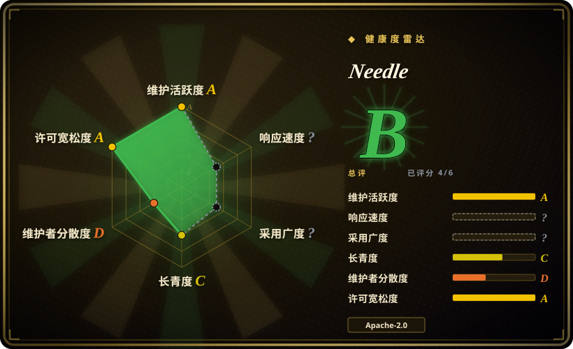

# Needle

面向手机、可穿戴、机器人和微控制器的 2-bit、8–29 MB 端侧基础模型，做工具调用、结构化抽取与嵌入——它有意用通用聊天能力换取极小体积上的任务准确率。

## 何时使用

你在做一款移动 App、可穿戴设备、智能家居中枢或机器人，希望它能对自然语言“动手”：调用正确的函数并填对参数，或者从杂乱文本里抽出带类型的字段——而且数据不出设备。设备可能离线，可能只有几 MB 内存的微控制器，按调用计费的 API 成本或数据驻留规则也排除了云端 LLM。通用的端侧 LLM 能聊天，但不可靠地吐出你的 App 需要的精确 JSON；服务端的函数调用模型又太大，根本装不进设备。

于是你 `pip install cactus-needle`，用 `@needle.tool` 装饰函数（签名给出参数类型，docstring 就是工具描述），SDK 在设备上用原生引擎跑一个 2-bit、8–29 MB 的 Needle 模型。每个 token 都被由你的 schema 编译出的 byte-level grammar 约束，所以生成的调用天然可解析；每轮返回 `function_calls`、`reasoning` 和一个 `confidence` 分数，无关请求返回空列表而不是编造的调用。你选它而不是通用运行时，是因为工具调用行为、grammar 保证和 confidence head 本身就是产品——不需要你用 prompt 加 JSON parser 拼出来。

## 何时不用

- **你想要通用聊天/助手。** Needle 明确用通用聊天能力换小体积上的任务准确率。如果任务是开放式对话或推理，改用通用小指令模型（如 Qwen2.5-0.5B/1.5B、SmolLM2）配 llama.cpp 或 Ollama——本页的模型聊天更弱。
- **你要在 GPU 上服务大量并发用户。** 这是按设备部署的模型加 SDK，没有批处理服务端。托管服务改用 [vLLM](../llm-inference/serving-engines/vllm.zh.md) 或 [TGI](../llm-inference/serving-engines/text-generation-inference.zh.md)（或直接调用云端 API）配更大的函数调用模型。
- **你要一个能承载任意模型的运行时。** Needle 只提供单一模型族，不是通用推理引擎。如果优先考虑模型选择，用 [llama.cpp](../llm-inference/local-runtimes/llama-cpp.zh.md)、[Ollama](../llm-inference/local-runtimes/ollama.zh.md) 或 [LiteRT-LM](litert-lm.zh.md)。
- **你要在困难或模糊请求上追求最高工具调用准确率。** 当准确率是硬约束且能接受一次网络往返时，改用云端前沿函数调用（OpenAI / Gemini）。要自托管就不要再选 [Functionary](../function-calling/functionary.zh.md)——它已废弃；改用 [vLLM](../llm-inference/serving-engines/vllm.zh.md) 或 [SGLang](../llm-inference/serving-engines/sglang.zh.md) 跑一个当前的函数调用模型。
- **你要求只靠源码仓库就能完全自包含。** 仓库里是 SDK 和训练/导出链路；原生引擎二进制和 `.cact` 权重在首次使用时从 Hugging Face 拉取，缓存在 `~/.cache/cactus-needle`。要真正自包含的产物，就把引擎和权重一并 vendor，或改用 llama.cpp 配一个打包好的 GGUF。
- **遥测必须完全不可能。** 匿名使用统计默认开启（用 `NEEDLE_TELEMETRY=0` 或 `DO_NOT_TRACK=1` 关闭）。如果策略禁止任何回连，选择没有遥测的模型/运行时。
- **你要最好的通用嵌入。** 嵌入头是为本地搜索/匹配/路由与任务模型一起调优的。高质量检索请改用专用嵌入模型（BGE、sentence-transformers）。
- **你需要长期稳定性保证或 SLA。** 项目年轻，发布节奏极快（v3.0.0 → 3.0.2 两天内发完），路线图由厂商掌握，权重格式还在变。要做多年期的押注，优先选 [LiteRT-LM](litert-lm.zh.md) 这类成熟的运行时。

## 横向对比

| 替代品 | 是否收录 | 我们的评价 | 取舍 |
|---|---|---|---|
| [llama.cpp](../llm-inference/local-runtimes/llama-cpp.zh.md) + 小指令模型 GGUF | ✅ | 需要一个运行时承载任意小模型、并要 grammar 约束输出与完整平台控制时，选 llama.cpp；希望工具调用、grammar 和 confidence 行为开箱即得、而不是自己拼装时，选 Needle。 | 通用运行时，模型选择极多且本地可控；但 prompt、tool schema、解析器和 grammar 都要自己拼，也没有校准过的 confidence 和 grounding 校验。 |
| [LiteRT-LM](litert-lm.zh.md) | ✅ | 在 Android/iOS 上部署 Gemma 级模型、想让 Google 运行时接管 NPU/GPU 加速时，选 LiteRT-LM；需要模型本身就是任务专用的工具调用模型、而非通用 Gemma 时，选 Needle。 | 一方提供的移动端加速器与 Google 背书；但它是推理运行时，函数调用模型和工具管线仍要你自己提供。 |
| FunctionGemma（Google） | 未收录 | 想要 Google 专为端侧函数调用做的模型族（270M 及其微调版）、并接受用 Hugging Face 权重配 LiteRT/llama.cpp 时，选 FunctionGemma；想用一个小模型同时拿到工具调用、类型化抽取和嵌入，外加一方提供的 Python SDK 时，选 Needle。 | 同样的端侧工具调用生态位，且有 Google 发布的权重；但没有统一的 SDK/grammar/confidence 契约，运行时和解析要自己接线，且它以模型卡而非代码仓库形式发布。 |
| [Functionary](../function-calling/functionary.zh.md) | ✅ | 只把 Functionary 当作开源函数调用的历史谱系参考——它已废弃（README 有明确声明）；要自托管维护中的工具调用，用 vLLM/SGLang 跑当前模型；模型必须端侧运行时选 Needle。 | JSON schema 工具调用的模板，但已停止维护——没有安全与模型更新——且体积比端侧模型大几个数量级。 |
| 云端函数调用（OpenAI / Gemini） | 未收录 | 当困难、模糊请求上的准确率是约束、且能接受网络往返时，选云端前沿 API；需要在每台设备上离线运行、且没有按调用计费时，选 Needle。 | 顶级准确率与零部署成本；但依赖网络、按调用计费、数据离开设备——与本页项目完全相反的取舍。 |

## 技术栈

- **模型：** Laddered Simple Attention Network——用 Monarch Hadamard MLP 取代 FFN，带因果卷积 tap 的 GQA attention，用 gather 读取的 engram n-gram 记忆，以及 multi-lane hyper-connection。2 到 20 层的每个深度都是可部署的子网络，所以能为更小的设备导出更小的模型。
- **SDK：** Python（≥3.9），通过 `ctypes` 调用预编译的原生 C 引擎（`libneedle.so` / `.dylib` / `.dll`）；模型以 JSON envelope 收发。
- **训练/导出：** JAX + Flax + Optax，配 `safetensors` 与 `sentencepiece`（`train` extra），导出为 `.cact` 权重格式。
- **权重/格式：** `.cact` 就地 map 读取；随模型发布的量化是 “Cactus Quants”，每权重 2.125 bit。
- **解码：** 由你的函数/JSON schema 编译出的 byte-level grammar 约束每个生成的 token；一个学习得到的 head 输出 confidence 分数。

## 依赖

- **运行时：** Python ≥3.9 与 `huggingface_hub`——唯一的硬运行时依赖。原生引擎二进制按平台自动下载，缓存在 `~/.cache/cactus-needle`。
- **权重：** `needle3.cact` / `needle2.cact` 从 Hugging Face 模型仓库 `Cactus-Compute/needle3` 与 `Cactus-Compute/needle2` 下载，**不在** GitHub 仓库里。
- **训练：** `jax`、`jaxlib`、`flax`、`optax`、`safetensors`、`sentencepiece`；可选 `jax-metal`（Apple）或 `jax[cuda12]`。
- **硬件：** 17 个已发布的平台目录，覆盖 macOS、Linux（x86_64/arm64/armv7/riscv64/mipsel）、Windows、Android、iOS/tvOS/watchOS 以及 WASM/WASM-component。没有数据库、服务或集群要运维。
- **网络：** 除非你预先 vendor，首次运行必须联网拉取引擎与权重。

## 运维难度

**低到中。** `pip install cactus-needle` 后首次调用即可自动拉取引擎与权重，没有服务端或数据存储要跑。真正的工作量在把模型发到真机或隔离机上：`needle build --platform <folder> [--layers N]` 把引擎和权重放到一起，而且每次发版都要让两者保持一致（`.cact` 归档带 generation tag，v2 归档无法在 v3 引擎上加载）。本地微调是一条 CLI（`needle finetune` → adapter → `needle build --lora`），但需要 JAX 训练栈；而随模型发布的 2-bit 后训练/量化跑在厂商的托管平台上。遥测用一个环境变量关闭。

## 健康度与可持续性

- **维护（2026-09-19）。** 活跃：最近 push 2026-09-18，PyPI 上 3.0.0 → 3.0.2 于 2026-09-17/18 发布，`v3.0.2` 已打 tag。GitHub Releases 列表为空（只有 tag）。节奏非常快。[推断]
- **治理/背书。** 属于 `cactus-compute` GitHub 组织（Cactus Compute, Inc.）——是厂商而非基金会。路线图和 2-bit 后训练/量化管线都由厂商控制，且该管线跑在厂商的托管平台上。因此长期性押注在厂商的持续性上。[推断]
- **Bus factor。** 集中：在采样的贡献者窗口里，头号贡献者 251 次提交，第二名 9 次。[推断] 组织背书部分抵消，但集中度风险仍在。
- **年龄与 Lindy（创建于 2026-02-24，约 7 个月）。** 年轻。约 7 个月拿到 ~11.4k star 是一条偏快、疑似 hype 的曲线，不是社会证明。Lindy 未证实——当前活跃，持久性未知；用“年龄 × 仍活跃”来判断。
- **采用度。** GitHub 上 ~11.4k star 与 727 fork；Hugging Face 权重仓库显示 ~24k 下载（needle3，创建于 2026-09-16）与 ~38.5k 下载（needle2）。[推断] 在端侧工具调用这个细分里确有 traction；未确认独立的生产使用者名单。
- **风险信号。** 遥测默认开启；版本与权重格式迭代快（v2 → v3 改了 `.cact` tag 和引擎分发方式）；随模型发布的 2-bit 模型依赖专有托管量化管线；头条 benchmark 数字为自报。代码许可是 Apache-2.0，两个 HF 模型卡也声明 Apache-2.0。

## 存疑（未验证）

- [未验证] benchmark 主张（“在移动端工具调用上超过体积 10 倍的模型”“在抽取上追平 2–3 倍大的模型”“121M 模型做 50M 模型的计算量”）来自项目自述，基线未指明，本页未独立复现。
- [未验证] “8–29 MB”与“每权重 2.125 bit”来自 README / 包元数据；真实体积取决于深度与量化，本页未实测。
- [未验证] 17 个平台的支持列表取自核验时的 `needle/agent/fetch.py`；每个目录当前是否都发布了可用的引擎未逐一核对。
- [推断] `Cactus-Compute/needle2` 的 Hugging Face 仓库带 `arxiv:2607.18363` tag，暗示有论文；其主张未阅读。
- [推断] “校准过的 confidence”与 grounding/validation 行为来自 README 加 SDK 的校验代码；校准质量本身未独立验证。
- [未验证] Hugging Face 的下载与点赞数是随时间变化的快照。
- [推断] Bus factor 集中度由 contributors API 采样推断（头名 251 对次名 9）；未审计完整提交历史。
- [推断] 遥测载荷内容依据模块自身注释（事件、版本、引擎版本、OS/arch、Python 版本、随机安装 id；不含 prompt 与输出），发往厂商的 Supabase 端点；未抓包或审计实际流量。
- [未验证] 未确认独立的生产使用者名单或第三方集成生态。
