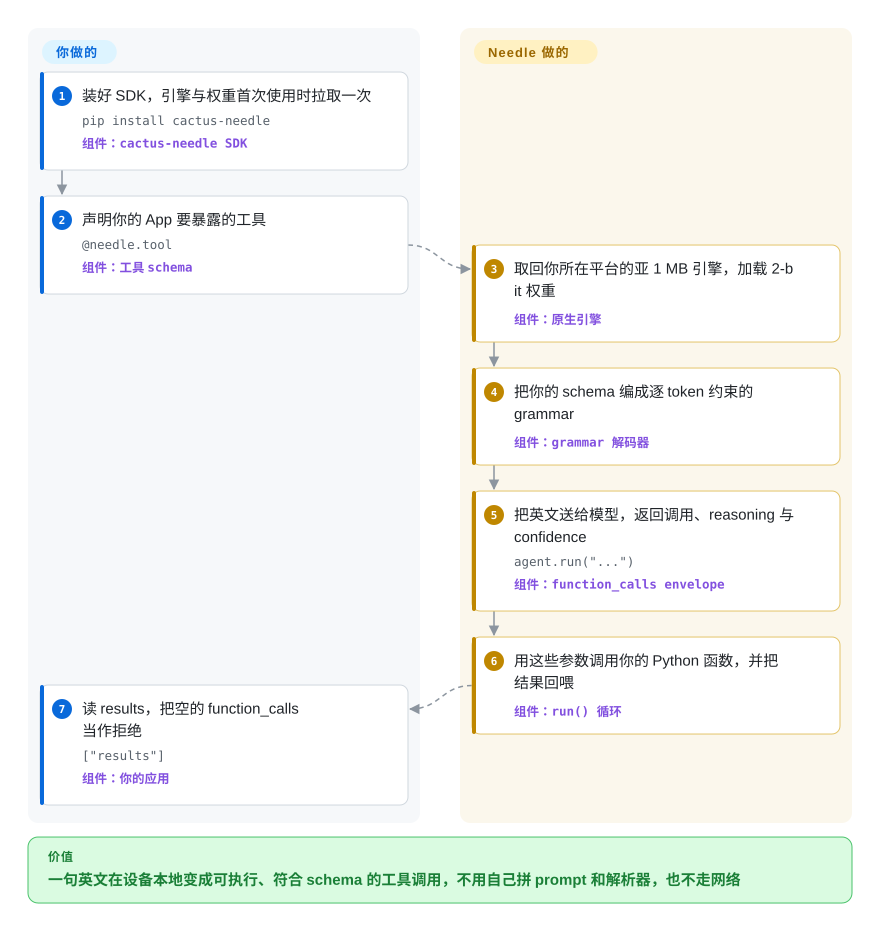

# Needle

你想让手机、手表或机器人听懂一句话就去执行——调对函数、填对参数——又不想把这句话发到云端；可通用的端侧小模型给不出你代码要的那段 JSON。Needle 用一个小模型加一套 Python SDK，在设备本地把一句英文变成符合 schema 的工具调用或带类型的记录，把容量全花在这一件事上，而不是聊天。

## 何时使用

你在做一款移动 App、可穿戴设备、智能家居中枢或机器人，希望它能对用户说的话“动手”：调用正确的函数并填对参数，或者从杂乱文本里抽出带类型的字段——而且数据不出设备。设备可能离线，可能只有几 MB 内存的微控制器，按调用计费的 API 成本或数据驻留规则也排除了云端 LLM。通用的端侧 LLM 能聊天，但给不出你的 App 需要的那段精确 JSON；服务端的函数调用模型又太大，装不进设备。

于是你 `pip install cactus-needle`，用 `@needle.tool` 装饰函数（签名给出参数类型，docstring 就是工具描述，Google 风格的 `Args:` 段落变成逐参数说明），SDK 在设备上用原生引擎跑一个 2-bit 的 Needle 模型——每个平台一个亚 1 MB 的引擎，加一份共享的 `.cact` 权重文件。两个约束决定它是否合适。第一，用户说的是英语：发布版模型和它的全部验收套件都是英语，中文或多语言界面得先微调。第二，工具集要小且封闭——控制在五个以内，数值有界、枚举封闭，这才是它被训练和调优的形状。你选它而不是通用运行时，是因为工具调用行为、grammar 保证和 confidence 信号是现成的，不用你拿 prompt 加 JSON parser 拼出来。

## 怎么用起来

你声明 App 要暴露的工具——一个装饰过的 Python 函数、一个 Pydantic 模型，或一份裸 JSON Schema——SDK 把这些声明编成一套 **byte-level grammar**：一条规则集，让任何会破坏你 schema 的下一个字符都无法被生成。包把这句英文交给设备上原生引擎里跑的小型 2-bit 模型；因为约束来自 grammar 而不是 prompt，吐出的调用一定能解析、也一定匹配你的类型——就像一张会拒绝非法按键的表单，永远填不出格式错误的内容。每轮回来一个 JSON envelope，带 `function_calls`、一段从用户原话推导每个参数的 `reasoning`，以及一个 `confidence` 分数；工具服务不了的请求本应返回空列表，而不是瞎猜。随后 `run()` 用这些参数调用你自己的 Python 函数，把结果回喂，循环到本轮结束。你负责的是：工具 schema（它的名称、枚举和边界就是模型的全部世界）、你为否定与越界取值加的那层运行时守卫，以及面向你领域的微调。Needle 负责的是：取用并承载引擎、grammar 约束解码、confidence 分数，以及“调用—执行”这条循环。

<!-- flow-steps:begin (generated from flows/needle.json by tools/flow_card.py — do not edit) -->

流程文字版

1. **你**：装好 SDK，引擎与权重首次使用时拉取一次 — `pip install cactus-needle` — 组件：`cactus-needle SDK`
2. **你**：声明你的 App 要暴露的工具 — `@needle.tool` — 组件：`工具 schema`
3. **Needle**：取回你所在平台的亚 1 MB 引擎，加载 2-bit 权重 — 组件：`原生引擎`
4. **Needle**：把你的 schema 编成逐 token 约束的 grammar — 组件：`grammar 解码器`
5. **Needle**：把英文送给模型，返回调用、reasoning 与 confidence — `agent.run("...")` — 组件：`function_calls envelope`
6. **Needle**：用这些参数调用你的 Python 函数，并把结果回喂 — 组件：`run() 循环`
7. **你**：读 results，把空的 function_calls 当作拒绝 — `["results"]` — 组件：`你的应用`

**价值**：一句英文在设备本地变成可执行、符合 schema 的工具调用，不用自己拼 prompt 和解析器，也不走网络

<!-- flow-steps:end -->

## 何时不用

- **你的用户不说英语。** 发布版模型实际是英语专用：一次抽查里，12 句中文有 11 句被映射到**错误**的工具，confidence 还高达 0.82–1.00（“打开厨房的灯”去叫扫地机回充，“帮我冲杯卡布奇诺”去启动洗碗机）。要中文就用 `needle finetune` 或平台按你的语料微调，或者在前面挂一个意图分类器；换成 [llama.cpp](../llm-inference/local-runtimes/llama-cpp.zh.md) 上的通用小指令模型并不能解决 JSON 契约问题，得让分类器和它配合。
- **你想要通用聊天/助手。** Needle 明确用通用聊天能力换小体积上的任务准确率。如果任务是开放式对话或推理，改用通用小指令模型（如 Qwen2.5-0.5B/1.5B、SmolLM2）配 llama.cpp 或 Ollama——本页的模型聊天更弱。
- **拒绝必须可靠（否定、越界取值、域外请求）。** 这正是基座模型最弱的地方：拿它去跑它**自己**的冻结验收套件，只有 172/192（89.6%），6 个套件里 5 个没达到“≥90% 且零 critical 失败”的门槛，失败几乎全落在负例上——“don't turn on the study lights”把它正要禁止的那个调用发了出来；“把音量设成 140/500”被静默夹成 14/5 然后执行；“记录 9000 ml 水”记了 900。需要可信的拒绝，就自己加运行时守卫（否定检测、越界**拒绝**而不是夹值），或者把这些意图放进确定性的一层——规则引擎或云端前沿模型——而不是交给模型。
- **你打算只靠 `confidence` 阈值兜底。** 上面那些错误带的是高分不是低分：错误调用落在 0.93–1.00，而把验收门槛从 0.0 抬到 0.4 结果毫无变化。把 `confidence` 当作确认交互的一个输入，而不是安全网；要硬保证，就把高风险意图放到你自己的守卫或云端模型后面。
- **你要在 GPU 上服务大量并发用户。** 这是按设备部署的模型加 SDK，没有批处理服务端。托管服务改用 [vLLM](../llm-inference/serving-engines/vllm.zh.md) 或 [TGI](../llm-inference/serving-engines/text-generation-inference.zh.md)（或直接调用云端 API）配更大的函数调用模型。
- **你要一个能承载任意模型的运行时。** Needle 只提供单一模型族，不是通用推理引擎。如果优先考虑模型选择，用 [llama.cpp](../llm-inference/local-runtimes/llama-cpp.zh.md)、[Ollama](../llm-inference/local-runtimes/ollama.zh.md) 或 [LiteRT-LM](litert-lm.zh.md)。
- **你要在困难或模糊请求上追求最高工具调用准确率。** 当准确率是硬约束且能接受一次网络往返时，改用云端前沿函数调用（OpenAI / Gemini）。要自托管就不要再选 [Functionary](../function-calling/functionary.zh.md)——它已废弃；改用 [vLLM](../llm-inference/serving-engines/vllm.zh.md) 或 [SGLang](../llm-inference/serving-engines/sglang.zh.md) 跑一个当前的函数调用模型。
- **你要求只靠源码仓库就能完全自包含。** 仓库里是 SDK 和训练/导出链路；原生引擎二进制和 `.cact` 权重在首次使用时从 Hugging Face 拉取，缓存在 `~/.cache/cactus-needle`。要真正自包含的产物，就把引擎和权重一并 vendor，或改用 llama.cpp 配一个打包好的 GGUF。
- **遥测必须完全不可能。** 匿名使用统计默认开启（用 `NEEDLE_TELEMETRY=0` 或 `DO_NOT_TRACK=1` 关闭）。如果策略禁止任何回连，选择没有遥测的模型/运行时。
- **你要最好的通用嵌入。** 嵌入头是为本地搜索/匹配/路由与任务模型一起调优的。高质量检索请改用专用嵌入模型（BGE、sentence-transformers）。
- **你需要长期稳定性保证或 SLA。** 项目年轻，发布节奏极快（v3.0.0 → v3.0.4 四天内发完），路线图由厂商掌握，权重格式已经改过一次。要做多年期的押注，优先选 [LiteRT-LM](litert-lm.zh.md) 这类成熟的运行时。

## 横向对比

| 替代品 | 是否收录 | 我们的评价 | 取舍 |
|---|---|---|---|
| [llama.cpp](../llm-inference/local-runtimes/llama-cpp.zh.md) + 小指令模型 GGUF | ✅ | 需要把工具调用行为、schema 编译出的 grammar 和 confidence 分数作为一个任务专用模型加 Python SDK 一起拿到时，选 Needle；需要一个运行时承载任意小模型、并要完整平台控制时，选 llama.cpp。 | Needle 把工具调用契约开箱给你，但它的 confidence 分不出对错、基座模型在负例上也失手；两条路你都得自己加运行时守卫来处理拒绝。 |
| [LiteRT-LM](litert-lm.zh.md) | ✅ | 在 Android/iOS 上部署 Gemma 级模型、想让 Google 运行时接管 NPU/GPU 加速时，选 LiteRT-LM；需要模型本身就是任务专用的工具调用模型、而非通用 Gemma 时，选 Needle。 | 一方提供的移动端加速器与 Google 背书；但它是推理运行时，函数调用模型和工具管线仍要你自己提供。 |
| FunctionGemma（Google） | 未收录 | 想要 Google 专为端侧函数调用做的模型族（270M 及其微调版）、并接受用 Hugging Face 权重配 LiteRT/llama.cpp 时，选 FunctionGemma；想用一个小模型同时拿到工具调用、类型化抽取和嵌入，外加一方提供的 Python SDK 时，选 Needle。 | 同样的端侧工具调用生态位，且有 Google 发布的权重；但没有统一的 SDK/grammar/confidence 契约，运行时和解析要自己接线，且它以模型卡而非代码仓库形式发布。 |
| [Functionary](../function-calling/functionary.zh.md) | ✅ | 只把 Functionary 当作开源函数调用的历史谱系参考——它已废弃（README 有明确声明）；要自托管维护中的工具调用，用 vLLM/SGLang 跑当前模型；模型必须端侧运行时选 Needle。 | JSON schema 工具调用的模板，但已停止维护——没有安全与模型更新——且体积比端侧模型大几个数量级。 |
| 云端函数调用（OpenAI / Gemini） | 未收录 | 当困难、模糊请求上的准确率是约束、且能接受网络往返时，选云端前沿 API；需要在每台设备上离线运行、且没有按调用计费时，选 Needle。 | 顶级准确率与零部署成本；但依赖网络、按调用计费、数据离开设备——与本页项目完全相反的取舍。 |

## 技术栈

- **模型：** Laddered Simple Attention Network——用 Monarch Hadamard MLP 取代 FFN，带因果卷积 tap 的 GQA attention，用 gather 读取的 engram n-gram 记忆，以及 multi-lane hyper-connection。
- **尺寸阶梯：** 2L·25M / 4L·29M / 8L·52M / 16L·98M / 20L·121M 参数；2 到 20 层的每个深度都是可部署的子网络，`needle build --layers N` 可为更小的设备导出更小的模型。
- **语言：** 发布版模型是英语专用。输入是一句自由文本，输出是一个 JSON envelope。tokenizer 是 SentencePiece，从 Hugging Face 拉取。
- **SDK：** Python（≥3.9），通过 `ctypes` 调用预编译的原生 C 引擎（`libneedle.so` / `.dylib` / `.dll`），每个平台不到 1 MB。
- **训练/导出：** JAX + Flax + Optax，配 `safetensors` 与 `sentencepiece`（`train` extra），导出为 `.cact` 权重格式。
- **权重/格式：** `.cact` 就地 map 读取；随模型发布的量化是 “Cactus Quants”，每权重 2.125 bit。
- **解码：** 由你的函数/JSON schema 编译出的 byte-level grammar 约束每个生成的 token；一个学习得到的 head 输出 confidence 分数。

## 依赖

- **运行时：** Python ≥3.9 与 `huggingface_hub`——唯一的硬运行时依赖。原生引擎二进制按平台自动下载，缓存在 `~/.cache/cactus-needle`。
- **权重：** `needle3.cact` / `needle2.cact` 从 Hugging Face 模型仓库 `Cactus-Compute/needle3` 与 `Cactus-Compute/needle2` 下载，**不在** GitHub 仓库里。
- **训练：** `jax`、`jaxlib`、`flax`、`optax`、`safetensors`、`sentencepiece`；可选 `jax-metal`（Apple）或 `jax[cuda12]`。合成数据生成（`needle finetune --generate`、`needle generate-data`）需要 `OPENROUTER_API_KEY` 并会连到 OpenRouter，所以除非自带 JSONL，本地微调并非完全离线。
- **托管微调（可选）：** `needle platform finetune | generate | jobs | models | files | billing` 与 `needle.platform.Platform` 会用 `NEEDLE_API_KEY` 把你的 JSONL 发到 `cactuscompute.com/v1`，每次提交都会消耗账户额度。
- **硬件：** 17 个已发布的平台目录，覆盖 macOS、Linux（x86_64/arm64/armv7/riscv64/mipsel）、Windows、Android、iOS/tvOS/watchOS 以及 WASM/WASM-component。没有数据库、服务或集群要运维。
- **网络：** 除非你预先 vendor，首次运行必须联网拉取引擎与权重。

## 运维难度

**低到中。** `pip install cactus-needle` 后首次调用即可自动拉取引擎与权重，没有服务端或数据存储要跑。真正的工作量在把模型发到真机或隔离机上：`needle build --platform <folder> [--layers N]` 把引擎和权重放到一起，而且每次发版都要让两者保持一致（`.cact` 归档带 generation tag，v2 归档无法在 v3 引擎上加载）。除部署外还要预留两件事。第一，它自带的验收套件每个环境一条命令就能跑（`python -m needle.environments.<name>`），而发布版基座模型 6 个里有 5 个不达标——所以要按“微调加自建运行时守卫”来排期，别指望基座模型处理负例。第二，本地 `needle finetune` 产出的 LoRA 权重会**丢掉 confidence 校准头**（用它构建的 agent 报 `confidence` 为 `None`）；只有平台微调保留校准。遥测用一个环境变量关闭。

## 健康度与可持续性

- **维护（2026-09-22）。** 活跃且快：最近 push 2026-09-21，`v3.0.4` 当天打 tag 并发布到 PyPI，`v3.0.0` → `v3.0.4` 四天内发完。GitHub Releases 列表为空（只有 tag）。[推断]
- **治理/背书。** 属于 `cactus-compute` GitHub 组织（Cactus Compute, Inc.）——是厂商而非基金会。路线图、2-bit 后训练/量化管线以及托管微调平台都由厂商控制。因此长期性押注在厂商的持续性上。[推断]
- **Bus factor。** 集中：头号贡献者 254 次提交，第二、第三名分别是 9 和 6（采样窗口）。[推断] 组织背书部分抵消，但集中度风险仍在。
- **年龄与 Lindy（创建于 2026-02-24，约 7 个月）。** 年轻。约 7 个月拿到 ~12.1k star 是一条偏快、疑似 hype 的曲线，不是社会证明。Lindy 未证实——当前活跃，持久性未知；用“年龄 × 仍活跃”来判断。
- **采用度。** GitHub 上 12,123 star、784 fork、65 watcher；Hugging Face 权重仓库显示约 54.5k 下载（needle3，创建于 2026-09-16）与约 31.7k 下载（needle2），均为 2026-09-22 快照。[推断] 在端侧工具调用这个细分里确有 traction；未确认独立的生产使用者名单。
- **风险信号。** 遥测默认开启；版本与权重格式迭代极快；随模型发布的 2-bit 模型依赖专有托管量化管线；头条 benchmark 为自报；且一次独立抽查发现基座模型恰好在它宣传的负例能力上（域外拒绝、否定、越界取值）不可靠，而 confidence 又无法补偿。代码许可是 Apache-2.0，两个 HF 模型卡也声明 Apache-2.0。

## 存疑（未验证）

- [未验证] benchmark 主张（“在移动端工具调用上超过体积 10 倍的模型”“在抽取上追平 2–3 倍大的模型”“121M 模型做 50M 模型的计算量”）来自项目自述，基线由它自己选定，本页未独立复现。
- [未验证] 验收套件结果（172/192；6 个套件里 5 个低于它们自己的 ≥90%/零 critical 门槛；confidence 门槛 0.0 与 0.4 结果相同）是单平台（macOS arm64）、基座模型、未微调、未重复的一次运行；可用 `NEEDLE_TELEMETRY=0 python -m needle.environments.<name>` 复现。
- [未验证] 中文结果（12 句里 11 句错，confidence 0.82–1.00）只是一次抽查；未测其他非英语语言，也未评估微调后的中文模型。
- [推断] README 的“8–29 MB”与 `llms.txt` 的“35 MB 的 needle3.cact”互相矛盾，两个来源都没写测量条件，真实磁盘体积仍无定论。
- [未验证] “每权重 2.125 bit”与 Cactus Quants 方案是项目自己的描述，本页未实测。
- [未验证] 17 个平台的支持列表取自核验时的 `needle/agent/fetch.py`；每个目录当前是否都发布了可用的引擎未逐一核对。
- [推断] `Cactus-Compute/needle2` 的 Hugging Face 仓库带 `arxiv:2607.18363` tag，暗示有论文；其主张未阅读。
- [推断] “校准过的 confidence”是项目的主张：抽查显示该分数分不出对错调用，但未测试厂商平台微调模型的校准质量。
- [未验证] star、fork 与 Hugging Face 下载数是随时间变化的快照（2026-09-22）。
- [推断] Bus factor 集中度由 contributors API 采样推断（254 / 9 / 6）；未审计完整提交历史。
- [推断] 遥测载荷内容依据模块自身注释（事件、包与引擎版本、OS/arch、Python 版本、随机安装 id；不含 prompt 与输出），发往厂商的 Supabase 端点；未抓包或审计实际流量。
- [未验证] 未确认独立的生产使用者名单或第三方集成生态。
