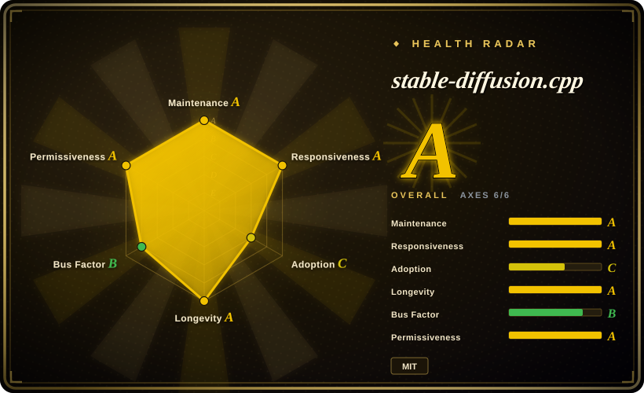
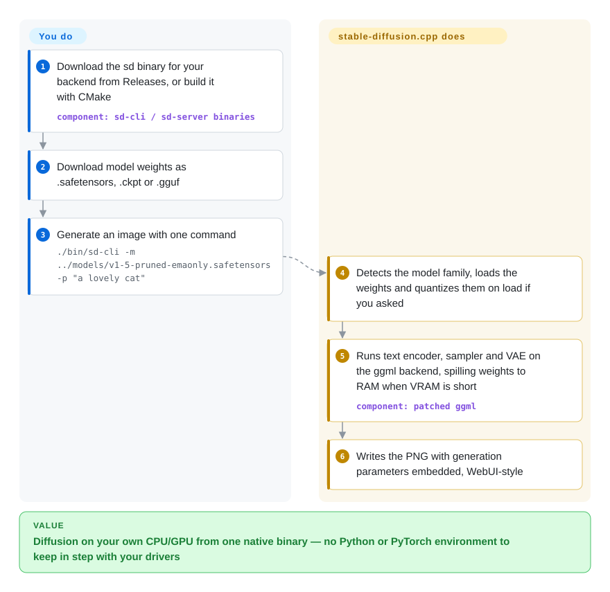

# stable-diffusion.cpp

You want to generate images on a laptop, a Mac, an AMD card or a machine with no GPU at all, and every Stable Diffusion tool starts by asking you to install a Python environment with a PyTorch build that matches your CUDA driver. stable-diffusion.cpp is one native binary (plus a C library) that loads the same checkpoints — SD, SDXL, Flux, Qwen-Image, Wan video and more — and runs them on CPU, CUDA, Vulkan, Metal or ROCm, with llama.cpp-style quantization to fit small memory.

## When to use

You are building a desktop app, a game-asset pipeline or a self-hosted service that needs image generation, and the target machines are not yours: some are Windows boxes with a 6 GB AMD card, some are M-series Macs, one is a CPU-only server. Shipping ComfyUI or the AUTOMATIC1111 WebUI there means shipping a Python runtime and a multi-gigabyte PyTorch wheel per GPU vendor, and the first bug report is `torch.cuda.OutOfMemoryError: CUDA out of memory. Tried to allocate 20.00 MiB` on a card that should have been big enough.

Reach for stable-diffusion.cpp when the deciding factor is **deployment footprint and hardware reach**, not workflow richness. It is the diffusion counterpart of [llama.cpp](../llm-inference/local-runtimes/llama-cpp.md): plain C/C++ over ggml, MIT-licensed, prebuilt binaries for CPU/CUDA/Vulkan/ROCm/macOS, GGUF quantization (Flux-dev at q4_0 is documented at ~6.4 GB instead of ~12 GB at q8_0), and a C API you can link into your own process or call through Python/Go/C#/Rust bindings. Choose it over [ComfyUI](comfyui.md) and [Stable Diffusion WebUI](stable-diffusion-webui.md) when you need an embeddable engine rather than a GUI with an extension ecosystem, and over Diffusers when you cannot or will not carry a Python/PyTorch stack.

## How it works

stable-diffusion.cpp re-implements each supported model family — the text encoder that turns your prompt into numbers, the diffusion network that repeatedly denoises a latent image, and the VAE that decodes the latent into pixels — directly in C++ on top of ggml, the same tensor library under llama.cpp. You hand it weight files you downloaded (`.safetensors`, `.ckpt` or `.gguf`); it detects the model family, can quantize the weights while loading (`--type q4_0` and friends — storing each number in fewer bits so it fits in less memory), and runs the whole pipeline on whichever backend the binary was built for. When the model does not fit in video memory it keeps weights in system RAM (or even re-reads them from disk) and moves each piece to the GPU only while it computes — slower, but it runs. What you own: picking and downloading the right weight files (big models need a separate VAE and text encoder), choosing flags, and choosing between the one-shot `sd-cli` and the long-running `sd-server`, which loads one model at startup and serves a web UI plus OpenAI-style (`/v1/images/generations`), WebUI-style (`/sdapi/v1/txt2img`) and native (`/sdcpp/v1/...`) HTTP APIs.

<!-- flow-steps:begin (generated from flows/stable-diffusion-cpp.json by tools/flow_card.py — do not edit) -->

Text version of the flow

1. **You**: Download the sd binary for your backend from Releases, or build it with CMake — component: `sd-cli / sd-server binaries`
2. **You**: Download model weights as .safetensors, .ckpt or .gguf
3. **You**: Generate an image with one command — `./bin/sd-cli -m ../models/v1-5-pruned-emaonly.safetensors -p "a lovely cat"`
4. **stable-diffusion.cpp**: Detects the model family, loads the weights and quantizes them on load if you asked
5. **stable-diffusion.cpp**: Runs text encoder, sampler and VAE on the ggml backend, spilling weights to RAM when VRAM is short — component: `patched ggml`
6. **stable-diffusion.cpp**: Writes the PNG with generation parameters embedded, WebUI-style

**Value**: Diffusion on your own CPU/GPU from one native binary — no Python or PyTorch environment to keep in step with your drivers

<!-- flow-steps:end -->

## When NOT to use

- **If you want node-graph workflows, ControlNet stacks beyond SD 1.5, custom nodes or a large extension ecosystem, use [ComfyUI](comfyui.md) instead**, because stable-diffusion.cpp exposes a fixed set of features through CLI flags and an API; its README lists ControlNet support for SD 1.5 only, and anything not implemented in C++ simply does not exist.
- **If you want a beginner-friendly GUI with inpainting canvases, extension tabs and a large tutorial base, use [Stable Diffusion WebUI](stable-diffusion-webui.md) or ComfyUI instead**, because stable-diffusion.cpp's bundled web UI (new as of 2026-04) is a thin front-end over one loaded model, not an artist's workbench.
- **If you train, fine-tune, or research new samplers and architectures in Python, use Diffusers instead**, because every model family here is a hand-ported C++ implementation: new papers land only when someone ports them, and you cannot monkey-patch a pipeline the way you can in PyTorch.
- **If you need a multi-user or network-exposed image API, put an authenticating gateway in front of it or use a serving layer such as LocalAI instead of bare `sd-server`**, because `sd-server` has no authentication (an API-key feature request, #1988, was still open on 2026-09-28), runs generation jobs on a single worker thread against one loaded model, and returns HTTP 429 when its queue fills.
- **If you need a stable, versioned API to depend on, pin an exact `master-NNN` build and budget for churn — or wrap it through a binding that pins for you**, because the README warns that "API and command-line option may change frequently", releases are per-commit build tags with no semver, and recent docs record C/JSON field renames (`tile_size_x/y` → `tile_size_w/h`).
- **If you are on Apple Silicon and want the fastest path, benchmark it against Core ML or MLX-based pipelines before committing**, because the project's own build guide says Metal is currently "highly inefficient" on very large matrix operations, and an open issue (#1990) reports silent blank-white output on an M5 Max with Z-Image-Turbo.
- **If you cannot tolerate backend-specific breakage between builds, pin a known-good build per backend and test before upgrading**, because recent open issues show regressions that hit only one backend (Vulkan video models broken since master-864, #1976; ROCm gfx1100 launch failures after #1994, #2008), the troubleshooting guide admits the maintainer "has limited hardware and cannot test every combination", and CI builds binaries without running a test suite.

## Comparison

| Alternative | In index | Our verdict | Tradeoff |
|---|---|---|---|
| [ComfyUI](comfyui.md) | ✅ | Pick stable-diffusion.cpp when you must embed generation in your own app or ship to mixed CPU/AMD/Mac hardware without Python; pick ComfyUI when an artist or researcher needs composable node workflows and the newest community nodes. | ComfyUI gets you the richest workflow surface and fastest model uptake at the cost of a Python/PyTorch stack and GPL-3.0; stable-diffusion.cpp gets you a single MIT binary and a C API at the cost of a fixed feature set. |
| [Stable Diffusion WebUI](stable-diffusion-webui.md) | ✅ | Pick stable-diffusion.cpp for headless or embedded generation and for newer model families (Flux, Qwen-Image, Wan); pick the WebUI when a human wants a mature tabbed GUI with the classic SD 1.x/SDXL extension ecosystem. | The WebUI trades a heavy Python install for years of extensions and tutorials; stable-diffusion.cpp even mirrors its `/sdapi/v1` endpoints and RNG, so clients can move over while losing the extensions. |
| Diffusers (huggingface/diffusers) | not indexed | Pick Diffusers when you write Python, need training/fine-tuning hooks, or need a model the day its paper ships; pick stable-diffusion.cpp when the deliverable is inference on end-user machines without Python. | Diffusers covers the widest model and scheduler surface with first-class PyTorch integration but needs a PyTorch/CUDA environment; stable-diffusion.cpp is lighter to ship but only runs what has been ported. Not added in this tab-intake batch. |
| LocalAI (mudler/LocalAI) | not indexed | Pick LocalAI when you want one OpenAI-compatible server for chat, embeddings, speech and images together; pick stable-diffusion.cpp directly when image/video generation is the only job and you want to control flags and builds yourself. | LocalAI wraps stable-diffusion.cpp as one of its backends (`backend/go/stablediffusion-ggml`), adding model management and a unified API at the cost of an extra layer and lagging upstream builds. Not added in this tab-intake batch. |
| Draw Things | not a repo | Pick Draw Things when you only want a polished, Apple-optimized app on your own Mac or iPhone; pick stable-diffusion.cpp when you need to script, embed, or run on Windows/Linux. | Draw Things is a closed, App Store–distributed product outside this index's repository scope; it cannot be embedded or rebuilt, which is exactly what stable-diffusion.cpp is for. |

## Tech stack

- **Language / build:** C++17 core with a C API header (`include/stable-diffusion.h`: `new_sd_ctx`, `generate_image`, `generate_video`), CMake build.
- **Tensor runtime:** ggml via a git submodule pointing at the maintainer's **patched fork** (`leejet/ggml`, forked from `ggml-org/ggml`); building against upstream ggml is supported but disables FP8 and INT8 convrot paths and may lose operators and optimizations.
- **Backends:** CPU (AVX/AVX2/AVX512), CUDA, Vulkan, Metal, OpenCL, SYCL, HIP/ROCm and MUSA, plus an RPC backend; flash attention and SageAttention (CUDA) options.
- **Models:** SD 1.x/2.x/XL/3/3.5, FLUX.1/FLUX.2, Chroma, Qwen-Image (+Edit), Z-Image, PixArt and many newer image families; video via Wan 2.1/2.2, LTX-2.x, HunyuanVideo 1.5, MiniMax-H3; LoRA, LCM, PhotoMaker, IP-Adapter, TAESD, ESRGAN upscaling.
- **Weight formats:** `.ckpt`/`.pth`, `.safetensors`, `.gguf`; `-M convert` writes quantized GGUF (or safetensors) ahead of time.
- **Front-ends:** `sd-cli`, `sd-server` (HTTP APIs + embedded web UI built from the `leejet/sdcpp-webui` submodule with Node.js/pnpm), libwebp/libwebm for WebP and WebM output.

## Dependencies

- **Runtime:** a self-contained binary or shared library — no Python, no PyTorch. GPU SDKs (CUDA toolkit, ROCm, Vulkan SDK) are needed only to build; the Windows CUDA release ships a separate `cudart` zip.
- **Prebuilt binaries (as of master-929, 2026-09-27):** Windows CPU/CUDA 12/Vulkan/ROCm, Linux Ubuntu 24.04 CPU/Vulkan/ROCm, macOS arm64. There is no prebuilt Linux CUDA binary, so Linux + NVIDIA means building from source (or Docker).
- **Models:** you download weights yourself from Hugging Face or elsewhere; newer families need several files (diffusion model + VAE + one or more text encoders). Weight licenses are separate from the MIT code license — FLUX.1-dev, for example, is under a non-commercial license on its model card.
- **Hardware:** the build guide recommends at least 4 GB of VRAM for CUDA; SD 1.x at 512×512 is documented at roughly 2 GB of memory, Flux-dev from ~3.7 GB (q2_k) to ~12 GB (q8_0).
- **Bindings (optional, third-party):** Python (`stable-diffusion-cpp-python`), Go, C#, Rust and Flutter/Dart wrappers listed in the README.

## Ops difficulty

**Medium.** Running a prebuilt binary is easy; the recurring cost is everything around it. You must pick the right weight files and companion encoders per model family, choose memory flags (`--offload-to-cpu`, `--params-backend`, `--vae-tiling`, `--diffusion-fa`) for each machine, and pin builds yourself because there is no semver and backend regressions do happen. NaN-induced black or white images on some backend/model/format combinations are a documented failure mode with manual `--linear-scale`/`--attn-scale` workarounds. `sd-server` needs a reverse proxy for auth and TLS if it leaves localhost (it binds `127.0.0.1:1234` by default), and serves one model per process, so multi-model hosting means multiple processes.

## Health & viability

- **Maintenance:** very active — created 2023-08-13, pushed 2026-09-27, with several `master-NNN` build releases on 2026-09-27 alone and new model families landing within days of their release (Qwen-Image-2.1 "Day-0" on 2026-09-20). Recent issues got a first response in a median ~27 hours (radar A); stale issues and PRs are auto-closed by workflow.
- **Governance / bus factor:** a personal-account project. The radar scores governance B: 68 contributors active in the last 12 months, but the top contributor holds ~53% of commits and the top three ~74%. The owner `leejet` wrote about 101 of roughly 170 commits since 2026-06-28 and 453 all-time, with a steady second tier (wbruna, stduhpf, fszontagh). The roadmap and the patched ggml fork both sit with one person; no foundation or company is named as a backer.
- **Backing & Lindy:** about three years old and still accelerating, in a niche where it has become the default ggml diffusion engine. That is a reasonable Lindy prior for a young field, discounted by the single-owner governance.
- **Adoption & ecosystem:** ~7.4k stars and ~830 forks; the radar's C on adoption is measured from ~147k release-asset downloads only, which misses from-source builds, bindings and embedding apps, so read it as a floor. It is used as the image backend by LocalAI and KoboldCpp, with bindings in five languages. The Python binding is modest in reach (~1.8k PyPI downloads in the month to 2026-09-28).
- **Risk flags:** MIT code, no relicense history found; the real risks are API/CLI churn without semver, a hand-ported model zoo whose breadth outruns the maintainer's hardware for testing, and dependence on a patched ggml fork rather than upstream.

## Caveats (unverified)

- [未验证] The VRAM/memory figures (Flux at 4–6 GB, SD 1.x ~2 GB, the Flux quantization table) come from the project's own docs; I did not run the binary or benchmark it on any hardware.
- [推断] "Jobs run one at a time" is read from `examples/server/main.cpp` (one `async_job_worker` thread) and the shared `sd_ctx_mutex` in `async_jobs.cpp`; I did not load-test the server.
- [推断] "No test suite in CI" is inferred from `.github/workflows/build.yml` (build and package jobs only) and CONTRIBUTING's instruction not to commit test code; the maintainer may test locally.
- [未验证] Whether the patched `leejet/ggml` fork will stay in sync with upstream ggml, or be merged back, is not stated anywhere I found.
- [未验证] LocalAI's lag behind upstream stable-diffusion.cpp builds is assumed from its wrapper architecture; I did not compare its pinned commit.
- [未验证] Per-model feature coverage (which of LoRA / ControlNet / PhotoMaker / flash attention work with which family and backend) is documented per model page, not as a matrix, and was not tested here.
- [未验证] Star, fork and download counts are as of 2026-09-28 and time-sensitive.
