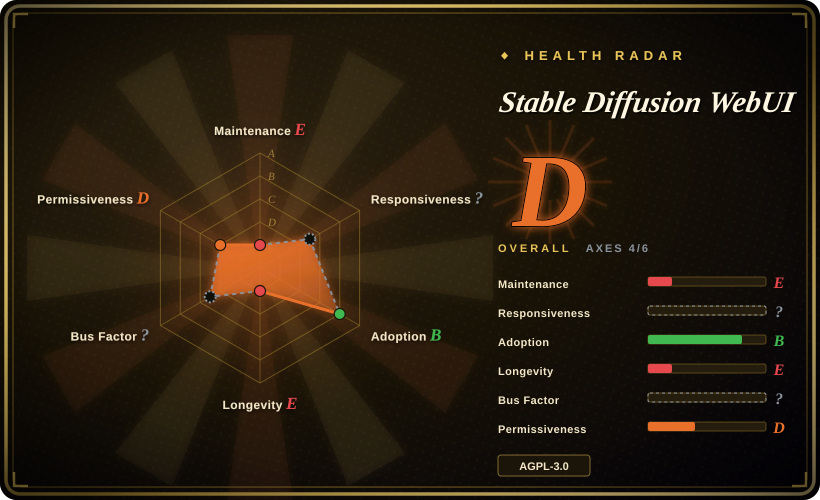
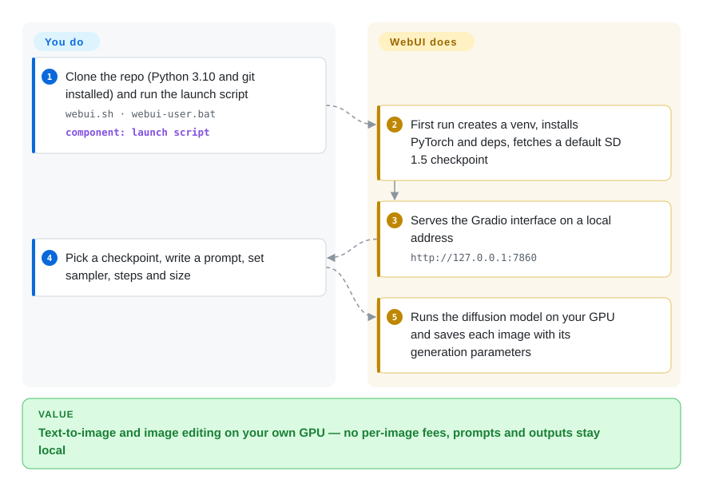

# Stable Diffusion WebUI

A web-based interface for Stable Diffusion image generation, built with Gradio, offering txt2img, img2img, inpainting, outpainting, upscaling, and a rich plugin ecosystem for local GPU inference.

## When to use

You're a creator, researcher, or developer who wants to generate images from text prompts or edit existing images using diffusion models on your own hardware. You need a local web UI where you can write prompts, tweak sampling parameters, do inpainting to remove or add objects, run img2img for style transfer, and train custom embeddings with textual inversion. You pick Stable Diffusion WebUI over ComfyUI because you want a conventional tabbed interface rather than a node graph; you choose it over InvokeAI because its extension ecosystem is larger and more documented; you prefer it over Fooocus because you need full parameter control rather than simplified presets. You have an NVIDIA GPU with at least 6–8 GB of VRAM and are comfortable installing Python packages and managing model checkpoints. You install the WebUI, download a Stable Diffusion checkpoint, and open the browser tab to start generating — no cloud credits, no API keys, full control over the model and the outputs. Pick it knowing the core is frozen: the default branch has had no commit since 2024-07, so it fits SD 1.5/SDXL-era workflows and the existing A1111 extension catalog, not newer model families.

## How it works

The WebUI is a Python web app that wraps Stable Diffusion — a model that turns random noise into an image step by step, steered by your prompt — behind a tabbed browser interface built with Gradio (a library that turns Python functions into web forms). **The launch script does the setup for you**: on first run it creates a virtual environment, installs PyTorch and the other dependencies, downloads a default SD 1.5 checkpoint (the multi-gigabyte weights file) unless you already put one in `models/Stable-diffusion/`, and serves the UI at `http://127.0.0.1:7860`. **You supply the GPU, choose checkpoints and write the prompt and settings**; it runs the sampler on your card and saves the generation parameters inside each image so you can reload them later. Everything beyond txt2img — img2img, inpainting, upscaling, ControlNet-style add-ons — lives in the same tabs or in community extensions you install from the UI, which is both its strength and its upgrade risk.

<!-- flow-steps:begin (generated from flows/stable-diffusion-webui.json by tools/flow_card.py — do not edit) -->

Text version of the flow

1. **You**: Clone the repo (Python 3.10 and git installed) and run the launch script — `webui.sh · webui-user.bat` — component: `launch script`
2. **Stable Diffusion WebUI**: First run creates a venv, installs PyTorch and deps, fetches a default SD 1.5 checkpoint
3. **Stable Diffusion WebUI**: Serves the Gradio interface on a local address — `http://127.0.0.1:7860`
4. **You**: Pick a checkpoint, write a prompt, set sampler, steps and size
5. **Stable Diffusion WebUI**: Runs the diffusion model on your GPU and saves each image with its generation parameters

**Value**: Text-to-image and image editing on your own GPU — no per-image fees, prompts and outputs stay local

<!-- flow-steps:end -->

## When NOT to use

- **Frozen core — check this first.** The default branch `master` has had no commit since 2024-07-27 (v1.10.1, released 2025-02 from that commit); only small install-compatibility fixes land on `dev` (latest 2026-03-02). New model families and samplers are not being added. If you are starting fresh or need newer models, use [ComfyUI](comfyui.md), which ships releases weekly, instead of building a workflow on a stalled core.
- **CPU-only inference.** If you have no GPU and need to run diffusion models, use a cloud API like Midjourney or DALL-E instead of Stable Diffusion WebUI, because running diffusion on CPU is excruciatingly slow (minutes per image) and this tool is designed for CUDA GPUs.
- **Commercial use without checking AGPL-3.0.** If you need a locally run diffusion tool with a less restrictive license for commercial derivatives, use ComfyUI (GPL-3.0, a different copyleft scope) or a cloud API instead of Stable Diffusion WebUI, because its AGPL-3.0 carries strong network copyleft obligations that may affect your distribution plans.
- **Zero-setup or non-technical users.** If you want a one-click consumer experience without managing Python, CUDA, and model weights, use Fooocus or a cloud service like Midjourney instead of Stable Diffusion WebUI, because installation requires Python, PyTorch, CUDA drivers, and managing multi-gigabyte model files.
- **Team multi-user deployments.** If you need built-in RBAC, queue management, or user isolation for a shared server, use ComfyUI (which has better queue management) or a hosted cloud API instead of Stable Diffusion WebUI, because it has no native multi-user isolation and concurrent users will interfere with each other's jobs and settings.
- **Managed cloud preference.** If you want a hosted API without managing GPUs, drivers, and model files, use Midjourney, DALL-E, or a Stable Diffusion API service instead of Stable Diffusion WebUI, because it is strictly self-hosted.
- **Strict reproducibility needs.** If you need reproducible, version-controlled workflows across machines, use ComfyUI with its JSON workflow export or Diffusers (Hugging Face) programmatically instead of Stable Diffusion WebUI, because the WebUI exposes hundreds of parameters, sampler choices, and extension interactions that make exact reproduction across different PyTorch/CUDA versions difficult.

## Comparison

| Alternative | In index | Our verdict | Tradeoff |
|---|---|---|---|
| [ComfyUI](comfyui.md) | ✅ | Choose ComfyUI for new setups, newer model families or exportable batch pipelines; keep WebUI only when its tabbed UI and existing A1111 extensions are what you rely on. | ComfyUI is actively maintained and its node graphs save as reusable JSON workflows, but the graph has a steeper learning curve than WebUI's tabs. |
| InvokeAI | 未收录 | Choose InvokeAI when iterative editing on a layered canvas matters more than A1111's extension catalog. | More focused on the artistic workflow with a built-in canvas; less extension-heavy than WebUI. |
| Fooocus | 未收录 | Choose Fooocus when you want prompt-in, image-out with presets and no parameter tuning; stay on WebUI when you need every sampler knob. | Stripped-down presets and minimal controls; good for beginners but limiting for advanced users. |
| DiffusionBee | 未收录 | Choose DiffusionBee on a Mac when a native app with no Python setup beats extensions and NVIDIA-tuned speed. | No command-line or extension ecosystem; Apple Silicon optimized but platform-locked. |
| Midjourney / DALL-E | not a repo | Choose a hosted service when you have no suitable GPU or want zero ops; choose WebUI when models, prompts and images must stay on your own hardware. | Proprietary models, subscription-based, no local control; WebUI is open-source and runs on your own GPU. |

## Tech stack

- **Python** — primary implementation language
- **Gradio** — web UI framework for the frontend
- **PyTorch** — deep learning framework for model inference
- **CUDA** — GPU acceleration via NVIDIA drivers
- **Stable Diffusion models** — community checkpoints, LoRAs, embeddings, and VAEs loaded at runtime

## Dependencies

- **NVIDIA GPU** with at least 6 GB VRAM (8 GB+ recommended for larger models and higher resolutions)
- **Python 3.10+** and matching PyTorch/CUDA versions
- **Model checkpoints** — multi-gigabyte `.safetensors` or `.ckpt` files downloaded from community hubs (e.g., Civitai, Hugging Face)
- **Optional: xformers** — for memory-efficient attention and speedups
- **Optional: GFPGAN, CodeFormer, RealESRGAN** — for face restoration and upscaling in the Extras tab

## Ops difficulty

**Medium.** Installation is a one-click script for basic setups, but the real burden is keeping the Python environment, PyTorch, CUDA drivers, and extension ecosystem compatible. Extension updates can break the WebUI after a `git pull`, and model files consume tens of gigabytes of disk space. GPU thermal management, VRAM limits, and batch-size tuning are ongoing concerns. For a personal workstation this is manageable; for a shared server or production pipeline, expect frequent troubleshooting.

## Health & viability

- **Maintenance (as of 2026-10-08) — frozen core, grade E.** No commit on the default branch since 2024-07-27; 0 of the last 13 weeks active. A collaborator (`w-e-w`) still merges occasional install fixes on `dev` (Blackwell, PyTorch 2.7, uv, setuptools — latest 2026-03-02), so "works on new installs" is being kept alive, but features are not moving.
- **Responsiveness — cannot be scored** (no qualifying issue/PR traffic in the scorer's window); ~2.5k open issues sit largely untriaged, which matches the frozen core.
- **Governance / bus factor.** Owned by a single `User` account (`AUTOMATIC1111`) with no org or foundation; the roadmap depends on that one person resuming. [推断]
- **Age × Lindy — longevity grade E.** Created 2022-08 (1508 days, ~4 years), and the active half of Lindy has lapsed: an old-and-stalled repo, not old-and-active.
- **Verdict — overall D.** Usable as-is for the SD 1.5/SDXL era; a poor base for anything you expect to keep upgrading.
- **Adoption — B, still large.** ~165k stars and ~5.8M release-asset downloads; the extension ecosystem and tutorials are its moat, which is why it still matters despite the freeze.
- **Risk flags — license grade D.** AGPL-3.0 (strong network copyleft) on the app; models and extensions carry their own licenses. No relicense history.

## Caveats (unverified)

- [未验证] The exact maintenance status of the `AUTOMATIC1111` user account and their continued availability is not publicly documented; the bus factor is a genuine concern.
- [未验证] The 2026-03-02 push was a `dev`-branch install fix; `master` has been unchanged since 2024-07-27 as of 2026-10-08. Whether the owner intends to resume feature work is not stated anywhere we found.
- [未验证] Individual model checkpoints and extensions carry their own licenses and safety filters; the tool's AGPL-3.0 does not govern the weights you download.
- [推断] The ~165k star count reflects both genuine popularity and the 2022–2023 AI art boom; some of that visibility is hype-driven rather than current active-user signal.
- [未验证] Specific VRAM requirements vary dramatically by model size, resolution, and enabled extensions; the "6–8 GB" figure is a rule of thumb, not a guarantee.
