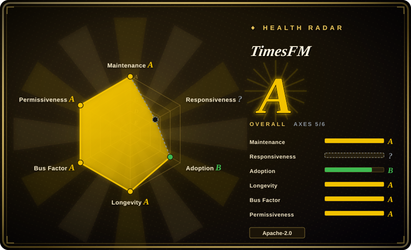
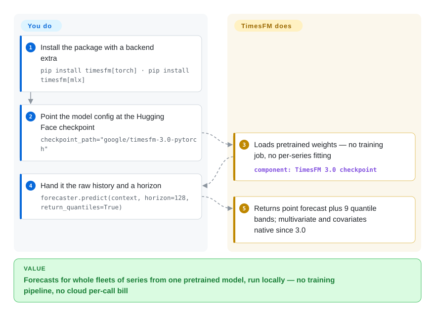

# TimesFM

You have hundreds or thousands of series to forecast — per-SKU demand, sensor readings, energy load — and training, tuning and babysitting one model per series never ends. TimesFM is Google Research's pretrained time-series foundation model: feed it a history and it returns zero-shot point and quantile forecasts without any training job, and since the 3.0 release (August 2026) it handles multivariate series and covariates natively. The checkpoints stay small (330M for 3.0), so they run on your own CPU or GPU.

## When to use

You're a data engineer at a logistics company with thousands of SKUs, each with its own demand history, and the ask is a daily forecast per SKU. Training and maintaining one classical model (ARIMA/Prophet) per series is a maintenance treadmill, and standing up a bespoke deep-learning pipeline means labeled tuning, validation, and a serving stack you don't have time to own. You want something that takes a series in and gives a forecast out, today, without a training job.

So you reach for TimesFM. You `pip install timesfm[torch]`, point a config at `google/timesfm-3.0-pytorch` on Hugging Face, and call `predict_batch(...)` over your series with just a horizon — no frequency indicator, no fitting. Because the model is a few hundred million parameters it loads and runs on a single CPU box or a modest GPU — no cloud forecasting API, no per-call bill, and your demand data stays on your own machine. You get point forecasts plus quantile bands (9 deciles in the 3.0 examples) in one call. When external drivers matter (promotions, price), TimesFM 3.0 takes past-only and past-and-future covariates natively — the 2.5 line needed the separate XReg path. On Apple silicon there is now an MLX backend that runs without PyTorch (README claims ~90–666 series/s on an M4 Max, self-reported). If accuracy on your domain still falls short, fine-tuning runs via Hugging Face Transformers + PEFT/LoRA with examples in the repo rather than starting from scratch.

## How it works

TimesFM replaces the "train a model per series" pipeline with one pretrained forecaster. Your series is chopped into patches — fixed-length windows of values treated like tokens — and the decoder-only transformer autoregressively generates future patches; a quantile head turns the raw output into a point forecast plus quantile bands (9 deciles in the 3.0 examples) instead of a single number. Since 3.0 the same call takes 2-D multivariate targets plus two kinds of covariates — past-only (drivers known only before now) and past-and-future (drivers you already know across the horizon, e.g. a planned promotion) — so you no longer bolt on the XReg regressor path that 2.5 required. What the project does for you: loading a checkpoint, forecasting, batching ragged-length series in one pass, quantiles and covariate handling included. What stays yours: cleaning and sampling the data at regular intervals, choosing the horizon, sizing CPU/GPU/MLX throughput for your batch, pinning checkpoint + module version across releases — and respecting that 3.0 default weights are licensed non-commercial while 2.5 weights remain Apache-2.0.

<!-- flow-steps:begin (generated from flows/timesfm.json by tools/flow_card.py — do not edit) -->

Text version of the flow

1. **You**: Install the package with a backend extra — `pip install timesfm[torch] · pip install timesfm[mlx]`
2. **You**: Point the model config at the Hugging Face checkpoint — `checkpoint_path="google/timesfm-3.0-pytorch"`
3. **TimesFM**: Loads pretrained weights — no training job, no per-series fitting — component: `TimesFM 3.0 checkpoint`
4. **You**: Hand it the raw history and a horizon — `forecaster.predict(context, horizon=128, return_quantiles=True)`
5. **TimesFM**: Returns point forecast plus 9 quantile bands; multivariate and covariates native since 3.0

**Value**: Forecasts for whole fleets of series from one pretrained model, run locally — no training pipeline, no cloud per-call bill

<!-- flow-steps:end -->

## When NOT to use

- **You want to ship the default 3.0 weights commercially or into production — you can't, today.** The code is Apache-2.0, but TimesFM 3.0 pretrained weights are distributed under `timesfm-non-commercial-license-v1.0` and are restricted to non-commercial, non-production use (README license notice + HF model card, checked 2026-09-28). Weights up to 2.5 remain Apache-2.0 — if the deployment is commercial and you don't want to wait for a license change, pick the 2.5 checkpoint (`google/timesfm-2.5-200m-pytorch`) or compare Chronos / Nixtla's OSS libraries, which don't carry that restriction.
- **Not a chat/LLM or anomaly detector** — TimesFM forecasts numeric time series only. It does not classify, detect anomalies, or generate text; pair it with your own logic for those.
- **Hard real-time / microsecond latency** — it's a ~330M transformer; even with the README's self-reported ~11 ms median on an M4 Max, per-call inference is heavier than a fitted ARIMA/exponential-smoothing model. For ultra-low-latency or embedded MCU targets, a tiny classical model wins.
- **You need a guaranteed-supported product** — the README states "this open version is not an officially supported Google product." No SLA; treat it as research code you self-host.
- **Very short or highly irregular series** — a foundation model shines with enough context; for a handful of points, sparse/intermittent demand, or event-driven irregular timestamps, classical or specialized methods are often better.
- **Structural/causal modeling** — since 3.0 (2026-08) TimesFM forecasts multivariate series with covariates natively, but it learns correlational dynamics, not a structural/causal model you can query for interventions. For causal inference, use dedicated causal tooling.
- **Version churn risk** — the lineage moves fast (1.0 → 2.0 → 2.5 → 3.0), and each step changed parameter count, context length and the forecasting API; the 3.0 code lives in a new `timesfm3` module, 2.5 is archived under `src/timesfm`, and 1.0/2.0 under `v1` (`pip install timesfm==1.3.0` loads old ones). Pin your checkpoint and API version and re-validate on upgrade.

## Comparison

| Alternative | In index | Our verdict | Tradeoff |
|---|---|---|---|
| [BitNet](bitnet.md) | ✅ | Choose BitNet when you need an on-device LLM runtime, not a forecaster. | An on-device **LLM** runtime (1-bit text models), a different modality entirely — TimesFM forecasts numbers, BitNet generates text. Listed here only to disambiguate "local model": pick by task, not by both being "small + local". |
| [LiteRT-LM](litert-lm.md) | ✅ | Choose LiteRT-LM when you need Google's on-device text-generation runtime. | Google's on-device **LLM** orchestration runtime (text gen on phones). Not a forecaster; you would not use it for demand forecasting. Same disambiguation note. |
| [Google AI Edge Gallery](ai-edge-gallery.md) | ✅ | Choose AI Edge Gallery when you need a demo app/catalog for generative on-device models. | A demo app/catalog for running on-device **generative** models, not time-series forecasting. Different task. |
| Chronos (Amazon) | 未收录 | Choose Chronos when you want the language-model-tokenization approach to time-series forecasting, or Apache-licensed weights for a commercial zero-shot forecaster. | Tokenizes series into a language-model vocabulary; strong zero-shot forecaster and a direct substitute. TimesFM 3.0 answers with native multivariate + covariate support and a quantile head, but its default weights are currently non-commercial-licensed — a real asymmetry for production picks. |
| TimGPT / Nixtla `nixtla` | 未收录 | Choose Nixtla when you need hosted forecasting API plus classical/neural OSS forecasting libs. | Hosted/managed forecasting API and OSS libs (statsforecast/neuralforecast). Nixtla's classical/neural libs are great when per-series training is fine; TimesFM trades that for zero-shot. |
| Moirai (Salesforce) | 未收录 | Choose Moirai when you need another open time-series foundation model with multivariate framing and permissively licensed weights. | Another open time-series foundation model with multivariate framing; overlapping use case, different architecture and license terms — TimesFM 3.0 went multivariate too, so check licenses and benchmarks before defaulting to either. |

## Tech stack

- **Language:** Python.
- **Architecture:** decoder-only transformer for forecasting (patched inputs → autoregressive horizon); 3.0 (≈330M per the README benchmark table) forecasts univariate and multivariate series natively with past-only and past-and-future covariates, emitting point forecasts plus 9 quantile deciles. The 2.5 line (200M, 16k context, optional ~30M quantile head) is archived under `src/timesfm`.
- **Backends:** PyTorch (`pip install timesfm[torch]`), an MLX-native backend for Apple silicon that runs without PyTorch (`pip install timesfm[mlx]`, README states it is numerically matched to the PyTorch forecaster), and historically JAX/Flax for 2.x.
- **Checkpoints:** hosted on Hugging Face — `google/timesfm-3.0-pytorch` for 3.0, the TimesFM collection for ≤2.5.
- **Fine-tuning:** via Hugging Face Transformers + PEFT (LoRA), with examples under `timesfm-forecasting/examples/finetuning/`.
- **Covariates (pre-3.0):** XReg (external regressors) for TimesFM 2.5 via `timesfm[xreg]`.

## Dependencies

- **Runtime:** Python; pick a backend — PyTorch (`timesfm[torch]`) or MLX (`timesfm[mlx]`, Apple silicon, no PyTorch). Runs on CPU, GPU, or TPU; CPU is viable for the small checkpoints, and the README benchmarks MLX on an M4 Max.
- **Install:** `pip install timesfm[torch]` or `pip install timesfm[mlx]` (PyPI currently at 3.0.2); the repo uses `uv` for local dev.
- **Model weights:** downloaded from Hugging Face (network access on first load); note 3.0 weights carry the non-commercial license, weights ≤2.5 are Apache-2.0.
- **Compute:** no GPU strictly required; a GPU/TPU helps throughput on large batches.

## Ops difficulty

**Low-to-medium.** Zero-shot inference is a `pip install` plus a config pointed at a checkpoint and a `predict_batch` call — no training job, no labeled data, no serving framework required, and the small checkpoints fit on commodity hardware. Difficulty rises if you (a) batch large fleets of series and need to size GPU/TPU/Mac throughput, (b) fine-tune via PEFT (then you own a training/eval loop), (c) wire covariates (native since 3.0, XReg on 2.5), or (d) wrap it in a service with input validation, since the model assumes clean, regularly-sampled numeric input. The main lifecycle burden is versioning plus licensing: the API moved modules across 1.0/2.0/2.5/3.0, so upgrades mean pinning and re-validating — and shipping 3.0 weights commercially is currently blocked by their non-commercial license.

## Health & viability

- **Maintenance (2026-09):** TimesFM 3.0 released August 2026 with GitHub tag v3.0.0 (2026-08-28) and PyPI 3.0.2; last push 2026-09-15 — clearly **active**, with a fast-moving model lineage (1.0 → 2.0 → 2.5 → 3.0). Release tags and model naming have historically lagged each other; check which checkpoint a tag ships before pinning.
- **Governance / backing:** Google Research-maintained (`google-research`, Organization). No single-maintainer bus factor, but the README explicitly states "not an officially supported Google product" — **no SLA**, and Google Research code can stall when the team's focus shifts. On the other hand, TimesFM is embedded in Google 1P surfaces (BigQuery ML, Google Sheets, Vertex Model Garden per the README), which raises the cost for Google of walking away.
- **Age & Lindy (created 2024-04, ~2.4yr):** young-ish but consistently active across four model generations — past the "abandoned-young" failure mode, not yet a long-lived Lindy bet. [推断] Treat as a credible-but-evolving foundation model.
- **Adoption (2026-09):** ~33.9k stars (GitHub API, 2026-09-28; up from ~25k in June) and 202,561 PyPI downloads/month; named by the README as a #1 foundation model on fev-bench, TIME Benchmark and GIFT-Eval — project-reported, not independently verified here. The 3.0 weights' non-commercial license may slow production adoption until it changes.
- **Risk flags:** the big one is **license drift**: code stayed Apache-2.0 but the 3.0 default weights moved to `timesfm-non-commercial-license-v1.0` (2026-08) — a relicense-shaped asymmetry between code and artifacts. Secondary flags: API churn across generations (pin checkpoint + module), and the "research code, no SLA" status.

## Caveats (unverified)

- [未验证] The benchmark wins (🥇 #1 on fev-bench, TIME Benchmark, GIFT-Eval) and the MLX latency table (11.1–48.1 ms, 90–666 series/s on M4 Max) are the project's own README claims; not independently reproduced here.
- [未验证] "3.0 ≈ 330M parameters" is inferred from the README's MLX benchmark heading ("330M model"); the model card does not headline a parameter count. The 15,360 `global_context` figure is likewise from the README.
- [未验证] Star count ~33.9k (GitHub API, 2026-09-28) drifts continuously; indicative only.
- [未验证] Whether the TimesFM 3.0 weights license (non-commercial "for the time being", per the README) will later reopen to Apache-2.0 is unknown — re-check before any commercial pick.
- [推断] CPU viability for the small checkpoints is inferred from model size and the README's backend table; actual latency/throughput depends on series count, horizon, and hardware — benchmark for your load.
- [推断] Accuracy vs Chronos/Moirai/Nixtla is workload-dependent; no first-party head-to-head is asserted here — evaluate on your own data.
- [未验证] "TimesFM in Google 1P products" (BigQuery ML, Sheets, Vertex) is cited from README links; the integration depth and parity with the open checkpoint were not verified.
