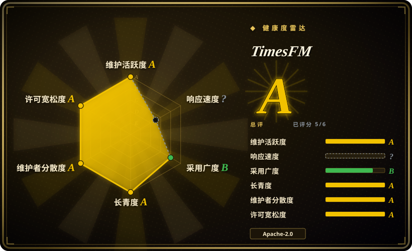
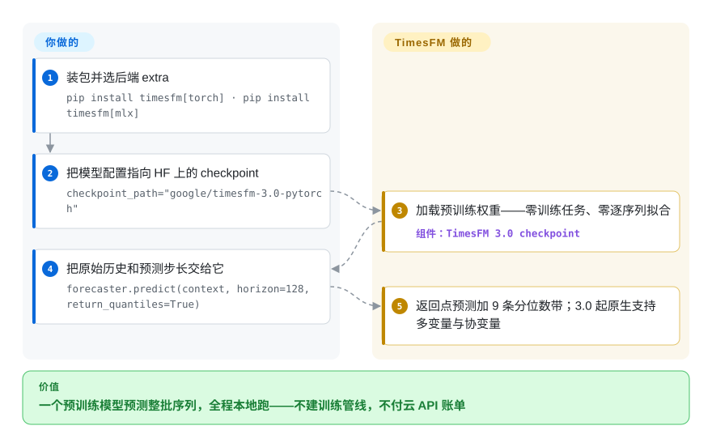

# TimesFM

你面前有几百几千条序列要预测——按 SKU 的需求、传感器读数、电力负荷——而给每条序列单独训练、调参、看护模型是永无止境的工作。TimesFM 是 Google Research 的预训练时间序列基础模型：把历史序列喂进去，它零样本直接返回点预测和分位数预测，不需要任何训练任务；2026 年 8 月的 3.0 版起，多变量序列与协变量也已原生支持。checkpoint 体量不大（3.0 约 330M），在你自己的 CPU 或 GPU 上就能跑。

## 何时使用

你是一家物流公司的数据工程师，手上有几千个 SKU，每个都有自己的需求历史，业务要求每天给每个 SKU 出一份预测。给每条序列单独训练并维护一个经典模型（ARIMA/Prophet）是个没完没了的运维负担；自建一套深度学习管线又意味着要做标注调参、验证、外加一套你根本没空维护的推理服务。你想要的是：序列进、预测出，今天就能用，还不用跑训练任务。

于是你选了 TimesFM：`pip install timesfm[torch]`，把配置指向 Hugging Face 上的 `google/timesfm-3.0-pytorch`，对一批批序列调用 `predict_batch(...)`，只需给出预测步长——没有 frequency 参数、不用拟合。因为模型只有几亿参数，它在一台单 CPU 机器或一块中等 GPU 上就能加载运行——没有云预测 API、没有按调用计费的账单，需求数据也留在你自己机器上。一次调用同时拿到点预测和分位数区间（3.0 示例里是 9 条分位）。当外部驱动因素（促销、价格）重要时，TimesFM 3.0 原生接受“仅过去”和“过去加未来”两类协变量，不再需要 2.5 那条单独的 XReg 路径。Apple silicon 上现在还有不依赖 PyTorch 的 MLX 后端（README 自报在 M4 Max 上约每秒 90–666 条序列）。如果你领域内的精度仍不够，可以走 Hugging Face Transformers + PEFT/LoRA 微调、仓库里有示例，而不必从零开始。

## 怎么用起来

TimesFM 把“每条序列训练一个模型”的管线换成一个预训练预测器。你的序列被切成 patch——定长的数值窗口，像 token 一样被处理——decoder-only transformer 自回归地生成未来的 patch；分位数头把原始输出变成“点预测加分位数区间”（3.0 示例里是 9 条分位），而不是孤零零一个数。从 3.0 起，同一个调用还能吃二维多变量目标，外加两类协变量——仅过去协变量（只在历史里已知的驱动因素）与过去加未来协变量（横跨预测区间、你提前就知道的因素，比如排定的促销）——所以不必再给 2.5 挂 XReg 回归器那条外挂路径。它替你做：加载 checkpoint、预测、把长度参差的序列打包成一次前向、分位数与协变量处理。仍归你管：把数据清洗成等间隔采样、选预测步长、为你的批量测算 CPU/GPU/MLX 吞吐、跨版本固定 checkpoint 和模块版本——以及遵守许可：3.0 默认权重是非商用许可，2.5 权重仍是 Apache-2.0。

<!-- flow-steps:begin (generated from flows/timesfm.json by tools/flow_card.py — do not edit) -->

流程文字版

1. **你**：装包并选后端 extra — `pip install timesfm[torch] · pip install timesfm[mlx]`
2. **你**：把模型配置指向 HF 上的 checkpoint — `checkpoint_path="google/timesfm-3.0-pytorch"`
3. **TimesFM**：加载预训练权重——零训练任务、零逐序列拟合 — 组件：`TimesFM 3.0 checkpoint`
4. **你**：把原始历史和预测步长交给它 — `forecaster.predict(context, horizon=128, return_quantiles=True)`
5. **TimesFM**：返回点预测加 9 条分位数带；3.0 起原生支持多变量与协变量

**价值**：一个预训练模型预测整批序列，全程本地跑——不建训练管线，不付云 API 账单

<!-- flow-steps:end -->

## 何时不用

- **你想把默认 3.0 权重商用或投生产——目前不行。** 代码是 Apache-2.0，但 TimesFM 3.0 预训练权重按 `timesfm-non-commercial-license-v1.0` 分发，仅限非商用、非生产用途（README 许可声明加 HF 模型卡，2026-09-28 核对）。2.5 及更早权重仍是 Apache-2.0——如果你的部署是商用的、又不想等许可变化，就选 2.5 checkpoint（`google/timesfm-2.5-200m-pytorch`），或对比 Chronos、Nixtla 的 OSS 库，它们没有这个限制。
- **不是聊天/LLM，也不是异常检测器** —— TimesFM 只做数值时间序列预测。它不分类、不检测异常、不生成文本；这些要靠你自己的逻辑来配。
- **硬实时 / 微秒级延迟** —— 它是约 330M 的 transformer；即便按 README 自报的 M4 Max 中位约 11 毫秒，单次推理也比一个拟合好的 ARIMA/指数平滑模型重。对于超低延迟或嵌入式 MCU 目标，小巧的经典模型更合适。
- **需要官方支持背书** —— README 明确写 "this open version is not an officially supported Google product"。没有 SLA；当作你自托管的研究代码看待。
- **极短或高度不规则序列** —— 基础模型在有足够上下文时才出彩；对于寥寥几个点、稀疏/间歇性需求、或事件驱动的不规则时间戳，经典或专门方法往往更好。
- **结构化/因果建模** —— 自 3.0（2026-08）起 TimesFM 原生预测多变量序列并支持协变量，但它学的是相关性动态，不是可以做干预问询的结构化/因果模型。要因果推断，请用专门的因果工具。
- **版本变动风险** —— 谱系迭代很快（1.0 → 2.0 → 2.5 → 3.0），每一代都改过参数量、上下文长度和预测 API；3.0 代码在新模块 `timesfm3` 里，2.5 归档在 `src/timesfm`，1.0/2.0 在 `v1`（`pip install timesfm==1.3.0` 可加载老版）。请固定 checkpoint 和 API 版本，升级即重验。

## 横向对比

| 替代品 | 是否收录 | 我们的评价 | 取舍 |
|---|---|---|---|
| [BitNet](bitnet.zh.md) | ✅ | 需要端侧 LLM 运行时而不是预测器时，选 BitNet。 | 一个端侧 **LLM** 运行时（1-bit 文本模型），完全是另一种模态——TimesFM 预测数字，BitNet 生成文本。列在这里只为消歧“本地模型”：按任务选，不要因为都“小+本地”就混为一谈。 |
| [LiteRT-LM](litert-lm.zh.md) | ✅ | 需要 Google 的端侧文本生成运行时时，选 LiteRT-LM。 | Google 的端侧 **LLM** 编排运行时（手机上跑文本生成）。不是预测器；不会用它做需求预测。同样的消歧说明。 |
| [Google AI Edge Gallery](ai-edge-gallery.zh.md) | ✅ | 需要端侧生成模型演示 app/目录时，选 Google AI Edge Gallery。 | 一个运行端侧**生成式**模型的演示 app/目录，不做时间序列预测。任务不同。 |
| Chronos (Amazon) | 未收录 | 想用语言模型 token 化路线做零样本预测、或需要权重许可同样宽松的替代品时，选 Chronos。 | 把序列 token 化进语言模型词表；很强的零样本预测器，是直接替代品。TimesFM 3.0 反过来以原生多变量加协变量和分位数头作答，但默认权重目前是非商用许可——商用选型时这是真实不对称。 |
| TimGPT / Nixtla `nixtla` | 未收录 | 需要托管预测 API 加经典/神经 OSS 预测库时，选 Nixtla。 | 托管/受管的预测 API 加 OSS 库（statsforecast/neuralforecast）。Nixtla 的经典/神经库在“可逐序列训练”时很好用；TimesFM 用零样本换掉这一步。 |
| Moirai (Salesforce) | 未收录 | 需要另一个多变量立论、且权重许可宽松的开源时间序列基础模型时，选 Moirai。 | 另一个开源时间序列基础模型，带多变量框架；用例重叠，架构与许可条款不同——TimesFM 3.0 也已原生化多变量，两边先核许可与基准再定。 |

## 技术栈

- **语言：** Python。
- **架构：** 用于预测的 decoder-only transformer（patch 化输入 → 自回归出 horizon）；3.0（按 README 基准表约 330M）原生预测单变量与多变量序列，支持仅过去、过去加未来两类协变量，输出点预测加 9 条分位。2.5 线（200M、16k 上下文、可选约 30M 分位数头）归档在 `src/timesfm`。
- **后端：** PyTorch（`pip install timesfm[torch]`）、面向 Apple silicon 且不依赖 PyTorch 的 MLX 原生后端（`pip install timesfm[mlx]`，README 称与 PyTorch 预测器数值对齐），以及 2.x 时代的 JAX/Flax。
- **Checkpoint：** 托管在 Hugging Face——3.0 用 `google/timesfm-3.0-pytorch`，2.5 及更早见 TimesFM 集合。
- **微调：** 通过 Hugging Face Transformers + PEFT（LoRA），示例在 `timesfm-forecasting/examples/finetuning/`。
- **协变量（3.0 之前）：** TimesFM 2.5 经 `timesfm[xreg]` 的 XReg（外生回归量）。

## 依赖

- **运行时：** Python；后端二选一——PyTorch（`timesfm[torch]`）或 MLX（`timesfm[mlx]`，Apple silicon、无需 PyTorch）。可跑在 CPU、GPU 或 TPU 上；小 checkpoint 用 CPU 可行，README 给出了 M4 Max 上的 MLX 基准表。
- **安装：** `pip install timesfm[torch]` 或 `pip install timesfm[mlx]`（PyPI 目前 3.0.2）；仓库本地开发用 `uv` 管理依赖。
- **模型权重：** 从 Hugging Face 下载（首次加载需联网）；注意 3.0 权重是非商用许可，2.5 及更早为 Apache-2.0。
- **算力：** 不强制要 GPU；GPU/TPU 在大批量上有助吞吐。

## 运维难度

**低到中。** 零样本推理就是一次 `pip install` 加一个指向 checkpoint 的配置和一次 `predict_batch` 调用——没有训练任务、不要标注数据、不需要服务框架，小 checkpoint 在普通硬件上就能跑。难度上升的情形：(a) 批量预测大规模序列、需要测算 GPU/TPU/Mac 吞吐；(b) 走 PEFT 微调（那你就要自己维护训练/评估循环）；(c) 接入协变量（3.0 起原生，2.5 用 XReg）；(d) 把它包成服务并做输入校验——因为模型假设输入是干净、等间隔采样的数值。主要的生命周期负担是版本加许可：1.0/2.0/2.5/3.0 之间 API 换了模块，升级必须固定版本并重验；而 3.0 权重的非商用许可目前直接挡住商用投产。

## 健康度与可持续性

- **维护（2026-09）：** TimesFM 3.0 于 2026 年 8 月发布，GitHub tag v3.0.0（2026-08-28）、PyPI 已到 3.0.2；最后 push 2026-09-15——明显**活跃**，模型谱系推进很快（1.0 → 2.0 → 2.5 → 3.0）。release tag 与模型命名历史上互相滞后，固定前先确认某个 tag 装的是哪个 checkpoint。
- **治理 / 背书：** 由 Google Research 维护（`google-research`，Organization）。没有单一维护者的巴士因子，但 README 明确写“不是受官方支持的 Google 产品”——**没有 SLA**，且 Google Research 的代码会在团队重心转移时停滞。另一面：README 列出 TimesFM 已进入 Google 自家产品（BigQuery ML、Google Sheets、Vertex Model Garden），这抬高了 Google 放弃它的成本。
- **年龄与 Lindy（创建于 2024-04，约 2.4 年）：** 偏年轻，但跨四代模型持续活跃——已越过“年轻即废弃”的失败模式，但还不是经过长期验证的 Lindy 赌注。[推断] 当作可信但仍在演进的基础模型看待。
- **采用度（2026-09）：** 约 33.9k star（GitHub API，2026-09-28；6 月时约 25k），PyPI `timesfm` 月下载 202,561；README 自称在 fev-bench、TIME Benchmark、GIFT-Eval 上基础模型排名第一——项目自报，本页未独立验证。3.0 权重的非商用许可在许可变化前可能拖慢生产采用。
- **风险标记：** 最大的一条是**许可漂移**：代码保持 Apache-2.0，但 3.0 默认权重转成了 `timesfm-non-commercial-license-v1.0`（2026-08）——代码与产物之间出现了 relicense 形态的不对称。次级风险：跨代 API 变动（要 pin checkpoint 加模块），以及“研究代码、无 SLA”的状态。

## 存疑（未验证）

- [未验证] 基准成绩（fev-bench、TIME Benchmark、GIFT-Eval 第一）与 MLX 延迟表（M4 Max，11.1–48.1 ms、每秒 90–666 条序列）均为项目 README 自报，本页未独立复现。
- [未验证] “3.0 约 330M 参数”是从 README 的 MLX 基准标题（"330M model"）推断的，模型卡未以参数量为主信息；15,360 的 `global_context` 同样出自 README。
- [未验证] star 数约 33.9k（GitHub API，2026-09-28）持续漂移——仅作参考。
- [未验证] README 称 3.0 权重“暂时（for the time being）”为非商用许可，之后是否会重新开放为 Apache-2.0 未知——商用选型前请复查。
- [推断] 小 checkpoint 的 CPU 可行性是从模型体量和后端表推断的；实际延迟/吞吐取决于序列数量、horizon 和硬件——请针对你的负载实测。
- [推断] 相对 Chronos/Moirai/Nixtla 的精度依负载而定；本文不主张任何第一方正面对比——请在你自己的数据上评估。
- [未验证] “TimesFM 进入 Google 1P 产品”（BigQuery ML、Sheets、Vertex）引自 README 链接；其与开源 checkpoint 的能力对齐程度未核实。
