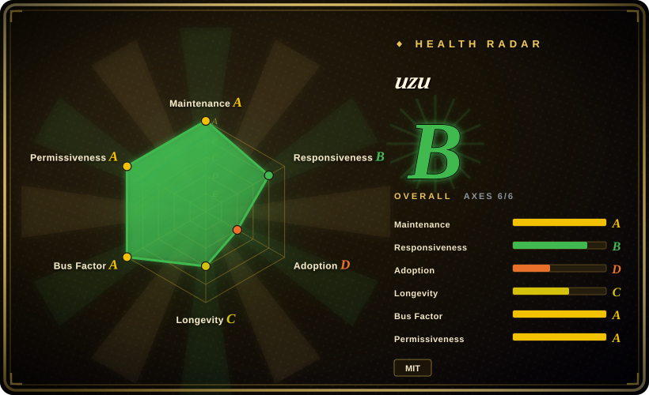
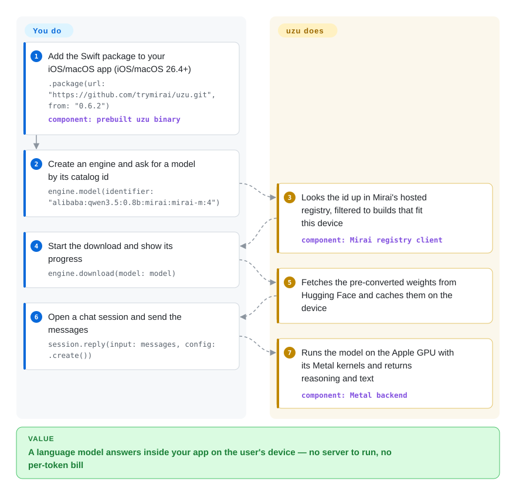

# uzu

You want a chat model inside your iPhone or Mac app, but a cloud API means a bill per request, a network round-trip and user text leaving the device — and a raw inference library leaves you to convert weights and write the download, caching and chat plumbing yourself. uzu is Mirai's Rust engine with Swift, Python and TypeScript wrappers that does that plumbing: you name a model from Mirai's catalog, it downloads a ready-converted copy and runs it on the Apple GPU.

## When to use

You are an iOS or macOS developer shipping an app — a notes app that should summarise on the device, a journaling app whose users will not accept their entries going to a server, or a Mac tool that must keep working on a plane. You tried a hosted API and the numbers did not work: every summary is a paid request, a 2–3 second round-trip, and a privacy review. You tried an inference library and found yourself converting a checkpoint, writing a downloader with resume, picking a quantization that fits an iPhone's memory, and gluing on a chat template — before writing a line of your actual feature.

uzu is the choice when you want the *app SDK* shape rather than the *engine* shape: add one Swift package, call `engine.model(identifier:)` with a catalog id, `engine.download(model:)`, then `session.reply(...)` — and it handles device-aware model selection, download and caching, chat templates, structured JSON output, and tool calls. Pick it over [llama.cpp](../llm-inference/local-runtimes/llama-cpp.md) or [MLX / mlx-lm](mlx-mlx-lm.md) when you would otherwise be writing that app-side plumbing yourself and your users are all on the newest Apple OS (26.4+); the trade is that you take Mirai's catalog, model format and hosted registry along with it.

## How it works

uzu is a Rust inference engine with hand-written Metal kernels — small programs that run on the Apple GPU — and it relies on Apple's *unified memory*, where the CPU and GPU share the same RAM so weights are never copied to a separate graphics card. It does not read Hugging Face checkpoints or GGUF files directly: models are converted ahead of time into Mirai's own format by the separate `lalamo` tool, and Mirai publishes ready-converted, already-quantized copies. **What it does for you:** asks Mirai's hosted registry (`sdk.trymirai.com`) which models fit this device, downloads the chosen one from Hugging Face and caches it, applies the chat template, runs generation with optional streaming, JSON-schema-constrained output and tool calls, and can also route the same `Engine` API to cloud providers (OpenAI and others) when you pass an API key. **What stays yours:** picking a model small enough for the device's memory (the README recommends the iOS Increased Memory entitlement), keeping only one model loaded at a time, and the product logic around the replies. Think of it as a vending machine rather than a kitchen: you choose from the menu Mirai stocks, and the machine handles the rest. The same engine also ships a CLI with an OpenAI-compatible local server (`cargo run --release -p cli -- server --model ...`); the card follows the in-app Swift path, which is the core value.

<!-- flow-steps:begin (generated from flows/uzu.json by tools/flow_card.py — do not edit) -->

Text version of the flow

1. **You**: Add the Swift package to your iOS/macOS app (iOS/macOS 26.4+) — `.package(url: "https://github.com/trymirai/uzu.git", from: "0.6.2")` — component: `prebuilt uzu binary`
2. **You**: Create an engine and ask for a model by its catalog id — `engine.model(identifier: "alibaba:qwen3.5:0.8b:mirai:mirai-m:4")`
3. **uzu**: Looks the id up in Mirai's hosted registry, filtered to builds that fit this device — component: `Mirai registry client`
4. **You**: Start the download and show its progress — `engine.download(model: model)`
5. **uzu**: Fetches the pre-converted weights from Hugging Face and caches them on the device
6. **You**: Open a chat session and send the messages — `session.reply(input: messages, config: .create())`
7. **uzu**: Runs the model on the Apple GPU with its Metal kernels and returns reasoning and text — component: `Metal backend`

**Value**: A language model answers inside your app on the user's device — no server to run, no per-token bill

<!-- flow-steps:end -->

## When NOT to use

- **Your users are not on Apple silicon running the latest OS.** The Swift package declares iOS / macOS / Mac Catalyst **26.4** as the minimum, the PyPI wheels are tagged `macosx_26_0`, and a 2026-09 request for a macOS 15 / Metal 3 build (issue #841) was closed — the engine targets Metal 4 only. Android, Linux, Windows and WebAssembly targets are listed as "in progress", and the docs FAQ says only Apple Silicon is supported. For older Apple OS versions or cross-platform apps use [llama.cpp](../llm-inference/local-runtimes/llama-cpp.md); for Android use [LiteRT-LM](litert-lm.md).
- **You need a build that makes no network calls you did not ask for.** `Engine::new` starts a telemetry client that posts model-download and inference events (model id, token statistics, errors) plus device context (OS name, CPU name, total memory) to `sdk.trymirai.com`, and no switch for it was found in `EngineConfig` or the docs. The model catalog also comes from that host (with a cached fallback). Prompt text is not in the event schema, but if your privacy promise is "nothing leaves the device", either patch it out in a fork or use [llama.cpp](../llm-inference/local-runtimes/llama-cpp.md) / [MLX / mlx-lm](mlx-mlx-lm.md), which load local files without a vendor endpoint.
- **You want any Hugging Face model the day it ships.** uzu runs only models in its own format — from Mirai's catalog, or ones you convert yourself with `lalamo`, which supports a fixed list of architectures. For same-day, any-checkpoint experiments on a Mac use [MLX / mlx-lm](mlx-mlx-lm.md); for the GGUF ecosystem use llama.cpp.
- **You need a production or multi-user server.** The CLI server loads one model at startup, listens on `127.0.0.1:8000` by default and has no authentication in its code; it is built from source with a nightly Rust toolchain. For a shared endpoint use [Ollama](../llm-inference/local-runtimes/ollama.md) on one box, or [vLLM](../llm-inference/serving-engines/vllm.md) on GPUs.
- **You need a stable, independently reproducible dependency.** It is 0.x with 28 GitHub releases since May 2026, most published crates sit under `crates/legacy/` marked "to be rewritten" in the workspace manifest, the Rust crate is only available as a git dependency (not on crates.io), and the Swift package downloads a prebuilt binary from `artifacts.trymirai.com` rather than compiling the repo. If you must audit and rebuild everything you ship, llama.cpp's source-built XCFramework is the simpler supply chain.
- **You only need a small on-device model and accept Apple's.** On iOS 26+, Apple's built-in Foundation Models framework gives a system model with no download and no extra binary; reach for uzu only when you need a model of your choosing.

## Comparison

| Alternative | In index | Our verdict | Tradeoff |
|---|---|---|---|
| [MLX / mlx-lm](mlx-mlx-lm.md) | ✅ | When you are a developer experimenting with arbitrary Hugging Face models on a Mac in Python, pick mlx-lm; pick uzu when the model has to ship inside a Swift app and you want download, caching and chat plumbing handled. | mlx-lm gains any-checkpoint support, fine-tuning and Apple's backing but leaves app integration to you; uzu gains an app SDK across four languages but limits you to its own converted models and macOS/iOS 26.4+. |
| [llama.cpp](../llm-inference/local-runtimes/llama-cpp.md) | ✅ | When the app must also run on older Apple OS versions, Android, Windows or Linux, or must not contact any vendor host, pick llama.cpp; pick uzu when you target only the newest Apple devices and value a high-level SDK over a C API. | llama.cpp gains the widest hardware matrix, GGUF model choice and no telemetry, but you write model management and chat glue; uzu does that glue for you at the cost of a vendor registry, telemetry and a Metal-4 floor. |
| [LiteRT-LM](litert-lm.md) | ✅ | When Android is your primary platform or you want Google's NPU/GPU delegates, pick LiteRT-LM; on an Apple-only app, uzu targets Metal directly. | LiteRT-LM gains Android and NPU reach with Google backing but centres on Gemma-class models; uzu gains Apple-GPU-specific kernels but has no shipping Android target yet. |
| MLC LLM (`mlc-ai/mlc-llm`) | not indexed | When one compiled model must run on iOS, Android and in the browser (WebGPU), pick MLC LLM; pick uzu when you only ship on Apple and want a smaller integration surface. | MLC LLM gains true cross-platform deployment through its TVM compiler but needs a per-model compile step; uzu skips compilation for catalog models but stays Apple-only. Not added in this tab batch. |
| Apple Foundation Models framework | not a repo | When a general small model is enough and you target iOS 26+, use Apple's built-in framework; pick uzu when you need a specific open model, structured output on that model, or a cloud fallback through the same API. | Apple's framework costs no download and no extra binary but is a closed OS component with one Apple-chosen model; uzu lets you pick the model at the cost of a multi-hundred-MB download per model. |

## Tech stack

- **Language:** Rust (edition 2024, nightly toolchain pinned in `rust-toolchain.toml`), ~1,000 `.rs` files across the workspace, plus Metal shader sources.
- **Compute backends:** `metal` (Metal 4, Apple GPU) and `cpu`; a Vulkan kernel PR was open on 2026-10-08.
- **Bindings:** Swift via `uniffi-rs` (Swift Package Manager, prebuilt `binaryTarget`), Python via `pyo3` (PyPI `uzu`, Python ≥ 3.12), TypeScript/Node via `napi-rs` (npm `@trymirai/uzu`, darwin arm64/x64).
- **Model format:** Mirai's own format, produced by the separate `trymirai/lalamo` converter; the catalog includes text models and the CLI also has text-to-speech and classification sessions.
- **Surfaces:** `Engine` / chat-session API with streaming, `Grammar::JsonSchema` structured output and tool calls; a CLI (`cargo run --release -p cli`) with an interactive TUI, a benchmark mode and an OpenAI-compatible server (`/v1/chat/completions`, `/v1/models`).

## Dependencies

- **Hardware/OS:** Apple Silicon (iOS, macOS, Mac Catalyst) on OS **26.4+**; PyPI/npm packages are macOS-only. Model RAM is the binding constraint — iOS apps should add the Increased Memory Limit entitlement.
- **Network:** `sdk.trymirai.com` for the model catalog (cached fallback on transient failures) and telemetry; `huggingface.co` for weights; `artifacts.trymirai.com` for the Swift binary. A local model directory can be registered via `local_path`.
- **Optional:** API keys for cloud providers (OpenAI, Anthropic, Gemini, xAI, Baseten, OpenRouter) if you use the hybrid cloud path; `lalamo` (Python, `uv`) to convert your own models.
- **Building from source:** nightly Rust, the Metal toolchain, `uv` and `pnpm`, installed by `cargo tools setup`.

## Ops difficulty

**Low for an app that uses the packaged SDK, medium-high if you build or serve it.** In-app it is one package dependency plus memory budgeting per device class; the work is choosing a model size per device, handling multi-hundred-MB downloads on cellular, and testing on real devices because the simulator uses stubs. Building from source needs a nightly toolchain and the Metal 4 compiler, and the minor version moves every week or two, so pin versions. The CLI server is a developer tool: no auth, one model, keep it on localhost.

## Health & viability

- **Maintenance (2026-10-09):** very active — commits in every one of the last 13 weeks (12–28 per week), v0.6.2 on 2026-10-08, and a release every few days since May 2026. Kernel work (Metal 4, speculative decoding, quantized matmuls) dominates the PR stream.
- **Governance & backing:** owned by Mirai Tech Inc.; six people account for ~92% of 852 default-branch commits (24 contributors) and there is no external governance. The company reportedly raised a $10M seed round in February 2026 led by Uncork Capital, so the roadmap is a startup's commercial roadmap.
- **Age / Lindy:** the repo was created 2025-06-23 (~15.5 months). Young and fast-moving, with a workspace openly mid-rewrite (`crates/legacy`); the Lindy prior gives it little credit yet.
- **Adoption:** ~2.0k stars and ~100 forks; 1,527 npm downloads in the last month per the health scorer (npm's own API showed 1,386 for 2026-09-08 → 10-07) and ~1.0k PyPI downloads (2026-10). The registry shows 0 dependent repositories, and no shipping apps were found.
- **Risk flags:** MIT (copyright Mirai Tech Inc.), no relicense history. The practical risks are vendor coupling — hosted registry, default-on telemetry, prebuilt Swift binary, own model format — and the single-company bus factor; if Mirai pivots, the catalog and registry go with it.

## Caveats (unverified)

- [推断] No way to disable telemetry was found in `EngineConfig`, the README or the docs as of commit read on 2026-10-09; a build flag or server-side setting may exist that this reading missed.
- [推断] Offline use with only a `local_path` model was not tested; whether `Engine` still contacts `sdk.trymirai.com` in that mode was inferred from `Engine::new`, not observed.
- [未验证] Speed relative to llama.cpp or MLX on the same device was not benchmarked here; third-party coverage repeats Mirai's own "up to 37% faster generation / 59% faster prefill" claim on selected model-device pairs.
- [未验证] The $10M seed (February 2026, Uncork Capital) comes from press and Dealroom coverage, not a Mirai filing.
- [未验证] Android support is described by maintainers as "under development"; no date or shipping build was found.
- [未验证] Star, fork, download and contributor numbers are a 2026-10-09 snapshot from the GitHub, npm and PyPI APIs.
