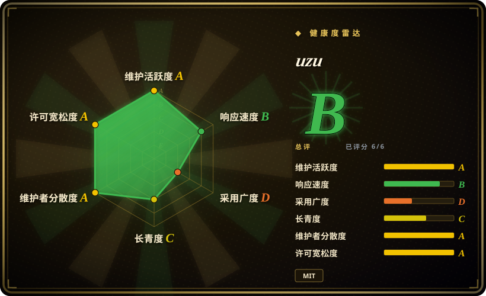
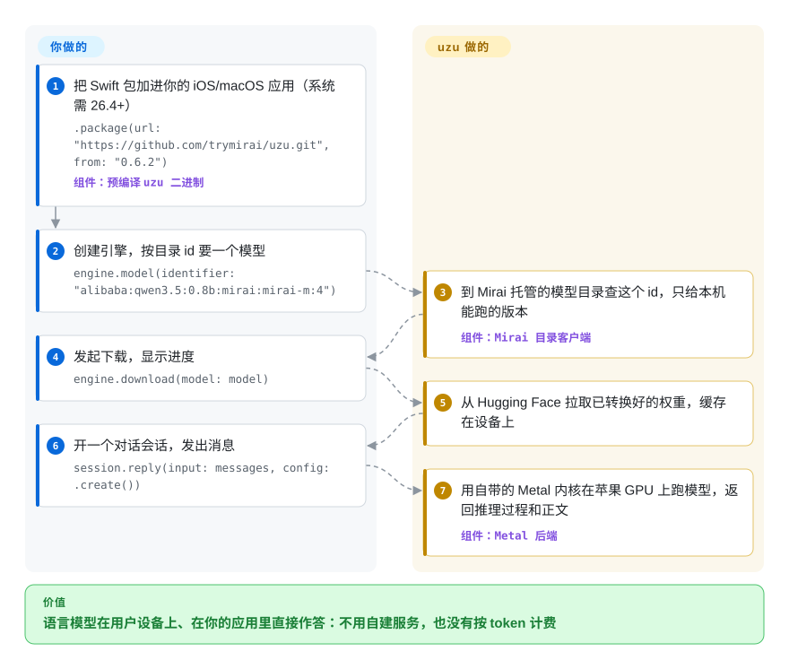

# uzu

你想在 iPhone 或 Mac 应用里放一个能对话的模型，可调云端 API 意味着每次请求都要付钱、要走一趟网络、用户的文字要离开设备；直接用底层推理库，又得自己转权重、写下载缓存、拼对话模板。uzu 是 Mirai 公司用 Rust 写的推理引擎，配 Swift、Python、TypeScript 封装，把这些杂活包了：你报一个 Mirai 目录里的模型名，它下载转换好的版本，在苹果 GPU 上跑起来。

## 何时使用

你是 iOS 或 macOS 开发者，正在做一个要上架的应用：笔记应用想在本机做摘要，日记应用的用户不接受内容上传服务器，或者一个 Mac 小工具在飞机上也得能用。你试过托管 API，账算不过来：每次摘要都是一笔付费请求、两三秒的往返，还要过一轮隐私审查。你也试过推理库，结果在写正经功能之前，先得转换权重、写一个能断点续传的下载器、挑一个塞得进 iPhone 内存的量化档位、再把对话模板拼上去。

当你要的是“应用 SDK”而不是“推理引擎”时，就该想到 uzu：加一个 Swift 包，用目录 id 调 `engine.model(identifier:)`，再 `engine.download(model:)`，然后 `session.reply(...)`——按设备挑模型、下载缓存、对话模板、JSON 结构化输出、工具调用都由它处理。如果换成 [llama.cpp](../llm-inference/local-runtimes/llama-cpp.zh.md) 或 [MLX / mlx-lm](mlx-mlx-lm.zh.md)，这些应用侧的胶水代码得你自己写；而且你的用户都在最新的苹果系统（26.4 及以上）上时，选 uzu。代价是你连带接受了 Mirai 的模型目录、模型格式和托管的模型注册服务。

## 怎么用起来

uzu 是一个 Rust 推理引擎，带手写的 Metal 内核（在苹果 GPU 上运行的小程序），并依赖苹果的“统一内存”：CPU 和 GPU 共用同一块内存，权重不用再拷到独立显卡上。它不直接读 Hugging Face 检查点或 GGUF 文件：模型要先用另一个工具 `lalamo` 转成 Mirai 自己的格式，Mirai 也发布了转换并量化好的现成版本。**它替你做的：**向 Mirai 托管的模型注册服务（`sdk.trymirai.com`）查询本机能跑哪些模型，从 Hugging Face 下载选中的那个并缓存，套用对话模板，执行生成（可流式输出、可按 JSON Schema 约束输出、可调用工具）；传入 API key 后，同一套 `Engine` 接口还能转发给 OpenAI 等云端服务。**留给你的：**挑一个装得进设备内存的模型（README 建议 iOS 应用申请“提高内存上限”权限），同一时间只保留一个已加载的模型，以及围绕回复的产品逻辑。打个比方，它更像自动售货机而不是厨房：你从 Mirai 备好的菜单里选，剩下的机器包办。同一个引擎还带一个命令行工具，能起 OpenAI 兼容的本地服务（`cargo run --release -p cli -- server --model ...`）；下面的卡片走应用内 Swift 这条路，那才是它的核心价值。

<!-- flow-steps:begin (generated from flows/uzu.json by tools/flow_card.py — do not edit) -->

流程文字版

1. **你**：把 Swift 包加进你的 iOS/macOS 应用（系统需 26.4+） — `.package(url: "https://github.com/trymirai/uzu.git", from: "0.6.2")` — 组件：`预编译 uzu 二进制`
2. **你**：创建引擎，按目录 id 要一个模型 — `engine.model(identifier: "alibaba:qwen3.5:0.8b:mirai:mirai-m:4")`
3. **uzu**：到 Mirai 托管的模型目录查这个 id，只给本机能跑的版本 — 组件：`Mirai 目录客户端`
4. **你**：发起下载，显示进度 — `engine.download(model: model)`
5. **uzu**：从 Hugging Face 拉取已转换好的权重，缓存在设备上
6. **你**：开一个对话会话，发出消息 — `session.reply(input: messages, config: .create())`
7. **uzu**：用自带的 Metal 内核在苹果 GPU 上跑模型，返回推理过程和正文 — 组件：`Metal 后端`

**价值**：语言模型在用户设备上、在你的应用里直接作答：不用自建服务，也没有按 token 计费

<!-- flow-steps:end -->

## 何时不用

- **你的用户不全在最新系统的 Apple 芯片设备上。** Swift 包声明的最低系统是 iOS / macOS / Mac Catalyst **26.4**，PyPI 的 wheel 标签是 `macosx_26_0`，2026-09 有人请求 macOS 15 / Metal 3 版本（issue #841），已被关闭——引擎只面向 Metal 4。Android、Linux、Windows、WebAssembly 目标都标着“进行中”，文档 FAQ 也写明目前只支持 Apple Silicon。要兼容旧版苹果系统或做跨平台应用，用 [llama.cpp](../llm-inference/local-runtimes/llama-cpp.zh.md)；做 Android 用 [LiteRT-LM](litert-lm.zh.md)。
- **你需要一个不会自己联网的构建。** `Engine::new` 会启动一个遥测客户端，把模型下载和推理事件（模型 id、token 统计、错误）连同设备信息（系统名、CPU 名、总内存）发到 `sdk.trymirai.com`；在 `EngineConfig` 和文档里都没找到关闭它的开关。模型目录也从这个域名拉取（拉取失败时用缓存）。事件结构里没有提示词正文，但如果你对用户的承诺是“什么都不离开设备”，要么在 fork 里把它去掉，要么改用 [llama.cpp](../llm-inference/local-runtimes/llama-cpp.zh.md) 或 [MLX / mlx-lm](mlx-mlx-lm.zh.md)——它们直接读本地文件，不连厂商服务。
- **你想让 Hugging Face 上任何新模型当天就能跑。** uzu 只跑自己格式的模型：要么来自 Mirai 的目录，要么你自己用 `lalamo` 转，而 `lalamo` 支持的架构是固定的一份清单。想在 Mac 上当天试任意检查点，用 [MLX / mlx-lm](mlx-mlx-lm.zh.md)；想用 GGUF 生态，用 llama.cpp。
- **你需要生产级或多用户服务。** 命令行服务在启动时加载一个模型，默认监听 `127.0.0.1:8000`，代码里没有鉴权；而且要用 nightly Rust 工具链从源码编译。要给多人共用的端点，单机用 [Ollama](../llm-inference/local-runtimes/ollama.zh.md)，GPU 集群用 [vLLM](../llm-inference/serving-engines/vllm.zh.md)。
- **你需要稳定、能自己完整复现的依赖。** 它还在 0.x，2026 年 5 月以来发了 28 个 GitHub release；对外发布的大部分 crate 放在 `crates/legacy/` 下，工作区清单里注明“待重写”；Rust crate 只能用 git 依赖引入（crates.io 上没有）；Swift 包下载的是 `artifacts.trymirai.com` 上的预编译二进制，而不是现场编译仓库源码。如果你发出去的每一行都必须能审计、能重建，llama.cpp 从源码构建的 XCFramework 供应链更简单。
- **你只需要一个小的端侧模型，用苹果自带的也行。** 在 iOS 26 及以上，苹果内置的 Foundation Models 框架提供系统模型，不用下载、不加二进制；只有当你必须用自己挑的模型时才需要 uzu。

## 横向对比

| 替代品 | 是否收录 | 我们的评价 | 取舍 |
|---|---|---|---|
| [MLX / mlx-lm](mlx-mlx-lm.zh.md) | ✅ | 如果你是开发者，要在 Mac 上用 Python 试任意 Hugging Face 模型，选 mlx-lm；如果模型要打包进 Swift 应用、希望下载缓存和对话胶水都有人包办，选 uzu。 | mlx-lm 换来任意检查点、微调能力和苹果背书，但应用集成要自己做；uzu 换来四种语言的应用 SDK，代价是只能用它自己转换的模型，系统要 macOS/iOS 26.4 以上。 |
| [llama.cpp](../llm-inference/local-runtimes/llama-cpp.zh.md) | ✅ | 如果应用还要跑在旧版苹果系统、Android、Windows 或 Linux 上，或者绝不能连厂商服务器，选 llama.cpp；如果只面向最新的苹果设备、看重高层 SDK 胜过 C 接口，选 uzu。 | llama.cpp 换来最广的硬件覆盖、GGUF 模型自由和零遥测，但模型管理和对话胶水要自己写；uzu 替你写好胶水，代价是厂商注册服务、遥测和 Metal 4 门槛。 |
| [LiteRT-LM](litert-lm.zh.md) | ✅ | 如果主力平台是 Android，或想用谷歌的 NPU/GPU 加速通道，选 LiteRT-LM；纯苹果应用里，uzu 直接面向 Metal。 | LiteRT-LM 换来 Android 和 NPU 覆盖以及谷歌背书，但以 Gemma 级模型为中心；uzu 有针对苹果 GPU 的内核，但还没有可用的 Android 目标。 |
| MLC LLM（`mlc-ai/mlc-llm`） | 未收录 | 如果同一个编译好的模型要同时跑在 iOS、Android 和浏览器（WebGPU）里，选 MLC LLM；只发苹果平台、想要更小的集成面，选 uzu。 | MLC LLM 借 TVM 编译器真正跨平台，但每个模型都要先编译；uzu 对目录内模型免去编译，但只限苹果。本批标签未收录。 |
| Apple Foundation Models 框架 | 非仓库 | 如果一个通用小模型就够、目标是 iOS 26 以上，用苹果内置框架；需要指定的开源模型、在该模型上做结构化输出，或想用同一套接口回退到云端时，选 uzu。 | 苹果框架不用下载、不加二进制，但它是闭源系统组件，模型由苹果指定；uzu 让你自选模型，代价是每个模型几百 MB 的下载。 |

## 技术栈

- **语言：** Rust（edition 2024，`rust-toolchain.toml` 固定 nightly 工具链），整个工作区约 1,000 个 `.rs` 文件，另有 Metal 着色器源码。
- **计算后端：** `metal`（Metal 4，苹果 GPU）和 `cpu`；2026-10-08 有一个 Vulkan 内核的 PR 尚未合并。
- **语言绑定：** Swift 走 `uniffi-rs`（Swift Package Manager，预编译 `binaryTarget`），Python 走 `pyo3`（PyPI 包 `uzu`，Python ≥ 3.12），TypeScript/Node 走 `napi-rs`（npm 包 `@trymirai/uzu`，darwin arm64/x64）。
- **模型格式：** Mirai 自有格式，由独立的 `trymirai/lalamo` 转换器生成；目录里以文本模型为主，命令行里还有语音合成和分类会话。
- **对外接口：** `Engine` / 对话会话 API，支持流式输出、`Grammar::JsonSchema` 结构化输出和工具调用；命令行（`cargo run --release -p cli`）提供交互式终端界面、基准模式和 OpenAI 兼容服务（`/v1/chat/completions`、`/v1/models`）。

## 依赖

- **硬件/系统：** Apple Silicon（iOS、macOS、Mac Catalyst），系统 **26.4 及以上**；PyPI/npm 包只有 macOS 版。真正卡脖子的是模型占用的内存——iOS 应用应申请“提高内存上限”权限。
- **网络：** `sdk.trymirai.com` 提供模型目录（临时故障时用缓存）并接收遥测；`huggingface.co` 提供权重；`artifacts.trymirai.com` 提供 Swift 二进制。也可以用 `local_path` 注册本地模型目录。
- **可选：** 走云端混合路径时需要各家 API key（OpenAI、Anthropic、Gemini、xAI、Baseten、OpenRouter）；自己转模型需要 `lalamo`（Python，`uv`）。
- **从源码构建：** nightly Rust、Metal 工具链、`uv` 和 `pnpm`，可用 `cargo tools setup` 一次装齐。

## 运维难度

**用打包好的 SDK 做应用：低；从源码构建或拿来起服务：中到高。** 应用内只是一个包依赖，加上按设备档位做内存预算；真正的工作是按设备挑模型大小、处理蜂窝网络下几百 MB 的下载，以及必须在真机上测试（模拟器用的是桩代码）。从源码构建需要 nightly 工具链和 Metal 4 编译器，小版本一两周一变，记得锁版本。命令行服务是开发工具：没有鉴权、只加载一个模型，只放在本机回环地址上用。

## 健康度与可持续性

- **维护（2026-10-09）：** 非常活跃——最近 13 周每周都有提交（每周 12–28 次），2026-10-08 发布 v0.6.2，自 2026 年 5 月以来几天一个版本。PR 主要是内核工作（Metal 4、投机解码、量化矩阵乘）。
- **治理与背书：** 归 Mirai Tech Inc. 所有；852 次默认分支提交里约 92% 出自 6 个人（共 24 名贡献者），没有外部治理。据报道公司 2026 年 2 月完成 1000 万美元种子轮，由 Uncork Capital 领投，所以路线图就是一家创业公司的商业路线图。
- **年龄 / Lindy：** 仓库创建于 2025-06-23（约 15.5 个月），年轻且变化快，工作区正公开地处于重写中（`crates/legacy`）；按 Lindy 先验，目前给不了它多少加分。
- **采用度：** 约 2.0k star、约 100 个 fork；健康度评分器记录的 npm 最近一个月下载 1,527 次（npm 自己的接口在 2026-09-08 至 10-07 区间显示 1,386 次），PyPI 约 1.0k 次（2026-10）。包注册表显示依赖它的仓库为 0 个，也没找到已上架的应用。
- **风险信号：** MIT（版权人 Mirai Tech Inc.），无改协议历史。实际风险是厂商绑定——托管注册服务、默认开启的遥测、预编译的 Swift 二进制、自有模型格式——以及单一公司的巴士因子；Mirai 一旦转向，模型目录和注册服务会跟着走。

## 存疑（未验证）

- [推断] 截至 2026-10-09 读到的代码，在 `EngineConfig`、README 和文档里都没找到关闭遥测的办法；也许存在本次阅读漏掉的编译开关或服务端设置。
- [推断] 只用 `local_path` 本地模型的离线场景没有实测；那种模式下 `Engine` 是否仍会连 `sdk.trymirai.com`，是从 `Engine::new` 的代码推断的，不是观察到的。
- [未验证] 没有在同一台设备上和 llama.cpp 或 MLX 对比速度；第三方报道转述的是 Mirai 自己的说法——在部分模型和设备组合上“生成最多快 37%、预填充最多快 59%”。
- [未验证] 1000 万美元种子轮（2026 年 2 月，Uncork Capital 领投）来自媒体和 Dealroom 的报道，不是 Mirai 的公开文件。
- [未验证] 维护者说 Android 支持“在开发中”，没找到时间表或可用构建。
- [未验证] star、fork、下载量和贡献者数是 2026-10-09 从 GitHub、npm 和 PyPI 接口取的快照。
