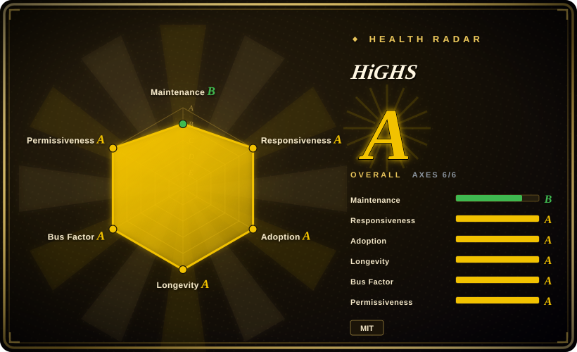
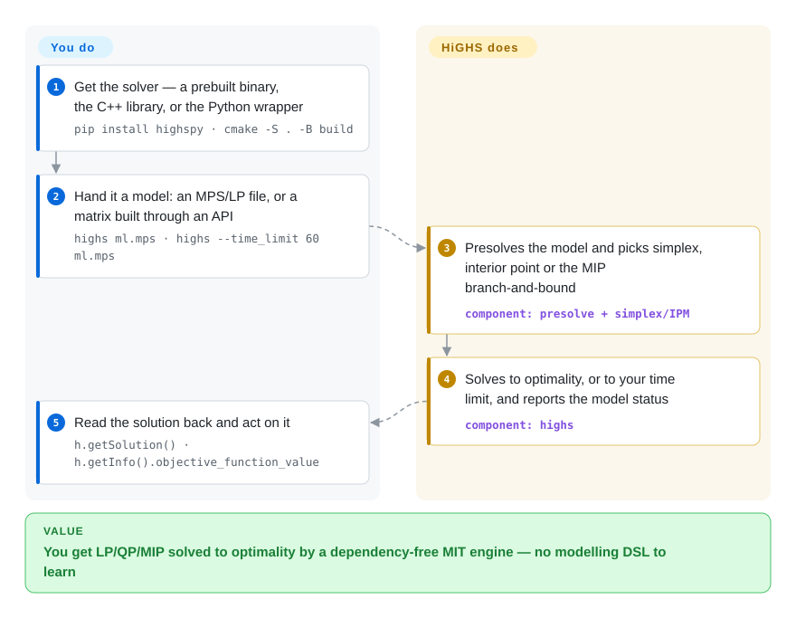

# HiGHS

A high-performance, dependency-free C++ solver for LP, convex QP and MIP — usable as a `highs model.mps` command, an embeddable library with C/C++/Python/C#/Fortran interfaces, or the backend another tool calls.

## When to use

You already have a linear model — written out as MPS or CPLEX LP, or built as a matrix by your own code or a modelling layer — and the only open question is how fast and under what licence it gets solved. You reach for HiGHS because it is **only the engine**: MIT-licensed, "no third-party dependencies are required", a `bin/highs` binary and a `lib/highs` library, plus `highspy` for Python, and nothing else to adopt. Against [OR-Tools](or-tools.md) the deciding tradeoff is exactly that: OR-Tools gives you CP-SAT, routing and four language bindings around a much larger install, while HiGHS gives you one solver with a small stable surface and expects you to bring the model. Against [Rebalancer](rebalancer.md) it is the complementary half — HiGHS is the solver Rebalancer calls for its optimal path, so choosing HiGHS directly is what you do when you already own the model and do not need a policy DSL or a local-search heuristic.

There is also a quieter signal: HiGHS is the default `linprog` method in SciPy, which means a large share of Python users already run it without having chosen it. If your LP/MIP shapes are conventional, you are on a well-travelled path.

## How it works

You own the model; HiGHS owns the solve. Hand it an MPS/LP file on the command line or build the matrix through the API (`addVariable`/`addConstrs`/`minimize` in the thin API, `addVars`/`addRows`/`changeColsCost` in the array API), then let it presolve and choose: revised simplex (primal or dual), an interior-point method for LP, or branch-and-bound for the integer case. The Python wrapper is explicit about the two phases — you build the model, call `h.run()`, and then read `h.getSolution()` and `h.getInfo().objective_function_value`; the model status tells you whether you got an optimum, a time-limited incumbent, or an infeasibility. What HiGHS will not do is tell you what to model: there is no DSL, no policy vocabulary, and no heuristic for a model too large to solve exactly — those decisions stay in your code, which is the point of picking an engine rather than a framework.

<!-- flow-steps:begin (generated from flows/highs.json by tools/flow_card.py — do not edit) -->

Text version of the flow

1. **You**: Get the solver — a prebuilt binary, the C++ library, or the Python wrapper — `pip install highspy · cmake -S . -B build`
2. **You**: Hand it a model: an MPS/LP file, or a matrix built through an API — `highs ml.mps · highs --time_limit 60 ml.mps`
3. **HiGHS**: Presolves the model and picks simplex, interior point or the MIP branch-and-bound — component: `presolve + simplex/IPM`
4. **HiGHS**: Solves to optimality, or to your time limit, and reports the model status — component: `highs`
5. **You**: Read the solution back and act on it — `h.getSolution() · h.getInfo().objective_function_value`

**Value**: You get LP/QP/MIP solved to optimality by a dependency-free MIT engine — no modelling DSL to learn

<!-- flow-steps:end -->

## When NOT to use

- **You want to declare policies like balance, capacity and minimize-movement rather than write linear expressions.** Use [Rebalancer](rebalancer.md): it compiles named specs into an expression graph and adds a local search that scales past what an exact MIP can handle, calling HiGHS underneath when you want optimality.
- **The problem needs constraint programming, routing or scheduling rather than a matrix.** Use [OR-Tools](or-tools.md): CP-SAT and its routing library express things a pure LP/MIP file cannot, and OR-Tools can still reach a MIP backend for the linear part.
- **The instance is large enough that an exact solve is hopeless.** HiGHS is an exact solver, so on a million-object rebalancing problem it will not finish; that workload needs a heuristic — [Rebalancer](rebalancer.md)'s local search, or a domain controller such as [descheduler](../dev-utilities/ops-infra/descheduler.md) inside Kubernetes.
- **You need the last few percent of MIP performance on a hard instance, plus support.** Buy Gurobi or FICO Xpress: HiGHS is a strong open-source engine, but a commercial solver with a support contract is what you want when a solve is on the critical path of a product.
- **The model is nonlinear, conic or nonconvex.** HiGHS covers LP, convex QP and MIP; SOCP, SDP and nonconvex objectives belong to a different solver class, and approximating them linearly changes the answer you are entitled to claim.
- **You need a managed service with no solver to install.** Use a hosted LP/MIP service instead — that trades the MIT licence and local data residency for zero operations.

## Comparison

| Alternative | In index | Our verdict | Tradeoff |
|---|---|---|---|
| [Rebalancer](rebalancer.md) | ✅ | Choose Rebalancer when the model is assignment-shaped and must scale by heuristic, using HiGHS only for the small optimal case; choose HiGHS directly when you already have the model and want nothing but the solve. | Rebalancer adds a policy DSL, a tuned local search and a MIP fallback but only covers one problem shape and is months old; HiGHS is a dependency-free engine with no modelling layer and a 2018-vintage track record. |
| [OR-Tools](or-tools.md) | ✅ | Choose OR-Tools when you want modelling APIs, constraint programming and routing in the same install; choose HiGHS when you want a single small solver and will write the matrix yourself. | OR-Tools is a suite with four language bindings and a much larger dependency; HiGHS is one engine with a small stable surface, and it is the kind of engine OR-Tools-class wrappers delegate to. |
| Gurobi / FICO Xpress | 未收录 | Buy Gurobi or Xpress when a hard MIP is on the critical path and you need certified performance and support; choose HiGHS when MIT licensing, no dependencies and an embeddable library matter more than the last few percent of solve time. | Commercial solvers are closed-source products with per-seat licensing and no repository; HiGHS is free and embeddable but you give up commercial tuning, support and the ability to escalate a bad instance. |
| A hosted LP/MIP service | 未收录 | Choose a hosted service when operations should be zero and per-solve billing is fine; choose HiGHS when the model is your own code's output and the data must stay where it is. | Hosted services remove install and capacity planning but bill per solve and move your model off your machines; HiGHS is a local library that costs nothing per solve and everything in your own ops attention. |

## Tech stack

- **Language:** C++ with some C; the same tree builds a CLI (`bin/highs`) and a library (`lib/highs`).
- **Algorithms:** primal and dual revised simplex (originating with Qi Huangfu, further developed by Julian Hall), an interior-point solver for LP (Lukas Schork), an active-set solver for QP (Michael Feldmeier) and a MIP solver (Leona Gottwald).
- **Build systems:** CMake (>= 3.15) is the supported path; Meson and Nix flake builds exist but are community-provided and explicitly not officially supported.
- **Interfaces:** C++/C, Python (`highspy`, depends on numpy), C# (`Highs.Native` on NuGet), Fortran (not in the default build).
- **File formats:** reads MPS and CPLEX LP files; writes model and solution files.
- **Option surface:** command-line flags (`--time_limit`, `--threads`, `--parallel`, `--presolve`, `--solver`) plus a full options file.

## Dependencies

- **Core:** none — the README states no third-party dependencies are required. That is the project's most distinctive property and the reason it embeds cleanly.
- **Python:** `pip install highspy` (CPython >= 3.9) pulls in numpy. HiPO support requires the separate `highspy-extras` extra.
- **C#:** the `Highs.Native` NuGet package, which bundles runtime libraries for win-x64/x86, linux-x64/arm64 and macos-x64/arm64.
- **Binaries:** precompiled static binaries on the releases page; note that `*-mit` packages are HiGHS alone, while `*-apache` packages bundle HiPO and are Apache-licensed because of HiPO's dependencies.
- **Build:** a C++ compiler and CMake >= 3.15 if you are not using a prebuilt artifact.
- **Runtime infrastructure:** none — it is a library and a CLI. Solves are CPU-bound and multi-threaded.

## Ops difficulty

**Very low.** There is nothing to run or monitor: a static binary, a shared library, or a wheel. The only operational facts worth knowing are (1) `*-mit` versus `*-apache` binary packages differ in what they bundle and in their licence, so pin the one your compliance posture wants; (2) `--time_limit` and `--threads` are the two options you will actually tune, because an unbounded MIP on a hard instance will otherwise run for as long as you let it; and (3) solves are CPU-bound, so capacity planning is just cores and memory. If a model is infeasible or numerically fragile, HiGHS reports a status rather than fixing it — that is your model's problem to diagnose.

## Health & viability

- **Maintenance — B; Responsiveness — A; Adoption — A; Longevity — A; Governance — A; Risk/licence — A (measured 2026-09-22).** This is the highest-aggregate entry in `optimization-solvers`: a 2018-vintage project still pushed daily, releases on a roughly quarterly rhythm (v1.13.1 → v1.15.1 across 2026-02 to 2026-07), same-day responsiveness, and a governance grade that reflects work distributed across several long-term maintainers rather than one owner.
- **Governance / bus factor.** `ERGO-Code` is an organization, not a personal account, and the README names the people behind each algorithm — a development style closer to an academic research group than to a single-vendor product. The project grew out of the University of Edinburgh's ERGO group and asks for citation of the Huangfu & Hall simplex paper rather than a CLA.
- **Backing & longevity — a solid Lindy case.** Eight years of continuous development with a still-active release train, MIT-licensed and dependency-free. The realistic risk is not abandonment but scope: an LP/MIP engine is a mature category, and the project's future is about incremental solver performance rather than a new platform bet. That makes it a low-drama dependency — which is what you want from a solver.
- **Adoption — A, and unusually load-bearing.** HiGHS is the default method behind SciPy's `linprog`, so a large slice of the Python scientific stack already runs it in production; it is also the open-source backend [Rebalancer](rebalancer.md) calls for its optimal path. Adoption by other libraries, rather than by end users, is the strongest form of this signal for a solver.
- **Risk flags.** MIT-licensed with no relicense history and no CLA. The one thing to check before adoption is the packaging split: the `*-apache` binaries bundle HiPO and carry Apache-2.0 (not MIT) because of HiPO's dependencies. Whether HiPO is a commercial product or a research addition was not established here.

## Caveats (unverified)

- [未验证] Star (~1.8k), fork (~359) and open-issue (~119) counts are as of 2026-09-22.
- [未验证] The release dates quoted (v1.13.1 2026-02 → v1.15.1 2026-07) come from the four most recent releases; the full tag history was not enumerated.
- [推断] "A large share of Python users already run it" is inferred from SciPy's `linprog` documentation listing `'highs'` as the default method (verified in `scipy/optimize/_linprog.py`), not from download statistics.
- [推断] The governance grade's meaning ("work distributed across several long-term maintainers") is read off the health radar's aggregate signals and the README's per-algorithm credits; the underlying contributor statistics were not audited by hand.
- [未验证] HiPO's nature — research addition, commercial product, or both — was not determined; the README only documents that the `*-apache` packages include it and that Python access needs `highspy-extras`.
- [未验证] Whether the Meson and Nix builds track the CMake build feature-for-feature is unknown; the README says they are community-provided and not officially supported.
- [推断] The comparison rows against commercial solvers and hosted services are reasoned from those products' public positioning, not benchmarked against HiGHS.
