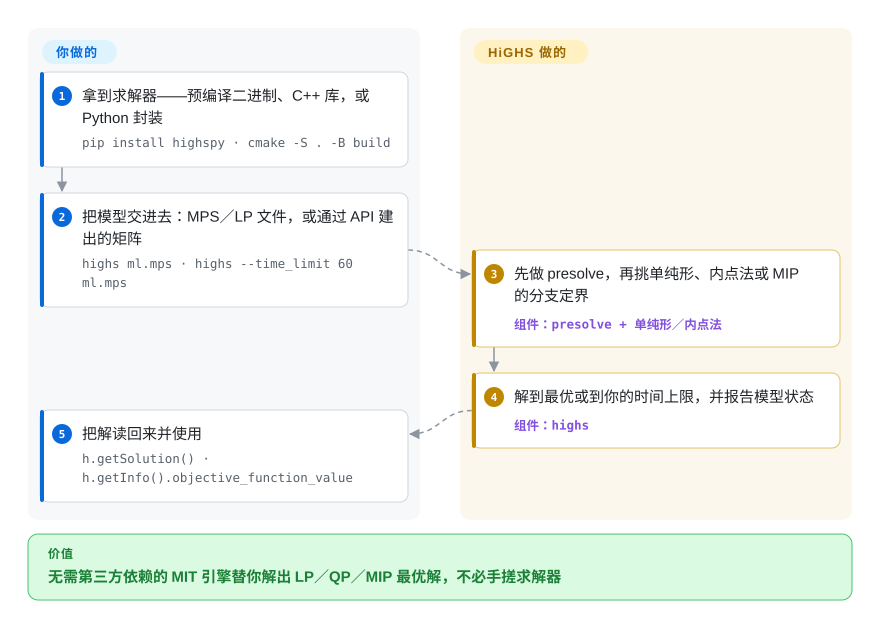

# HiGHS

一个高性能、无第三方依赖的 C++ 求解器，覆盖 LP、凸 QP 与 MIP——既能 `highs model.mps` 当命令用，也能作为带 C／C++／Python／C#／Fortran 接口的库嵌进程序，还能当别的工具调用的后端。

## 何时使用

模型已经有了——写成 MPS 或 CPLEX LP 文件，或者由你自己的代码／建模层拼成矩阵——唯一没定的只是「多快解出来、以什么许可解出来」。你选 HiGHS，因为它**只是引擎**：MIT 许可、README 明说「不需要任何第三方依赖」、产物就是一个 `bin/highs` 可执行文件加一个 `lib/highs` 库，Python 侧是 `highspy`，除此之外没有要接受的东西。相对 [OR-Tools](or-tools.zh.md)，决定性的取舍正是这一点：OR-Tools 在更大的安装体积里给你 CP-SAT、routing 与四种语言绑定；HiGHS 给你一个接口小而稳定的求解器，模型由你负责。相对 [Rebalancer](rebalancer.zh.md) 它是互补的另一半——HiGHS 就是 Rebalancer 在最优路径上调用的求解器，所以「直接用 HiGHS」正是你已经拥有模型、不需要策略 DSL 也不需要局部搜索启发式时该做的选择。

还有一个更安静的信号：HiGHS 是 SciPy `linprog` 的默认方法，也就是说大量 Python 用户其实已经在跑它，只是没主动选过。如果你的 LP／MIP 形状比较常规，你走的是一条被踩烂了的路。

## 怎么用起来

模型归你，求解归它。你可以在命令行把 MPS／LP 文件交给它，也可以通过 API 把矩阵搭出来（薄接口用 `addVariable`／`addConstrs`／`minimize`，数组接口用 `addVars`／`addRows`／`changeColsCost`），然后它做 presolve 并挑算法：原始或对偶的修正单纯形、用于 LP 的内点法、或整数情形下的分支定界。Python 封装把两段分得很清楚——你搭好模型、调 `h.run()`，再读 `h.getSolution()` 与 `h.getInfo().objective_function_value`；模型状态会告诉你拿到的是最优、时限内的当前解，还是不可行。HiGHS 不会告诉你该建什么模：没有 DSL、没有策略词汇、也没有给「大到解不动」的模型准备的启发式——那些决定留在你的代码里，而这正是「选引擎而不是选框架」的意义。

<!-- flow-steps:begin (generated from flows/highs.json by tools/flow_card.py — do not edit) -->

流程文字版

1. **你**：拿到求解器——预编译二进制、C++ 库，或 Python 封装 — `pip install highspy · cmake -S . -B build`
2. **你**：把模型交进去：MPS／LP 文件，或通过 API 建出的矩阵 — `highs ml.mps · highs --time_limit 60 ml.mps`
3. **HiGHS**：先做 presolve，再挑单纯形、内点法或 MIP 的分支定界 — 组件：`presolve + 单纯形／内点法`
4. **HiGHS**：解到最优或到你的时间上限，并报告模型状态 — 组件：`highs`
5. **你**：把解读回来并使用 — `h.getSolution() · h.getInfo().objective_function_value`

**价值**：无需第三方依赖的 MIT 引擎替你解出 LP／QP／MIP 最优解，不必手搓求解器

<!-- flow-steps:end -->

## 何时不用

- **你想声明的是均衡、容量、尽量少搬这类策略，而不是写线性表达式。** 用 [Rebalancer](rebalancer.zh.md)：它把具名 spec 编译成表达式图，并附一套能超出精确 MIP 处理范围的局部搜索，需要最优时再回头调 HiGHS。
- **问题需要约束规划、路径规划或排程，而不是一个矩阵。** 用 [OR-Tools](or-tools.zh.md)：CP-SAT 与它的 routing 库能表达纯 LP／MIP 文件表达不了的东西，而且线性那部分照样能接 MIP 后端。
- **实例大到精确求解没希望。** HiGHS 是精确求解器，百万对象级别的重新分配问题它跑不完；那种负载需要启发式——[Rebalancer](rebalancer.zh.md) 的局部搜索，或者 Kubernetes 里 [descheduler](../dev-utilities/ops-infra/descheduler.zh.md) 这类领域控制器。
- **你要的是硬实例上最后几个百分点的 MIP 性能，外加支持。** 那就买 Gurobi 或 FICO Xpress：HiGHS 是很强的开源引擎，但当一次求解处在产品关键路径上时，你要的是带支持合同的商用求解器。
- **模型是非线性、锥或非凸的。** HiGHS 覆盖 LP、凸 QP 与 MIP；SOCP、SDP 与非凸目标属于另一类求解器，用线性近似去凑，会得到一个你其实无权声称正确的答案。
- **你要的是托管服务、一点求解器都不想装。** 那就用托管的 LP／MIP 服务，代价是拿 MIT 许可与数据本地性去换零运维。

## 横向对比

| 替代品 | 是否收录 | 我们的评价 | 取舍 |
|---|---|---|---|
| [Rebalancer](rebalancer.zh.md) | ✅ | 模型是分配问题形状、必须靠启发式撑规模、只用 HiGHS 处理小规模最优情形时选 Rebalancer；模型已在手、除了求解什么都不想要时直接选 HiGHS。 | Rebalancer 多了策略 DSL、调好的局部搜索与 MIP 兜底，但只覆盖一类问题且只有几个月历史；HiGHS 是无依赖引擎、没有建模层，但有 2018 年以来的记录。 |
| [OR-Tools](or-tools.zh.md) | ✅ | 想在同一个安装里拿到建模 API、约束规划与 routing 时选 OR-Tools；只想一个小的求解器、矩阵自己写时选 HiGHS。 | OR-Tools 是套件，四种语言绑定、依赖大得多；HiGHS 是单一引擎、接口小而稳定——而且它正是 OR-Tools 这一类封装会去委派的那种引擎。 |
| Gurobi／FICO Xpress | 未收录 | 硬 MIP 处在关键路径上、需要认证性能与支持时买 Gurobi 或 Xpress；MIT 许可、无依赖、可嵌入比最后几个百分点的求解时间更重要时选 HiGHS。 | 商用求解器是闭源产品、按席位授权、没有仓库；HiGHS 免费可嵌入，但你放弃商用调优、支持，以及「某个实例解不动时能升级求助」的能力。 |
| 托管的 LP／MIP 服务 | 未收录 | 希望运维为零、按次计费可接受时选托管服务；模型是自己代码的产物、数据必须留在本地时选 HiGHS。 | 托管服务省掉安装与容量规划，但按次计费、把你的模型搬出你的机器；HiGHS 是本地库，每次求解不花钱，代价是你自己的运维注意力。 |

## 技术栈

- **语言：** C++，含少量 C；同一棵树既产出 CLI（`bin/highs`）也产出库（`lib/highs`）。
- **算法：** 原始与对偶修正单纯形（最初由 Qi Huangfu 编写，Julian Hall 继续发展）、用于 LP 的内点法（Lukas Schork）、用于 QP 的 active set 法（Michael Feldmeier），以及 MIP 求解器（Leona Gottwald）。
- **构建系统：** 官方支持 CMake（>= 3.15）；Meson 与 Nix flake 构建存在，但由社区提供，README 明说不被官方支持。
- **接口：** C++／C、Python（`highspy`，依赖 numpy）、C#（NuGet 上的 `Highs.Native`）、Fortran（不在默认构建里）。
- **文件格式：** 读写 MPS 与 CPLEX LP，能写出模型文件与解文件。
- **选项面：** 命令行开关（`--time_limit`、`--threads`、`--parallel`、`--presolve`、`--solver`），以及完整的 options 文件。

## 依赖

- **内核：** 无——README 明说不需要第三方依赖。这是它最鲜明的性质，也是它能干净嵌入的原因。
- **Python：** `pip install highspy`（CPython >= 3.9）会带上 numpy；要用 HiPO 需另装 `highspy-extras`。
- **C#：** `Highs.Native` NuGet 包，内含 win-x64／x86、linux-x64／arm64、macos-x64／arm64 的运行时库。
- **二进制：** releases 页有预编译静态二进制；注意 `*-mit` 包只含 HiGHS，`*-apache` 包内捆绑 HiPO，因 HiPO 的依赖而是 Apache 许可。
- **构建：** 不用预编译产物时，需要 C++ 编译器与 CMake >= 3.15。
- **运行时基础设施：** 无——它是库与 CLI。求解是 CPU 密集、多线程的。

## 运维难度

**极低。** 没有要跑或盯的东西：一个静态二进制、一个共享库，或一个 wheel。只有三件运维事实值得知道：(1) `*-mit` 与 `*-apache` 二进制包捆绑的内容与许可不同，按你的合规口径固定选一个；(2) 真正会去调的选项只有 `--time_limit` 与 `--threads`，因为硬实例上的无界 MIP 否则会一直跑下去；(3) 求解是 CPU 密集的，容量规划就是核数与内存。如果模型不可行或数值脆弱，HiGHS 只会报状态而不会替你修——那是你模型自己要诊断的问题。

## 健康度与可持续性

- **维护 B、响应 A、采用 A、长寿 A、治理 A、许可 A（2026-09-22 实测）。** 它是 `optimization-solvers` 里总分最高的条目：2018 年的项目至今每天有推送，发版大致按季度（2026-02 到 2026-07 之间从 v1.13.1 到 v1.15.1），响应是当天量级，治理一项的评分反映出维护工作分散在若干长期维护者身上，而不是一个人。
- **治理与巴士因子。** `ERGO-Code` 是组织账号而非个人账号，README 逐个点名每种算法背后的人——这套作风更接近学术研究组，而不是单一厂商的产品。项目源自爱丁堡大学的 ERGO 组，要求的是引用 Huangfu 与 Hall 的单纯形论文，而不是签 CLA。
- **背书与长寿性——一个站得住脚的 Lindy 案例。** 八年连续开发、发版列车仍在运行、MIT 许可、无依赖。现实风险不是被放弃，而是范围：LP／MIP 引擎是成熟品类，项目的未来在于求解性能的持续改进，而不是押注新平台。这让它成为一个「低戏剧性」的依赖——而这正是你希望求解器具备的。
- **采用 A，而且这一项在承重。** HiGHS 是 SciPy `linprog` 背后的默认方法，也就是说 Python 科学计算栈的一大片已经在生产里跑它；它同时是 [Rebalancer](rebalancer.zh.md) 最优路径调用的开源后端。对一个求解器来说，「被别的库采用」是这项信号里最强的一种。
- **风险信号。** MIT 许可，无 relicense 历史，无 CLA。采用前唯一要核对的是打包切分：`*-apache` 二进制捆绑 HiPO，并因 HiPO 的依赖而按 Apache-2.0（而非 MIT）分发。HiPO 究竟是商业产品还是研究性附加物，此处未查证。

## 存疑（未验证）

- [未验证] star（约 1.8k）、fork（约 359）与 open issue（约 119）数截至 2026-09-22。
- [未验证] 文中引用的发版日期（v1.13.1 2026-02 → v1.15.1 2026-07）取自最近四个 release，完整 tag 历史未逐个列举。
- [推断] 「大量 Python 用户其实已经在跑它」由 SciPy `linprog` 文档把 `'highs'` 列为默认方法（已在 `scipy/optimize/_linprog.py` 中核对）推断而来，不是下载量统计。
- [推断] 治理一项的含义（「维护工作分散在若干长期维护者身上」）是从健康度雷达的聚合信号与 README 的逐算法署名读出来的；底层贡献者统计未手工审计。
- [未验证] HiPO 的性质——研究附加、商业产品、还是两者兼有——未查明；README 只记录了 `*-apache` 包包含它、Python 使用需要 `highspy-extras`。
- [未验证] Meson 与 Nix 构建是否与 CMake 构建功能对齐未知；README 说它们由社区提供、不被官方支持。
- [推断] 与商用求解器、托管服务两行对比依据的是那些产品的公开定位，未与 HiGHS 做基准对比。
