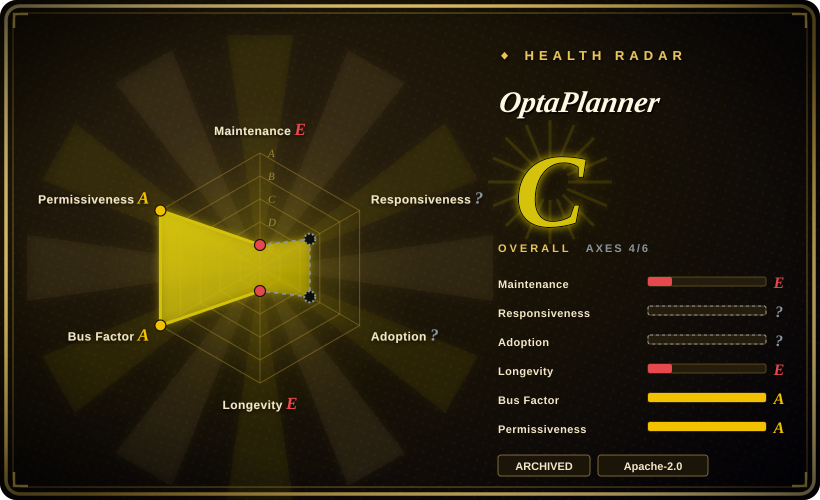
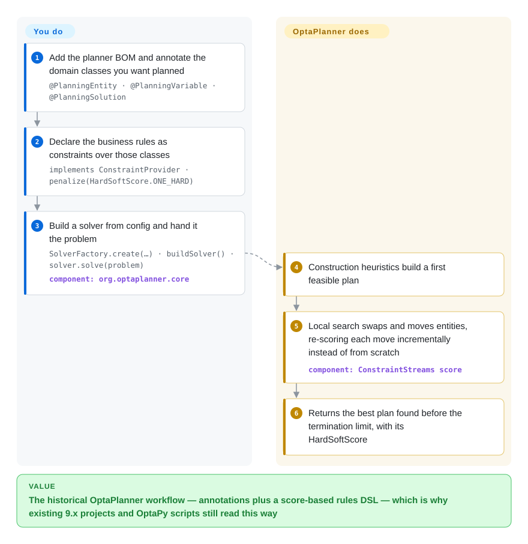

# OptaPlanner

The long-lived Java constraint solver that defined the "annotate your domain, score your rules" planning model — **archived**: its codebase has been merged into Apache KIE Drools, and new work belongs on Timefold Solver, the fork by the original team.

## When to use

You should reach for this page for exactly two jobs, neither of which is "add a dependency". The first is **archaeology**: you have inherited a Java planning service pinned to `org.optaplanner:optaplanner-*`, and you need to know what the annotation and ConstraintStreams code means, why the build runs `mvn clean install -Dquickly`, and where the project went. The second is **reading a design**: OptaPlanner is the canonical implementation of score-based planning on the JVM, and its quickstarts (`optaplanner-quickstarts`, `hello-world`) are still the clearest worked example of the entity/variable/solution + ConstraintProvider model that [Timefold Solver](timefold-solver.md) inherited essentially unchanged. The tradeoff that decides this page is therefore not "OptaPlanner versus its substitutes" but **"read this versus adopt it"**: for any new project the answer is [Timefold Solver](timefold-solver.md), because it is the same design with a maintained release train, and OptaPlanner's own README says contributions are no longer accepted here.

## How it works

The mechanism is the one Timefold inherited, so this page is also a description of how a score-based planner works underneath. You add `@PlanningEntity` and `@PlanningVariable` to the fields that the solver may change and `@PlanningSolution` to the class holding the problem; a `ConstraintProvider` returns named constraints built from ConstraintStreams (`forEachUniquePair`, `Joiner`s, `penalize`/`reward`), which the solver evaluates as a `HardSoftScore`. `SolverFactory.create(new SolverConfig()...)` wires the solution class, the entity classes, the constraint provider and a termination limit together; `solver.solve(problem)` then runs construction heuristics followed by local search, keeping the best plan found. What you do is model the domain and write the rules; what the planner does is explore the plan space, re-scoring each proposed move incrementally rather than from scratch. Because the artifact is archived, the honest note is about the *sources* of the value: the machine still runs, but nothing upstream will be fixed.

<!-- flow-steps:begin (generated from flows/optaplanner.json by tools/flow_card.py — do not edit) -->

Text version of the flow

1. **You**: Add the planner BOM and annotate the domain classes you want planned — `@PlanningEntity · @PlanningVariable · @PlanningSolution`
2. **You**: Declare the business rules as constraints over those classes — `implements ConstraintProvider · penalize(HardSoftScore.ONE_HARD)`
3. **You**: Build a solver from config and hand it the problem — `SolverFactory.create(…) · buildSolver() · solver.solve(problem)` — component: `org.optaplanner.core`
4. **OptaPlanner**: Construction heuristics build a first feasible plan
5. **OptaPlanner**: Local search swaps and moves entities, re-scoring each move incrementally instead of from scratch — component: `ConstraintStreams score`
6. **OptaPlanner**: Returns the best plan found before the termination limit, with its HardSoftScore

**Value**: The historical OptaPlanner workflow — annotations plus a score-based rules DSL — which is why existing 9.x projects and OptaPy scripts still read this way

<!-- flow-steps:end -->

## When NOT to use

- **You are starting anything new.** Use [Timefold Solver](timefold-solver.md): it is the fork by the original OptaPlanner team, the annotation and ConstraintStreams model is compatible, and it is actively released — OptaPlanner explicitly points at other repositories for the latest source, issues and contributions.
- **You need dependency or security fixes to land upstream.** Archived means archived: no CVE response, no dependency bumps, no PRs. Proxy or vendored forks only make sense if you have decided to own the patch burden yourself.
- **Your stack is Python, C# or .NET.** Use [OR-Tools](or-tools.md): CP-SAT covers scheduling and routing from a Python API, so there is no reason to stand up the JVM for a score-based planner.
- **The model is a linear/integer program.** Use [HiGHS](highs.md): if your constraints are linear expressions over a matrix, an exact solver gives you a bound and a much smaller dependency.
- **The plan is really an assignment of objects to containers under numeric policies at scale.** Use [Rebalancer](rebalancer.md): policy specs plus a tuned local search beat a score-based metaheuristic on that shape, and the project is maintained.
- **You need a commercially supported planner for a production service.** OptaPlanner's support used to be Red Hat's; with the project archived, the supported path from this lineage is the one Timefold sells — check that licence rather than assuming the Apache-2.0 terms cover the support you need.

## Comparison

| Alternative | In index | Our verdict | Tradeoff |
|---|---|---|---|
| [Timefold Solver](timefold-solver.md) | ✅ | Choose Timefold for every new project and for the migration of existing 9.x code: the domain annotations and `ConstraintProvider` model carry over, and only Timefold has a live release train with security and dependency updates. | Same design, opposite maintenance posture — Timefold adds an open-core boundary and a company-owned roadmap, and in exchange you get releases, fixes and a documented quickstart line that is still moving. |
| [Rebalancer](rebalancer.md) | ✅ | Choose Rebalancer when the plan is an assignment of objects to containers under numeric policies at shard/host scale; choose the OptaPlanner→Timefold lineage when the plan is governed by many soft, negotiable rules over rich entities. | Rebalancer is a C++/Python policy DSL with a search tuned for millions of objects and is only months old; the OptaPlanner lineage is a mature Java rules model whose 2011-era design is now carried by Timefold. |
| [OR-Tools](or-tools.md) | ✅ | Choose OR-Tools when the language is Python/C#/.NET or the problem needs constraint programming and routing in one install; choose the OptaPlanner lineage when the team is on the JVM and the rules are meant to be edited as Java. | OR-Tools is permissively licensed end to end and far broader in engines; OptaPlanner's value was a score-based domain model, and that value now lives in Timefold rather than in this archived repository. |
| Gurobi / FICO Xpress | 未收录 | Buy a commercial solver when the bottleneck is the linear/integer solve and you need certified performance and support; treat OptaPlanner as a pattern source rather than a component in that decision. | Commercial solvers are closed-source engines with per-seat licensing and live support; this repository is a free, archived planning framework — useful to read, not to depend on. |

## Tech stack

- **Language:** Java (the quickstarts build with Maven, `mvn clean install -Dquickly`, and run via `mvn exec:java`).
- **Artifacts:** Maven Central under `org.optaplanner`, consumed through `optaplanner-bom`.
- **Core abstractions:** `@PlanningEntity` / `@PlanningVariable` / `@PlanningSolution` annotations, `HardSoftScore` and other score types, `ConstraintProvider` with ConstraintStreams, `SolverFactory` / `SolverConfig` / `Solver` from `org.optaplanner.core`.
- **Companion repositories:** `optaplanner-quickstarts` holds the worked examples; `kiegroup/optaplanner` describes itself as a midstream mirror of this repository rather than the canonical source.
- **Continuation:** the code now develops inside `apache/incubator-kie-drools`; the community fork with an independent release train is `TimefoldAI/timefold-solver`.

## Dependencies

- **Runtime:** a JVM plus the `org.optaplanner` artifacts from Maven Central. No service or database is required for the quickstarts.
- **Build from source:** Maven 3.x and a JDK; the `-Dquickly` flag skips checks and analysis, and the full build is documented at roughly 17 minutes versus about a minute for the fast build.
- **Companion projects:** `optaplanner-quickstarts` for examples; `optaplanner-docs` builds asciidoctor documentation out of the same tree.
- **Runtime infrastructure:** none beyond the JVM — solving is in-process and CPU-bound.
- **What you cannot get:** upstream dependency bumps, security fixes, or accepted contributions, because the repository is archived.

## Ops difficulty

**Low as software, high as a lifecycle risk.** Technically nothing changed: it is a JVM library, solves in-process, and has the same termination controls as its successors. But the operationally relevant fact is that the *supply chain* has stopped. Anything you deploy on it accrues unpatched dependencies, and the usual escape hatches — opening an issue, upgrading to the next release, waiting for a CVE fix — are gone. That makes the honest ops assessment "low runtime cost, non-trivial long-term debt", and it is why the only defensible way to run it today is with a plan to move to Timefold Solver rather than with a hope that the archive will be reversed.

## Health & viability

- **Maintenance — E; Longevity — E; Responsiveness — `?`; Adoption — `?`; Governance — A; Risk/licence — A (measured 2026-09-22). Overall C (4/6).** The two E grades are the archived state, and they are the whole story: a repository can hold a famous design and still be an unsafe dependency. The `?` on responsiveness is because issue tracking is disabled on an archived repository, so there is no signal to measure — not a low score, an unmeasurable one.
- **Governance / bus factor.** The Apache Software Foundation owns the artifacts and the archive decision, which is why the licence and governance grades stay high: nothing here is vendor-captured, and the code cannot be relicensed out from under you. The ASF also moved the codebase into Apache KIE rather than abandoning it, which is the orderly version of retirement.
- **Backing & longevity — Lindy inverts here, and that is the lesson of the page.** Age alone does not make a project a safe bet: this is a 2011-era codebase that has been *actively* maintained for most of its life and is now archived, so the age × still-active test fails on the "still-active" term. Its successor carries the design; the repository carries the history.
- **Adoption — `?`, deliberately.** The radar could not derive a package-registry or dependent-repository signal for an archived midstream artifact, and reading popularity off 3.5k stars on a retired repository would be exactly the "high stars as social proof" mistake the index warns about. The meaningful adoption fact is that the *design* is widely used through Timefold and previously through Red Hat's product line.
- **Risk flags.** Archived with contributions closed; the code has moved into a different Apache project, so bug reports and fixes now flow through Apache KIE Drools. Apache-2.0 with no relicense history, and copyrights include Red Hat Inc. and contributors — check that lineage if your legal review cares.

## Caveats (unverified)

- [未验证] The last-push timestamp recorded in the upstream snapshot (2026-07-14) coexists with the repository being archived; whether that push predates or coincides with archiving was not determined.
- [未验证] Star (~3.5k) and fork (~106) counts are as of 2026-09-22; on an archived repository they are historical rather than growing.
- [推断] The claim that OptaPlanner's design moved into `apache/incubator-kie-drools` is taken from the repository's own archive notice (which writes the project name as "OplaPlanner"); the state of the KIE Drools tree itself was not inspected.
- [推断] "Timefold is the supported continuation" follows from Timefold's fork statement plus OptaPlanner's archive notice, not from an official Apache migration guide.
- [未验证] Whether the archived `org.optaplanner` Maven artifacts are still resolvable in every repository your build might use was not checked.
- [未验证] The `kiegroup/optaplanner` mirror's relationship to the canonical archived repository (what it mirrors, and on what cadence) was not determined beyond its own description.
- [推断] The comparison rows against commercial solvers are reasoned from those products' public positioning, not benchmarked.
