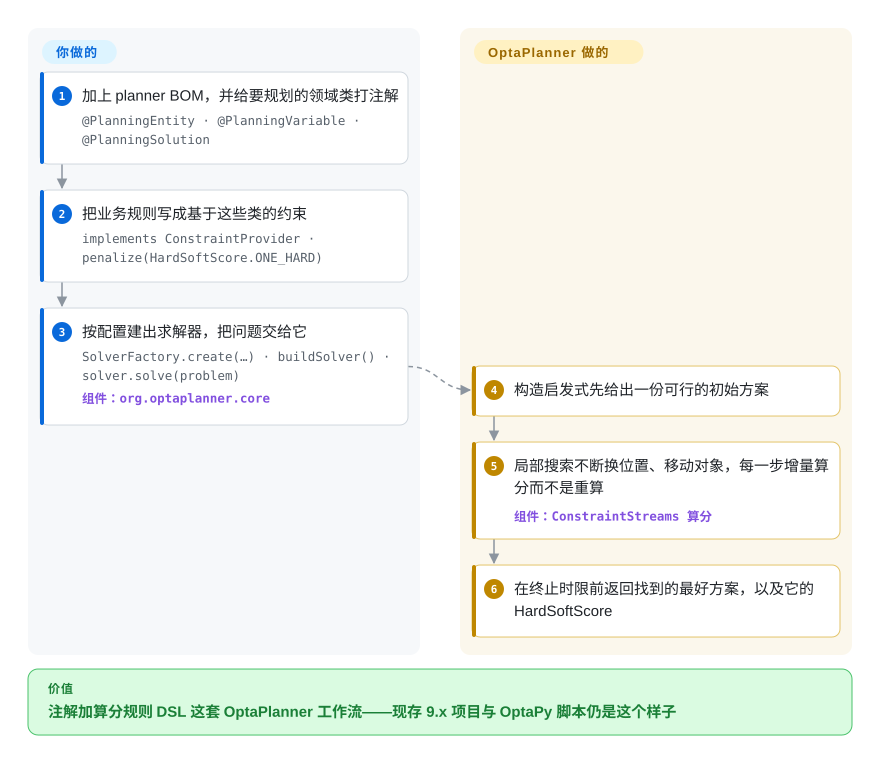

# OptaPlanner

定义了「给领域打注解、给规则打分」这套规划模型的 Java 约束求解器——**已归档**：代码库并入 Apache KIE Drools，新工作应该落在 [Timefold Solver](timefold-solver.zh.md)，即原团队的 fork。

## 何时使用

你应该只在两种场合打开这一页，而两者都不是「加一个依赖」。第一是**考古**：你接手了一个钉在 `org.optaplanner:optaplanner-*` 上的 Java 规划服务，需要弄懂那些注解与 ConstraintStreams 代码到底在说什么、构建为什么跑 `mvn clean install -Dquickly`、以及这个项目后来去了哪里。第二是**读一份设计**：OptaPlanner 是 JVM 上「基于算分的规划」的经典实现，它的 quickstarts（`optaplanner-quickstarts`、`hello-world`）至今仍是 entity／variable／solution 加 ConstraintProvider 这套模型最清晰的完整示例——而这套模型被 [Timefold Solver](timefold-solver.zh.md) 几乎原样继承。所以决定这一页的取舍不是「OptaPlanner 与它的替代品」，而是**「读它还是采用它」**：任何新项目，答案都是 [Timefold Solver](timefold-solver.zh.md)，因为那是同一份设计加一条在维护的发版列车，而 OptaPlanner 自己的 README 说这里已不再接受贡献。

## 怎么用起来

机制正是 Timefold 继承过去的那套，所以这一页同时也描述了「打分式规划器」底下是怎么跑的。你给求解器可以改动的字段加上 `@PlanningEntity` 与 `@PlanningVariable`，给承载问题的类加上 `@PlanningSolution`；`ConstraintProvider` 返回一组用 ConstraintStreams 搭出来的具名约束（`forEachUniquePair`、`Joiner`、`penalize`／`reward`），求解器把它们算成一个 `HardSoftScore`。`SolverFactory.create(new SolverConfig()...)` 把 solution 类、entity 类、约束提供者与终止条件接在一起；随后 `solver.solve(problem)` 跑构造启发式再接局部搜索，保留找到的最好方案。你负责的是建模与写规则；规划器负责探索计划空间，并对每个候选改动做**增量**重算而不是从头重算。因为这个制品已经归档，诚实的提醒在于价值的**来源**：机器还能跑，但上游不会再修任何东西。

<!-- flow-steps:begin (generated from flows/optaplanner.json by tools/flow_card.py — do not edit) -->

流程文字版

1. **你**：加上 planner BOM，并给要规划的领域类打注解 — `@PlanningEntity · @PlanningVariable · @PlanningSolution`
2. **你**：把业务规则写成基于这些类的约束 — `implements ConstraintProvider · penalize(HardSoftScore.ONE_HARD)`
3. **你**：按配置建出求解器，把问题交给它 — `SolverFactory.create(…) · buildSolver() · solver.solve(problem)` — 组件：`org.optaplanner.core`
4. **OptaPlanner**：构造启发式先给出一份可行的初始方案
5. **OptaPlanner**：局部搜索不断换位置、移动对象，每一步增量算分而不是重算 — 组件：`ConstraintStreams 算分`
6. **OptaPlanner**：在终止时限前返回找到的最好方案，以及它的 HardSoftScore

**价值**：注解加算分规则 DSL 这套 OptaPlanner 工作流——现存 9.x 项目与 OptaPy 脚本仍是这个样子

<!-- flow-steps:end -->

## 何时不用

- **你要起任何新项目。** 用 [Timefold Solver](timefold-solver.zh.md)：它是原 OptaPlanner 团队的 fork，注解与 ConstraintStreams 模型兼容，且在持续发版——OptaPlanner 自己明确指向别的仓库去拿最新源码、提 issue 与提交贡献。
- **你需要依赖或安全修复能落到上游。** 归档就是归档：没有 CVE 响应、没有依赖升级、不收 PR。只有当你是决定自己扛补丁负担时，代理包或自建 vendored fork 才说得通。
- **你的技术栈是 Python、C# 或 .NET。** 用 [OR-Tools](or-tools.zh.md)：CP-SAT 用 Python API 就能覆盖排程与路径，没必要为打分式规划器搭一套 JVM。
- **模型是线性／整数规划。** 用 [HiGHS](highs.zh.md)：约束若是矩阵上的线性表达式，精确求解器既给你界，依赖也小得多。
- **计划实质是「对象到容器、带数值策略、有规模」的分配。** 用 [Rebalancer](rebalancer.zh.md)：在那个形状上，策略 spec 加调好的局部搜索胜过打分式元启发，而且项目在维护中。
- **生产服务需要有人商业支持这台规划器。** OptaPlanner 的支持过去来自 Red Hat；项目归档之后，这条血脉里有支持的路是 Timefold 在卖的——去核对那份许可，而不是默认 Apache-2.0 覆盖了你需要的支持。

## 横向对比

| 替代品 | 是否收录 | 我们的评价 | 取舍 |
|---|---|---|---|
| [Timefold Solver](timefold-solver.zh.md) | ✅ | 所有新项目、以及现存 9.x 代码的迁移都选 Timefold：领域注解与 `ConstraintProvider` 模型可以带过去，而且只有 Timefold 有在跑的发版列车、安全与依赖更新。 | 同一份设计，相反的维护姿态——Timefold 多了 open-core 边界与公司掌握路线图，换来的是发版、修复，以及一条仍在推进的入门文档线。 |
| [Rebalancer](rebalancer.zh.md) | ✅ | 计划是「对象到容器、带数值策略、分片／主机量级」的分配时选 Rebalancer；计划由大量软的、可谈判的规则支配、且实体很丰富时选 OptaPlanner→Timefold 这条血脉。 | Rebalancer 是 C++／Python 的策略 DSL，搜索按百万级对象调过，但只有几个月历史；OptaPlanner 血脉是成熟的 Java 规则模型，其 2011 年时代的设计现在由 Timefold 承接。 |
| [OR-Tools](or-tools.zh.md) | ✅ | 语言是 Python／C#／.NET、或需要在同一个安装里拿到约束规划加 routing 时选 OR-Tools；团队在 JVM 上、且规则本来就该以 Java 形式编辑时选 OptaPlanner 血脉。 | OR-Tools 端到端宽松许可、引擎广得多；OptaPlanner 的价值在打分式领域模型，而那份价值现在住在 Timefold 里，不在这个已归档的仓库里。 |
| Gurobi／FICO Xpress | 未收录 | 瓶颈在线性／整数求解本身、且需要认证性能与支持时买商用求解器；OptaPlanner 只当模式来源，别把它算进那个决策的组件里。 | 商用求解器是闭源引擎、按席位授权、有在线支持；这个仓库是免费但已归档的规划框架——适合读，不适合依赖。 |

## 技术栈

- **语言：** Java（quickstarts 用 Maven 构建：`mvn clean install -Dquickly`，再用 `mvn exec:java` 跑起来）。
- **制品：** Maven Central 上的 `org.optaplanner`，通过 `optaplanner-bom` 引入。
- **核心抽象：** `@PlanningEntity`／`@PlanningVariable`／`@PlanningSolution` 注解、`HardSoftScore` 及其他分数类型、基于 ConstraintStreams 的 `ConstraintProvider`，以及 `org.optaplanner.core` 里的 `SolverFactory`／`SolverConfig`／`Solver`。
- **配套仓库：** `optaplanner-quickstarts` 放完整示例；`kiegroup/optaplanner` 自称是本仓库的 midstream 镜像，而不是规范源。
- **续作：** 代码现在在 `apache/incubator-kie-drools` 里开发；拥有独立发版列车的社区 fork 是 `TimefoldAI/timefold-solver`。

## 依赖

- **运行时：** 一个 JVM 加 Maven Central 上的 `org.optaplanner` 制品。quickstarts 不需要服务或数据库。
- **从源码构建：** Maven 3.x 与一个 JDK；`-Dquickly` 跳过检查与分析，文档里完整构建约 17 分钟，快速构建约 1 分钟。
- **配套项目：** `optaplanner-quickstarts` 提供示例；`optaplanner-docs` 从同一棵源码树构建 asciidoctor 文档。
- **运行时基础设施：** 除 JVM 之外没有——求解在进程内、CPU 密集。
- **你拿不到的东西：** 上游的依赖升级、安全修复，或对贡献的接受，因为仓库已归档。

## 运维难度

**作为软件是低，作为生命周期风险是高。** 技术层面什么都没变：它是个 JVM 库、进程内求解、终止控制与其继任者相同。但运维上真正相关的事实是**供应链停了**。任何跑在它上面的东西都在累积未修补的依赖，而通常的逃生口——提 issue、升级到下一个 release、等 CVE 修复——都没有了。所以诚实的运维评价是「运行成本低，长期负债不轻」，这也是为什么今天唯一站得住脚的用法，是带着迁往 Timefold Solver 的计划去用，而不是抱着归档会被撤销的希望去用。

## 健康度与可持续性

- **维护 E、长寿 E、响应 `?`、采用 `?`、治理 A、许可 A（2026-09-22 实测）。总分 C（4/6）。** 两个 E 就是归档状态本身，而这就是整件事：一个仓库可以承载一套著名的设计，同时仍是不安全的依赖。响应是 `?` 是因为归档仓库关闭了 issue 追踪，没有信号可测——不是低分，是不可测。
- **治理与巴士因子。** Apache 软件基金会拥有这些制品与「归档」这个决定，这也正是许可与治理分保持在高位的原因：这里没有被厂商俘获，代码也不可能被悄悄改许可。ASF 还把代码库迁进了 Apache KIE，而不是就地丢弃——这是退休的体面版本。
- **背书与长寿性——Lindy 先验在这里反转，而这正是本页的教训。** 光有年龄并不能让项目变成安全的选择：这是一个 2011 年时代的代码库，一生中大部分时间都在**活跃**维护，而现在已经归档，所以「年龄 × 仍在活跃」的检验在「仍在活跃」这一项上失败。继任者承接设计；这个仓库承接历史。
- **采用 `?`，而且是刻意的。** 对一个已归档的 midstream 制品，雷达无法推出包注册表或依赖仓库信号；而从 3.5k 星去读一个已退役仓库的流行度，恰恰是本索引警告的那种「把高星当社会证明」的错误。真正有意义的采用事实是：这套**设计**通过 Timefold、此前还通过 Red Hat 的产品线被广泛使用。
- **风险信号。** 已归档且贡献关闭；代码迁入另一个 Apache 项目，因此 bug 报告与修复现在走 Apache KIE Drools。Apache-2.0，无 relicense 历史，版权包含 Red Hat Inc. 与贡献者——如果你的法务在意血统，去核对这一条。

## 存疑（未验证）

- [未验证] 上游快照记录的最后推送时间（2026-07-14）与仓库处于归档状态并存；该次推送是发生在归档之前还是与归档同时，未查明。
- [未验证] star（约 3.5k）与 fork（约 106）数截至 2026-09-22；在归档仓库上这些是历史值而非增长值。
- [推断] 「OptaPlanner 的设计迁入 `apache/incubator-kie-drools`」取自仓库自己的归档通告（其中把项目名写成了 “OplaPlanner”）；KIE Drools 那棵树本身的状态未做检查。
- [推断] 「Timefold 是有支持的续作」由 Timefold 的 fork 声明加 OptaPlanner 的归档通告推出，并非来自官方的 Apache 迁移指南。
- [未验证] 归档后的 `org.optaplanner` Maven 制品在你的构建可能用到的每个仓库里是否仍可解析，未逐一核对。
- [未验证] `kiegroup/optaplanner` 镜像与规范归档仓库的关系（镜像什么、什么节奏）除其自述之外未查明。
- [推断] 与商用求解器那一行依据的是那些产品的公开定位，未做基准对比。
